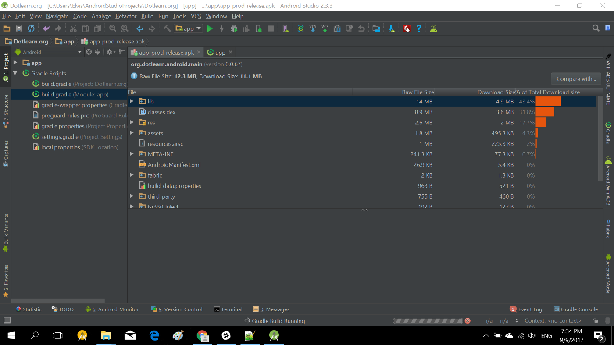

Size does matter especially for apps targeting users in the developing market. Most users in the developing world don’t have access to a fast and cheap internet connection and are usually very cautious about the size of mobile apps.

Up until recently the size of our app was about 11.1mb, but we were able to reduce it to 3.1mb (yea, you saw that right) without any performance/quality difference. I will be sharing a few of the techniques we used to reduce the size of the app this much.



### 1. Code Shrinking

The classes.dex file which contains the app code (3rd party libraries inclusive) was about 31.8% of the total app download size. While this wasn’t the largest component in the app, some optimization could be done to reduce the size of this file. A few things we tried was:

**i. Use Proguard**

Proguard is a tool used for code obfuscation. It also removes unused classes, fields, methods, and attributes from a packaged app. Enabling Proguard is quite easy, all you have to do is add the code below to the app build.gradle file (important lines are in bold)

```groovy:title=build.gradle
android {
    buildTypes {
        release {
            minifyEnabled true
            proguardFiles getDefaultProguardFile('proguard-android.txt'), 'proguard-rules.pro'
        }
    }
}
```

**ii. Cleaning Progaurd Rules Files**

In the previous step, Progaurd was able to save about 500kb. Quickly looking at our **proguard-rules.txt** file shows why proguard couldn’t reduce the size of the classes.dex file further. Many libraries were being excluded from Proguard in the rules file, so Proguard couldn’t do any optimization on them.

We had to remove the Proguard **keep** command one at a time, then build and ensure nothing breaks. It was a really slow process but it was very much worth the effort. Just be careful what you exclude from Proguard, it might be a very easy fix to keep almost everything but you end up packaging code you are not using into your release APK.

**iii. Some More Proguard**

There is a not so popular Proguard file which we used named ‘**proguard-android-optimize.txt**’ which perform analysis at the bytecode level to reduce the APK size further and help it run faster. Switching to this is quite easy too, just replace the code above with this (important part in bold):


```groovy:title=build.gradle
android {
    buildTypes {
        release {
            minifyEnabled true
            proguardFiles getDefaultProguardFile('proguard-android-optimize.txt'), 'proguard-rules.pro'
        }
    }
}
```

**iv) Remove Unused Libraries**

While Proguard can help reduce the size of your classes.dex file by automatically removing unused code, you still have to remove unused dependencies from your build.gradle file. The tool [here](https://stackoverflow.com/questions/19379517/how-to-find-remove-unused-dependencies-in-gradle) could help you find unused dependencies in your build.gradle file. We didn’t use any tool for this, as it wasn’t really hard to find these guys.

With the above-listed steps, we were able to reduce the size of the classes.dex file to just 1.6mb, that’s about Mb of data saved.

### 2. Compress Images

We had to bundle many images in the app APK file. Images for lessons, background, actions, etc were all stored within the app so the app can function when the user is offline.

Images are usually very heavy and you have to have them for different screen densities. The Android build tool compresses the images in your APK already during the build process, but you can also compress the images yourself too before adding them to your project. There are several tools for compressing PNG images online, but my favorite tool is [TinyPng](http://tinypng.com). I have seen multiple PNG images being reduced to about 70% of their original size. There are similar tools for GIF and JPEG images.

Just keep a backup of the original images before compressing them, just in case some magic happens or the size improvement is inconsequential. I was able to reduce the size of the res folder from 2mb to just 875kb by compressing all images (except simple icons, as i got inconsequential savings from compressing them).

### 3. Shrink Resources

This one is pretty easy. Shrink Resources works only in conjunction with code shrinking. After the code shrinker removes all unused code, the resource shrinker can identify which resources the app still uses. To enable code shrinking, set the shrinkResources property to true in your build.gradle file (alongside minifyEnabled for code shrinking). For example:

```groovy:title=build.gradle
android {
    buildTypes {
        release {
            shrinkResources true
            minifyEnabled true
            proguardFiles getDefaultProguardFile('proguard-android-optimize.txt'), 'proguard-rules.pro'
        }
    }
}
```

### 4. Exclude Sparse Translation

This is another simple optimization. Since we only support one language currently, we were able to reduce the size of the resources.arsc file by only including the strings for the language we support. Most libraries like the Android support library comes with strings translation that we don’t need because we only fully support one language. A multi-language app is a good way to reach more users, but apps that are not completely translated can result in a poor user experience.

We were able to exclude the unnecessary translations by adding the code below in the app build.gradle file (the important part is in bold)

```groovy:title=build.gradle
android {
    defaultConfig {
        resConfigs "en"
    }
}
```

### 5. Shrink Asset Files

We were able to reduce the size of assets folder by doing the following:

**i. Minify Text Files**

Text files like JavaScript, CSS, HTML, JSON, etc that are in the asset folder should be minified. Depending on the size of the file, the savings might not be much, but a 100kb saving can still reduce your app size from 5mb to 4.9mb :).

**ii. Remove Font Files**

We removed the extra font files that were included in the asset folder. The default Android font Roboto is very legible and there is no pressing need to use something different.

If you really need to use a custom font, The [Downloadable Font](https://developer.android.com/guide/topics/ui/look-and-feel/downloadable-fonts.html) feature was added in Android Oreo and have already been back-ported to Android Jelly Bean (API 14) using the support library. Consider using this option instead of bundling font files in your app APK file.

### 6. Switched From Realm Database

We have been using the [Realm Mobile Database](http://realm.io) for a while and it provides so many useful features that makes the life of a developer easy. Personally, i have been rooting for Realm since it launched on Android.

But the problem with Realm (and many other NoSQL database for Android) is that they are not included in Android by default, so you have to include their native libraries in your app for them to work. The result of this is a heavier APK file that contains native libraries for different device architecture.

We got around this by doing [ABI Split](https://developer.android.com/studio/build/configure-apk-splits.html), which was able to reduce the size of the app by having one APK per architecture. This doesn’t solve the problem completely as each native library was still about 800kb — 1mb and you will now have to manage multiple APKs.

We decided to replace Realm with the [Room Persistence Library](https://developer.android.com/topic/libraries/architecture/room.html) that was announced at Google IO 17. Luckily for us, we were using the Android MVP pattern and only had to make changes in the Model layer (One reason you should properly think about your app architecture).

By switching to Room Persistence Library, were able to burn about 4MB of fat :) and still have a very stable app. Lastly, we no longer have to deal with managing multiple APK files.

Using the optimizations/steps listed above, we were able to reduce our app download size to just 3.1mb. Here is a link to our app on Play Store: [https://play.google.com/store/apps/details?id=org.dotlearn.android.main](https://play.google.com/store/apps/details?id=org.dotlearn.android.main)
