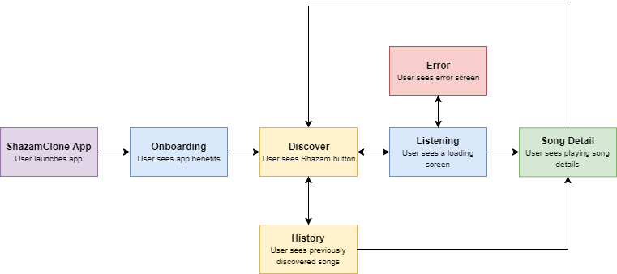
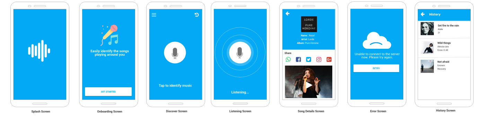
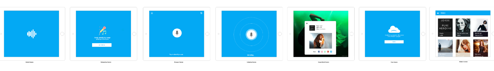

You have probably used the magical [Shazam](https://www.shazam.com) or [SoundHound](https://soundhound.com) app. Well, for those from a different planet that haven’t used them :), Shazam and SoundHound help you easily identify songs that are playing around you. All you have to do is just tap a button and a magic potion is used to discover the song that’s playing.

I will show you how to build an app that does exactly the same thing. The only requirement for this project is [some knowledge building Android apps](https://www.udacity.com/course/android-basics-nanodegree-by-google--nd803). This will be the first project in the Building Android Apps Series.

One of the very first steps to building an Android application is to determine what users are able to do and see with the app. While you can simply start development immediately, it’s best to sit back for a while and look at the project you are trying to build from a high level.

So, let’s start with the first part, which is what a user can do with the app. We will be using [User Stories](https://www.mountaingoatsoftware.com/agile/user-stories) to express this. Writing a user story is quite easy even if you haven’t written one before. **User stories** are just short, basic descriptions of a feature told from the perspective of the user. They usually follow a simple template:

> *As a < type of user >, I want < some goal > so that < some reason >.*

You can always add more stories when you need additional features. So here are the user stories for the ShazamClone app:

 1. As a user, I want to identify any song playing around me by just clicking a button.

 2. As a user, I want to see the songs I previously discovered

 3. As a user, I want to share the name and artist of the song I discovered

 4. As a user, I want to watch the video of the song I discovered

 5. As a kind user, I want to appreciate the developer so that he can build more products [😊](https://emojipedia.org/smiling-face-with-smiling-eyes/)

We now know what the user can do with the app, let’s now focus on what they see on the app. We will need to determine the exhaustive set of screens needed to allow users to achieve their goals. You can create this list using your user stories. Below is an exhaustive list of screens based on our user stories:

* Onboarding screen (Shows the benefit of the app in a slide show)

* Home or Discover screen (To discover new songs or view history)

* Listening or Discovering screen (Loading page)

* Song Detail screen (From which a user can share or watch song videos)

* History screen (A list of previously discovered songs)

* Error screen (When a recoverable or nonrecoverable error occurs)

Next is to define the directed relationships between screens. For this, you will need a diagram software or you could also just use paper and pen. One of my favorite tool is [Draw.io](http://draw.io) as it doesn’t have a steep learning curve. You basically just draw rectangles with text for each screen on your list and then use arrows to show the screen relationship. An arrow from one screen *A *to another screen *B *implies that screen *B *should be directly reachable via some user interaction in screen *A*.

After creating the screen lists and the relationship between them, we can start [Wireframing](http://en.wikipedia.org/wiki/Website_wireframe). Wireframing is the step in the design process where you begin to lay out your screens. Keep in mind that at this point, pixel-perfect precision (creating high-fidelity mockups) is not important. The easiest and fastest way to get started is to sketch out your screens by hand using paper and pencils.

After you’re satisfied with initial sketches, it’s a good idea to move on to digital wireframing software. You can use any tool that works for you to do your wireframing. There are also online tools that allow you to collaborate with other people. For this project, I used [MockFlow](http://mockflow.com) which is pretty basic and easy to use. I was able to create the designs below with it.

In the next part of this post, we will be focusing on the development (coding) of the app. Stay tuned.