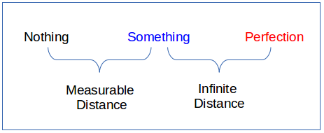
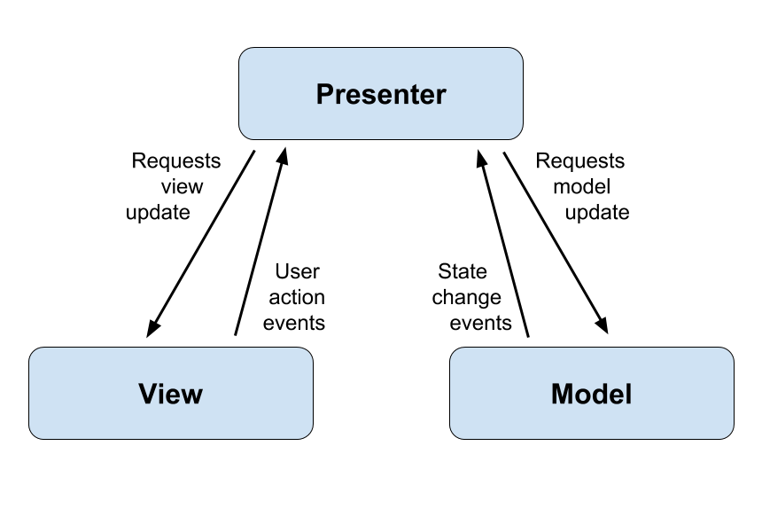

Having completed the design process in the [first post](https://android.jlelse.eu/building-a-shazam-clone-part-1-building-android-apps-series-179c2580a094), we will move on to building the app. But before we begin, I will like to emphasize this: it’s easier to detect issues and cheaper to fix them before sweat and coffee have been invested in producing code. In the same vein, it’s also easy to get stuck in the design process with [Analysis Paralysis](https://softwareengineering.stackexchange.com/questions/83117/how-do-i-deal-with-analysis-paralysis). You shouldn’t be looking to create a perfect design, but a good enough one. Remember, “ perfect is the enemy of good”.



So let’s get down to the app development. We will be looking at two things in this post: the app architecture and the code structure.

### App Architecture

We will be using the [MVP (Model View Presenter) architecture](https://android.jlelse.eu/android-mvp-for-beginners-25889c500443) for the app. MVP is a software architecture that separates concerns. The presenter acts as the bridge between the model and view, taking care of the presentation logic. You may have heard of it or seen one of its 1000+ different implementations.



The MVP architecture improves testability, readability, and scalability of the code. Those improvements are achieved by separating concerns: it enables easier testing (both unit and UI), smaller class sizes, and it makes it easier to change the way the data is obtained or the UI.
>  **The best architecture is the one that YOU can easily understand, explain to others and rapidly iterate over new features with minimal code refactoring. — [**Weighing in on the Holy Architecture War](https://android.jlelse.eu/weighing-in-on-the-holy-architecture-war-my-take-on-architecture-components-31f7025e9c66)

Different developers have come up with different ways to implement the MVP pattern. You might also have a different way to implement it, and that’s fine too. There is no silver bullet yet, so long as you stick to the principles below, feel free to experiment with the different implementations.

### Views:

* The View is the component responsible for displaying data provided by the presenter and passing on any user event to the Presenter.

* A View can be an Activity, a Fragment or a custom android.View class. I usually prefer using a Fragment over an Activity because Fragments are modular. You can comfortably reuse fragments in different Activities. Just one rule here: Never reference a concrete Activity from a Fragment. Always use an Interface and have each parent Activity implement it. This way, you can simply use it in different Activities. I will show you how to do this as we move on.

* Make Views dumb and [Passive](https://martinfowler.com/eaaDev/PassiveScreen.html). Pass on every user action to the Presenter to handle. The presenter should be the one in charge, telling the View what to display. For example, form validation should be done in the Presenter. Your View should just collect the form data and pass it to the Presenter, while the Presenter does the validation and either sends the data to your Model or tells the View to show an error message.

* Views shouldn’t talk to Models. Your Views should leave the talking to the Presenter.

* Create a Contract Interface that your Views will implement. The presenter must depend on the View Interface and not on a concrete class. You should depend on abstractions here, not on concretions (SOLID principles).

* Each View should ideally have a single Presenter.

### Presenters:

* The Presenter acts as a controller and sits in the middle between the View and the Model.

* Each Presenter should ideally have a single View.

* Presenters should be framework-independent. Ensure that Presenters don’t depend on Android specific classes. This enables you to easily write tests and run them on your local JVM. In practice, this is usually hard, especially when you need basic objects like a Context. We will learn about different ways to handle this later.

* Also, create a Contract Interface for your Presenter. This is entirely optional, and some [developers believe it’s a waste of time](http://blog.karumi.com/interfaces-for-presenters-in-mvp-are-a-waste-of-time/). I usually use the same implementation applied by Google in the [Android Architecture](https://github.com/googlesamples/android-architecture) repository, where you have two inner interfaces: one for the View and one for the Presenter. Here is an example:

```kotlin:title=LessonListUiContract.kt
interface LessonListUiContract {
    
    interface View extends IUpdatableView {
    
        void showLoading();
        void hideLoading();
    
        void showError(@NonNull String errorMessage);
        void hideError();
    
    }
    
    interface Presenter extends IPresenter<StudyModel, View> {
    
        void onRetryClicked();
        void onLessonClicked(@NonNull Lesson lesson);
    
    }
    
}
```

* Lastly, I feel you shouldn’t try to persist data in the Presenter. Persisting/Caching of data should be left to the Model to do. You can read more about this approach [here](https://hackernoon.com/presenters-are-not-for-persisting-f537a2cc7962#.ssl022wg7).

### Models:

* In an application with a good layered architecture, this model would only be the gateway to the domain layer or business logic. See it as the provider of the data we want to display in the view. — [Source](http://www.tinmegali.com/en/model-view-presenter-android-part-1/)

* Use any pattern that works best for you here. You can choose to use the [Repository pattern](https://medium.com/@krzychukosobudzki/repository-design-pattern-bc490b256006), custom Managers, or others.

* You should handle things like caching, making new network calls, saving to the database, and fetching from the database in this layer. You should also provide a clean API that your presenter can simply use.

* Whatever tech you are using in the model layer, try to encapsulate from the Presenter. For example, your Presenter shouldn’t care whether you are saving data in a SharedPreference, SQLite, or [Realm](http://realm.io) database. All it has to do is make a request for data and get a response. I recently switched an app from [Realm to Room](https://medium.com/dot-learn/how-we-reduced-our-app-size-by-72-c2471ba75954). The process was effortless, and I only had to make changes in the Model layer because I applied this rule.

The architecture we will be using for this project will be based on the [Android Architecture Patterns](https://github.com/googlesamples/android-architecture/tree/todo-mvp/) repository by Google.

With the architecture part covered, let’s take a look at how the code base will be structured. We will be using a very similar structure to the [Google IO 2017 app](https://github.com/google/iosched/blob/master/doc/NAVIGATING_CODE.md). Inside the app *src* folder, the following folders are available:

* main: the app code. It is packaged by feature, not by layer. The only classes packaged by layers are those common to all features, such as BaseActivity. Packing by feature enables different developers to easily work on different features in a contained manner. It also enables a new developer to understand what features the app has simply by scanning the package list, and to understand a given feature by reading through the code in a given package.

* debug: used for resources for the debug build.

* androidTest: contains instrumentation tests. They can be run on either a device or an emulator.

* test: contains unit tests. Those are plain Java unit tests and do not need a device or an emulator to be run.

I think that’s enough info for one post, so enough of the text and images. In the next part, we will create the project on Android studio and start writing code. Stay tuned.