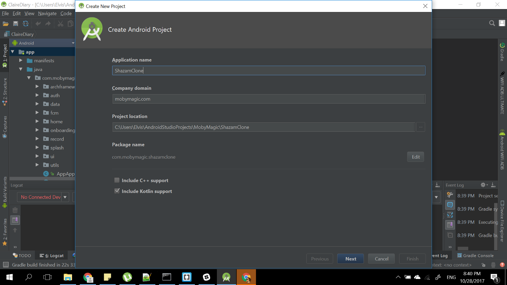
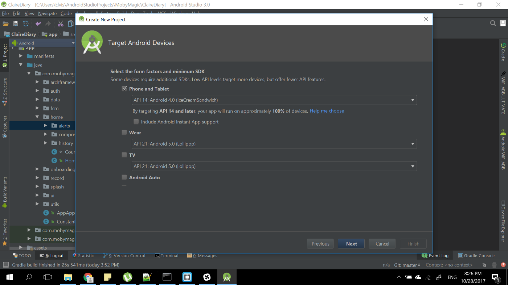
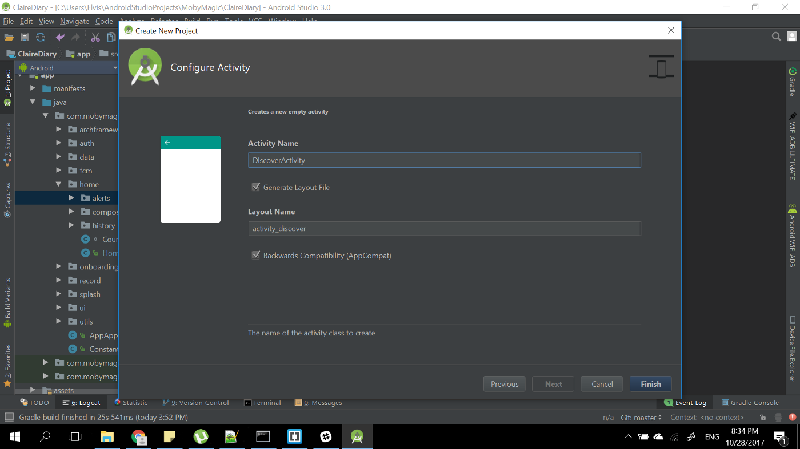
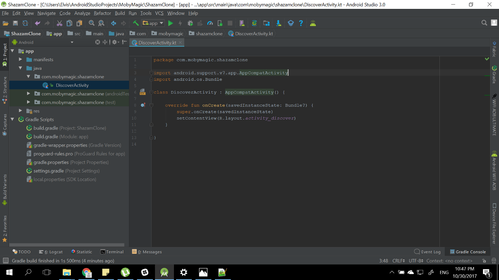
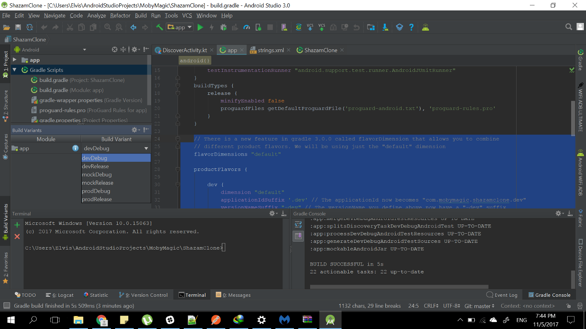
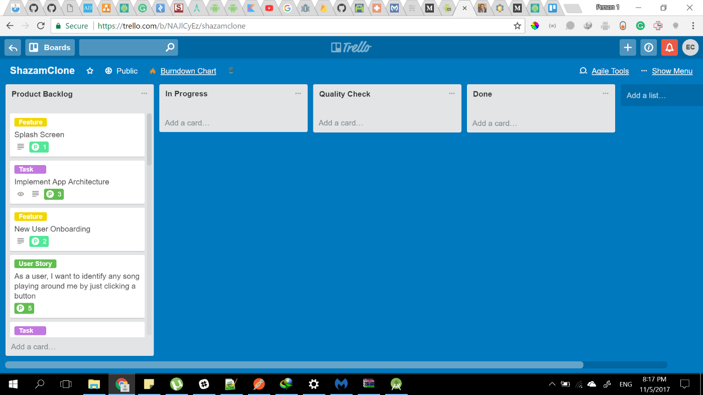
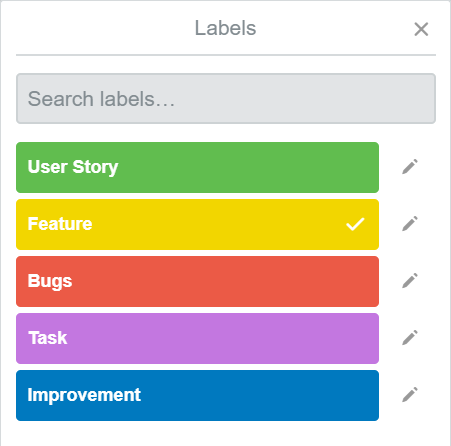

In the [last post](https://android.jlelse.eu/building-a-shazam-clone-part-2-building-android-apps-series-fc4a28d57b77), we learned about the MVP (Model View Presenter) architecture pattern and the package by feature code structure. In this post, we will create the project and do some initial setup on it.

We will be using the new shiny [Android Studio 3.0](https://android-developers.googleblog.com/2017/10/android-studio-30.html). If you are using the older version of Android Studio, you should still be able to follow the series, but the steps will be quite different for you. Well, I will provide links to resources that will help you if you are still on an older version of Android Studio.

The app will also be written in [Kotlin](https://kotlinlang.org). If you haven’t programmed in Kotlin before, you can get your feet wet with the official [tutorial](http://kotlinlang.org/docs/tutorials/). I will also explain some Kotlin syntax and features here.

Without further ado, fire up Android Studio and click on New Project. We will name the project ShazamClone. Feel free to use any name, we will have to rename the app anyways when uploading to the Play Store as Google won’t allow us to use that name. If you are running Android 3.0, make sure you tick ‘Include Kotlin support’.



Next is to select our target Android devices. We will be supporting only phones and tablets. Because I want my uncle Bob to be able to run the app, I am targeting API 14 (Android 4.0 Ice Cream Sandwich). I would have selected API 9 as my target, so my grandmom can also run it, but Google Play Services [no longer support API 9](https://android-developers.googleblog.com/2016/11/google-play-services-and-firebase-for-android-will-support-api-level-14-at-minimum.html).



After selecting the target Android devices, we will create a new empty Activity. It will be our default (launcher) activity and will house the magically discover music button.



After clicking Finish, Android Studio will create and set up the project for you. If you are running Android Studio 3.0 and you followed the steps above, you don’t have to take any additional steps to get Kotlin working. But if you are running an older version of Android Studio, then follow this tutorial to [configure Kotlin](https://kotlinlang.org/docs/tutorials/kotlin-android.html).

After Android Studio is done creating the project, you should get a screen like this:



When building apps, we sometimes want to make changes to only the development version or provide mock data for a particular version. You may also want to have the development and production version of the app on the same phone. Well, while you could manually achieve all of this, we will be using a feature called product flavors.

[Product flavors](https://developer.android.com/studio/build/build-variants.html) allow you to have different versions of your app that share the same code base. We will be creating 3 product flavors for this project:

 1. **dev**: This is the development version. For now, it will have some optimization that will make it build faster, a different name and application id. This usually also contain your server development/local URL.

 2. **mock**: This version is provided with fake data. Sometimes the API might not be ready yet when you are building an app and you just want to build something with mock data. This flavor is also useful for testing.

 3. **prod**: The version that goes on Play Store and gets released to users. It usually contains your production/live server URL.

To create the flavors listed above, go to your app module build.gradle file and insert this code inside **android{}**:

```groovy:title=build.gradle
// There is a new feature in gradle 3.0.0 called flavorDimension that allows you to combine
// different product flavors. We will be using just the "default" dimension
flavorDimensions "default"

productFlavors {

    dev {
        dimension "default"
        applicationIdSuffix '.dev' // The applicationId now becomes "com.mobymagic.shazamclone.dev"
        versionNameSuffix "-dev" // The versionName you define above now have a "-dev" suffix
        resValue "string", "app_name", "Shazam Clone Dev" // Changes the app name to "Shazam Clone Dev"

        // [Performance optimization] The following configuration limits the "dev" flavor
        // to using English string resources and xxhdpi screen-density resources.
        resConfigs "en", "xxhdpi"
    }

    mock {
        dimension "default"
        applicationIdSuffix '.mock'
        versionNameSuffix "-mock"
        resValue "string", "app_name", "Shazam Clone Mock"
    }

    prod {
        dimension "default"
        resValue "string", "app_name", "Shazam Clone"
    }
}
```

Go to your **strings.xml **file and delete app_name string, so we will not have conflicts while building. After doing that, you can now Sync the project. On the build variants pane on Android Studio (Usually located at the bottom left), you should see all three flavors with the different build types: Debug and Release. You can switch from one flavor to another and then run it. You will see the differences in the app name when they are installed on your phone. You will also notice you can have all 3 versions of the app on the same phone because they are using different **applicationId**.



We have done the basic setup needed for the Project. We will revisit this file later (severally) as we add useful libraries and improve items.

Remember the user stories from [part 1](https://android.jlelse.eu/building-a-shazam-clone-part-1-building-android-apps-series-179c2580a094)? Well, you don’t just write them and throw them away. You add more stories as requirements change, improve existing stories and track them to see what has been implemented. You need a tool to help you manage your stories and tasks. There are many online tools you can use like [Trello](http://trello.com), [Asana](http://asana.com), [Pivotal Tracker](https://www.pivotaltracker.com/), and more.

For this project, we will be using [Trello](http://trello.com). The single reason I picked Trello over other tools is because of its simplicity. If you take some time to explore it, you should be able to start using it in a few minutes/hours. [Here](https://trello.com/guide) is the official Trello guide to get you started.

There are 3 key concepts you need to understand before using Trello:

 1. **Cards**: A card usually represents a task or something that needs to get done.

 2. **Lists**: You can think of lists like categories. They help you keep the cards organized. As you work on the tasks represented by a card, you usually move them from one list to another.

 3. **Labels**: You use labels to tag different types of tasks represent by a card. They are optional, but they are just another form of organization.

I have created a Trello board for this project, which you can view [here](https://trello.com/b/NAJlCyEz/shazamclone). You can also bookmark the page as we will be using the board to actively track what is done and what isn’t.

I tried to keep the board as simple as possible. We basically have 4 lists:

 1. **Product Backlog**: Which contains all the features, user stories, tasks, and other items to work on.

 2. **In Progress**: As the name implies, this list contains tasks that are currently being worked on.

 3. **Quality Check**: After completing a task, we move the card to this list. We then confirm if truly the task was completed before moving it to the **Done **list.

 4. **Done**: All the cards that have been completed belongs to this list



We also created some basic labels for the board so we can easily identify cards.



I have created a repository on Github for the project which you can view [here](https://github.com/Elvis10ten/ShazamClone).

With the project initial setup complete, we can begin implementing items on the Trello board.

I have been trying to keep each post short enough so it will be easy to go through. I am considering doing a video for the next part to make the series better and more in depth. Let me know what you think in the comment section. Stay tuned for the next part on “Building Android Apps” series.