I want to quickly walk you through how to build a BBC world news aggregator app on Android. The app will make use of the BBC RSS feed to display the news content.

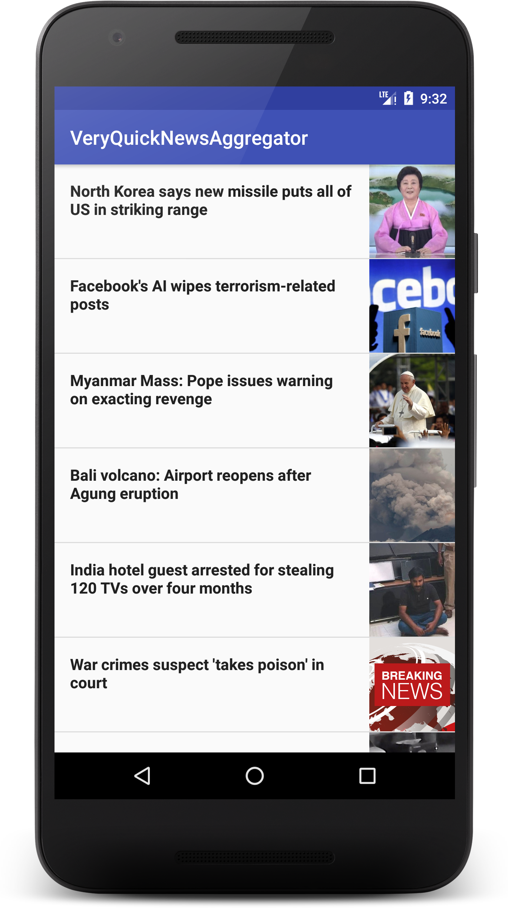

Let me quickly state that I do not work for or represent BBC. The BBC world news is used just as an example, you can plug in your favorite news source as a replacement.

I have created a video lesson on Youtube where I walkthrough every step in details.

<div class="video_wrapper">
    <iframe class="video_frame" width="100%" height="100%" src="https://www.youtube.com/embed/8LH0eT50kZM" frameborder="0" allow="accelerometer; autoplay; clipboard-write; encrypted-media; gyroscope; picture-in-picture" allowfullscreen></iframe>
</div>

The app will be written in the beloved Kotlin. It will be a very simple app which you can easily add additional features on top. I will be making use of two awesome services which are:

 1. [Zapier](http://www.zapier.com): Zapier is a service that allows you to automate several things. For this project, we will be using Zapier to store any new news item in the BBC news feed in our Firebase database.

 2. [Firebase](http://console.firebase.google.com): We will be using the Firebase Realtime Database to save news item in the BBC news feed.

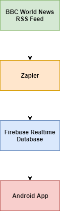

First things first, fire up Android studio and click on New Project. You can give the project any name, but I will be calling it **VeryQuickNewsAggregator**. Leave all the default options checked and click Next.

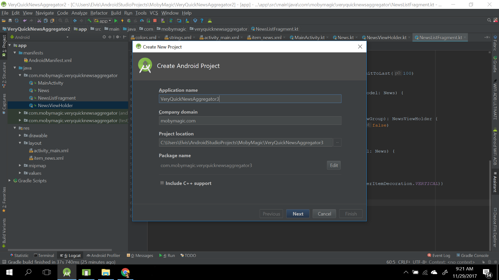

While creating the project, make sure you select the option to create a new empty activity. I will be calling that activityMainActivity and it’s going to be the default launcher activity.

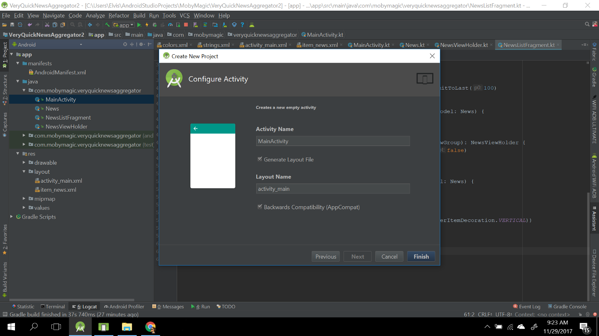

Newer versions of Android Studio comes with a tool which you can use to easily integrate Firebase into your application. The tool can be accessed by going to the **Tools** menu at the top and clicking on **Firebase**. You should get a screen like this.

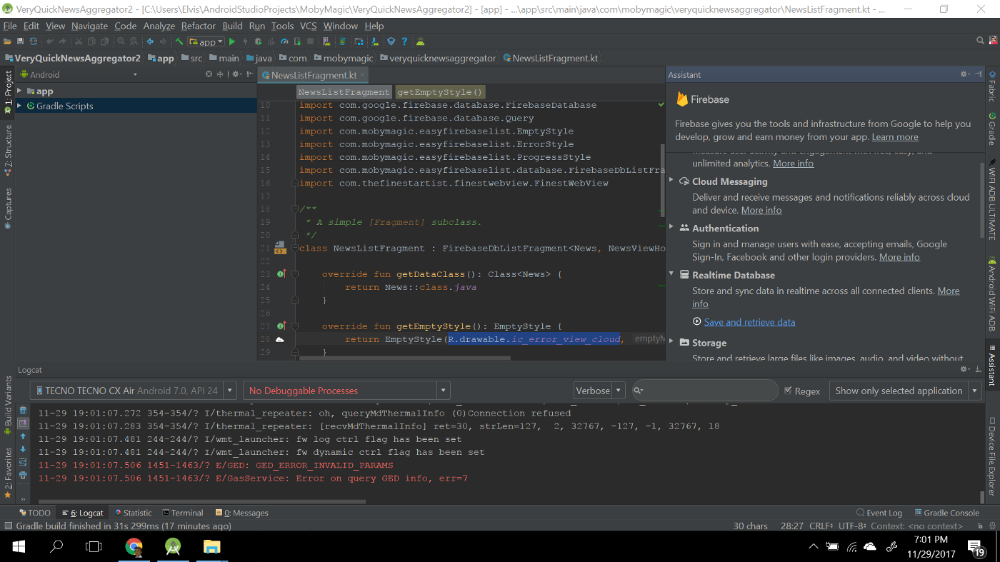

There are several really good Firebase services, but for this app, we are only interested in the Realtime Database. Click on **Save and retrieve data **link under the **Realtime Database** option. There are two steps you have to take to setup the Firebase database for the app:

 1. Click on the button below **Connect your app to Firebase**. When the dialog comes up, select an existing project or create a new one.

 2. Click on the button below **Add the Realtime Database to your app**. It should add the needed dependencies to your build.gradle files.

If you completed the steps listed above, you should get a screen very similar to the one below.

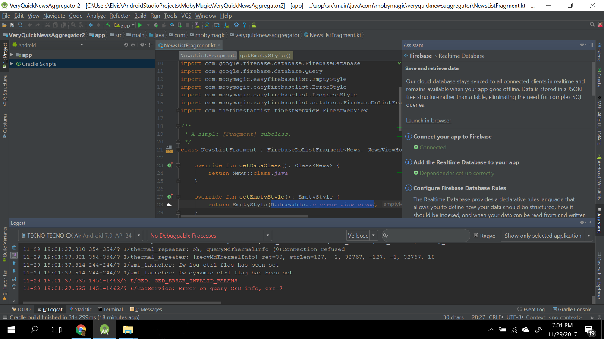

With Firebase setup, let’s add the needed dependencies to our app build.gradle file. We will be adding the following libraries:

 1. [RecyclerView](https://developer.android.com/training/material/lists-cards.html): We will be using it to show the list of news items.

 2. [Picasso](http://square.github.io/picasso/): A simple image loading library which we will be using to load the news thumbnail.

 3. [EasyFirebaseList](https://github.com/Elvis10ten/EasyFirebaseList): A library that will help us easily show a list of items from the Firebase database.

 4. [FinestWebView](https://github.com/TheFinestArtist/FinestWebView-Android): A custom WebView we will be using to display the news item detail.

The app build.gradle file should look like this.

```groovy:title=build.gradle
apply plugin: 'com.android.application'
apply plugin: 'kotlin-android'
apply plugin: 'kotlin-android-extensions'

android {
    compileSdkVersion 26
    
    defaultConfig {
        applicationId "com.mobymagic.veryquicknewsaggregator"
        
        minSdkVersion 14
        targetSdkVersion 26
        
        versionCode 1
        versionName "1.0"
        
        testInstrumentationRunner "android.support.test.runner.AndroidJUnitRunner"
    }
    
    buildTypes {
        release {
            minifyEnabled false
            proguardFiles getDefaultProguardFile('proguard-android.txt'), 'proguard-rules.pro'
        }
    }
}

dependencies {
    implementation fileTree(dir: 'libs', include: ['*.jar'])
    implementation "org.jetbrains.kotlin:kotlin-stdlib-jre7:$kotlin_version"
    implementation 'com.android.support:appcompat-v7:26.1.0'
    implementation 'com.android.support:design:26.1.0'
    implementation 'com.android.support:recyclerview-v7:26.1.0'
    implementation 'com.android.support.constraint:constraint-layout:1.0.2'
    implementation 'com.google.firebase:firebase-database:11.6.0'
    implementation 'com.firebaseui:firebase-ui-database:3.1.0'
    implementation 'com.android.support:support-v4:26.1.0'

    implementation 'com.mobymagic:easyfirebaselist:1.0.2'
    implementation 'com.squareup.picasso:picasso:2.5.2'
    api 'com.thefinestartist:finestwebview:1.2.7'

    testImplementation 'junit:junit:4.12'
    androidTestImplementation 'com.android.support.test:runner:1.0.1'
    androidTestImplementation 'com.android.support.test.espresso:espresso-core:3.0.1'
}

apply plugin: 'com.google.gms.google-services'
```

The FinestWebView [installation guide](https://github.com/TheFinestArtist/FinestWebView-Android#getting-started) states that the FinestWebViewActivity needs to be added to the app AndroidManifest file. Also, we need to request the INTERNET permission to be able to connect to the internet. So our AndroidManifest.xml file will look like this.

```xml:title=AndroidManifest.xml
<?xml version="1.0" encoding="utf-8"?>
<manifest xmlns:android="http://schemas.android.com/apk/res/android"
    package="com.mobymagic.veryquicknewsaggregator">

    <uses-permission android:name="android.permission.INTERNET" />
    <uses-permission android:name="android.permission.ACCESS_NETWORK_STATE" />

    <application
        android:allowBackup="true"
        android:icon="@mipmap/ic_launcher"
        android:label="@string/app_name"
        android:roundIcon="@mipmap/ic_launcher_round"
        android:supportsRtl="true"
        android:theme="@style/AppTheme">

        <activity android:name=".MainActivity">
            <intent-filter>
                <action android:name="android.intent.action.MAIN" />

                <category android:name="android.intent.category.LAUNCHER" />
            </intent-filter>
        </activity>

        <activity
            android:name="com.thefinestartist.finestwebview.FinestWebViewActivity"
            android:configChanges="keyboardHidden|orientation|screenSize"
            android:screenOrientation="sensor"
            android:theme="@style/FinestWebViewTheme.Light" />

    </application>

</manifest>
```

The MainActivity will just be hosting a single fragment, so we can modify the activity_main layout file to include the simple FrameLayout below.

```xml:title=activity_main.xml
<?xml version="1.0" encoding="utf-8"?>
<FrameLayout
    xmlns:android="http://schemas.android.com/apk/res/android"
    android:id="@+id/newsListFragmentContainer"
    android:layout_width="match_parent"
    android:layout_height="match_parent" />
```

We will need to create a layout file that shows each news item in a RecyclerView. Create a new layout called item_news . It will just be a very simple horizontal LinearLayout that contains a TextView that shows the news title and an ImageView that displays the news thumbnail.

```xml:title=item_news.xml
<?xml version="1.0" encoding="utf-8"?>
<LinearLayout
    xmlns:android="http://schemas.android.com/apk/res/android"
    android:orientation="horizontal"
    android:layout_width="match_parent"
    android:layout_height="wrap_content"
    android:minHeight="96dp">

    <TextView
        android:id="@+id/newsTitleTextView"
        android:layout_width="0dp"
        android:layout_weight="1"
        android:layout_height="wrap_content"
        android:textAppearance="@style/TextAppearance.AppCompat.Subhead"
        android:textStyle="bold"
        android:padding="16dp" />

    <ImageView
        android:id="@+id/newsThumbnailImageView"
        android:layout_width="88dp"
        android:layout_height="match_parent"
        android:scaleType="centerCrop"
        android:contentDescription="@null" />

</LinearLayout>
```

We can now create a new Fragment that will handle the display of news items. I will name the new Fragment as NewsListFragment, but feel free to use any name here. If you are using the Android studio GUI to create the Fragment, ensure you uncheck all the checkboxes (use the image below as a guide).

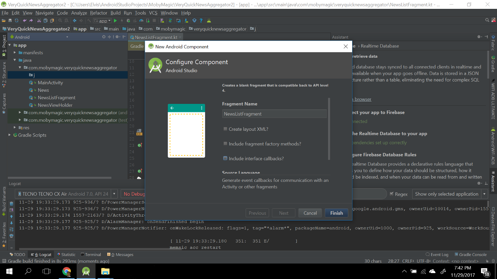

Let’s now add the code to show this newly created Fragment in our MainActivity class.

```kotlin:title=MainActivity.kt
package com.mobymagic.veryquicknewsaggregator

import android.support.v7.app.AppCompatActivity
import android.os.Bundle

class MainActivity : AppCompatActivity() {

    override fun onCreate(savedInstanceState: Bundle?) {
        super.onCreate(savedInstanceState)
        setContentView(R.layout.activity_main)

        showNewsFragment()
    }

    private fun showNewsFragment() {
        val tag = "NewsListFragment"
        val existingFragmentWithTag = supportFragmentManager.findFragmentByTag(tag)

        if(existingFragmentWithTag == null) {
            supportFragmentManager.beginTransaction()
                    .add(R.id.newsListFragmentContainer, NewsListFragment(), tag)
                    .commit()
        }
    }

}
```

We need to create a model for the news data that will be stored in the Firebase database. We will be using [Kotlin Data class](https://kotlinlang.org/docs/reference/data-classes.html) which saves us from writing several boilerplate methods like getters and setters.

```kotlin:title=News.kt
package com.mobymagic.veryquicknewsaggregator

data class News(val title: String, val link: String, val description: String, val pubDate: String,
                val thumbnail: String) {

    constructor(): this("", "", "", "", "")

}
```

Next is to create a RecyclerView.ViewHolder for the news items. Thanks to [Kotlin Android Extension](https://kotlinlang.org/docs/tutorials/android-plugin.html), we don’t need to add any findViewById calls here. We only have a very simple bind function that binds the data to the views.

```kotlin:title=NewsViewHolder.kt
package com.mobymagic.veryquicknewsaggregator

import android.support.v7.widget.RecyclerView
import android.view.View
import com.squareup.picasso.Picasso
import kotlinx.android.synthetic.main.item_news.view.*

class NewsViewHolder(view: View): RecyclerView.ViewHolder(view) {

    fun bind(model: News) {
        itemView.newsTitleTextView.text = model.title
        Picasso.with(itemView.context).load(model.thumbnail).into(itemView.newsThumbnailImageView)
    }

}
```

Finally, let’s add the main ingredient which is the NewsListFragment. We will be making use of the EasyFirebaseList library to easily show a list of items from the Firebase database. The library handles showing progress, empty and error states. The implementation of the NewsListFragment is pretty straightforward.

```kotlin:title=NewsListFragment.kt
package com.mobymagic.veryquicknewsaggregator

import android.support.v4.app.Fragment
import android.support.v7.widget.DividerItemDecoration
import android.support.v7.widget.LinearLayoutManager
import android.support.v7.widget.RecyclerView
import android.view.LayoutInflater
import android.view.ViewGroup
import com.google.firebase.database.DatabaseError
import com.google.firebase.database.FirebaseDatabase
import com.google.firebase.database.Query
import com.mobymagic.easyfirebaselist.EmptyStyle
import com.mobymagic.easyfirebaselist.ErrorStyle
import com.mobymagic.easyfirebaselist.ProgressStyle
import com.mobymagic.easyfirebaselist.database.FirebaseDbListFragment
import com.thefinestartist.finestwebview.FinestWebView

/**
 * A simple [Fragment] subclass.
 */
class NewsListFragment : FirebaseDbListFragment<News, NewsViewHolder>() {

    override fun getDataClass(): Class<News> {
        return News::class.java
    }

    override fun getEmptyStyle(): EmptyStyle {
        return EmptyStyle(R.drawable.ic_error_view_cloud, "No news yet in database")
    }

    override fun getErrorStyle(error: DatabaseError): ErrorStyle {
        return ErrorStyle(R.drawable.ic_error_view_cloud, "An error occurred while fetching news")
    }

    override fun getProgressStyle(): ProgressStyle {
        return ProgressStyle("Loading...")
    }

    override fun getQuery(): Query {
        return FirebaseDatabase.getInstance().reference.child("news").limitToLast(100)
    }

    override fun onBindViewHolder(viewHolder: NewsViewHolder, key: String, model: News) {
        viewHolder.bind(model)
    }

    override fun onCreateViewHolder(inflater: LayoutInflater, viewGroup: ViewGroup): NewsViewHolder {
        val view = inflater.inflate(R.layout.item_news, viewGroup, false)
        return NewsViewHolder(view)
    }

    override fun onItemClicked(viewHolder: NewsViewHolder, key: String, model: News) {
        FinestWebView.Builder(activity).show(model.link)
    }

    override fun setupRecyclerView(recyclerView: RecyclerView) {
        recyclerView.addItemDecoration(DividerItemDecoration(activity, DividerItemDecoration.VERTICAL))
        recyclerView.layoutManager = LinearLayoutManager(activity)
    }
    
}
```

The last step is to use Zapier to automate the reading and saving of the BBC world news RSS feed items to the Firebase database.

We will need to create a new **ZAP** (task) on Zapier. Zaps are automations created using one **Trigger **and one **Action**. So tasks are made of two important components:

 1. **Trigger**: A Trigger is any event that sets your Zap in motion. Some examples of Triggers include a new favorited Tweet on Twitter, a new email in Gmail, or a new note in Evernote.

 2. **Action**: An Action is an event that’s completed in a second app automatically. Some examples of Actions include appending text to a note in Evernote, adding a new spreadsheet row in a Google Doc, or creating a new card in Trello.

If you are new to Zapier, you can easily create a new account. After login, click on **Make A Zap** button (It’s located at the top with an orange background). When the page loads up, search for the RSS app and select it.

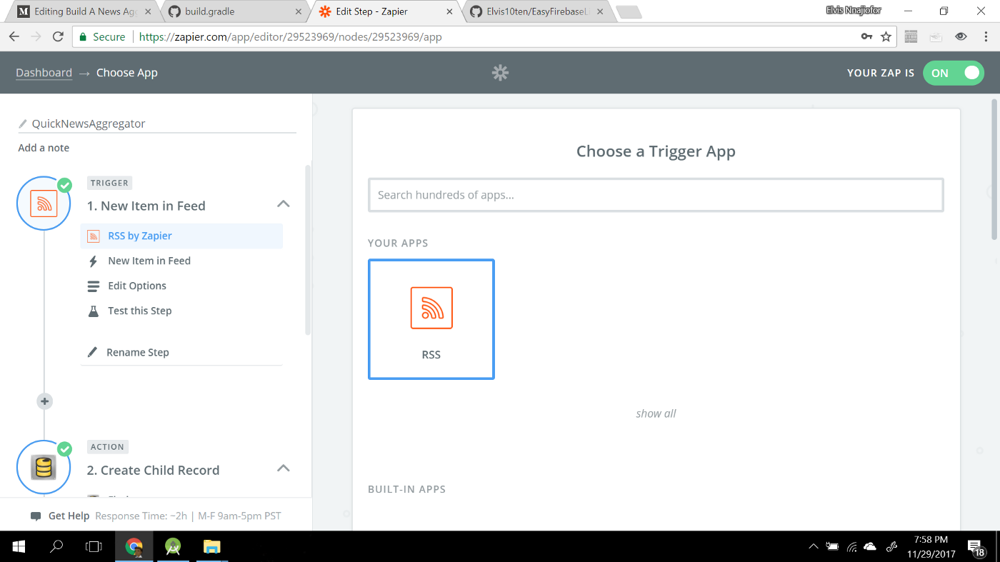

After selecting the RSS app, click on the continue button. Select the single option that shows up when the next page loads up and click on Continue again.

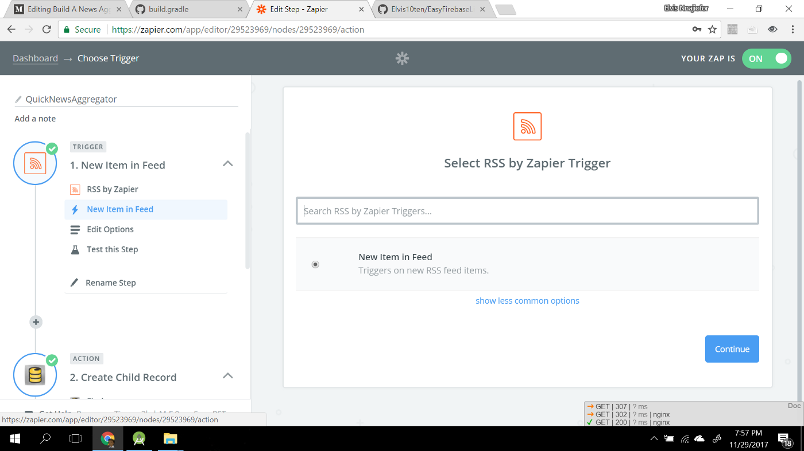

The next screen is where you specify the RSS feed URL. We will be using the BBC world news RSS feed URL here. Leave every other field unchanged and click on Continue

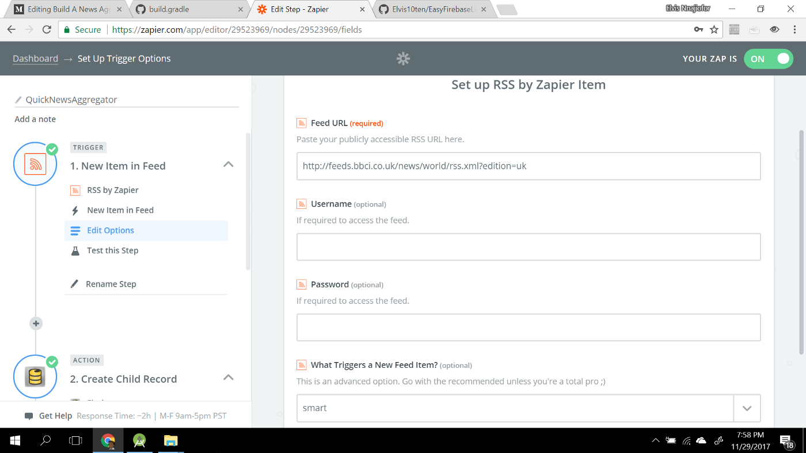

The final step for the RSS feed trigger is to test it to ensure Zapier can actually access the RSS feed. After successfully testing it, click on Continue to create a new Action.

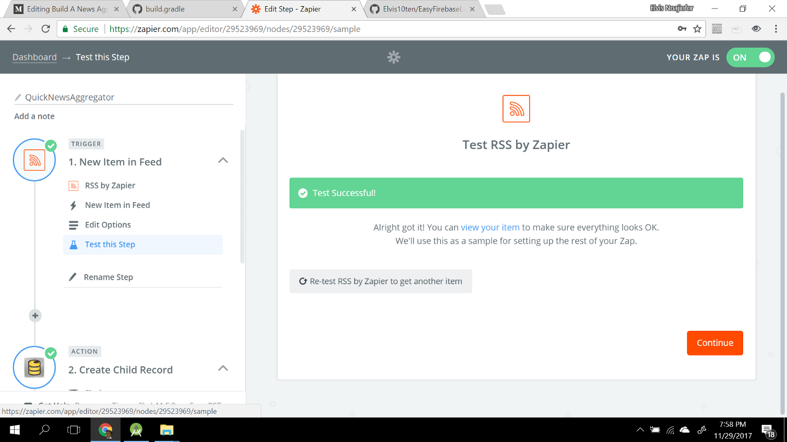

We want to insert each new news item into the Firebase database. So for the action, search for Firebase, select it and click on Continue.

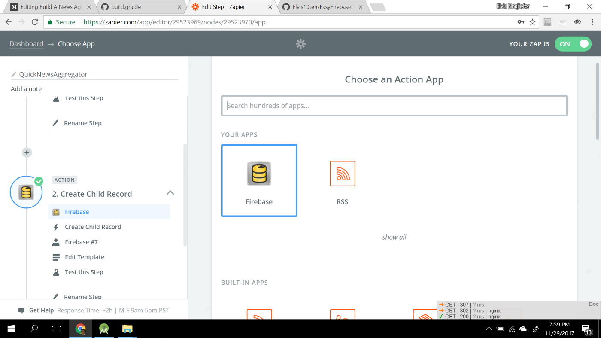

The next screen will prompt you to select an action. We will select the **Create Child Record** action and click on Continue.

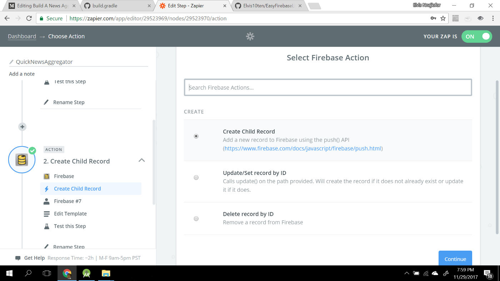

In the next screen, you will have to setup the Firebase child record. Use the image below as a guide or you can watch the video lesson (included at the top of this post).

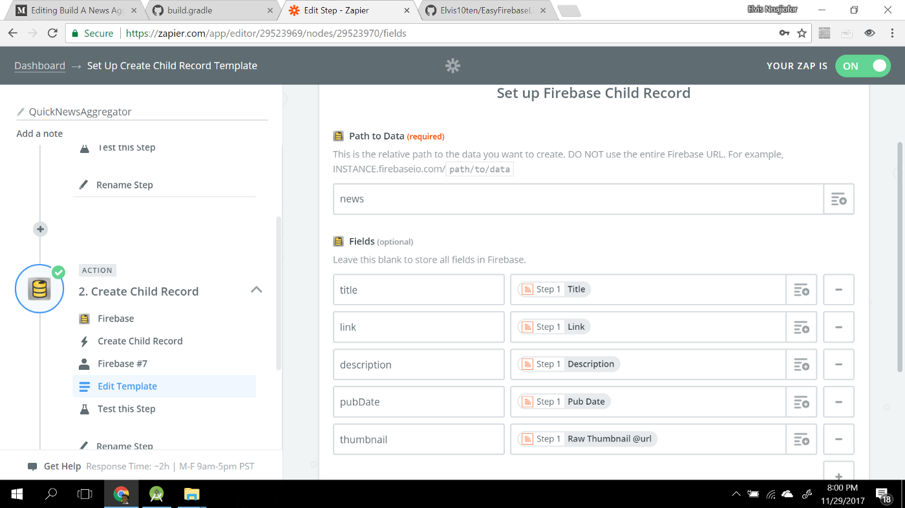

After setting up the Firebase child record, click on Continue. The next and final step will be to test the Firebase database. After doing that you can click on Finish which will create a new ZAP in your Zapier account. Don’t forget to give your ZAP a name and switch it ON.

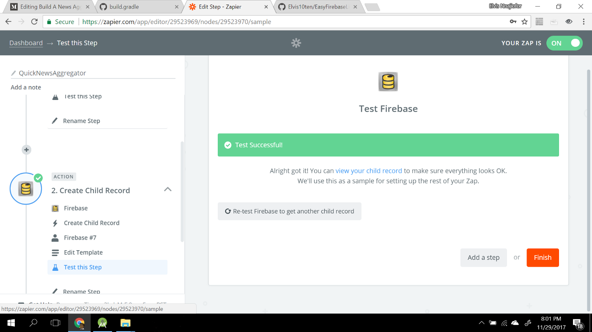

You can now install the app on an emulator or real device and run it. It should display the data currently in the Firebase Realtime Database. As Zapier adds more items to the database, it will get automatically updated on the app.

So, that’s it. You have successfully created a news aggregator app. If you have any question, please leave a comment below and I will reply as soon as possible. You can view the project [Repository on Github](https://github.com/Elvis10ten/QuickAndroidNewsAggregator).