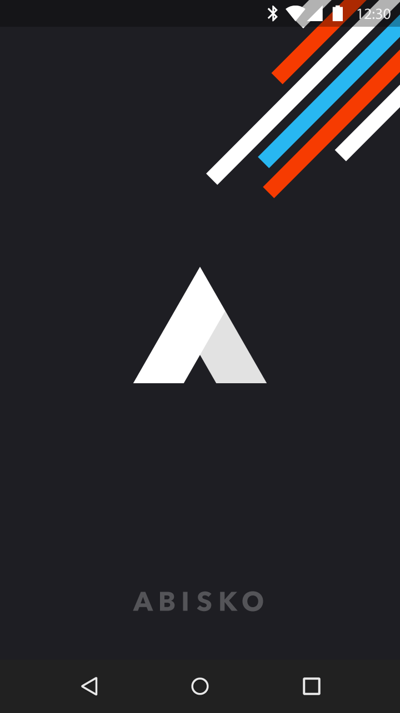

In the past, having splash screens in your Android app were not recommended. It didn’t make much sense to intentionally delay the user by adding a splash screen that shows for x seconds. Am sure no one launches an app just to see a splash screen (more on this later).

> Getting users to the content they care about should be your #1 priority

Well, when [Material Design](https://material.io/guidelines/) dropped with a pattern called [Launch Screen](https://material.io/guidelines/patterns/launch-screens.html) (Splash Screen), someone from the Android team shared a [post](https://plus.google.com/+AndroidDevelopers/posts/Z1Wwainpjhd) on how to do splash screens the ‘right’ way.



In this post I will walk through 4 common methods of implementing splash screens on the Android platform:

 1. Using a Launcher Theme (**The good**)

 2. Using a Launcher Theme with a Dedicated Splash Activity (**The okay**)

 3. Using Timers (**The bad**)

 4. Using Smart Timers (**The ugly**)

### [Using a Launcher Theme](https://plus.google.com/+AndroidDevelopers/posts/Z1Wwainpjhd)

When your app is launched and it isn’t in memory yet, there may be some delay between when the user starts your app and when your launcher Activity’s onCreate() is actually called.

During the ‘cold start’, the window manager tries to draw a placeholder UI using elements from the app theme like the windowBackground. So, rather than showing the default windowBackground (usually white or black), you can change it to a custom drawable that shows your splash screen. This way the splash screen only shows when needed and you don’t slow down your users.

The key is creating a custom theme that overrides **android:windowBackground**, then replacing that custom theme with your standard theme before calling *super.onCreate()* in your Activity.

**Implementation**

In this example, I will assume your app main theme is named **AppTheme**, but if it’s not then you can replace all occurrence of **AppTheme **with the name of your app main theme.

You will have to create a new theme for the launcher. The only element we are interested in overriding in this theme is the windowBackground, so the launcher theme will be:

```xml:title=styles.xml
<?xml version="1.0" encoding="utf-8"?>
<resources>
  
  <!-- Your AppTheme or other themes/styles here -->
  
  <!-- The launcher theme. It sets the main window background to the launch_screen drawable -->
  <style name=”AppTheme.Launcher”>
    <item name=”android:windowBackground”>@drawable/launch_screen</item>
    <!-- Optional, on Android 5+ you can modify the colorPrimaryDark color to match the windowBackground color for further branding-->
    <!-- <item name="colorPrimaryDark">@android:color/white</item> -->
  </style>
  
</resources>
```

To inherit every other attribute in your main theme, the dot notation was used by prefixing the name of the theme (**AppTheme**), separated by a period (**.**).

Let’s define the launch_screen drawable. While you could just use a simple image, it will end up stretched to fill the entire screen. Instead, you can use an XML file such as:

```xml:title=launch_screen.xml
<?xml version="1.0" encoding="utf-8"?>

<!-- The android:opacity=”opaque” line — this is critical in preventing a flash of black as your theme transitions. -->
<layer-list xmlns:android="http://schemas.android.com/apk/res/android" android:opacity="opaque">
  
  <!-- The background color, preferably the same as your normal theme -->
  <item android:drawable="@android:color/white"/>
  
  <!-- Your product logo - 144dp color version of your app icon -->
  <item>
    
    <bitmap
      android:src="@drawable/product_logo_144dp"
      android:gravity="center"/>
    
  </item>
  
</layer-list>
```

Then apply the launcher theme to your launcher Activity in your AndroidManifest.xml file using:

```xml:title=AndroidManifest.xml
android:theme=”@style/AppTheme.Launcher”
```

The easiest way to transition back to your normal theme in your launcher (main) activity is to call setTheme(R.style.AppTheme) before *super.onCreate()* and *setContentView()*:

```kotlin:title=MainActivity.kt
import android.os.Bundle
import android.support.v7.app.AppCompatActivity

class MainActivity: AppCompatActivity() {

    override fun onCreate(savedInstanceState: Bundle?) { 
        // Make sure this is before calling super.onCreate 
        setTheme(R.style.AppTheme)
        super.onCreate(savedInstanceState)
        // …
    }

}
```

You can read more about this approach from the source [here](https://plus.google.com/+AndroidDevelopers/posts/Z1Wwainpjhd).

**Pros:**

 1. No launch/splash activity needed — there is no delay such as there would be if you were launching a second activity from a dedicated splash screen activity.

 2. No artificial delays — No intentional x seconds delay. Only showing the splash screen when the system is loading up the app.

**Cons:**

I have seen 3 very common complains about this approach.

 1. The [splash screen showing again](https://android.jlelse.eu/which-splash-screen-approaches-is-better-4de3128988fd#.8jokh29uw) if the activity was killed and recreated by the system. In most cases, this is not a very serious issue, but you can use **Method 2** to fix it.

 2. Some developers want to have a dedicated splash screen Activity that routes to different pages based on some state after the splash screen is done. Again you can easily do this using **Method 2** below, but sometimes this dedicated router Activity end up getting really messy.

 3. Not able to load heavy data/components while the splash screen is shown. It’s usually a bad idea to require heavy data or components to be loaded before the app is actually started (there are some exceptions). You can try one of the suggestions below:

i) Try to lazy load your components/modules/libraries. Except a component is really really required for the app to work, try not to load it at launch time rather load it when you need it or use a background thread to load it after the app has started. Try to keep your Application onCreate() as light as possible

ii) Make use of caching. Except that info changes very frequently, you should cache it. So when next the user comes to your app, you can show this cached content while you load more recent content.

I think we should strive to remove things like long splash screens, ProgressDialogs that make the user unable to perform any other action apart from just staring at the screen. You never know how long it will take to load that data from the Internet.

> If your app connects to the web, assume that anything that can go wrong will go wrong. This way you can build for the millions of people still using unstable 2g and 3g connections.

### Using a Launcher Theme with a Dedicated Splash Activity

This method builds on top **Method 1**. It requires you to have a dedicated splash screen Activity. This allows you to quickly solve the first 2 issues in **Method 1**.

All you have to do in this step is to create a new splash Activity and assign the launcher theme to it in your AndroidManifest.xml file (Like in **Method 1**). Then edit your splash activity to route to the various pages. Look at the example below:

```kotlin:title=SplashActivity.kt
import android.os.Bundle
import android.support.v7.app.AppCompatActivity

class SplashActivity: AppCompatActivity() {

    override fun onCreate(savedInstanceState: Bundle?) { 
        // Make sure this is before calling super.onCreate 
        setTheme(R.style.AppTheme)
        super.onCreate(savedInstanceState)

        val user = UserDb.getCurrentUser()
        routeToAppropriatePage(user)
        finish()
    }

    private fun routeToAppropriatePage(user: User) {
        // Example routing
        when {
            user == null -> OnboardingActivity.start(this)
            user.hasPhoneNumber() -> EditProfileActivity.start(this)
            user.hasSubscriptionExpired() -> PaymentPlansActivity.start(this)
            else -> HomeActivity.start(this)
        }
    }
    
}
```

**Pros:**

 1. Solves the first two issues listed in **Method 1**.

**Cons:**

 1. I have seen this routing thing easily get ugly.

 2. Small delay transitioning between Activities.

 3. It’s easy to forget and start doing some long running operations here.

### Using Timers

This is the old easy approach. You just have to create a dedicated splash screen Activity that shows up for x seconds, then opens the appropriate activity. You get more flexibility here as you can add animations, custom views or any other element you can normally fit into an Activity layout. A very basic implementation of this will look like this:

```kotlin:title=SplashActivity.kt
import android.os.Bundle
import android.os.Handler
import android.support.v7.app.AppCompatActivity

class SplashActivity: AppCompatActivity() {

    override fun onCreate(savedInstanceState: Bundle?) {
        super.onCreate(savedInstanceState)
        setContentView(R.layout.activity_splash)

        scheduleSplashScreen()
    }

    private fun scheduleSplashScreen() {
        val splashScreenDuration = getSplashScreenDuration()
        Handler().postDelayed(
                {
                    // After the splash screen duration, route to the right activities
                    val user = UserDb.getCurrentUser()
                    routeToAppropriatePage(user)
                    finish()
                },
                splashScreenDuration
        )
    }

    private fun getSplashScreenDuration() = 2000L

    private fun routeToAppropriatePage(user: User) {
        // Example routing
        when {
            user == null -> OnboardingActivity.start(this)
            user.hasPhoneNumber() -> EditProfileActivity.start(this)
            user.hasSubscriptionExpired() -> PaymentPlansActivity.start(this)
            else -> HomeActivity.start(this)
        }
    }

}
```

**Pros:**

 1. You get a chance to show your awesome animation or some custom design you have built. This really makes sense for games or apps directed to kids.

 2. More flexibility on what you can do on the splash screen.

**Cons:**

 1. Double whammy — Your launcher Activity usually doesn’t show up immediately when the app is launched, especially when your app is cold starting. The user waits for the cold start looking at only the windowBackground and then waits for your splash screen again before getting to your app content.

 2. Your awesome animation or design usually only amaze the user the first few times. After that, most users will find it boring and they want to get to the content. I think **Method 4** provides a fix for this.

 3. Most times the extra delay is not worth it.

### Using Smart Timers

This builds on **Method 3**. So rather than make the delay fixed, you vary it based on whether the user is launching the app for the first time or not. Here is an example using SharedPreferences:

```kotlin:title=SplashActivity.kt
import android.content.Context
import android.os.Bundle
import android.os.Handler
import android.support.v7.app.AppCompatActivity

class SplashActivity: AppCompatActivity() {

    override fun onCreate(savedInstanceState: Bundle?) {
        super.onCreate(savedInstanceState)
        setContentView(R.layout.activity_splash)

        scheduleSplashScreen()
    }

    private fun scheduleSplashScreen() {
        val splashScreenDuration = getSplashScreenDuration()
        Handler().postDelayed(
                {
                    // After the splash screen duration, route to the right activities
                    val user = UserDb.getCurrentUser()
                    routeToAppropriatePage(user)
                    finish()
                },
                splashScreenDuration
        )
    }

    private fun getSplashScreenDuration(): Long {
        val sp = getPreferences(Context.MODE_PRIVATE)
        val prefKeyFirstLaunch = "pref_first_launch"
        
        return when(sp.getBoolean(prefKeyFirstLaunch, true)) {
            true -> {
                // If this is the first launch, make it slow (> 3 seconds) and set flag to false
                sp.edit().putBoolean(prefKeyFirstLaunch, false).apply()
                5000
            }
            false -> {
                // If the user has launched the app, make the splash screen fast (<= 1 seconds)
                1000
            }
        }
    }

    private fun routeToAppropriatePage(user: User) {
        // Example routing
        when {
            user == null -> OnboardingActivity.start(this)
            user.hasPhoneNumber() -> EditProfileActivity.start(this)
            user.hasSubscriptionExpired() -> PaymentPlansActivity.start(this)
            else -> HomeActivity.start(this)
        }
    }

}
```

**Pros:**

Inherits all **Method 3** pros.

 1. This might fix the issue of the user getting tired of seeing your splash screen showing up for a long period of time.

**Cons:**

 1. Double whammy — The issue in method 3 still exists here

 2. Most times the extra delay is not worth it.

 3. I haven’t used this method before, but I think there might be some lag while reading from storage.

Okay, so that’s it for splash screens on Android. If I missed any other common implementation, please let me know in the comment section below.