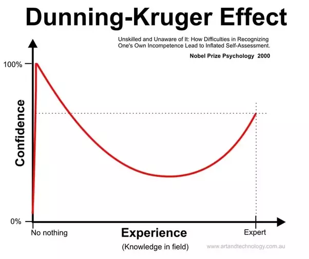
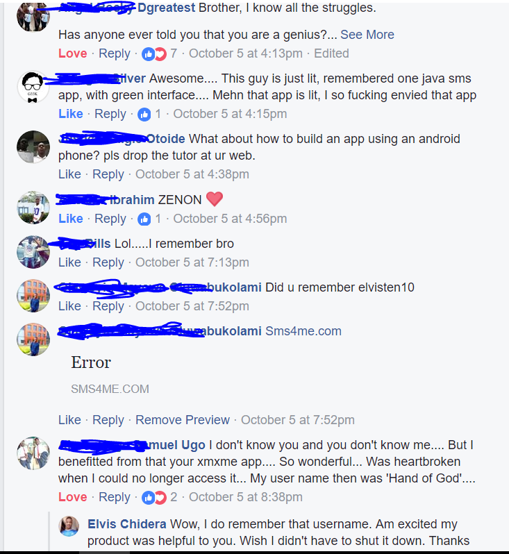
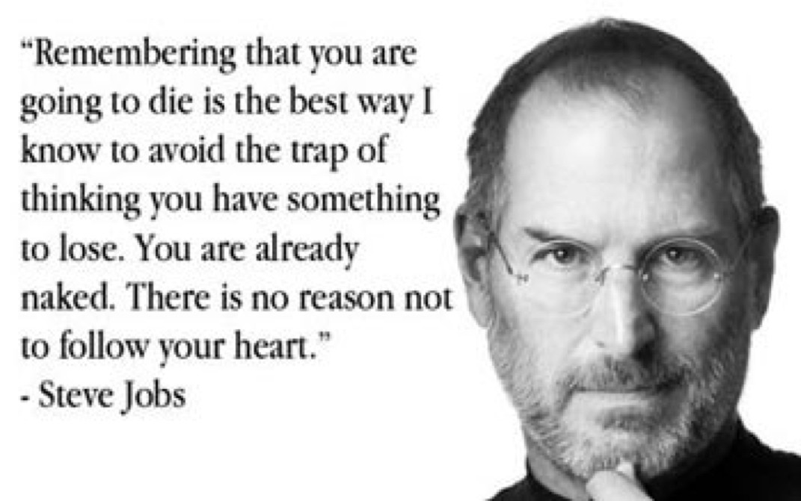
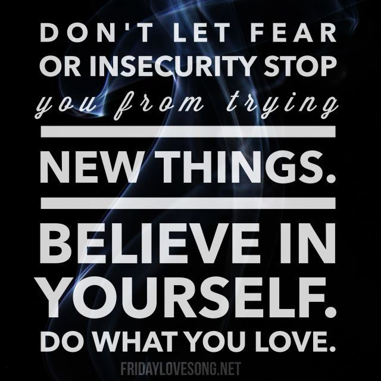

In 2012, I was just a village boy from Nigeria who had nothing but a dream and a Nokia feature (J2ME) phone. Today, I’m a 19 year old Android developer who has worked on over 50 apps and currently works for an MIT startup. My name is [Elvis Chidera](https://www.linkedin.com/in/elvischidera/) and this is my story.

My journey began with my curiosity about how to build a website. Growing up, I spent a lot of time online as I loved downloading games and reading [Society Of Robots](https://www.societyofrobots.com). I would save for weeks to buy a 10 MB internet bundle for 100 Naira ($0.28), and back in 2012, that could last for a month.

When learning to code, I took the first and simple step of doing a Google search about how to build a website. I got millions of results. Not knowing where to start, I clicked on the first link I saw, which was from [W3CSchools](http://www.w3schools.com).

The article explained that I need to learn some languages (HTML and CSS) to be able to build a website. I checked some other resources to confirm that I actually needed to learn these things. Then I started the W3CSchools HTML and CSS course.

Each day after school I would head over to the website to study. Initially, the code examples and explanations didn’t make much sense to me. But I kept studying regardless. I referred to various tutorials when I was stuck. This helped me view the problems I encountered from many different angles.

When I was younger, I struggled with my reading and writing skills in school. I was only able to get better at them through continuous practice. So I already had this model in my head: if I continue to practice — no matter how long it takes — I will ultimately be able to understand these programming languages.

A few months of intensive learning got me acquainted with HTML, CSS, and JavaScript. While I was still learning, a friend showed me the movie “The Social Network.” And after watching it, I was super motivated to build the next big thing. Thank you, Hollywood.

I had a eureka moment a few days later. The idea was to build a better version of Facebook. At that time, you couldn’t see your Facebook friends that were online. Also, Facebook was built to connect with people you already knew in real life.

So that was my billion dollar startup idea: build a social network with all the features Facebook didn’t have. Mark Zuckerberg - I’m coming for you - or so I thought.

I spent the next few months building a better social network by adding any feature I could even think of using.

I was naively confident that I was going to win.

After completing the project, I did what anybody without an advertising budget would do. I spammed the internet for days and days.

After several days of marketing, reality slapped me hard in the face. I only got 200 users, which I had to keep begging to come back to the site.

I was depressed! A few months of hard work spent in vain. This taught me two important lessons the hard way:

 1. I needed to recognize the [cold start AKA chicken and egg problem](http://platformed.info/seeding-two-sided-businesses-strategy-chicken-and-egg-problem/) that new platforms face early on.

 2. I was building something I **thought **people needed. But I ended up building just another [feature factory](https://hackernoon.com/12-signs-youre-working-in-a-feature-factory-44a5b938d6a2).

While it’s okay to be motivated by a project, you also need to know when you’re headed down a dead end. I spent a few more months trying to see if I could get more people on my site, but retention numbers kept dancing toward 0%, and I eventually gave up on the project.

But I was motivated by the motto of Lewis in [Meet the Robinsons](https://en.wikipedia.org/wiki/Meet_the_Robinsons), “Keep moving forward.”

Seeking inspiration for my next project, I reflected on the needs of my local community. This time around, I wanted to build something that people actually needed and are willing to pay for.

I came up with an idea to make text messages cheaper and easier to send to multiple people at a time. This was more like Whatsapp backed by SMS. After speaking to different people about it, I decided this was the next thing to do.

I named the project Xmx Me. It was going to be a J2ME app. This meant I had to learn Java. Looking back in time, I have to admit that it was the biggest challenge I’d yet encountered. I had to read some tutorials several times to fully understand them.

After completing a few Java courses, I was ready for work. Relentlessly typing one line of code after another, I carefully built the backend with PHP, the frontend with HTML and CSS, and the mobile app with J2ME. The app was coming to life.

But here’s the thing — I didn’t own a laptop. I was building out all of these pieces of my app on my J2ME feature phone.

Wait. What?

You read that right.

## How I built my production apps on a feature phone

At this point in my life, I had never actually programmed on a laptop. I simply couldn’t afford one. My parents wanted to help me. But it was difficult for them because they had to choose between paying my school fees (and other necessities) versus buying me a laptop.

I hadn’t used a laptop before, and my only interaction with computers was at cyber cafes. I remember watching some videos about how to use a computer (left click, drag, drop, and other basic stuff) and then walking into a cyber cafe to practice them.

I was lucky that a relative had gifted me a feature phone ([The Nokia 2690](https://www.gsmarena.com/nokia_2690-3004.php)). This phone changed my life. It’s what I used to develop Xmx Me, my failed social network, and several other projects.

With nothing but a phone and the will to succeed, hour after hour I typed my code on that tiny keyboard. I was lucky again to have found an app that allowed me to compile my [J2ME projects](http://elvischidera.blogspot.com.ng/2013/09/create-j2me-apps-with-your-mobile-phone.html). Yes, building a J2ME app on a J2ME phone *is* possible.

The SDK was resource hungry, so my battery often died. I would carry on, writing out all my code on paper and try to review it for any syntax errors.

I don’t think I’ll fail any Java whiteboard coding tests after having done this for so long. :)

## Launching my group SMS app

After several months, I had the product ready. I was able to convince someone I met on an internet forum to help me pay for the [website hosting](http://www.zettahost.com/) and the bulk [SMS service](http://www.80kobo.com/) for a limited number of SMS units.

The app launch went well — at least better than my first project. We got some local press, and one of Kenya’s top blogs even [wrote about the app](https://techmoran.com/xmx-mebulk-sms-app-developed-by-a-14-year-old-boy-from-port-harcourtnigeria/). We grew organically to about 5,000 users.

We were in business. And we were getting transactions a couple of times a day.

With no prior experience running a business, I made some huge mistakes, some of which were:

 1. There was no easy way to charge users in Nigeria. Not everybody has a debit card. So I allowed people to pay using their mobile phone credit. The problem here was, there was no official way to convert this credit into money. I had to sell to vendors, who bought it back at a ridiculously low rates.

 2. There was little to no accounting. I was losing money and I didn’t know about it. I didn’t factor in some overhead costs. There were several missing pieces.

I was considering selling the App to buy a laptop. Not knowing what to do, I went [online to beg](http://www.nairaland.com/1339891/14-year-old-nigerian-bulk-sms-app). Yes, I was that shameless and hungry. It didn’t turn out well. Somebody accused of being a scammer, which I eventually resolved. Again, I was inexperienced and I handled the situation poorly.

After borrowing money multiple times to keep the business running, I decided to throw in the towel. Looking back, I think this was a bad decision. With a little more learning and experience, I would have been able to make things better. Maybe I didn’t see any future in an SMS app. Well, I released a throwback app recently, and many of the users still use it and love it.

## Lessons I learned along the way

I realized that if I was going to be able to afford a computer anytime soon, I would need to work hard for it. So I began saving all the money I could. I cut my daily expenses and lived as simple a life as possible. I asked my relatives for help. I even sold some personal belongings to raise money for the laptop.

Still, it wasn’t enough. Determined to achieve my goal, I took on a freelance job of building a website so I could earn the remaining sum.

How do you use a feature phone to build a website designed for PC users? Simple: have a Facebook friend who you disturb every night to view your website on his computer and give you feedback. It was cheaper than going to a cyber cafe repeatedly.

I also made heavy use of [Ideone](http://ideone.com) which allowed me to run my PHP scripts to see if they work before uploading them.

Well, I finally was able to get that laptop. I can still remember the feeling of joy I had. That smell of plastic when you unbox a brand new cheap computer. I could now work on any project I wanted without feeling restricted because of my phone.

Since J2ME devices were slowly dying out, I eventually switched to building for the Android platform. My Java skills were still relevant there. I just needed to learn some platform-specific things.

The next year in 2015, after high school, I decided to start working to support my family. So I began freelancing. I was always active in local forums and groups, looking for people who wanted help with building an Android app.

Because I didn’t have a good portfolio, I would build apps for some people before they even paid, without any guarantee that I’d be paid. I was stung by this approach several times, but it allowed me to build a good enough portfolio.

I would like to share something I wish I knew while I was freelancing:
> Don’t spread yourself too thin. Taking up too many responsibilities is not good for your health, your family, or the clients.

I worked with several clients from different parts of Nigeria who loved my work. I eventually got a full-time job in Lagos, Nigeria after working with a client remotely.

Then, while going through my news feed, I saw a job advert for an Android developer position at [Dot Learn](http://www.dotlearn.org). I looked them up and realized they are an MIT startup working in an education technology field that I was passionate about, and in a market I understood. They had a unique idea: to solve the problem of access to online education by making educational videos that are extremely data-light — as low as 1MB for every hour of video.

This was almost unbelievable, and I knew it was key to making education very accessible to a lot of people.

I am very passionate about revolutionizing education in Africa. In fact, I have already built a free (ad-supported) exam prep app called [PrepUp](https://play.google.com/store/apps/details?id=elvis10ten.com.past_questions&hl=en) that has over 35,000+ installs and was one of the finalists at the [West Africa Mobile Awards in 2016](https://techpoint.ng/2016/03/24/west-africa-mobile-awards-2016-finalists/). So I wanted to be part of what Dot Learn was building.

So I went through the developer job requirements and I felt I had a chance. But impostor syndrome didn’t want me to be great.

For days I had conflicting thoughts. Should I apply or not?

Then I realized one thing: I had nothing to lose.

The worst that could happen would be that I got rejected. But I wouldn’t die. So, I went ahead and applied.

Fingers crossed, I started re-watching several of the videos I had downloaded from [MIT OCW](https://ocw.mit.edu/courses/electrical-engineering-and-computer-science/). I also spent some nights watching some [coding interview solution videos](https://www.youtube.com/channel/UCxX9wt5FWQUAAz4UrysqK9A/videos). In the past, I had mostly been hired based on my strong portfolio and previous job experience, but I didn’t want to be caught off guard if they gave me a coding interview.

Well, long story short: after lots of preparation, answering some difficult questions, a phone interview, and some coding projects, I was accepted.

I couldn’t believe it. I was ecstatic.

Looking back at it, this was one of my best decisions.

Working at Dotlearn, I have had exponential growth in my career and have met with lots of awesome people from MIT, Harvard, and other great places.

From attending big events like the [Techcrunch Battlefield](https://techcrunch.com/video/dot-learn-startup-battlefield-africa-2017/59df0c729e45105de569e2c1/) (I ended up missing my flight) to realizing I could rap, it’s been a fun and exciting experience so far.

### Final Notes

I know I’m just getting started, but the goal of my story is to inspire someone somewhere in a similar situation like me.