[Flutter](https://flutter.io) is Google’s new **open-source **toolkit for helping developers build iOS and Android apps with just **one codebase**. Flutter apps are written in the [Dart](http://dartlang.org) programming language and compile to **native** code, so the performance is really, really great.

In this tutorial, I will show you how to use Flutter to build an app that shows the current price of different cryptocurrencies. I will walk you through the fundamentals of Flutter and Dart.

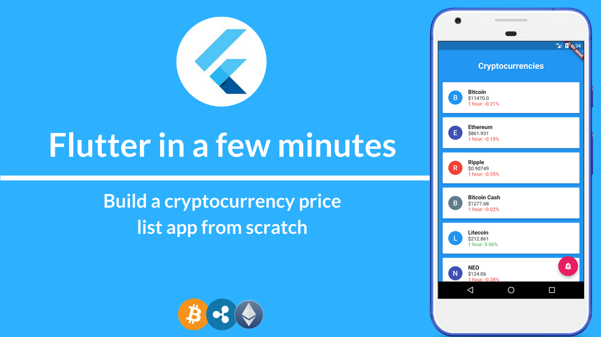

Before we start, [install Flutter](https://flutter.io/get-started/install/) and the [Flutter editor plugin](https://flutter.io/get-started/editor/) if you haven’t done so already. The installation should be straight-forward, but if you bump into issues you can leave a comment on this post and I will be glad to help out.

For this tutorial, I will be using [Android Studio](https://developer.android.com/studio/index.html), but you can also use [IntelliJ](https://www.jetbrains.com/idea/) or [Visual Studio Code](https://code.visualstudio.com/).

Also, some object-oriented programming (OOP) experience is required. Relax! You don’t need years of experience — if you know what [classes and objects](https://www.techrepublic.com/article/intro-to-oop-understanding-classes-and-objects/) are, you should be fine.

### Let’s get started

On Android Studio or IntelliJ, click on the **File** menu -> **New** -> **New Flutter Project**. If you don’t see the **New Flutter Project** option, ensure you have installed the [Flutter plugin](https://flutter.io/get-started/editor/). If you are using Visual Studio Code, follow the steps [here](https://flutter.io/get-started/test-drive/) to create a new project.

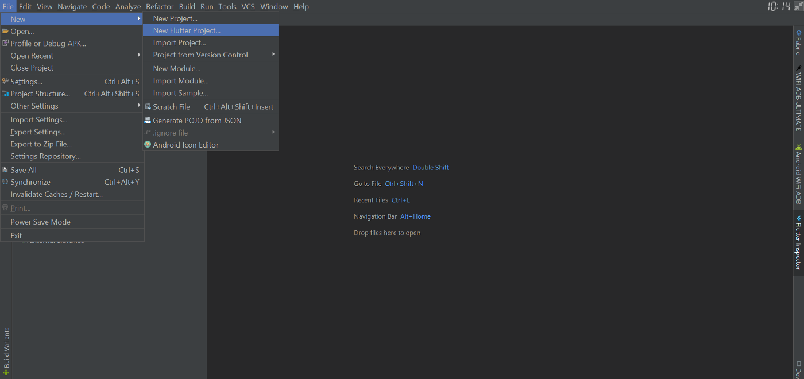

When the page opens, select **Flutter Application** and click on the **Next** button.

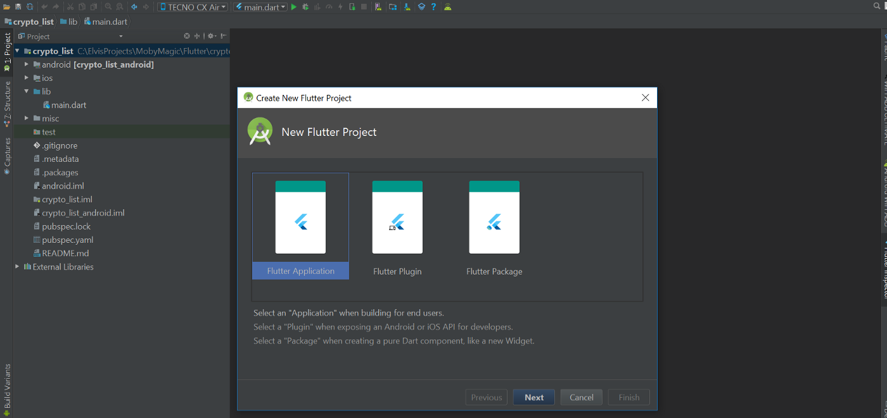

The next page lets you configure the project. You can use a similar configuration like the image below. Just ensure that the Flutter SDK path points to the directory where you downloaded Flutter.

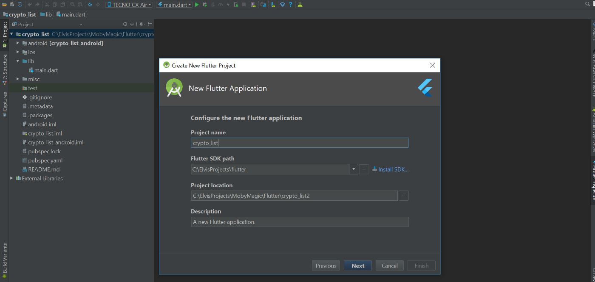

The last page lets you configure your company domain name, and you can set it to any domain name. After that, click on the Finish button.

The project creation should begin after clicking the finish button, which usually takes a few minutes.

When it’s done, your project should look like this.

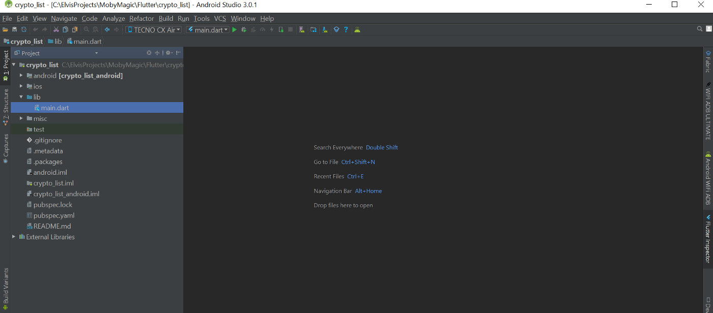

A file called main.dart was created in the lib folder. It contains code for a demo app. Since we will be building our app from scratch, open up the main.dart file and delete/clear all the code in it.

If your project includes a test directory that contains the file widget_test.dart, delete this file before continuing. It contains tests for the code we just deleted.

Flutter apps are written in the Dart programming language. The main.dart file is a Dart source file (.dart extension). The Dart convention is to name source files using lowercase_with_underscores.

Let’s start writing some Dart code. We will begin with the programming tradition: printing “Hello World!”

To do that we will have to create something called the main function. The main function is a top-level function that every Flutter app has that serves as the entry point into your app. Think of it like the entrance to a house.

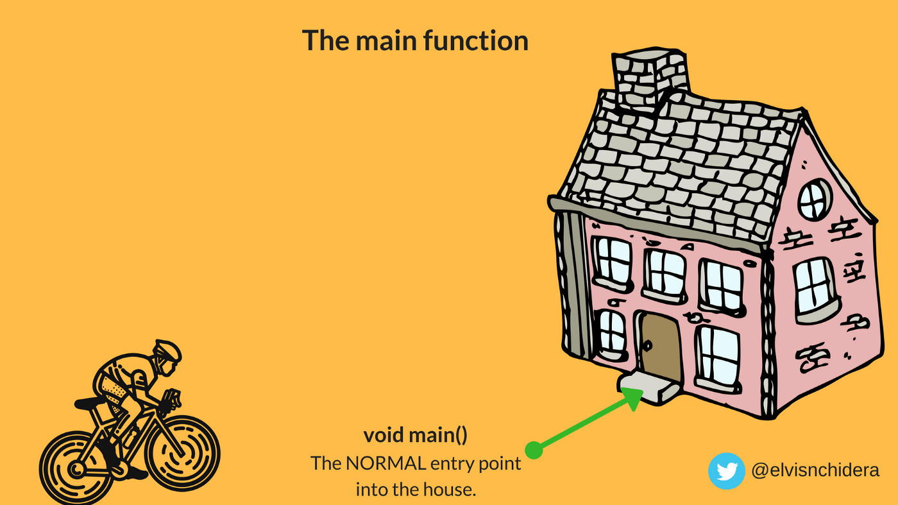

When you run your app on a device, execution will start from the main function. Let’s create a simple main function, so enter the following code into your main.dart file.

```dart:title=main.dart
 // This is where the app starts executing.
void main() {
  print('Hello World'); // Prints Hello World! to the console
}
```

As you can see, creating the main function is easy. The second line contains the main function declaration: its return type(void) and name (main). The main function returns void meaning it returns nothing.

The third line does the printing to the console. We call the print function and pass a string argument to it. Note that in Dart, you can use single quotes (‘string’) or double quotes (“string”) when declaring a string literal.

To run the code, click on the green run (play) button at the top of Android Studio or IntelliJ. Ensure you have an actual device connected or you have an [emulator running](https://flutter.io/setup-windows/).

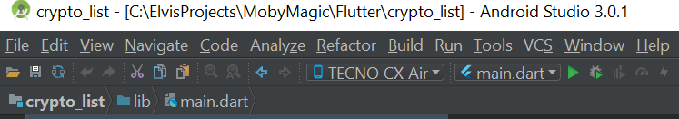

After the app successfully starts, you should see “Hello World!” printed on the console.

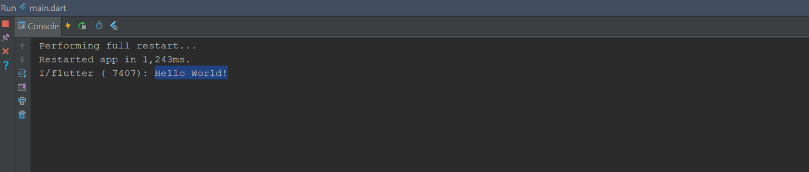

But if you check your device or emulator, you will see something disappointing.

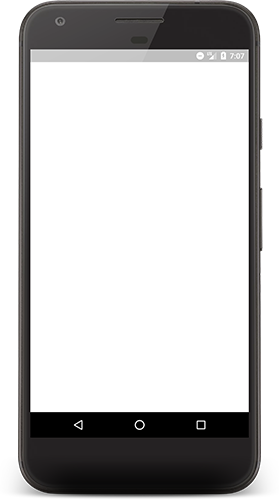

Well, this was expected, as we are currently only printing to the console. There was nothing added to the app UI, and that is why it is blank.

So let’s fix this by adding some elements to the app UI. Our app will be using material design, so let’s add a package to the main.dart file to help with that.

```dart:title=main.dart
import 'package:flutter/material.dart';
```

Just like any modern programming language, you can import a library/package to use in your code. Here we are importing the material.dart package. This package contains code that helps us create a material styled app.

The material.dart package has a function called runApp. The runApp takes a widget and attaches it to the screen. Well, what is a widget?


You can think of widgets as views or UI elements. They are the things you see (and some you don’t see) when you run your app on a device. In Flutter, you will be using widgets a lot, because the main idea is that your app UI is made entirely out of widgets.

Flutter already comes with a suite of powerful widgets like text and images. The material.dart package we just imported has several material design widgets that we will be using shortly.

Let’s use the runApp method now to show “Hello World!” at the center of the device screen. Replace the content of the main function with the code below.

```dart:title=main.dart
void main() {
  print('Hello World!');
  
  // Runs the MaterialApp widget
  runApp(new MaterialApp(
    // This is the widget that is displayed first when the application is started normally
    home: new Center(
      // The Text widget is wrapped in a center widget to center it on the screen
      child: new Text('Hello World!'),
    ),
  ));
}
```

Let me explain some of the new stuff in the code above

 1. new: To create an object, you usually use the new keyword with a *constructor* for a class. (OOP)

 2. new MaterialApp(): Here we are creating a new widget object called MaterialApp. The MaterialApp widget creates a number of useful things needed by a material design app.

 3. home:: In Dart, we can clearly state the name of each parameter within the function/constructor call. The widget passed in as the home parameter is displayed first when the app is started normally.

 4. new Center(child: new Text('Hello World!')) : We wrap the Text widget inside a Center widget so that the text gets centered on the screen. The Text widget is a child of the Center widget. Yes, widgets can be nested.

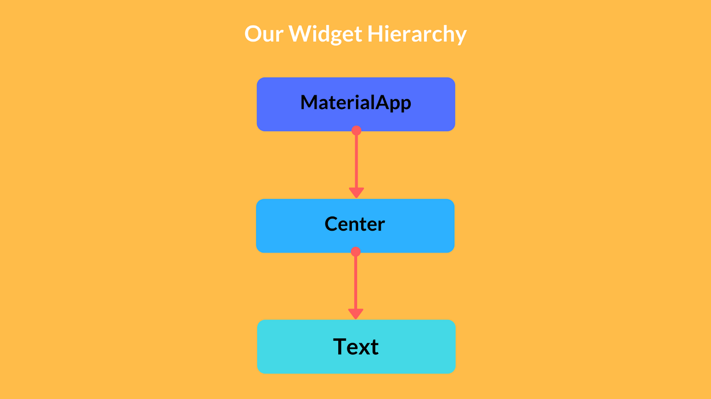

If you run the code again and open up your device, you should get a slightly better screen now.

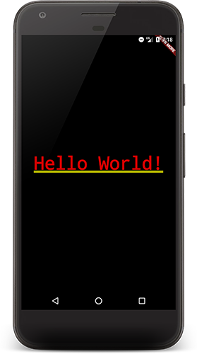

Cool! We were able to show an ugly looking text centered on the device screen.

### The next steps

Let’s take a few steps forward now. We will be getting the cryptocurrency prices from the [CoinMarketCap API](https://api.coinmarketcap.com/v1/ticker/). The API returns a JSON array. Here is a sample response from the API:

```json:title=coin_market_cap_api_response.json
[
    {
        "name": "Bitcoin", 
        "price_usd": "11525.7", 
        "percent_change_1h": "-0.18",
        ...
    },
    ...
]
```

We will be making a request to the CoinMarketCap API and decoding the JSON from the app. We will have to include a couple of new packages to the main.dart file.

```dart:title=main.dart
import 'dart:async';
import 'dart:convert';
import 'package:http/http.dart' as http;
```

Here’s an overview of the new packages:

 1. dart:async: Provides the Future class, which I will talk more about below.

 2. dart:convert: Provides the json variable we will use to decode the JSON string response.

 3. package:http/http.dart: Provides the function we will use to make HTTP GET requests.

Let’s add a new function to the main.dart file that makes a request to the CoinMarketCap API.

```dart:title=main.dart
Future<List> getCurrencies() async {
  String apiUrl = 'https://api.coinmarketcap.com/v1/ticker/?limit=50';
  // Make a HTTP GET request to the CoinMarketCap API.
  // Await basically pauses execution until the get() function returns a Response
  http.Response response = await http.get(apiUrl);
  // Using the JSON class to decode the JSON String
  return JSON.decode(response.body);
}
```

Let’s walk through the new code

-> Future&lt;List&gt; : We are basically saying that the getCurrencies() function will return a List sometime in the future. It will make an HTTP request to the CoinMarketCap API and return a List of currencies when done.

The getCurrencies() function is asynchronous. If you have some JavaScript experience, you can think of Futures as Promises. I created the images below to help you understand Futures in Dart.

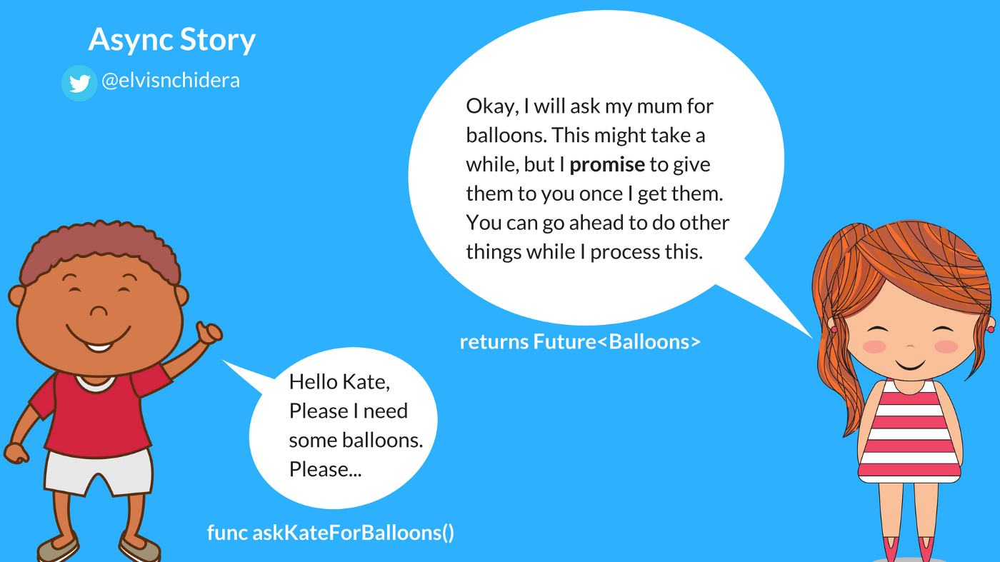

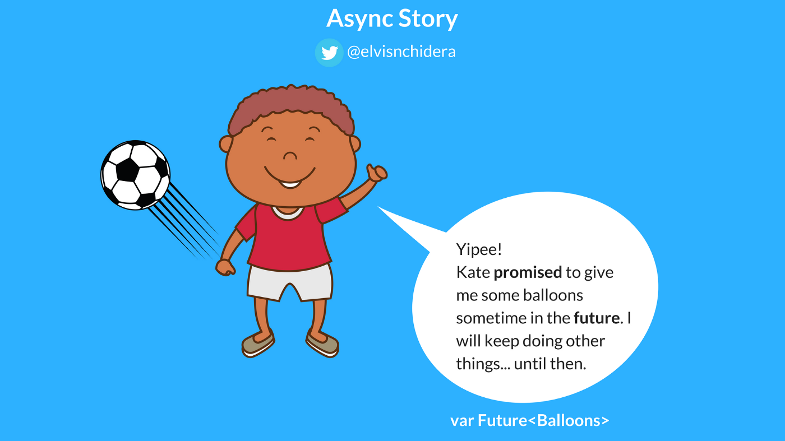

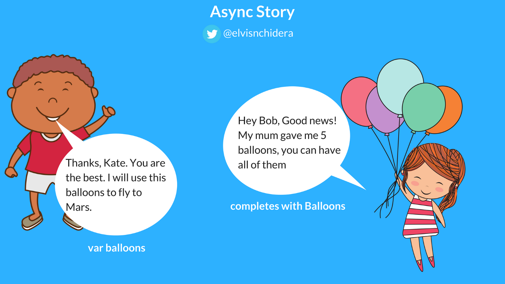

-> async and await :

Await expressions let you write asynchronous code almost as if it were synchronous. The http.get(url) function is asynchronous, returning a Future&lt;Response&gt; immediately when it’s called. We want to wait for the Response so we can decode the JSON string, but we also don’t want to use ugly callbacks.

The await expression evaluates http.get(url), and then suspends the currently running function (getCurrencies()) until the result is ready — that is, until the Future has completed.

To use await, the code must be in a function marked as asynchronous. An async function is a function whose body is marked with an async modifier. When you call an async function, it immediately returns a Future. The body of the function is scheduled for execution later.

You can read more about async and await in Dart [here](https://www.dartlang.org/articles/language/await-async).

-> http.get(url) : Makes a HTTP GET request to the CoinMarketCap API. This function is asynchronous and returns a Future immediately.

 1. JSON.decode(response.body) : Decodes the JSON string response.

Let’s test the getCurrencies() function we just created. We do that by making a call to it in our main function and printing the returned value to the console.

```dart:title=main.dart
// Since we are using await within the main function, we have to make it asynchronous too
void main() async {
  // Testing the getCurrencies function
  // We wait for the currency data to arrive
  List currencies = await getCurrencies();
  // Before printing it to the Console
  print(currencies);
  
  runApp(new MaterialApp(
    home: new Center(
      child: new Text('Hello World!'),
    ),
  ));
}
```

If you run the code above, you should see the API response printed to the console.

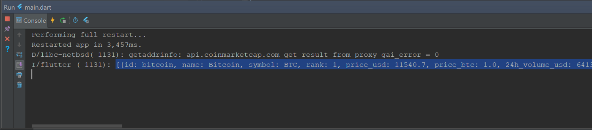

Well, in the real world bad things can happen. For example, you might not be connected to the internet, so the request to the CoinMarketCap API will fail. For this tutorial, we will assume we are in [Wakanda](https://en.wikipedia.org/wiki/Wakanda_(comics)).

In a production app, you will have to handle network failure. You do that by putting the HTTP call in a [try…catch](https://www.dartlang.org/guides/libraries/futures-error-handling) block.

### Building out the UI

Now that we have a list of currencies, let’s go ahead to build the UI to show that list.

When writing Flutter apps, you’ll usually create new widget classes. A widget’s main job is to implement a build function, which describes the widget in terms of other, lower-level widgets.

Let’s create a new Widget called CryptoListWidget. Add the code below to the bottom of your main.dart file.

```dart:title=main.dart
class CryptoListWidget extends StatelessWidget {
  
  // This is a list of material colors. Feel free to add more colors, it won't break the code
  final ListMaterialColor _colors = [Colors.blue, Colors.indigo, Colors.red];
  // The underscore before a variable name marks it as a private variable
  final List _currencies;

  // This is a constructor in Dart. We are assigning the value passed to the constructor
  // to the _currencies variable
  CryptoListWidget(this._currencies);

  @override
  Widget build(BuildContext context) {
    // Build describes the widget in terms of other, lower-level widgets.
    return new Text('Hello World!');
  }

}
```

Let’s walk through the new code above:

 1. StatelessWidget : You will usually create Widgets that are subclasses of either [StatelessWidget or StatefulWidget](https://stackoverflow.com/questions/47501710/stateful-vs-stateless-widgets-in-flutter), depending on whether your widget manages any state. We are using StatelessWidget because we have our data already and we won’t be updating it in this tutorial.

 2. final List&lt;MaterialColor&gt; _colors : Variables in a StatelessWidget should be final (meaning they are constant or do not change). Here we are declaring a final variable that holds a list of MaterialColors. The underscore (_) before the variable name makes it private (inaccessible from other classes).

 3. CryptoListWidget(this._currencies) : This is the constructor for our widget. It assigns the list of currencies we pass into the constructor to the _currencies variable.

 4. build function: The build method returns a lower-level Widget (Text) that describes how it will look.

Let’s replace the Text widget in the build function above with a new widget called Scaffold. The Scaffold widget implements the basic material design visual layout structure. Replace the build function above with the one below.

```dart:title=main.dart
  @override
  Widget build(BuildContext context) {
    return new Scaffold(
      body: _buildBody(),
      backgroundColor: Colors.blue,
    );
  }
```

The Scaffold class provides APIs for showing drawers, floating an action button, bottom bar, snack bar, and so on. We will be adding a floating action button later.

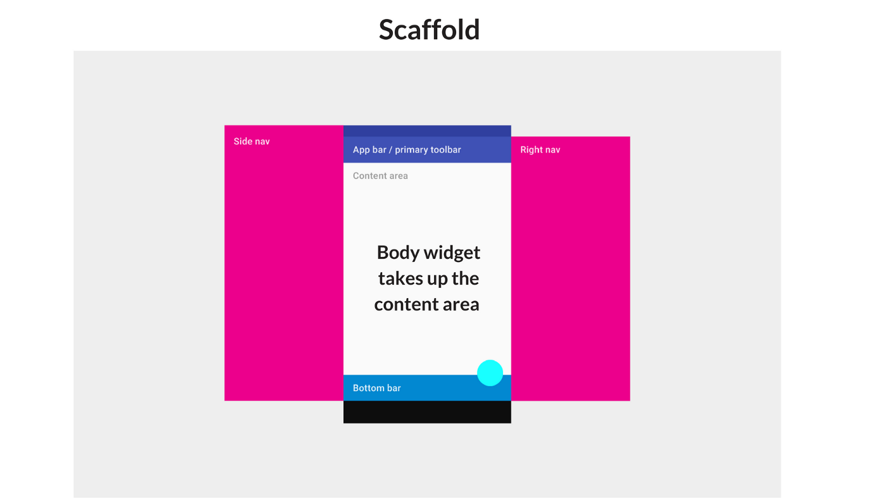

You should get a warning that _buildBody() isn’t defined for the class CryptoListWidget. Let’s go ahead to create _buildBody() function inside of the CryptoListWidget class.

```dart:title=main.dart
Widget _buildBody() {
    return new Container(
      // A top margin of 56.0. A left and right margin of 8.0. And a bottom margin of 0.0.
      margin: const EdgeInsets.fromLTRB(8.0, 56.0, 8.0, 0.0),
      child: new Column(
        // A column widget can have several widgets that are placed in a top down fashion
        children: <Widget>[
          _getAppTitleWidget(),
          _getListViewWidget()
        ],
      ),
    );
}
```

The syntax here should be familiar. We are using two new Widgets:

 1. Container widget: A [Container](https://docs.flutter.io/flutter/widgets/Container-class.html) widget is just a container :) (for other widgets).

 2. Column widget: A [Column](https://docs.flutter.io/flutter/widgets/Column-class.html) widget layouts a list of child widgets in the vertical direction. It has a parameter called children that takes a list of widgets.

Let’s create the two functions we called in the _buildBody() function. The first one is _getAppTitleWidget() .

```dart:title=main.dart
Widget _getAppTitleWidget() {
    return new Text(
      'Cryptocurrencies',
      style: new TextStyle(
          color: Colors.white,
          fontWeight: FontWeight.bold,
          fontSize: 24.0),
    );
}
```

This function returns a regular Text widget with a style that makes it bold and white with a font size of 24.0.

The text is going to look like this when we run the app.

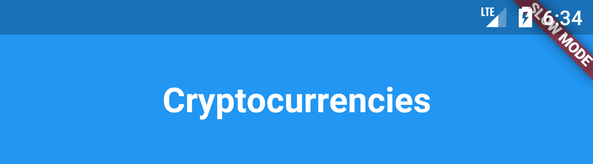

We can’t run the app yet because we haven’t created the other function called _getListViewWidget(). Let’s quickly create it using the code below.

```dart:title=main.dart
Widget _getListViewWidget() {
    // We want the ListView to have the flexibility to expand to fill the
    // available space in the vertical axis
    return new Flexible(
        child: new ListView.builder(
            // The number of items to show
            itemCount: _currencies.length,
            // Callback that should return ListView children
            // The index parameter = 0...(itemCount-1)
            itemBuilder: (context, index) {
              // Get the currency at this position
              final Map currency = _currencies[index];

              // Get the icon color. Since x mod y, will always be less than y,
              // this will be within bounds
              final MaterialColor color = _colors[index % _colors.length];

              return _getListItemWidget(currency, color);
            }));
}
```

The _getListViewWidget() returns a ListView widget that is wrapped in a Flexible widget. We use the ListView.builder to easily create the list. We pass in an itemCount which tells the builder how many currencies to show.

The itemBuilder callback will be called for each item and you have to return a new widget. In the code above we are calling a function called _getListItemWidget() that returns a Widget.

Before we create the _getListItemWidget() function, let’s quickly create the individual elements for the ListView item widget. We want each item in the ListView to look like this:


So, we have three main widgets:

 1. A round icon widget with the currency name’s first character

 2. A text widget with the currency name

 3. A text widget with the price and percent change in 1 hour.

Let’s create the widgets. For simplicity sake, I created a function for each of them. The first function called _getLeadingWidget() returns the round icon with the text.

```dart:title=main.dart
CircleAvatar _getLeadingWidget(String currencyName, MaterialColor color) {
    return new CircleAvatar(
      backgroundColor: color,
      child: new Text(currencyName[0]),
    );
}
```

The widget will look like this:

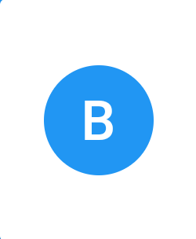

The second function called _getTitleWidget returns the Text widget for the currency name.

The third function called _getSubtitleWidget() returns the Text widget for the currency current price and percent change in 1 hour.

```dart:title=main.dart
Text _getTitleWidget(String currencyName) {
    return new Text(
      currencyName,
      style: new TextStyle(fontWeight: FontWeight.bold),
    );
}

Text _getSubtitleWidget(String priceUsd, String percentChange1h) {
    return new Text('\$$priceUsd\n1 hour: $percentChange1h%');
}
```

Both of these widgets should look like this:

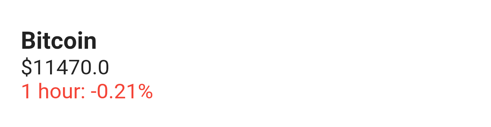

Let’s wrap all three widgets in something called a ListTile widget. The ListTile widget is based on the [Material Design List](https://material.io/guidelines/components/lists.html) documentation. It shows all three widgets in this style.

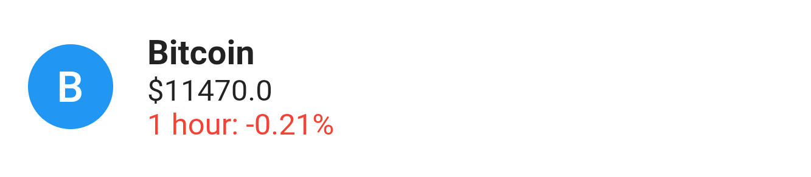

We will create a new function called _getListTile that returns a ListTile widget.

```dart:title=main.dart
ListTile _getListTile(Map currency, MaterialColor color) {
    return new ListTile(
      leading: _getLeadingWidget(currency['name'], color),
      title: _getTitleWidget(currency['name']),
      subtitle: _getSubtitleWidget(
          currency['price_usd'], currency['percent_change_1h']),
      isThreeLine: true,
    );
}
```

Finally, let’s create the _getListItemWidget() . It is going to return a Container widget that has a top padding of 5.0 and has a Card widget child. The card widget has the ListTile returned by _getListTile as it’s child.

```dart:title=main.dart
Container _getListItemWidget(Map currency, MaterialColor color) {
    // Returns a container widget that has a card child and a top margin of 5.0
    return new Container(
      margin: const EdgeInsets.only(top: 5.0),
      child: new Card(
        child: _getListTile(currency, color),
      ),
    );
}
```

The widget will look like this.

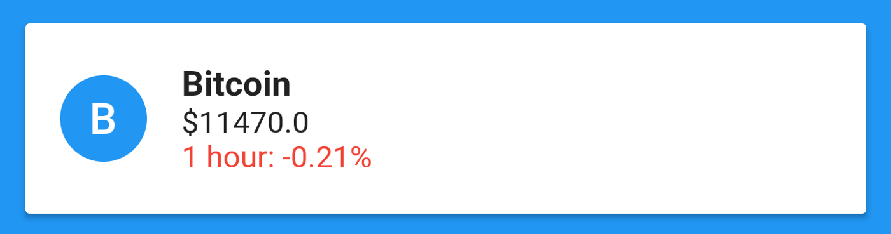

We have successfully completed our CryptoListWidget. But we have to update the main function to show the newly created widget instead of the Text widget.

```dart:title=main.dart
void main() async {
  // Bad practice alert :). You should ideally show the UI, and probably a progress view,
  // then when the requests completes, update the UI to show the data.
  List currencies = await getCurrencies();
  print(currencies);
  
  runApp(new MaterialApp(
    home: new CryptoListWidget(currencies),
  ));
}
```

That’s it. You can hit the run button again. If everything works well and you are connected to the internet, you should a screen that looks like this.

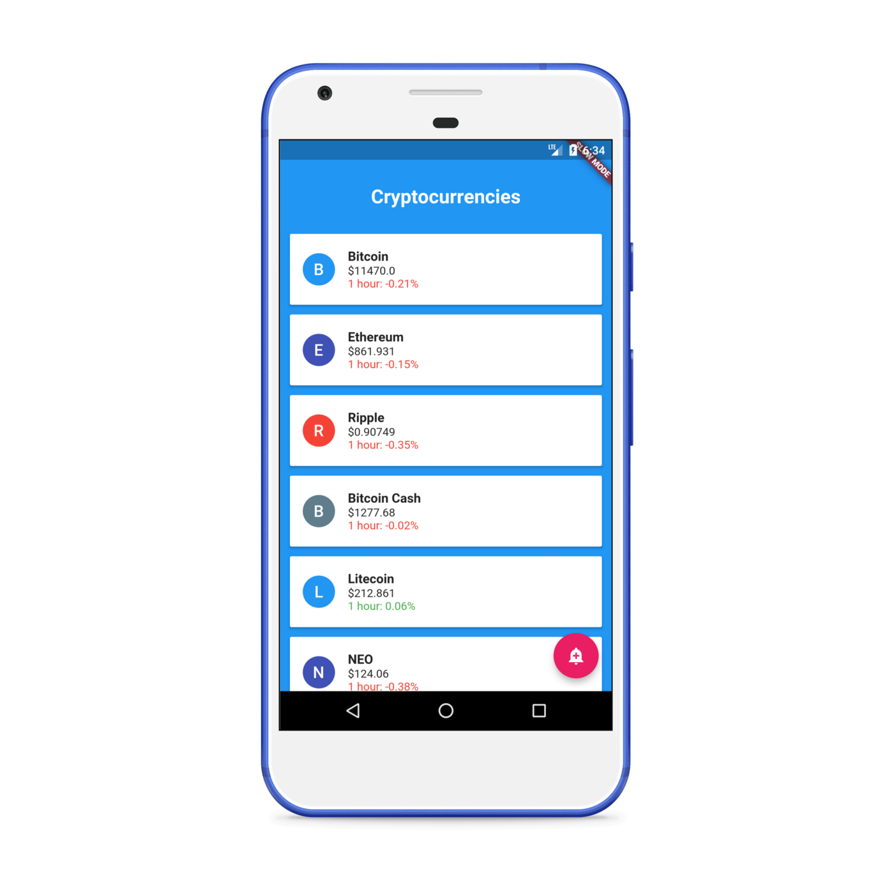

Really cool right?

The app you see will be slightly different from the screenshot above:

 1. It does not have a floating action button at the bottom right.

 2. The text color of the percent change in 1 hour is black.

I decided not to include them in the tutorial. But you can check the project [Github repository](https://github.com/Elvis10ten/FlutterCryptocurrencyListApp) to see how I was able to achieve it.

The completed app can be downloaded [here](https://drive.google.com/file/d/1awcyZCsbeM3qiNHgBb_Jx-On2N3lEh9F/view?usp=sharing).

Thanks for reading and hope you enjoy Flutter as much as I do.