I recently started a project that involved working with OpenCV on Android. Most of the guides on setting up the library on Android were outdated or not complete. So, after getting multiple requests from team mates on how to set this up, I decided to just write a dead simple guide on this.

)](./assets/banner.jpeg)

**Step 1: Download OpenCV Android Library**

Go to the [OpenCV Android Sourceforge](https://sourceforge.net/projects/opencvlibrary/files/opencv-android/) page and download the latest OpenCV Android library. As at the time of writing this post, the latest available version was **3.4.1**.

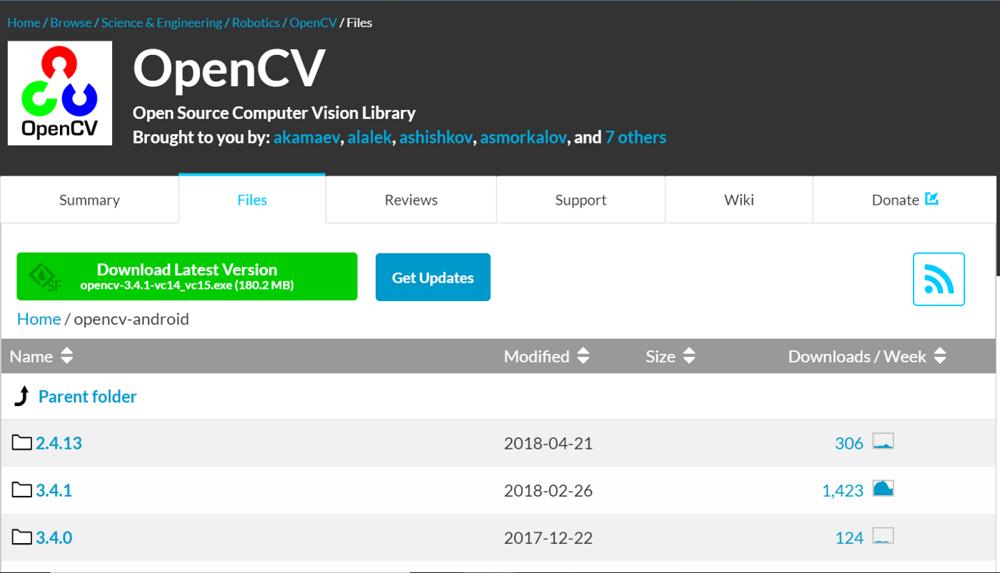

When the download completes, you should extract the contents of the zip file into a folder.

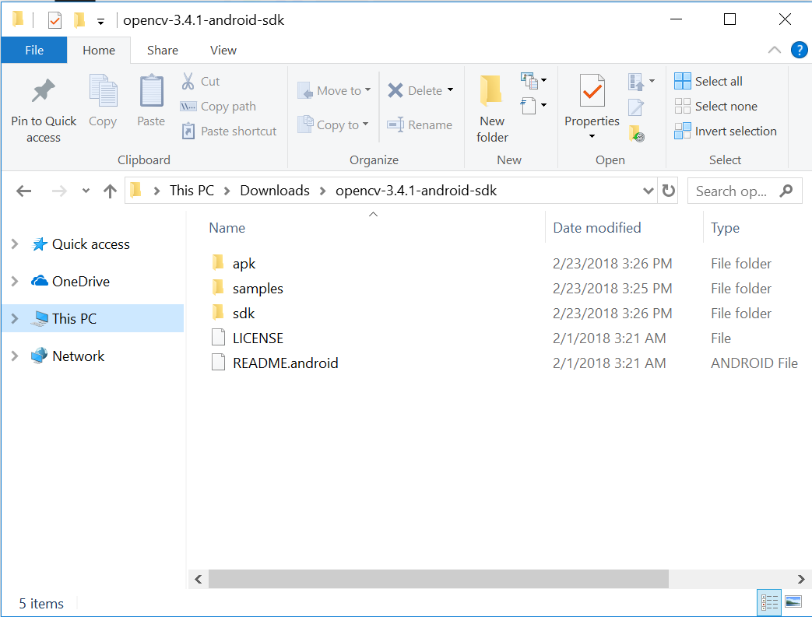

**Step 2: Setup project**

Create a new Android project using Android Studio only if you have not created one already for your computer vision project.

Note: Skip this step if you already have an Android project you want to use the OpenCV library in.

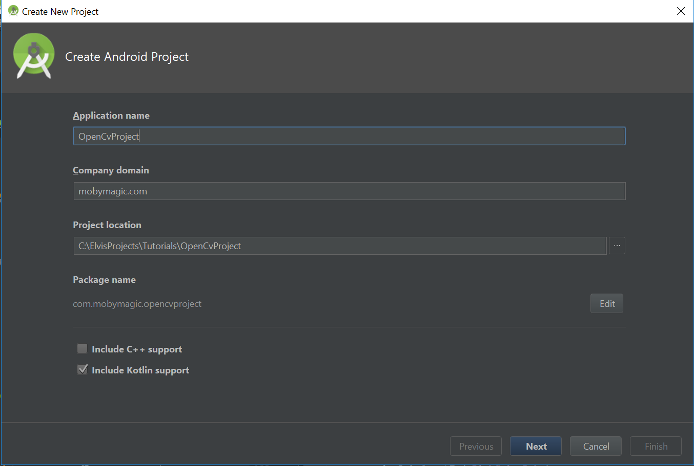

**Step 3: Import OpenCV Module**

After successfully creating an Android project, it is time to import the OpenCV module into your Android project. Click on **File** -> **New** -> **Import Module…**

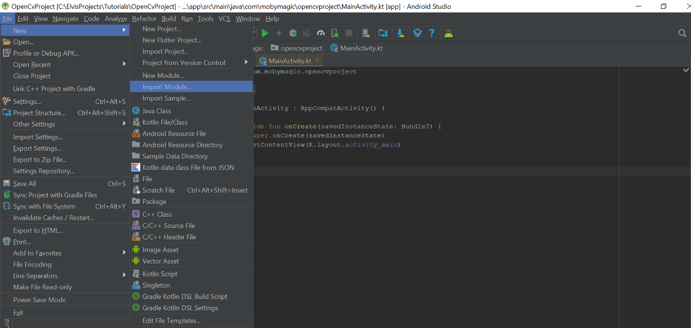

It should bring up a popup like the image below where you can select the path to the module you want to import.


Browse to the folder where you extracted the OpenCV Android library zip file contents. Select the java folder inside of the sdk folder.

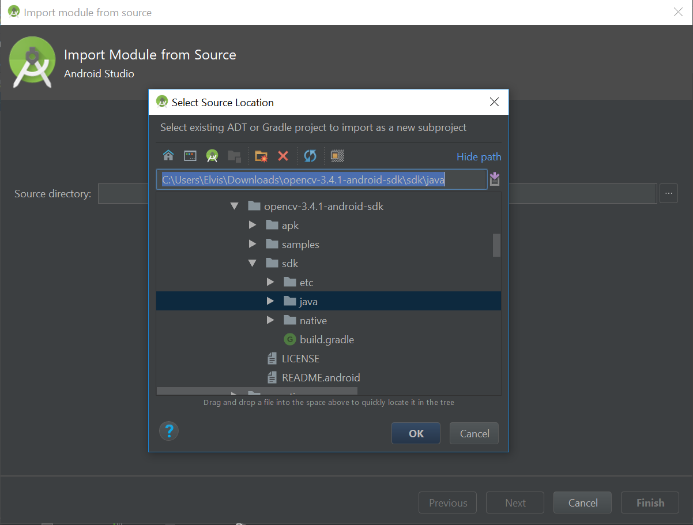

After selecting the correct path and clicking **OK**, you should get a screen like the image below.

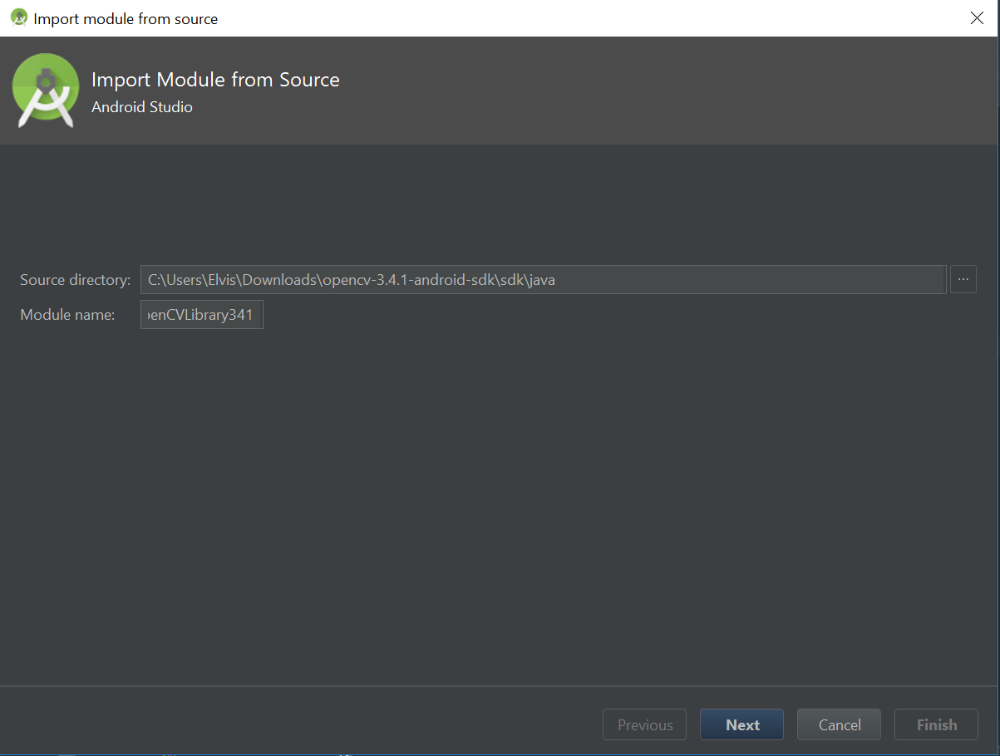

Click on **Next** to go to the next screen. On the next screen (the image below) you should leave the default options checked and click on **Finish** to complete the module import.

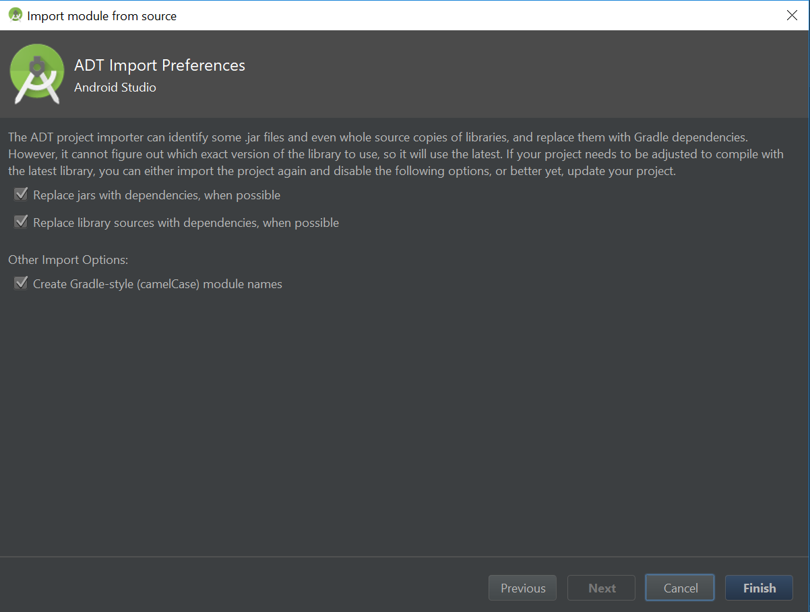

**Step 4: Fixing Gradle Sync Errors**

You should get a Gradle build error after you finish importing the OpenCV library. This happens because the library is using an old Android SDK that you probably don’t have installed yet.

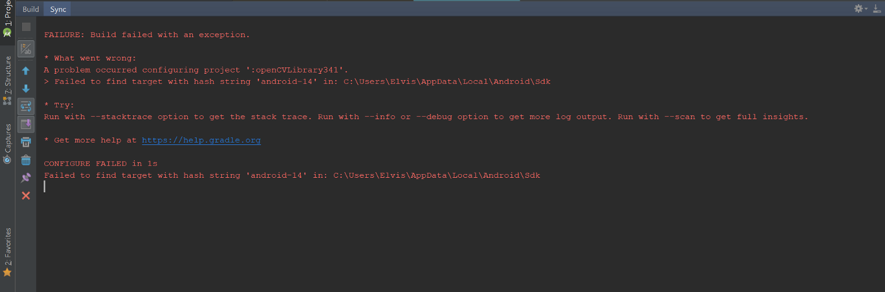

To quickly fix this error, switch from the Android pane to the Project pane on the left side of Android Studio.

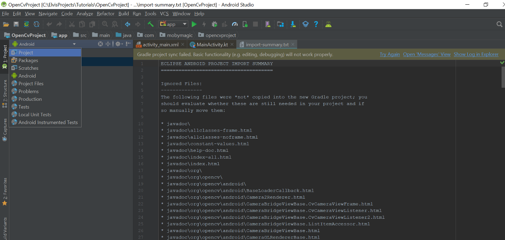

Browse to OpenCV library module and open its build.gradle file.

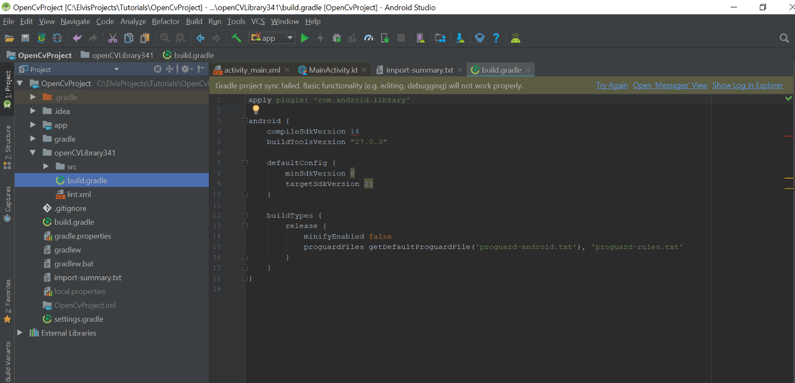

To fix the error, you just have to change the compileSdkVersion and targetSdkVersion to the latest Android SDK version or the one you have installed on your PC. After changing the version you should click on the **sync** button so that Gradle can sync the project.

Quick tip: buildToolsVersion can be ignored

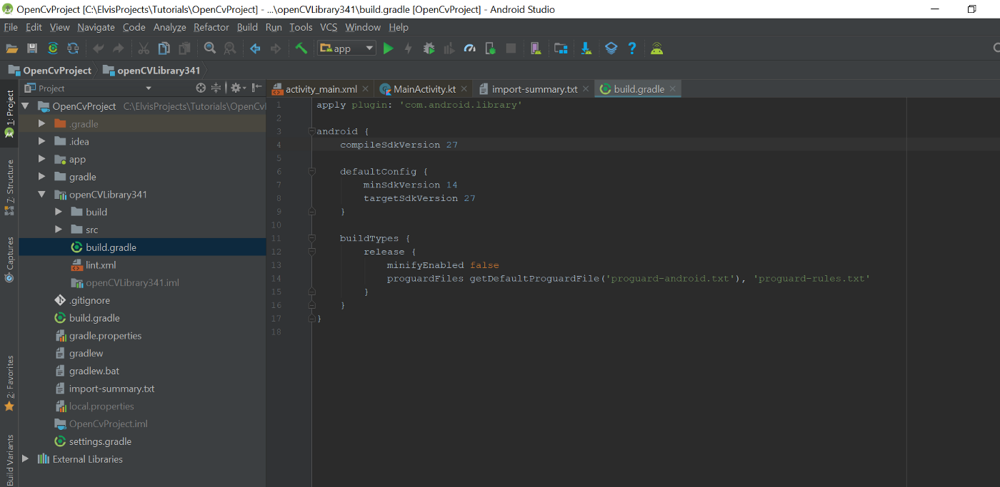

**Step 5: Add the OpenCV Dependency**

To work with the OpenCV Android library, you have to add it to your app module as a dependency. To easily do this on Android Studio, click on **File** -> **Project Structure**.

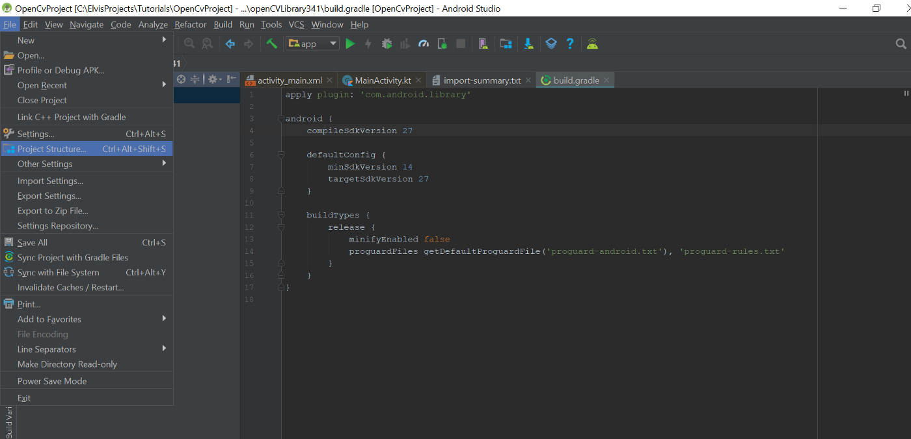

When the project structure dialog opens, click on the app module or any other module that you want to use OpenCV library in.

After navigating to the module, click on the **Dependencies** tab. You should see a green plus button on the far right of the dialog, click on it and select **Module dependency**.

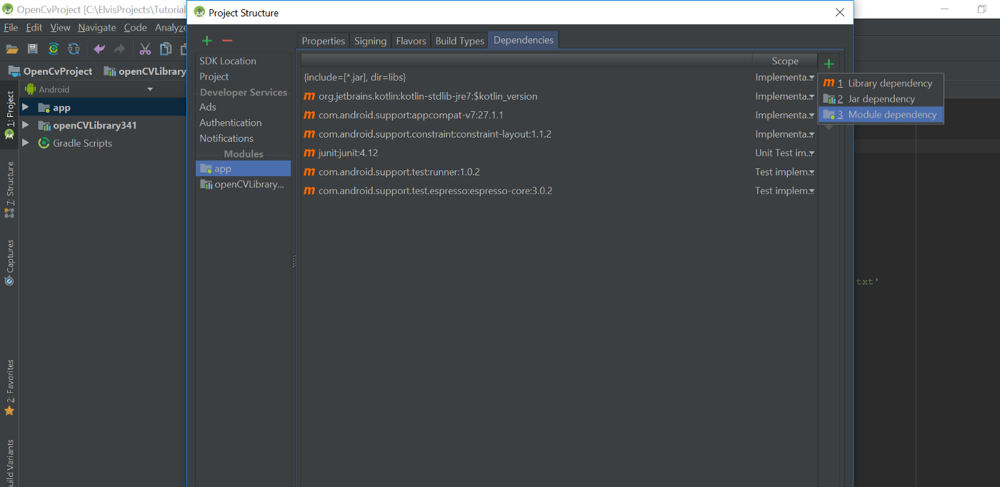

When the choose modules dialog opens, select the OpenCV library module and click on **OK**.

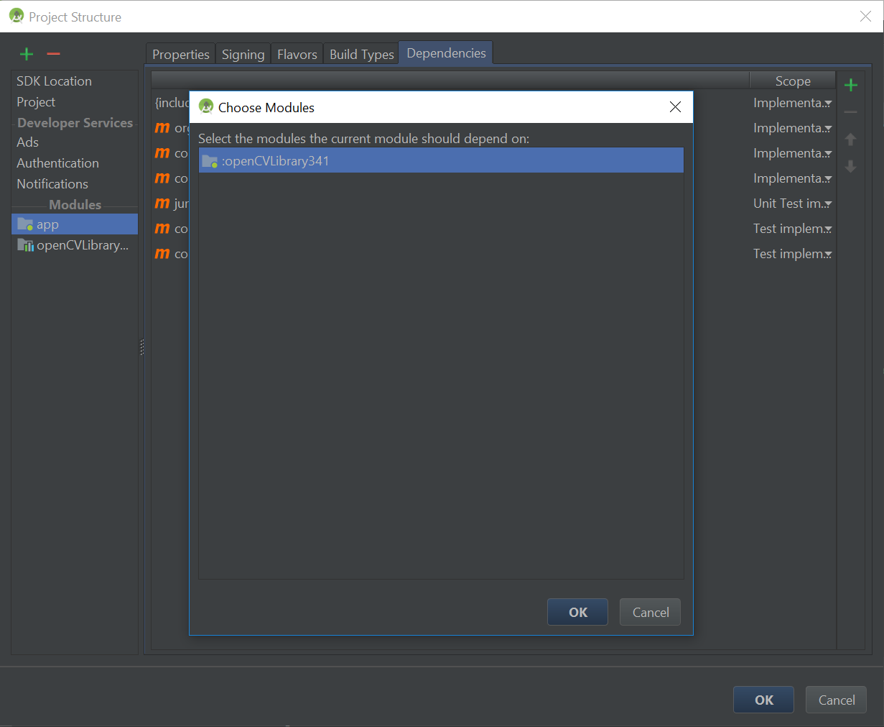

When you return to the dependencies page, confirm that the module was actually added as a dependency then click on the **OK** button to continue.

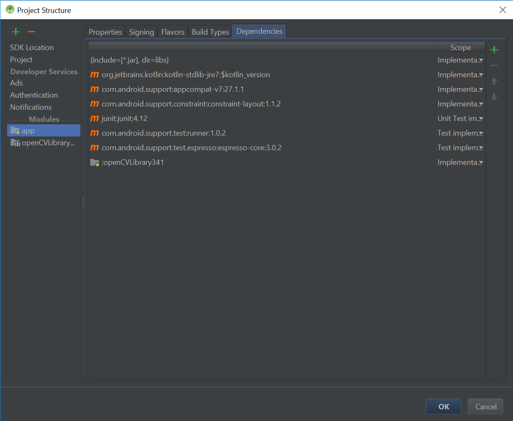

**Step 6: Add Native Libraries**

On your file explorer, navigate to the folder where you extracted the content of the OpenCV Android library zip file. Open the sdk folder and then the native folder (Use the image below as a guide).


Copy the libs folder in the native folder over to your project app module main folder (Usually ProjectName/app/src/main).


Rename the libs folder you just copied into your project to jniLibs.


**Step 7: Add Required Permissions**

To successfully use OpenCV, your app should have the camera permission added to its AndroidManifest.xml file.

Tip: Don’t forget to request for the camera permission at runtime on Android 6 and above.

```xml:title=AndroidManifest.xml
<uses-permission android:name="android.permission.CAMERA"/>

<uses-feature android:name="android.hardware.camera" android:required="false"/>
<uses-feature android:name="android.hardware.camera.autofocus" android:required="false"/>
<uses-feature android:name="android.hardware.camera.front" android:required="false"/>
<uses-feature android:name="android.hardware.camera.front.autofocus" android:required="false"/>
```

**Step 8: Try out Sample**

To confirm that you successfully integrated the OpenCV Android library, you can try out one of the samples included in the library zip file.

Let’s try out the color-blob-detection sample. You can see the sample in action below:

<div class="video_wrapper">
    <iframe class="video_frame" width="100%" height="100%" src="https://www.youtube.com/embed/d62LO19pejE" frameborder="0" allow="accelerometer; autoplay; clipboard-write; encrypted-media; gyroscope; picture-in-picture" allowfullscreen></iframe>
</div>

Quickly update your app main activity with the code below.

```java:title=MainActivity.java
package com.mobymagic.opencvproject;

import java.util.List;

import org.opencv.android.BaseLoaderCallback;
import org.opencv.android.CameraBridgeViewBase.CvCameraViewFrame;
import org.opencv.android.LoaderCallbackInterface;
import org.opencv.android.OpenCVLoader;
import org.opencv.core.Core;
import org.opencv.core.CvType;
import org.opencv.core.Mat;
import org.opencv.core.MatOfPoint;
import org.opencv.core.Rect;
import org.opencv.core.Scalar;
import org.opencv.core.Size;
import org.opencv.android.CameraBridgeViewBase;
import org.opencv.android.CameraBridgeViewBase.CvCameraViewListener2;
import org.opencv.imgproc.Imgproc;

import android.app.Activity;
import android.os.Bundle;
import android.util.Log;
import android.view.MotionEvent;
import android.view.View;
import android.view.Window;
import android.view.WindowManager;
import android.view.View.OnTouchListener;
import android.view.SurfaceView;

public class MainActivity extends Activity implements OnTouchListener, CvCameraViewListener2 {
    private static final String  TAG              = "MainActivity";

    private boolean              mIsColorSelected = false;
    private Mat                  mRgba;
    private Scalar               mBlobColorRgba;
    private Scalar               mBlobColorHsv;
    private ColorBlobDetector    mDetector;
    private Mat                  mSpectrum;
    private Size                 SPECTRUM_SIZE;
    private Scalar               CONTOUR_COLOR;

    private CameraBridgeViewBase mOpenCvCameraView;

    private BaseLoaderCallback  mLoaderCallback = new BaseLoaderCallback(this) {
        @Override
        public void onManagerConnected(int status) {
            switch (status) {
                case LoaderCallbackInterface.SUCCESS:
                {
                    Log.i(TAG, "OpenCV loaded successfully");
                    mOpenCvCameraView.enableView();
                    mOpenCvCameraView.setOnTouchListener(MainActivity.this);
                } break;
                default:
                {
                    super.onManagerConnected(status);
                } break;
            }
        }
    };

    public MainActivity() {
        Log.i(TAG, "Instantiated new " + this.getClass());
    }

    /** Called when the activity is first created. */
    @Override
    public void onCreate(Bundle savedInstanceState) {
        Log.i(TAG, "called onCreate");
        super.onCreate(savedInstanceState);
        requestWindowFeature(Window.FEATURE_NO_TITLE);
        getWindow().addFlags(WindowManager.LayoutParams.FLAG_KEEP_SCREEN_ON);

        setContentView(R.layout.color_blob_detection_surface_view);

        mOpenCvCameraView = (CameraBridgeViewBase) findViewById(R.id.color_blob_detection_activity_surface_view);
        mOpenCvCameraView.setVisibility(SurfaceView.VISIBLE);
        mOpenCvCameraView.setCvCameraViewListener(this);
    }

    @Override
    public void onPause()
    {
        super.onPause();
        if (mOpenCvCameraView != null)
            mOpenCvCameraView.disableView();
    }

    @Override
    public void onResume()
    {
        super.onResume();
        if (!OpenCVLoader.initDebug()) {
            Log.d(TAG, "Internal OpenCV library not found. Using OpenCV Manager for initialization");
            OpenCVLoader.initAsync(OpenCVLoader.OPENCV_VERSION_3_0_0, this, mLoaderCallback);
        } else {
            Log.d(TAG, "OpenCV library found inside package. Using it!");
            mLoaderCallback.onManagerConnected(LoaderCallbackInterface.SUCCESS);
        }
    }

    public void onDestroy() {
        super.onDestroy();
        if (mOpenCvCameraView != null)
            mOpenCvCameraView.disableView();
    }

    public void onCameraViewStarted(int width, int height) {
        mRgba = new Mat(height, width, CvType.CV_8UC4);
        mDetector = new ColorBlobDetector();
        mSpectrum = new Mat();
        mBlobColorRgba = new Scalar(255);
        mBlobColorHsv = new Scalar(255);
        SPECTRUM_SIZE = new Size(200, 64);
        CONTOUR_COLOR = new Scalar(255,0,0,255);
    }

    public void onCameraViewStopped() {
        mRgba.release();
    }

    public boolean onTouch(View v, MotionEvent event) {
        int cols = mRgba.cols();
        int rows = mRgba.rows();

        int xOffset = (mOpenCvCameraView.getWidth() - cols) / 2;
        int yOffset = (mOpenCvCameraView.getHeight() - rows) / 2;

        int x = (int)event.getX() - xOffset;
        int y = (int)event.getY() - yOffset;

        Log.i(TAG, "Touch image coordinates: (" + x + ", " + y + ")");

        if ((x < 0) || (y < 0) || (x > cols) || (y > rows)) return false;

        Rect touchedRect = new Rect();

        touchedRect.x = (x>4) ? x-4 : 0;
        touchedRect.y = (y>4) ? y-4 : 0;

        touchedRect.width = (x+4 < cols) ? x + 4 - touchedRect.x : cols - touchedRect.x;
        touchedRect.height = (y+4 < rows) ? y + 4 - touchedRect.y : rows - touchedRect.y;

        Mat touchedRegionRgba = mRgba.submat(touchedRect);

        Mat touchedRegionHsv = new Mat();
        Imgproc.cvtColor(touchedRegionRgba, touchedRegionHsv, Imgproc.COLOR_RGB2HSV_FULL);

        // Calculate average color of touched region
        mBlobColorHsv = Core.sumElems(touchedRegionHsv);
        int pointCount = touchedRect.width*touchedRect.height;
        for (int i = 0; i < mBlobColorHsv.val.length; i++)
            mBlobColorHsv.val[i] /= pointCount;

        mBlobColorRgba = converScalarHsv2Rgba(mBlobColorHsv);

        Log.i(TAG, "Touched rgba color: (" + mBlobColorRgba.val[0] + ", " + mBlobColorRgba.val[1] +
                ", " + mBlobColorRgba.val[2] + ", " + mBlobColorRgba.val[3] + ")");

        mDetector.setHsvColor(mBlobColorHsv);

        Imgproc.resize(mDetector.getSpectrum(), mSpectrum, SPECTRUM_SIZE, 0, 0, Imgproc.INTER_LINEAR_EXACT);

        mIsColorSelected = true;

        touchedRegionRgba.release();
        touchedRegionHsv.release();

        return false; // don't need subsequent touch events
    }

    public Mat onCameraFrame(CvCameraViewFrame inputFrame) {
        mRgba = inputFrame.rgba();

        if (mIsColorSelected) {
            mDetector.process(mRgba);
            List<MatOfPoint> contours = mDetector.getContours();
            Log.e(TAG, "Contours count: " + contours.size());
            Imgproc.drawContours(mRgba, contours, -1, CONTOUR_COLOR);

            Mat colorLabel = mRgba.submat(4, 68, 4, 68);
            colorLabel.setTo(mBlobColorRgba);

            Mat spectrumLabel = mRgba.submat(4, 4 + mSpectrum.rows(), 70, 70 + mSpectrum.cols());
            mSpectrum.copyTo(spectrumLabel);
        }

        return mRgba;
    }

    private Scalar converScalarHsv2Rgba(Scalar hsvColor) {
        Mat pointMatRgba = new Mat();
        Mat pointMatHsv = new Mat(1, 1, CvType.CV_8UC3, hsvColor);
        Imgproc.cvtColor(pointMatHsv, pointMatRgba, Imgproc.COLOR_HSV2RGB_FULL, 4);

        return new Scalar(pointMatRgba.get(0, 0));
    }
}
```

Then create a new class called ColorBlobDetector and copy the code below into it.

```java:title=ColorBlobDetector.java
package com.mobymagic.opencvproject;

import java.util.ArrayList;
import java.util.Iterator;
import java.util.List;

import org.opencv.core.Core;
import org.opencv.core.CvType;
import org.opencv.core.Mat;
import org.opencv.core.MatOfPoint;
import org.opencv.core.Scalar;
import org.opencv.imgproc.Imgproc;

public class ColorBlobDetector {
    // Lower and Upper bounds for range checking in HSV color space
    private Scalar mLowerBound = new Scalar(0);
    private Scalar mUpperBound = new Scalar(0);
    // Minimum contour area in percent for contours filtering
    private static double mMinContourArea = 0.1;
    // Color radius for range checking in HSV color space
    private Scalar mColorRadius = new Scalar(25,50,50,0);
    private Mat mSpectrum = new Mat();
    private List<MatOfPoint> mContours = new ArrayList<MatOfPoint>();

    // Cache
    Mat mPyrDownMat = new Mat();
    Mat mHsvMat = new Mat();
    Mat mMask = new Mat();
    Mat mDilatedMask = new Mat();
    Mat mHierarchy = new Mat();

    public void setColorRadius(Scalar radius) {
        mColorRadius = radius;
    }

    public void setHsvColor(Scalar hsvColor) {
        double minH = (hsvColor.val[0] >= mColorRadius.val[0]) ? hsvColor.val[0]-mColorRadius.val[0] : 0;
        double maxH = (hsvColor.val[0]+mColorRadius.val[0] <= 255) ? hsvColor.val[0]+mColorRadius.val[0] : 255;

        mLowerBound.val[0] = minH;
        mUpperBound.val[0] = maxH;

        mLowerBound.val[1] = hsvColor.val[1] - mColorRadius.val[1];
        mUpperBound.val[1] = hsvColor.val[1] + mColorRadius.val[1];

        mLowerBound.val[2] = hsvColor.val[2] - mColorRadius.val[2];
        mUpperBound.val[2] = hsvColor.val[2] + mColorRadius.val[2];

        mLowerBound.val[3] = 0;
        mUpperBound.val[3] = 255;

        Mat spectrumHsv = new Mat(1, (int)(maxH-minH), CvType.CV_8UC3);

        for (int j = 0; j < maxH-minH; j++) {
            byte[] tmp = {(byte)(minH+j), (byte)255, (byte)255};
            spectrumHsv.put(0, j, tmp);
        }

        Imgproc.cvtColor(spectrumHsv, mSpectrum, Imgproc.COLOR_HSV2RGB_FULL, 4);
    }

    public Mat getSpectrum() {
        return mSpectrum;
    }

    public void setMinContourArea(double area) {
        mMinContourArea = area;
    }

    public void process(Mat rgbaImage) {
        Imgproc.pyrDown(rgbaImage, mPyrDownMat);
        Imgproc.pyrDown(mPyrDownMat, mPyrDownMat);

        Imgproc.cvtColor(mPyrDownMat, mHsvMat, Imgproc.COLOR_RGB2HSV_FULL);

        Core.inRange(mHsvMat, mLowerBound, mUpperBound, mMask);
        Imgproc.dilate(mMask, mDilatedMask, new Mat());

        List<MatOfPoint> contours = new ArrayList<MatOfPoint>();

        Imgproc.findContours(mDilatedMask, contours, mHierarchy, Imgproc.RETR_EXTERNAL, Imgproc.CHAIN_APPROX_SIMPLE);

        // Find max contour area
        double maxArea = 0;
        Iterator<MatOfPoint> each = contours.iterator();
        while (each.hasNext()) {
            MatOfPoint wrapper = each.next();
            double area = Imgproc.contourArea(wrapper);
            if (area > maxArea)
                maxArea = area;
        }

        // Filter contours by area and resize to fit the original image size
        mContours.clear();
        each = contours.iterator();
        while (each.hasNext()) {
            MatOfPoint contour = each.next();
            if (Imgproc.contourArea(contour) > mMinContourArea*maxArea) {
                Core.multiply(contour, new Scalar(4,4), contour);
                mContours.add(contour);
            }
        }
    }

    public List<MatOfPoint> getContours() {
        return mContours;
    }
}
```

Finally, update your app main activity layout file with the layout code below.

```xml:title=color_blob_detection_surface_view.xml
<?xml version="1.0" encoding="utf-8"?>
<FrameLayout
    xmlns:android="http://schemas.android.com/apk/res/android"
    android:layout_width="match_parent"
    android:layout_height="match_parent" >

    <org.opencv.android.JavaCameraView
        android:layout_width="match_parent"
        android:layout_height="match_parent"
        android:id="@+id/color_blob_detection_activity_surface_view" />

</FrameLayout>
```

**Step 9: Using OpenCV Manager**

Because you are bundling native libraries in your app APK, you will end up with a very large app APK size.

One way to solve this is to use [ABI splits](https://developer.android.com/studio/build/configure-apk-splits), so you only have the neccessary libraries needed for each device in an APK.

The other way around the size issue is to use the [OpenCV Manager](https://play.google.com/store/apps/details?id=org.opencv.engine). In the folder where you extracted the library contents into, there is a folder called apk that contains the OpenCV manager for various architectures.


Select the APK with the right architecture of your test device and use ADB via command prompt/line to install it on your device.


**Step 10: Test the App**

Finally, hit the run button and run the app on your test device.

**Note:** Don’t forget to grant camera permission on Android 6 and above.

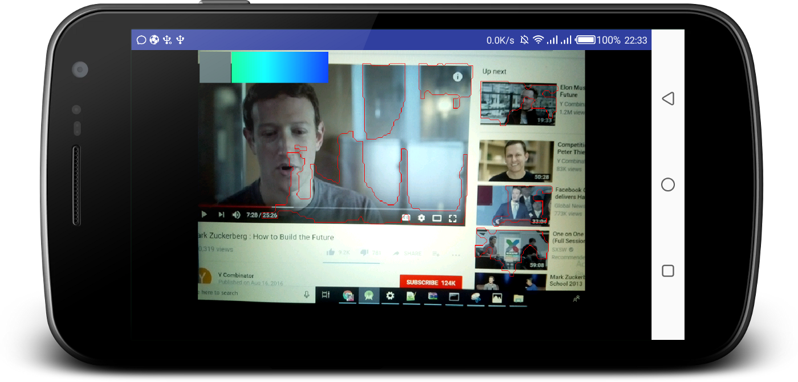

That is all.