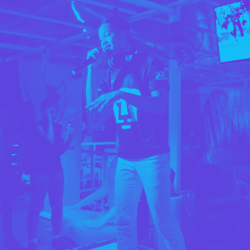

I wrote this song for Rauf — The agile coach at a previous company.

<blockquote>

We were <strong><mark class="highlight-orange_background">using</mark></strong> <mark class="highlight-gray_background"><strong>waterfall</strong></mark>

As that <strong><mark class="highlight-pink_background">was</mark></strong> the industry <strong><mark class="highlight-gray_background">protocol</mark></strong>

At a <strong><mark class="highlight-yellow_background">point</mark></strong>, we started <mark class="highlight-orange_background"><strong>loosing</strong></mark>, and it <mark class="highlight-red_background"><strong>appeared</strong></mark> <mark class="highlight-orange_background"><strong>confusing</strong></mark>

It felt like we&#x27;ve <strong><mark class="highlight-purple_background">hit</mark></strong> a <strong><mark class="highlight-gray_background">wall</mark></strong> at the <strong><mark class="highlight-yellow_background">checkpoint</mark></strong>

It was <strong><mark class="highlight-pink_background">clear</mark></strong> we were <mark class="highlight-orange_background"><strong>bruising</strong></mark>

 

<strong><mark class="highlight-teal_background">Project</mark></strong> managers didn&#x27;t <mark class="highlight-purple_background"><strong>get it</strong></mark>, <mark class="highlight-pink_background"><strong>cause</strong></mark> our <strong><mark class="highlight-teal_background">projects</mark></strong> <mark class="highlight-gray_background"><strong>stalled</strong></mark>

Requirements were <strong><mark class="highlight-brown_background">brewed</mark></strong> <mark class="highlight-teal_background"><strong>unchecked</strong></mark>, and they <strong><mark class="highlight-brown_background">grew</mark></strong> so <strong><mark class="highlight-gray_background">tall</mark></strong>

That our dear <strong><mark class="highlight-red_background">engineers fear</mark></strong>

No matter how they <strong><mark class="highlight-gray_background">brawled</mark></strong>

These projects ain&#x27;t gonna ship <mark class="highlight-gray_background"><strong>at all</strong></mark>

 

<mark class="highlight-gray_background"><strong>Projects</strong></mark> laid <strong><mark class="highlight-orange_background">scattered</mark></strong>

But <strong><mark class="highlight-gray_background">project</mark></strong> managers <mark class="highlight-orange_background"><strong>lathered</strong></mark> with <mark class="highlight-orange_background"><strong>flatter</strong></mark>

<strong><mark class="highlight-brown_background">Engineers</mark></strong> started to <strong><mark class="highlight-orange_background">chatter</mark></strong>

It was <strong><mark class="highlight-brown_background">clear</mark></strong> this was a <mark class="highlight-teal_background"><strong>new</strong></mark> <mark class="highlight-orange_background"><strong>chapter</strong></mark>

Where we were no <mark class="highlight-orange_background"><strong>longer</strong></mark> <mark class="highlight-orange_background"><strong>faster</strong></mark>, and <strong><mark class="highlight-yellow_background">falling</mark></strong> in the <mark class="highlight-yellow_background"><strong>waterfall</strong></mark>

Senior management <strong><mark class="highlight-teal_background">knew</mark></strong> they had to <mark class="highlight-orange_background"><strong>shatter</strong></mark> the <strong><mark class="highlight-orange_background">later</mark></strong>

<mark class="highlight-yellow_background"><strong>Once and for all</strong></mark>

 

We made the <strong><mark class="highlight-gray_background">call</mark></strong> to <mark class="highlight-purple_background"><strong>implement</strong></mark> <mark class="highlight-teal_background"><strong>products</strong></mark> in <mark class="highlight-purple_background"><strong>increments</strong></mark>

And hoped that the <mark class="highlight-teal_background"><strong>by-product</strong></mark> solves our <mark class="highlight-purple_background"><strong>predicament</strong></mark>

Thats when <mark class="highlight-brown_background"><strong>Rauf</strong></mark> came into the picture to help us <mark class="highlight-brown_background"><strong>morph</strong></mark>

From <strong><mark class="highlight-blue_background">fragile</mark></strong> <mark class="highlight-gray_background"><strong>waterfall</strong></mark> to <mark class="highlight-blue_background"><strong>agile</strong></mark> <mark class="highlight-red_background"><strong>metaphors</strong></mark>

 

With some <mark class="highlight-purple_background"><strong>instruments</strong></mark> he tried to bring us back to <strong><mark class="highlight-red_background">shore</mark></strong>

And taught us some <strong><mark class="highlight-pink_background">lessons</mark></strong> which has been a <mark class="highlight-pink_background"><strong>blessing</strong></mark>

Gonna share them now in this <strong><mark class="highlight-gray_background">small</mark></strong> <strong><mark class="highlight-pink_background">session</mark></strong>

 

First, you must <mark class="highlight-purple_background"><strong>empower</strong></mark> your team to take <mark class="highlight-red_background"><strong>action</strong></mark>

Cross functional teams with an innate <mark class="highlight-red_background"><strong>passion</strong></mark>

To ensure customer <mark class="highlight-red_background"><strong>satisfaction</strong></mark>

Staying in <strong><mark class="highlight-red_background">interaction</mark></strong> is your <mark class="highlight-purple_background"><strong>superpower</strong></mark> 

And only course of <strong><mark class="highlight-red_background">action</mark></strong>

 

This helps you to <strong><mark class="highlight-brown_background">sit</mark></strong> with your team to <strong><mark class="highlight-brown_background">split</mark></strong> features into <mark class="highlight-brown_background"><strong>bits</strong></mark>

<mark class="highlight-brown_background"><strong>Commit</strong></mark> to <strong><mark class="highlight-brown_background">do it</mark></strong> repeatedly

Use a <mark class="highlight-brown_background"><strong>toolkit</strong></mark> as your team <mark class="highlight-brown_background"><strong>permits</strong></mark>

Store them on a <mark class="highlight-orange_background"><strong>hardboard</strong></mark> or on an <strong><mark class="highlight-orange_background">e-board</mark></strong>

Whichever you can <mark class="highlight-orange_background"><strong>afford</strong></mark>

<strong><mark class="highlight-orange_background">Hardboards</mark></strong> are easy to <mark class="highlight-orange_background"><strong>onboard</strong></mark>

<strong><mark class="highlight-orange_background">E-boards</mark></strong> are hard to be <strong><mark class="highlight-orange_background">ignored</mark></strong>

The board is your team&#x27;s <mark class="highlight-red_background"><strong>backlog</strong></mark>

With a <strong><mark class="highlight-red_background">watchdog</mark></strong> called the <mark class="highlight-purple_background"><strong>Scrum master</strong></mark>

 

He creates <mark class="highlight-pink_background"><strong>racks</strong></mark> which are called <mark class="highlight-purple_background"><strong>sprints</strong></mark>

Where you <mark class="highlight-pink_background"><strong>stack</strong></mark> <mark class="highlight-gray_background"><strong>tickets</strong></mark> with the <mark class="highlight-gray_background"><strong>biggest</strong></mark> <mark class="highlight-pink_background"><strong>impact</strong></mark> <mark class="highlight-purple_background"><strong>footprint</strong></mark>

And <mark class="highlight-pink_background"><strong>attack</strong></mark> them in two or three weeks <mark class="highlight-purple_background"><strong>stint</strong></mark>

Keep <mark class="highlight-pink_background"><strong>track</strong></mark> of each <mark class="highlight-purple_background"><strong>sprint</strong></mark> like its <mark class="highlight-red_background"><strong>calories</strong></mark>

Each ticket should be <mark class="highlight-pink_background"><strong>compact</strong></mark> in the <mark class="highlight-red_background"><strong>gallery</strong></mark>

 

Lastly, you have to observe the scrum <mark class="highlight-gray_background"><strong>rituals</strong></mark>

Standup <mark class="highlight-brown_background"><strong>meetings</strong></mark> is the most <mark class="highlight-gray_background"><strong>habitual</strong></mark>

Where teams <mark class="highlight-orange_background"><strong>participate</strong></mark> and share their <mark class="highlight-brown_background"><strong>feelings</strong></mark>

This is done daily to <mark class="highlight-orange_background"><strong>facilitate</strong></mark> <mark class="highlight-yellow_background"><strong>collaboration</strong></mark>

<mark class="highlight-orange_background"><strong>Eliminate</strong></mark> <mark class="highlight-yellow_background"><strong>distraction </strong></mark>and <mark class="highlight-orange_background"><strong>demonstrate</strong></mark> <mark class="highlight-yellow_background"><strong>progression</strong></mark>

 

These you will use at your <mark class="highlight-blue_background"><strong>retrospective</strong></mark> <strong><mark class="highlight-brown_background">meeting</mark></strong>

To understand from a different <mark class="highlight-blue_background"><strong>perspective</strong></mark>

What was <mark class="highlight-blue_background"><strong>defective</strong></mark> and <mark class="highlight-blue_background"><strong>effective</strong></mark> as a <mark class="highlight-blue_background"><strong>collective</strong></mark>

And apply some <mark class="highlight-blue_background"><strong>correctives</strong></mark> as part of the next sprint <strong><mark class="highlight-blue_background">objective</mark></strong>

 

Agile is <mark class="highlight-blue_background"><strong>iterative</strong></mark> like that

Giving you full <mark class="highlight-purple_background"><strong>utility</strong></mark> of your team&#x27;s <strong><mark class="highlight-purple_background">ability</mark></strong>

Providing <mark class="highlight-purple_background"><strong>visibility</strong></mark> for each <mark class="highlight-purple_background"><strong>responsibility</strong></mark>

That ensures the project&#x27;s <mark class="highlight-purple_background"><strong>viability</strong></mark>

 

Our projects are in a <mark class="highlight-orange_background"><strong>stronger</strong></mark> <mark class="highlight-gray_background"><strong>lane</strong></mark>

Project managers are no <mark class="highlight-orange_background"><strong>longer</strong></mark> <mark class="highlight-gray_background"><strong>insane</strong></mark>

Stakeholders no <mark class="highlight-orange_background"><strong>longer ponder</strong></mark>

As they are <mark class="highlight-gray_background"><strong>again entertained</strong></mark>

 

Our team is <mark class="highlight-red_background"><strong>fire</strong></mark> man, you <strong><mark class="highlight-brown_background">cannot</mark></strong><mark class="highlight-brown_background"> </mark><mark class="highlight-brown_background"><strong>flame us</strong></mark>

We love agile man, you <mark class="highlight-brown_background"><strong>cannot</strong></mark><mark class="highlight-brown_background"> </mark><mark class="highlight-brown_background"><strong>blame us</strong></mark>

We going <mark class="highlight-red_background"><strong>higher</strong></mark> now, you cannot <mark class="highlight-brown_background"><strong>tame us</strong></mark>

We <mark class="highlight-purple_background"><strong>beating</strong></mark> our <mark class="highlight-yellow_background"><strong>chest</strong></mark>

About to go <mark class="highlight-blue_background"><strong>apesh*t</strong></mark> on the <mark class="highlight-yellow_background"><strong>request</strong></mark> list

You can put us on the <mark class="highlight-blue_background"><strong>ape</strong></mark> list

We <mark class="highlight-purple_background"><strong>coming</strong></mark> for the <strong><mark class="highlight-yellow_background">conquest</mark></strong>

Smashing any coming <strong><mark class="highlight-yellow_background">contest</mark></strong>

 

I hope you learned from our <mark class="highlight-teal_background"><strong>lesson</strong></mark>, no need for <mark class="highlight-teal_background"><strong>stressing</strong></mark>

Pickup agile and start <mark class="highlight-teal_background"><strong>progressing</strong></mark> towards <mark class="highlight-teal_background"><strong>progression</strong></mark>

</blockquote>