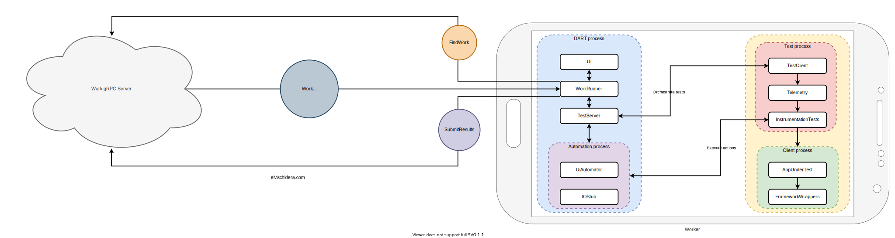
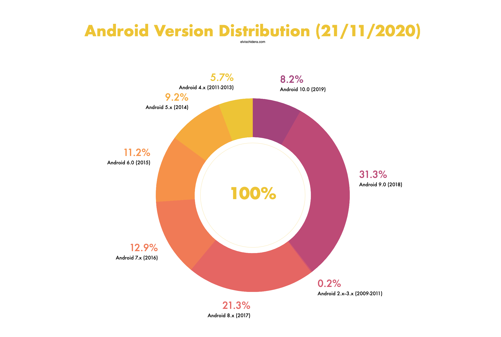
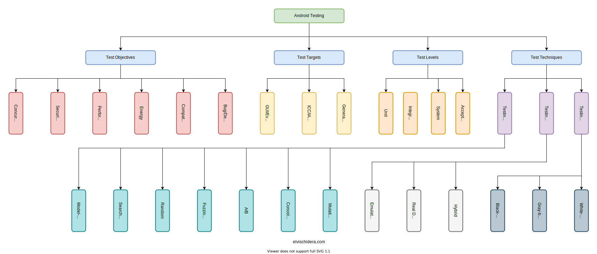
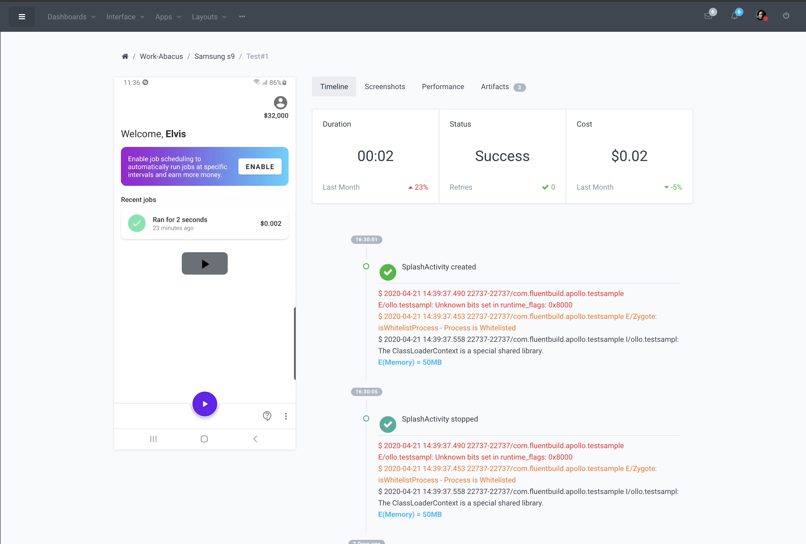
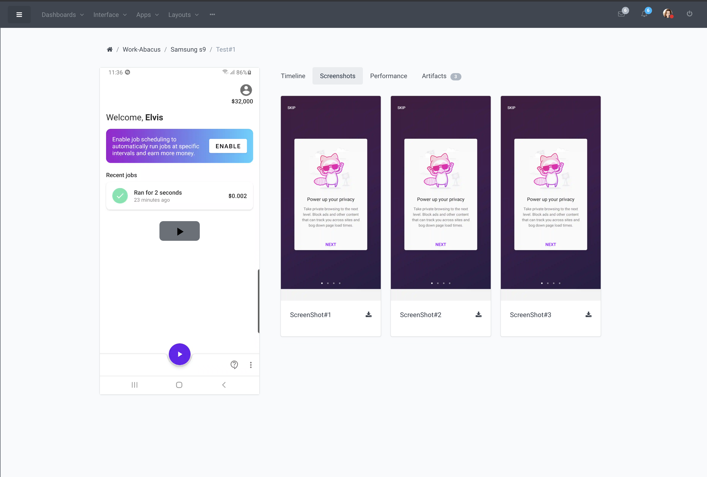
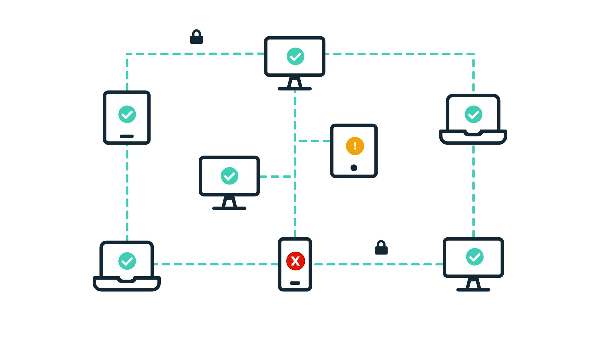
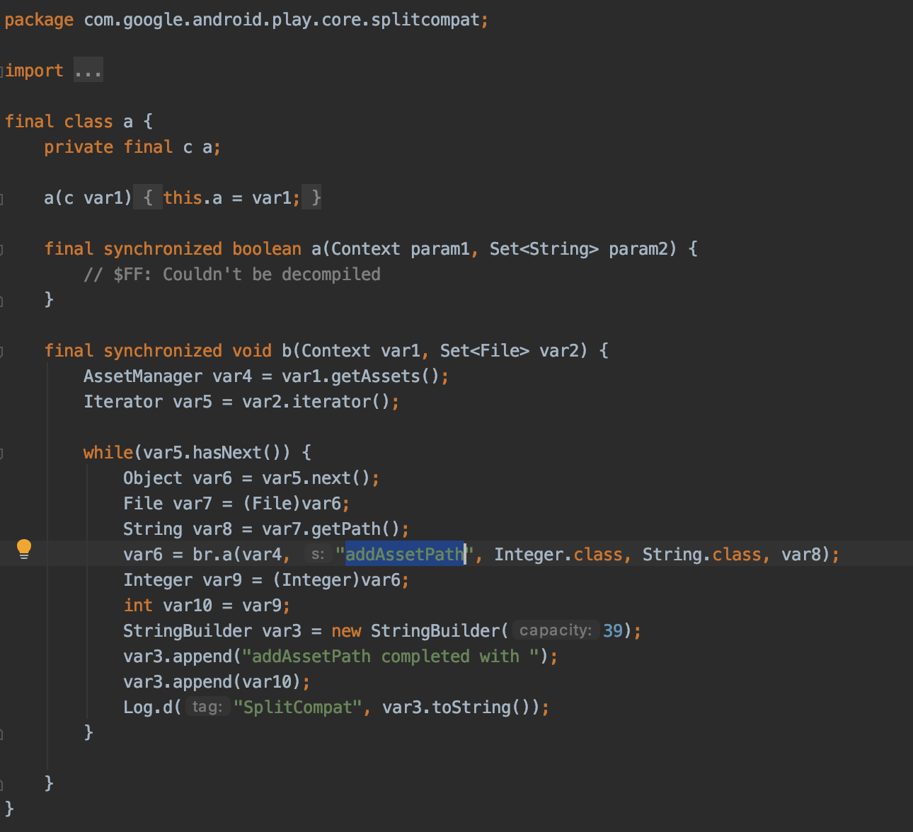
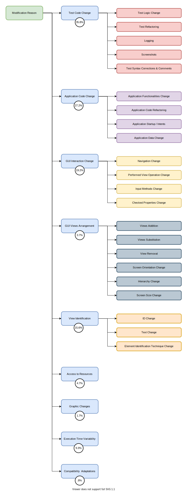
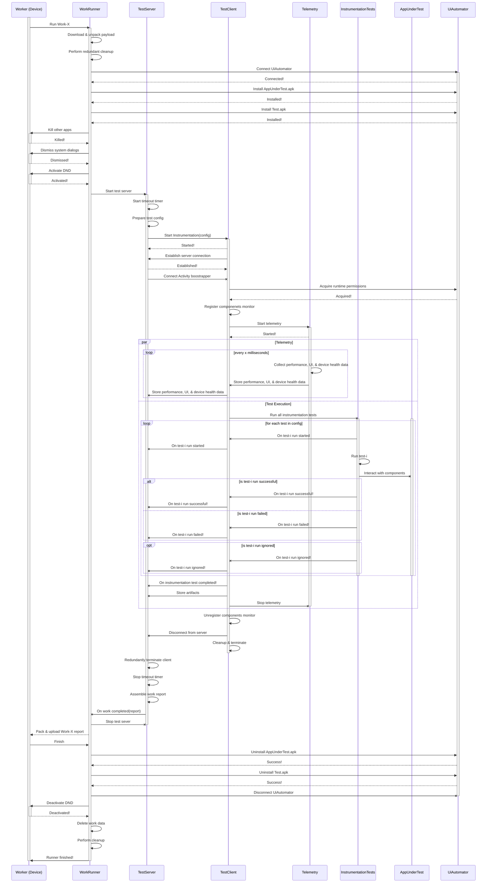
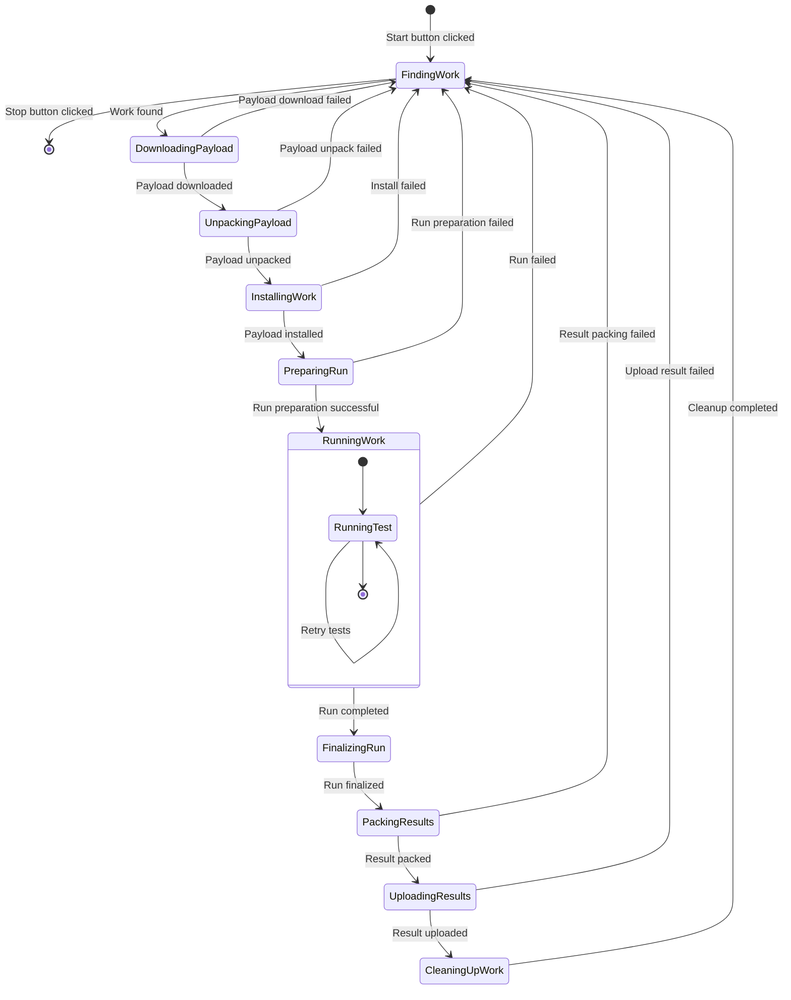

There are currently ~2.5 billion Android devices — consisting of ~1,300 discrete brands and ~24,000 unique device models. I'm exploring tapping into this latent resource pool to make automated testing affordable & unlock a more comprehensive configuration coverage.

The goal of DART (Distributed Android Remote Testing) is to enable any Android device to run automated tests — without ADB or complex setups/maintenance. A commercial product could pay people per hour of device use, allowing anyone to utilize idle device time. Each device is subsumed to provide a distributed testbed.

DART is orthogonal to [crowdsourced testing](https://en.wikipedia.org/wiki/Crowdsourced_testing) — the latter requires active human participation.

DART seems to be the best solution to utilize device idle time — the best way to verify that an app works on "Samsung S9" is by executing it on "Samsung S9".  Contrast this to other procedures where phones are usually a suboptimal option: server hosting, remote computation, etc.

In the demo below, I ran a few test cases on [Mozilla Focus Privacy Browser](https://play.google.com/store/apps/details?id=org.mozilla.focus&hl=en_US&gl=US) without cables/ADB.

<div class="video_wrapper">
    <iframe class="video_frame" width="100%" height="100%" src="https://www.youtube.com/embed/CcHEsx7ODyw" frameborder="0" allow="accelerometer; autoplay; clipboard-write; encrypted-media; gyroscope; picture-in-picture" allowfullscreen></iframe>
</div>

### 1.1. 💪 Motivation

The following problems motivated the development of DART.

##### i. 🧩 Android Device Fragmentation


The top device farms barely cover 1% of the total number of Android device models. Nondistributed device farms favor depth instead of breadth — maintenance cost increases as more diverse devices are added.

Testing on flagship devices alone doesn't always suffice.
>Anecdote: I once spent an entire day debugging an ANR that occurs to a small fraction of our users. I discovered it only affects phones purchased in specific regions. I never was able to reproduce the issue on the same phone bought in the USA.

The Android version distribution exacerbates this problem.



[Headspin](https://www.headspin.io/) aims to alleviate some of these issues. They claim to have a global infrastructure of more than 22,000 SIM-enabled (similar) devices in 150 locations. A big plus as traditional services (like Firebase Testlabs) can't handle geographical concerns. At Headspin's core is the [DeviceFarmer STF](https://github.com/DeviceFarmer/stf) open-source library. But like its predecessors, Headspin only supports a limited set of device models.

##### ii. 💸 Expensive Physical Devices


Real device test farms have an initial cost and require periodic maintenance, hence why they are more expensive than virtual device farms.

> Running 10 hours of test daily on real devices costs **$1000/month** (assuming 20 working days of equal levels of productivity).

### 1.2. 📱 Product

**The key 🔑:** Uber averts enormous maintenance costs by not owning all the cars on its global network. Similarly, with a distributed network of test devices, extensive device coverage is attainable with minimal maintenance costs. For one or two co-located devices, maintenance isn't fastidious.

> From [DeviceFramer STF](https://github.com/DeviceFarmer/stf#faq) FAQ: "Aside from a single early failure we had within only a few months, all of our devices were doing fine for about two years. However, having reached the 2-3 year mark, several devices have started to experience visibly expanded batteries [...]
In our experience, the system runs just fine most of the time, and any issues are mostly USB-related. You'll usually have to do something about once a week."

Organizations can decide what type of tests are ideal for DART and if the network is made-up of single nodes or clusters of nodes. The simple taxonomy of android testing below should be helpful. [1]



The network can be internal to an organization. An example: `X` devices stored in HQ, each employee can remotely contribute their test device into the system.

It can also be external to an organization. Imagine paying people `$1.5/hour` of device time. Assuming a device runs test overnight (thanks to timezone differences), the estimated monthly earning is `$240` (`$1.5 * 8 hours * 20 working days`).

> The median income in some countries is ~$400/month. 

Below is a demo of the [proof-of-concept](https://github.com/Elvis10ten/dart).

<div class="video_wrapper">
    <iframe class="video_frame" width="100%" height="100%" src="https://www.youtube.com/embed/7SotlhlwMDA" frameborder="0" allow="accelerometer; autoplay; clipboard-write; encrypted-media; gyroscope; picture-in-picture" allowfullscreen></iframe>
</div>

Currently, a simple dashboard renders the test summary.

<div class="image_row">
  <div class="dual_image_column">
    
  </div>
  <div class="dual_image_column">
    
  </div>
</div>

### 1.3. 🛡️ Security



There are two perspectives here:

##### i. 🧐 End-user Perspective

The end-user is concerned about malignant binaries & privacy.

Security checks will guard devices from malicious binaries. The system will be closed — only verified publishers allowed. GooglePlay is leveraged to enforce package name and signature correspondence.

A sandboxed test environment guarantees that private data is inaccessible to apps under test.

[](https://blog.google/products/android-enterprise/android-enterprise-security-assessed-gartner/)

##### ii. 👩🏽‍💻 Publisher Perspective

The publisher cares about test fraud and product leaks.

Proof of work disincentivizes test fraud. The server can use device logs, screenshots, videos with UUID, and past executions to validate submitted work results. As this isn't watertight, it is best combined with other strategies: user verifications, [device attestation](https://developer.android.com/training/safetynet), randomization, and device throughput throttling.

Preventing product leaks is hard  — if it runs on a phone, any sufficiently motivated (& knowledgeable) person can figure out a way to access objects. Three good-enough solutions are:

a. Running headless tests.

b. Using a private network of vetted devices.

c. Adopting only for binaries at the later end of the release pipeline.

### 1.4. 🎃 Going Headless

It is possible to obscure the application under test using a simple overlay. The video below shows the execution of the test cases of the Google IO 2019 app. On the right, the app interactions are invisible. Depending on the strategy, concealing actions do not affect screenshots or videos.

<div class="video_wrapper">
    <iframe class="video_frame" width="100%" height="100%" src="https://www.youtube.com/embed/jxwsoe3T8yE" frameborder="0" allow="accelerometer; autoplay; clipboard-write; encrypted-media; gyroscope; picture-in-picture" allowfullscreen></iframe>
</div>

With framework UI component wrappers, it is possible to borrow some ideas from [Layoutlib](https://android.googlesource.com/platform/frameworks/base/+/4db1f432b853152075923499768639e14403b73a/tools/layoutlib/README) to offer a full headless solution. `Layoutlib` is a custom version of the android View framework designed to run inside Eclipse. The goal of the library is to provide layout rendering in Eclipse that are very close to their rendering on devices.

### 1.5. 📦 Containerization

Tests need to run in an isolated environment. A plugin framework like [VirtualAPK](https://github.com/didi/VirtualAPK) can be built to offer a layer of isolation between apps and the OS. This works using the `DexClassLoader` and some reflection hacks to modify framework components. With this approach, apps can be seamlessly loaded & unloaded without any user interaction.


> The [GooglePlay dynamic feature delivery](https://developer.android.com/guide/app-bundle/play-feature-delivery) system uses some of these reflection techniques to support legacy devices (pre Android 7.0) 🙈. For instance, `addAssetPath` is called via reflection to make resources not bundled in an APK available for use.


This plugin approach adds cruft that is nonexistent on a regular device. An alternative is using the [Android work profile](https://developer.android.com/work/managed-profiles). Work profile creates a separate, self-contained profile on Android devices that isolates corporate data from personal apps and data. [3]

<a href="https://blog.google/products/android-enterprise/work-profile-new-standard-employee-privacy/"></a>

Work profiles also provide always-on VPN configuration, control of runtime permissions, extra security, etc. Work profiles are a great fit, only deviating slightly from the operating mode used by the average user.

> Android allows apps signed with the same key to run in the same process, if the apps so request, so that the system treats them as a single application. [3]

### 1.6. 💔 Flakiness
The system should eliminate most causes of flakiness that results from running tests on real peoples' devices — I have run over **5,000 tests** so far without any issues 🚀. In an external network, it would be naive to assume perfection as there are so many variables introduced. As the project evolves, these issues would be identified and mitigated.

A few researchers manually examined **423** projects featuring the Espresso automated GUI testing tool. They derived a set of **27** different causes of modifications and grouped them into **nine** macro-categories. Category percentages were then computed based on the frequency of modification causes. [2]



### 1.7. 🚧 Code Repository

There are four primary directories in the [Github repo](https://github.com/Elvis10ten/dart):

i. `Apollo`: Android project for the client (worker).

ii. `WorkServer`: Kotlin project for the gRPC work server.

iii. `WorkSpecs`: Protobuf definitions shared by both the server & Android client.

iv. `Dashboard`: React project for the web dashboard.

All projects are still a work in progress and lack adequate documentation.

## 2. 🏗️ System Overview


As shown above, multiple components must work in tandem to run tests on a device. The sequence diagram below shows the component interactions at a high-level.


<small>Note: Lines with an "x" represent asynchronous messages (<a href="https://github.com/mermaid-js/mermaid/issues/590">issue in Mermaid</a>).</small>

The diagram shows the finite system states and their respective transitions.



The next few sections cover individual system components. For the sake of brevity, I exclude codes that are irrelevant to the topic at hand. For each component, I only focus on some key ideas. You can always explore the [Github repo](https://github.com/Elvis10ten/dart) for the full source code.

## 3. 🤖 UiAutomator

The framework's `UiAutomation` can't be used when tests aren't run traditionally. Fortunately, the functionalities of `UiAutomation` can be replicated using the platform `Accessibility APIs` and some other functionally equivalent alternatives. As evident from the documentation, `UiAutomation` can be viewed as an `AccessiblityService` with extras.

```java:title=android.app.UiAutomation.java
/**
 * Class for interacting with the device's UI by simulation user actions and
 * introspection of the screen content. It relies on the platform accessibility
 * APIs to introspect the screen and to perform some actions on the remote view
 * tree. It also allows injecting of arbitrary raw input events simulating user
 * interaction with keyboards and touch devices. One can think of a UiAutomation
 * as a special type of {@link android.accessibilityservice.AccessibilityService}
 * which does not provide hooks for the service life cycle and exposes other
 * APIs that are useful for UI test automation.
 * <p>
 * The APIs exposed by this class are low-level to maximize flexibility when
 * developing UI test automation tools and libraries. Generally, a UiAutomation
 * client should be using a higher-level library or implement high-level functions.
 * For example, performing a tap on the screen requires construction and injecting
 * of a touch down and up events which have to be delivered to the system by a
 * call to {@link #injectInputEvent(InputEvent, boolean)}.
 * </p>
 * <p>
 * The APIs exposed by this class operate across applications enabling a client
 * to write tests that cover use cases spanning over multiple applications. For
 * example, going to the settings application to change a setting and then
 * interacting with another application whose behavior depends on that setting.
 * </p>
 */
public final class UiAutomation {
}
```

The alternative `UiAutomation` (internal) server can be implemented like this:

```kotlin:title=UiAutomationServer.kt
class UiAutomationServer(
    private val screenRotator: ScreenRotator,
    private val screenViewer: ScreenViewer,
    private val appPermissioner: AppPermissioner
): AutomationServer.Stub() {

    var lastAccessibilityEvent: AccessibilityEvent? = null
    var accessibilityEventListener: OnAccessibilityEventListener? = null

    fun onAccessibilityEvent(event: AccessibilityEvent) {
        lastAccessibilityEvent = event

        val uiEvent = addUiEvent(event)
        accessibilityEventListener?.onAccessibilityEvent(uiEvent)
    }

    override fun setOnAccessibilityEventListener(listener: OnAccessibilityEventListener?) {
        accessibilityEventListener = listener
    }

    override fun findFocus(focus: Int) =
        runWithOriginalIdentity { AutomationService.INSTANCE?.findFocus(focus) }

    override fun performGlobalAction(action: Int) =
        runWithOriginalIdentity { AutomationService.INSTANCE?.performGlobalAction(action) ?: false }

    override fun getLastEvent() = lastAccessibilityEvent

    override fun setRotation(rotation: Int) =
        runWithOriginalIdentity { screenRotator.setRotation(rotation) }

    override fun unfreezeCurrentRotation() =
        runWithOriginalIdentity { screenRotator.unfreezeCurrentRotation() }

    override fun freezeCurrentRotation() =
        runWithOriginalIdentity { screenRotator.freezeCurrentRotation() }


    override fun restoreInitialRotation() =
        runWithOriginalIdentity { screenRotator.restoreInitialSettings() }

    override fun getWindows(): List<AccessibilityWindowInfo> =
        runWithOriginalIdentity { AutomationService.INSTANCE?.windows ?: emptyList() }

    override fun findAccessibilityNodeInfosByText(nodeInfo: UiNodeInfo, text: String): List<UiNodeInfo> {
        return try {
            nodeInfo.accessibilityNodeInfo.findAccessibilityNodeInfosByText(text).map {
                addUiNodeInfo(it)
            }
        } catch (e: Exception) {
            Timber.e(e)
            emptyList()
        }
    }

    override fun findAccessibilityNodeInfosByViewId(nodeInfo: UiNodeInfo, viewId: String): List<UiNodeInfo> {
        return try {
            nodeInfo.accessibilityNodeInfo.findAccessibilityNodeInfosByViewId(viewId).map {
                addUiNodeInfo(it)
            }
        } catch (e: Exception) {
            Timber.e(e)
            emptyList()
        }
    }

    override fun performNodeAction(nodeInfo: UiNodeInfo, action: Int): Boolean {
        return nodeInfo.accessibilityNodeInfo.performAction(action)
    }

    override fun getUiEventSource(event: UiEvent): UiNodeInfo? {
        return event.accessibilityEvent.source?.let { addUiNodeInfo(it) }
    }

    override fun getRootInActiveWindow() =
        runWithOriginalIdentity { AutomationService.INSTANCE?.rootInActiveWindow }

    override fun getServiceInfo() =
        runWithOriginalIdentity { AutomationService.INSTANCE?.serviceInfo }

    override fun setServiceInfo(serviceInfo: AccessibilityServiceInfo): Boolean {
        return runWithOriginalIdentity {
            AutomationService.INSTANCE?.let {
                // TODO: Security on ServiceInfo from clients. This maybe should be validated/restricted.
                it.serviceInfo = serviceInfo
                return@runWithOriginalIdentity true
            }

            return@runWithOriginalIdentity false
        }
    }

    override fun takeScreenshot(): Bitmap? {
        return try {
            screenViewer.capture()
        } catch (e: Exception) {
            Timber.e(e, "Failed to take screenshot")
            null
        }
    }
}

inline fun <R> runWithOriginalIdentity(action: () -> R): R {
    Binder.clearCallingIdentity()
    val identity = Binder.clearCallingIdentity()
    try {
        return action()
    } finally {
        Binder.restoreCallingIdentity(identity)
    }
}
```

Not all functionality is directly available using the platform `Accessibility APIs`. For instance, `DevicePolicyManager` is used to grant runtime permissions & `MediaProjector` for device-wide screenshots.

```kotlin:AppPermissioner.kt
class AppPermissioner(
    private val appContext: Context,
    private val devicePolicyManager: DevicePolicyManager
    private val adminComponent: ComponentName
) {

    @TargetApi(Build.VERSION_CODES.M)
    fun grantRuntimePermissionAsUser(packageName: String, permission: String, userHandle: UserHandle) {
        devicePolicyManager.setPermissionGrantState(
            adminComponent,
            packageName,
            permission,
            PERMISSION_GRANT_STATE_GRANTED
        )
    }

    @TargetApi(Build.VERSION_CODES.M)
    fun revokeRuntimePermissionAsUser(packageName: String, permission: String, userHandle: UserHandle) {
        devicePolicyManager.setPermissionGrantState(
            adminComponent,
            packageName,
            permission,
            PERMISSION_GRANT_STATE_DEFAULT
        )
    }
}
```
```kotlin:title=Screenshot.kt
private const val DISPLAY_NAME_SCREENSHOT = "ScreenyScreenshotDisplay"
// Max images is set to 2 to allow [ImageReader.acquireLatestImage] to do its thing
private const val MAX_IMAGES = 2
private const val SCREENSHOT_TIMEOUT_MILLIS = 10_000L
private const val LOG_TAG = "Screenshot"

internal class Screenshot(
    private val mediaProjection: MediaProjection,
    private val backgroundHandler: Handler
) {

    fun capture(windowManager: WindowManager): Bitmap? {
        Log.i(LOG_TAG, "Capturing Screenshot!")
        val countDownLatch = CountDownLatch(1)
        val displayProps = windowManager.getDefaultDisplayProps()
        val imageReader = ImageReader.newInstance(displayProps.width, displayProps.height, PixelFormat.RGBA_8888, MAX_IMAGES)
        var bitmap: Bitmap? = null

        val virtualDisplay = mediaProjection.createVirtualDisplay(
            DISPLAY_NAME_SCREENSHOT,
            displayProps,
            imageReader.surface,
            backgroundHandler
        ) {
            countDownLatch.countDown()
        }

        imageReader.setOnImageAvailableListener({
            imageReader.setOnImageAvailableListener(null, null)
            val image = imageReader.acquireLatestImage()

            image.close()
            
            try {
                bitmap = image.getBitmap(displayProps)
                Log.i(LOG_TAG, "Screenshot captured!!")
            } catch (e: Exception) {
                Log.e(LOG_TAG, "Failed to get bitmap from image", e)
            } finally {
                image.closeCatching { Log.e(LOG_TAG, "Error closing Image", it) }
                imageReader.closeCatching { Log.e(LOG_TAG, "Error closing ImageReader", it) }
                virtualDisplay.surface = null
                countDownLatch.countDown()
            }
        }, backgroundHandler)

        try {
            countDownLatch.await(SCREENSHOT_TIMEOUT_MILLIS, TimeUnit.MILLISECONDS)
        } finally {
            virtualDisplay.release()
        }

        return bitmap
    }
}

@WorkerThread
private fun Image.getBitmap(displayProps: DisplayProperties): Bitmap {
    val buffer: ByteBuffer = planes.first().buffer
    val pixelStride = planes.first().pixelStride
    val rowStride = planes.first().rowStride
    val rowPadding = rowStride - pixelStride * displayProps.width

    val bitmap = Bitmap.createBitmap(
        displayProps.width + (rowPadding.toFloat() / pixelStride.toFloat()).toInt(),
        displayProps.height,
        Bitmap.Config.ARGB_8888
    )

    bitmap.copyPixelsFromBuffer(buffer)
    return bitmap
}
```

A custom class with the exact set of functions is used as a drop-in replacement for `UiAutomation`. Client test code either has to use this custom class directly or use a Gradle plugin that changes the `import` using bytecode manipulation.

> The AccessibilityService runs in a dedicated process to isolate it from the work runner app. Also, we use a proxy service to communicate with the AccessibilityService because onBind is final.

## 4. 🕹️ TestServer

Once the **AppUnderTest.apk** and **Test.apk** has been installed, the `TestServer` calls the `Context.startInstrumentation` function to run the test cases.

```java:title=android.content.Context
    /**
     * Start executing an {@link android.app.Instrumentation} class.  The given
     * Instrumentation component will be run by killing its target application
     * (if currently running), starting the target process, instantiating the
     * instrumentation component, and then letting it drive the application.
     *
     * <p>This function is not synchronous -- it returns as soon as the
     * instrumentation has started and while it is running.
     *
     * <p>Instrumentation is normally only allowed to run against a package
     * that is either unsigned or signed with a signature that the
     * the instrumentation package is also signed with (ensuring the target
     * trusts the instrumentation).
     *
     * @param className Name of the Instrumentation component to be run.
     * @param profileFile Optional path to write profiling data as the
     * instrumentation runs, or null for no profiling.
     * @param arguments Additional optional arguments to pass to the
     * instrumentation, or null.
     *
     * @return {@code true} if the instrumentation was successfully started,
     * else {@code false} if it could not be found.
     */
    public abstract boolean startInstrumentation(@NonNull ComponentName className,
            @Nullable String profileFile, @Nullable Bundle arguments);
```

For the arguments parameter, a `Bundle` is populated with configuration details from the server.

```kotlin:title=TestConfigs.kt
class TestConfigs(private val arguments: Bundle) {

    fun isObscureWindowEnabled() = arguments.getBoolean(ARG_OBSCURE_WINDOW_ENABLED)

    fun shouldRetrieveTestFiles() = arguments.getBoolean(ARG_RETRIEVE_TEST_FILES)

    fun shouldRetrieveAppFiles() = arguments.getBoolean(ARG_RETRIEVE_APP_FILES)

    fun getTestsCount() = arguments.getInt(ARG_TESTS_COUNT)

    fun getProfilerSampleFrequency() = arguments.getInt(ARG_PROFILER_SAMPLE_FREQUENCY)

    fun isClearDataEnabled() = arguments.getBoolean(ARG_CLEAR_DATA)

    fun isAutoScreenShotEnabled() = arguments.getBoolean(ARG_AUTO_SCREEN_SHOT_ENABLED)

    fun getAutoScreenShotFps() = arguments.getInt(ARG_AUTO_SCREEN_SHOT_FPS)

    fun getScreenShotQuality() = arguments.getInt(ARG_AUTO_SCREEN_QUALITY)
}
```

`TestObserver.aidl` is defined for `TestClient` &lt;&gt; `TestServer` communication.

```kt:title=TestCallback.aidl
interface TestCallback {

    void onTestRunStarted(in TestDescription description);

    void onTestRunFinished(in TestResult result);

    void onTestStarted(
        in TestDescription description,
        String logFileName,
        String profilerFileName,
        String autoScreenShotNamePrefix
    );

    void onTestFinished(in TestDescription description);

    void onTestFailure(in TestFailure failure);

    void onTestAssumptionFailure(in TestFailure failure);

    void onTestIgnored(in TestDescription description);

    void onProcessCrashed(in TestDescription failure, String stackTrace);

    void onClientConnected(Finisher finisher);

    void onInterrupted(int reasonId);

    void sendString(String message);
}
```

### 4.1. 💾 Remote Storage

Logs and other artifacts need to be "streamed" to the `TestServer`. This data needs to be stored in the server's private directory but the Android security model doesn't allow foreign apps to write directly into an app's private directories. This limitation can be circumvented using a `ContentProvider` and `FileDescriptors`.

```kt:title=RemoteStorageConstants.kt
object RemoteStorageConstants {

    const val PREFIX_CONTENT = "content://"
    const val AUTHORITY = "com.fluentbuild.apollo.runtime.remotestorage"
    const val BASE_URI = "${PREFIX_CONTENT}${AUTHORITY}/"

    const val MODE_READ = "r"
    const val MODE_WRITE = "w"
    const val MODE_APPEND = "wa"
}
```
```kt:title=RemoteStorageProvider.kt
private const val REMOTE_STORAGE_DIR = "stash"

class RemoteStorageProvider: ContentProvider() {

    override fun openFile(uri: Uri, mode: String): ParcelFileDescriptor? {
        val child = uri.toString().substringAfter(RemoteStorageConstants.BASE_URI)
        if(child.isBlank()) return null

        return try {
            File(getDir(context!!), child).run {
                Timber.i("Opening file: %s with mode: %s", absolutePath, mode)
                parentFile?.mkdirs()
                openParcelFileDescriptor(mode)
            }
        } catch (e: Exception) {
            null
        }
    }

    companion object {

        fun getDir(context: Context) = File(context.filesDir, REMOTE_STORAGE_DIR).apply { mkdirs() }
    }
}
```

## 5. 🧫 TestClient

The `TestClient` is included in the **Test.apk** and controls test execution. It is part of the `"com.fluentbuild.apollo:client:version"` artifact.

```kt:title=TestClient.kt
private const val LOG_TAG = "TestClient"
private const val RUNNER_PACKAGE = "com.fluentbuild.apollo"
private const val RUNNER_SERVICE = "com.fluentbuild.apollo.RunnerService"
private const val SERVICE_CONNECTION_TIMEOUT_MILLIS = 10_000L

/**
 * For the current instrumentation to communicate information back to the RuntimeService.
 *
 */
class TestClient(
    private val instrumentation: Instrumentation,
    private val clientFinalizer: ClientFinalizer,
    private val logWrapper: LogWrapper
): WorkInterruptCallback {

    private val connectionLatch = CountDownLatch(1)

    @Volatile
    private lateinit var testCallback: TestCallback

    private val serviceConnection = object : ServiceConnection {

        override fun onServiceConnected(className: ComponentName, service: IBinder) {
            logWrapper.i(LOG_TAG, "TestClient connected to runner service")
            testCallback = TestCallback.Stub.asInterface(service)
            connectionLatch.countDown()
        }

        override fun onServiceDisconnected(className: ComponentName) {
            logWrapper.e(LOG_TAG, "TestClient is disconnected from runner service")
            instrumentation.finishInstrumentation(Activity.RESULT_CANCELED)
        }
    }

    // Called on the test thread
    fun connect() {
        logWrapper.i(LOG_TAG, "Connecting to runner service")

        val intent = Intent()
        intent.setClassName(RUNNER_PACKAGE, RUNNER_SERVICE)

        instrumentation.context.requireServiceBind(intent, serviceConnection)

        if(!connectionLatch.await(SERVICE_CONNECTION_TIMEOUT_MILLIS, TimeUnit.MILLISECONDS)) {
            unbindService()
            throw TimeoutException("Couldn't connect to runner service")
        }

        onClientConnected()
    }

    private fun onClientConnected() {
        try {
            testCallback.onClientConnected(object : Finisher.Stub() {

                override fun finish(resultCode: Int) {
                    logWrapper.i(LOG_TAG, "Instrumentation finish requested")
                    clientFinalizer.finalize()
                    instrumentation.finishInstrumentation(resultCode)
                }
            })
        } catch (e: RemoteException) {
            handleRemoteFailure("Unable to notify runner service of connection!", e)
        }
    }

    @MainThread
    fun disconnect() {
        unbindService()
    }

    // Just simple test callbacks below
}
```

`TestClient` works in tandem with an instance of `Instrumentation`. A custom instance is required to be able to intercept `Instrumentation` callbacks. In the `"com.fluentbuild.apollo:client:version"` artifact, an implementation that subclasses `AndroidJUnitRunner` is provided. A reflection hack is used to register a `org.junit.runner.notification.RunListener` in `AndroidJUnitRunner`.

`TestClient` works in tandem with an instance of `Instrumentation`. A custom instance is required to be able to intercept `Instrumentation` callbacks. In the `"com.fluentbuild.apollo:client:version"` artifact, an implementation that subclasses `AndroidJUnitRunner` is provided. In this implementation, I used a reflection hack to hook into the `InstrumentationResultPrinter`. Passing in the `TestObserver`, which captures test states and eventually calls into the real printer.

```kt
private fun init(testConfigs: TestConfigs) {
    val printerField = getPrinterField()
    val printer = printerField.get(runner) as InstrumentationResultPrinter
    initializer.init(testConfigs, printer)
    printerField.set(runner, initializer.getTestObserver())
}

private fun getPrinterField(): Field {
    return AndroidJUnitRunner::class.java.getDeclaredField("instrumentationResultPrinter")
        .apply { isAccessible = true }
}
```

For publishers that don't use `AndroidJunitRunner`, they can still use the client artifact by calling into the relevant functions.

#### 5.2. 🔐 Runtime Permissions

`UiAutomation` can be used to request runtime permission. An extra layer similar to the one in the `androidx.test.runner.permission` package can be created to simplify this flow.

```kotlin:title=PermissionGranter.kt
/**
 * Requests a runtime permission on devices running Android M (API 23) and above.
 *
 * This class is usually used to grant runtime permissions to avoid the permission dialog from
 * showing up and blocking the App's Ui. This is especially helpful for Ui-Testing to avoid loosing
 * control over your application under test.
 *
 * The requested permissions will be granted for all test methods in the test class. Use [addPermissions] to add a permission to the permission list. To request all
 * permissions use the [requestPermissions] method.
 *
 */
interface PermissionGranter {

    /**
     * Adds a permission to the list of permissions which will be requested when [.requestPermissions] is called.
     *
     * Precondition: This method does nothing when called on an API level lower than [Build.VERSION_CODES.M].
     *
     * @param permissions a list of Android runtime permissions.
     */
    fun addPermissions(vararg permissions: String)

    /**
     * Request all permissions previously added using [.addPermissions]
     *
     * Precondition: This method does nothing when called on an API level lower than [ ][Build.VERSION_CODES.M].
     */
    fun requestPermissions()
}
```

#### 5.3. 🔬 Components Monitor

The components of the **AppUnderTest** are closely monitored to power some telemetry functionalities. For each type of component, we create an implementation of the `Monitor` interface.

```kt:title=Monitor.kt
abstract class Monitor<CallbackT> {

    protected val callbacks = mutableListOf<WeakReference<CallbackT>>()

    internal fun registerCallback(callback: CallbackT) {
        if(callbacks.none { it.get() == callback }) {
            callbacks += WeakReference(callback)
        }
    }

    internal fun unregisterCallback(callback: CallbackT) {
        callbacks.removeAll { it.get() == callback }
    }
}
```

`AppMonitor` monitors the `Application` lifecycle.

```kt:title=AppMonitor.kt
class AppMonitor: Monitor<AppMonitor.Callback>() {

    private var appRef: WeakReference<Application>? = null

    private fun signalLifecycleChange(application: Application, stage: ApplicationStats.Stage) {
        callbacks.forEach { it.get()?.onStageChanged(application, stage) }
    }

    fun onCallApplicationOnCreate(app: Application, action: () -> Unit) {
        appRef = WeakReference(app)
        signalLifecycleChange(app, ApplicationStats.Stage.PRE_ON_CREATE)
        action()
        signalLifecycleChange(app, ApplicationStats.Stage.CREATED)
    }

    fun getActiveApp(): Application? = appRef?.get()

    interface Callback {
        fun onStageChanged(app: Application, stage: ApplicationStats.Stage)
    }
}
```

`ActivityMonitor` monitors the lifecycle of all activities in the **AppUnderTest**. The action function allows the monitor control when the caller (the Instrumentation) can pass the event downstream.

```kt:title=ActivityMonitor.kt
class ActivityMonitor: Monitor<ActivityMonitor.Callback>() {

    private val activeActivities = WeakHashMap<Activity, ActivityStats.Stage>()

    private fun signalLifecycleChange(activity: Activity, stage: ActivityStats.Stage) {
        activeActivities[activity] = stage
        callbacks.forEach {
            it.get()?.onStageChanged(activity, stage)
        }
    }

    fun onCallActivityOnDestroy(activity: Activity, action: () -> Unit) {
        signalLifecycleChange(activity, ActivityStats.Stage.DESTROYED)
        action()
        activeActivities.remove(activity)
    }

    fun onCallActivityOnRestart(activity: Activity, action: () -> Unit) {
        action()
        signalLifecycleChange(activity, ActivityStats.Stage.RESTARTED)
    }

    fun onCallActivityOnCreate(activity: Activity, bundle: Bundle?, action: () -> Unit) {
        signalLifecycleChange(activity, ActivityStats.Stage.PRE_ON_CREATE)
        action()
        signalLifecycleChange(activity, ActivityStats.Stage.CREATED)
    }

    fun onCallActivityOnCreate(
        activity: Activity,
        bundle: Bundle?,
        persistentState: PersistableBundle,
        action: () -> Unit
    ) {
        signalLifecycleChange(activity, ActivityStats.Stage.PRE_ON_CREATE)
        action()
        signalLifecycleChange(activity, ActivityStats.Stage.CREATED)
    }

    fun onCallActivityOnStart(activity: Activity, action: () -> Unit) {
        action()
        signalLifecycleChange(activity, ActivityStats.Stage.STARTED)
    }

    fun onCallActivityOnStop(activity: Activity, action: () -> Unit) {
        action()
        signalLifecycleChange(activity, ActivityStats.Stage.STOPPED)
    }

    fun onCallActivityOnResume(activity: Activity, action: () -> Unit) {
        action()
        signalLifecycleChange(activity, ActivityStats.Stage.RESUMED)
    }

    fun onCallActivityOnPause(activity: Activity, action: () -> Unit) {
        action()
        signalLifecycleChange(activity, ActivityStats.Stage.PAUSED)
    }
    
    fun getActiveActivities(): Set<Activity>  {
        return activeActivities.keys
    }

    interface Callback {
        fun onStageChanged(activity: Activity, stage: ActivityStats.Stage)
    }
}
```

### 5.4. 🔂 JUnit

Only `Parcelable` classes can be used in AIDL IPC calls. Because of this constraint, the following model classes were created to pass notifications from JUnit to the server.

```kotlin:title=Models.kt
data class TestDescription(
    val className: String,
    val methodName: String?,
    val displayName: String
): Parcelable

data class TestFailure(
    val description: TestDescription,
    val trace: String
): Parcelable

data class TestResult(
    val runtimeMillis: Long,
    val ignoreCount: Int,
    val failures: List<TestFailure>
): Parcelable
```

The jUnit models will need to be mapped to the model classes defined above.

```kotlin:title=ModelsMapper.kt
private const val MAX_TRACE_SIZE = 64 * 1024

internal fun Description.createTestModel(): TestDescription {
    return TestDescription(className, methodName, displayName)
}

internal fun Failure.createTestModel(): TestFailure {
    var stackTrace = trace

    if (stackTrace.length > MAX_TRACE_SIZE) {
        // Since we report failures back to the runtime via a binder IPC, we need to make sure that
        // we don't exceed the Binder transaction limit - which is 1MB per process.
        Log.w(LOG_TAG, "Stack trace too long, trimmed to first $MAX_TRACE_SIZE characters.")
        stackTrace = trace.substring(0, MAX_TRACE_SIZE) + "\n"
    }

    return TestFailure(description.createTestModel(), stackTrace)
}

internal fun Result.createTestModel(): TestResult {
    return TestResult(runTime, ignoreCount, failures.map { it.createTestModel() })
}
```

The `TestObserver` is an instance of `org.junit.runner.notification.RunListener`, and is notified of events that occur during a test run. These events are passed to the `TestClient` which then passes it to the `TestServer`.

```kt:title=TestObserver.kt
internal class TestObserver(
    private val testClient: TestClient,
    private val wrappedPrinter: InstrumentationResultPrinter,
    private val clientFinalizer: ClientFinalizer,
    private val collatorsManager: CollatorsManager
): InstrumentationResultPrinter() {

    private var startedCount = 0
    private var lastStartedTest: Description? = null

    override fun testRunStarted(description: Description) {
        testClient.testRunStarted(description)
        wrappedPrinter.testRunStarted(description)
    }

    override fun testStarted(description: Description) {
        lastStartedTest = description
        startedCount++
        testClient.testStarted(description, collatorsManager.getInfo())
        wrappedPrinter.testStarted(description)
    }

    override fun testAssumptionFailure(failure: Failure) {
        testClient.testAssumptionFailure(failure)
        restartMeasurement()
        wrappedPrinter.testAssumptionFailure(failure)
    }

    override fun testRunFinished(result: Result) {
        testClient.testRunFinished(result)
        wrappedPrinter.testRunFinished(result)
    }

    override fun sendString(msg: String) {
        testClient.sendString(msg)
        wrappedPrinter.sendString(msg)
    }

    override fun instrumentationRunFinished(
        summaryWriter: PrintStream,
        resultBundle: Bundle,
        junitResults: Result
    ) {
        clientFinalizer.finalize()
        wrappedPrinter.instrumentationRunFinished(summaryWriter, resultBundle, junitResults)
    }

    override fun testFailure(failure: Failure) {
        testClient.testFailure(failure)
        restartMeasurement()
        wrappedPrinter.testFailure(failure)
    }

    override fun testFinished(description: Description) {
        testClient.testFinished(description)
        restartMeasurement()
        wrappedPrinter.testFinished(description)
    }

    override fun testIgnored(description: Description) {
        testClient.testIgnored(description)
        restartMeasurement()
        wrappedPrinter.testIgnored(description)
    }

    override fun reportProcessCrash(throwable: Throwable) {
        testClient.processCrashed(Failure(lastStartedTest, throwable))
        restartMeasurement()
        wrappedPrinter.reportProcessCrash(throwable)
    }

    private fun restartMeasurement() {
        collatorsManager.restart()
    }
}
```

### 5.5. 👀 Obscuring Screen

`OverlayView` is a simple custom fullscreen opaque view that is used to obscure Activities when requested. The overlay is attached to the window immediately after an Activity is created. I haven't noticed any interferences yet between the overlay and test UI interactions.

```kotlin:title=WindowOverlay.kt
internal class WindowOverlay(activity: Activity) {

    private val overlayView = OverlayView(activity)

    init {
        activity.window.addContentView(overlayView.rootView, getWindowParams())
    }

    fun updateLabel(labelText: String) {
        overlayView.updateLabel(labelText)
    }

    fun getRoot() = overlayView.rootView

    private fun getWindowParams(): WindowManager.LayoutParams {
        val type = if(AndroidVersion.isAtLeastOreo()) {
            WindowManager.LayoutParams.TYPE_APPLICATION_OVERLAY
        } else {
            @Suppress("DEPRECATION")
            WindowManager.LayoutParams.TYPE_PHONE
        }

        val formats = WindowManager.LayoutParams.FLAG_NOT_TOUCHABLE or
                WindowManager.LayoutParams.FLAG_NOT_FOCUSABLE or
                WindowManager.LayoutParams.FLAG_KEEP_SCREEN_ON or
                WindowManager.LayoutParams.FLAG_FULLSCREEN

        return WindowManager.LayoutParams(
            WindowManager.LayoutParams.MATCH_PARENT,
            WindowManager.LayoutParams.MATCH_PARENT,
            type,
            formats,
            PixelFormat.TRANSPARENT
        )
    }
}
```

### 5.5. 🤏 User Interrupts

Any external interactions should immediately stop test execution to prevent interference. The `NavigationInteractionObserver` detects when a user presses a button.

```kotlin:title=NavigationInteractionObserver.kt
private const val SYSTEM_DIALOG_REASON_KEY = "reason"
private const val SYSTEM_DIALOG_REASON_GLOBAL_ACTIONS = "globalactions"
private const val SYSTEM_DIALOG_REASON_RECENT_APPS = "recentapps"
private const val SYSTEM_DIALOG_REASON_HOME_KEY = "homekey"

internal class NavigationInteractionObserver(private val callback: Callback): BroadcastReceiver() {

    override fun onReceive(context: Context, intent: Intent) {
        val reason = intent.getStringExtra(SYSTEM_DIALOG_REASON_KEY)

        if (reason == SYSTEM_DIALOG_REASON_HOME_KEY) {
            callback.onHomePressed()
        } else if (reason == SYSTEM_DIALOG_REASON_RECENT_APPS) {
            callback.onRecentAppsPressed()
        }
    }

    fun start(context: Context) {
        context.registerReceiver(this, IntentFilter(Intent.ACTION_CLOSE_SYSTEM_DIALOGS))
    }

    fun stop(context: Context) {
        context.unregisterReceiver(this)
    }

    interface Callback {

        fun onHomePressed()

        fun onRecentAppsPressed()
    }
}
```

The `WindowInteractionObserver` detects when a user taps on the screen.

```kotlin:title=WindowInteractionObserver.kt
internal class WindowInteractionObserver(private val callback: Callback): ActivityMonitor.Callback {

    override fun onStageChanged(activity: Activity, stage: ActivityStats.Stage) {
        if(stage == ActivityStats.Stage.CREATED) {
            activity.window.callback = object: WindowCallbackWrapper(activity.window.callback) {

                override fun dispatchTouchEvent(event: MotionEvent): Boolean {
                    evaluateUserMotion(event)
                    return super.dispatchTouchEvent(event)
                }

                override fun dispatchKeyEvent(event: KeyEvent): Boolean {
                    evaluateUserKeyInput(event)
                    return super.dispatchKeyEvent(event)
                }
            }
        }
    }

    interface Callback {

        fun onWindowTouchedByUser()

        fun onKeyPressedByUser()
    }
}
```

### 5.7. 💾 Remote Storage

The client can utilize the server's ContentProvider to save files in the server's private directory.

```kt:title=FileDescriptorProvider.kt
class FileDescriptorProvider(private val context: Context) {

    @Throws(Exception::class)
    internal fun getReadableDescriptor(fileName: String) = getDescriptor(fileName, MODE_READ)

    @Throws(Exception::class)
    internal fun getWritableDescriptor(fileName: String) = getDescriptor(fileName, MODE_WRITE)

    @Throws(Exception::class)
    internal fun getAppendableDescriptor(fileName: String) = getDescriptor(fileName, MODE_APPEND)

    @Throws(Exception::class)
    private fun getDescriptor(fileName: String, mode: String): ParcelFileDescriptor =
        context.contentResolver.openFileDescriptor(getFileUri(fileName), mode)!!.apply { checkError() }

    private fun getFileUri(filePath: String) = Uri.parse("${BASE_URI}${filePath}")
}
```

### 5.8. 🧹 Finalizing

After running all tests or when the **AppUnderTest** crashes, all miscellaneous artifacts are moved to the `TestServer`.

```kt:title=ArtifactsCopier.kt
class ArtifactsCopier(
    private val targetContext: Context,
    private val instrumentationContext: Context,
    private val testConfigs: TestConfigs,
) {

    fun copy() {
        if (testConfigs.shouldRetrieveTestFiles()) {
            copyDir(destinationDir = "test_files", sourceDir = instrumentationContext.filesDir)
        }

        if (testConfigs.shouldRetrieveAppFiles()) {
            copyDir(destinationDir = "app_files", sourceDir = targetContext.filesDir)
        }
    }
}
```

```kotlin:title=ClearDataTask.kt
internal class ClearDataTask(private val targetContext: Context): Task {

    override fun run() {
        targetContext.externalMediaDirs.forEach { it?.deleteRecursively() }
        targetContext.noBackupFilesDir.deleteRecursively()

        targetContext.cacheDir.deleteRecursively()
        targetContext.codeCacheDir.deleteRecursively()
        targetContext.externalCacheDir?.deleteRecursively()

        targetContext.filesDir.deleteRecursively()
        if(AndroidVersion.isAtLeastNougat()) {
            targetContext.dataDir.deleteRecursively()
        } else {
            targetContext.filesDir.parentFile?.deleteRecursively()
        }
    }
}
```

### 5.9. ❌ Cancelling

When an error occurs transmitting test state, or when the server connection is broken, the client automatically cancels all executions. The server can also cancel the client using the `Finisher` interface.

```java:title=Finisher.aidl
interface Finisher {
    void finish(int resultCode);
}
```

When the connection to the client is severed, the server uses the `CancelSignalObserver` in a last-ditch effort to terminate the client. The `CancelSignalObserver` is a `BroadcastReceiver` that is tied to the lifecycle of the test process.

```kt:title=CancelSignalObserver.kt
class CancelSignalObserver(private val instrumentation: Instrumentation): BroadcastReceiver() {

    override fun onReceive(context: Context, intent: Intent) {
        if(intent.action == ACTION_CANCEL_SIGNAL) {
            instrumentation.finishInstrumentation(Activity.RESULT_CANCELED)
        }
    }

    fun start() {
        instrumentation.targetContext.registerReceiver(
            this,
            IntentFilter(ACTION_CANCEL_SIGNAL)
        )
    }

    fun stop() {
        instrumentation.targetContext.unregisterReceiver(this)
    }
}
```

### 6. ⏱️ Telemetry

While tests are running, performance & device health data is periodically collated and stored. Protocol buffers are used for data serialization.

```protobuf:title=MemoryStats.proto
message MemoryStats {

    /** The proportional set size for dalvik heap.  (Doesn't include other Dalvik overhead.) */
    int32 appDalvikPss = 1;

    /** The private dirty pages used by dalvik heap. */
    int32 appDalvikPrivateDirty = 2;

    /** The shared dirty pages used by dalvik heap. */
    int32 appDalvikSharedDirty = 3;

    /** The proportional set size for the native heap. */
    int32 appNativePss = 4;

    /** The private dirty pages used by the native heap. */
    int32 appNativePrivateDirty = 5;

    /** The shared dirty pages used by the native heap. */
    int32 appNativeSharedDirty = 6;

    /** The proportional set size for everything else. */
    int32 appOtherPss = 7;

    /** The private dirty pages used by everything else. */
    int32 appOtherPrivateDirty = 8;

    /** The shared dirty pages used by everything else. */
    int32 appOtherSharedDirty = 9;

    /**
    * The total memory accessible by the kernel.  This is basically the
    * RAM size of the device, not including below-kernel fixed allocations
    * like DMA buffers, RAM for the baseband CPU, etc.
    */
    int64 systemTotalSizeBytes = 10;

    /**
     * The available memory on the system.  This number should not
     * be considered absolute: due to the nature of the kernel, a significant
     * portion of this memory is actually in use and needed for the overall
     * system to run well.
     */
    int64 systemAvailableSizeBytes = 11;

    /**
     * The threshold of {@link #availMem} at which we consider memory to be
     * low and start killing background services and other non-extraneous
     * processes.
     */
    int64 systemThresholdSizeBytes = 12;

    int32 relativeTime = 13;
}
```

```protobuf:title=NetworkStats.proto
message NetworkStats {

    /**
     * Return number of packets received by the given UID since device boot.
     * Counts packets across all network interfaces, and always increases
     * monotonically since device boot. Statistics are measured at the network
     * layer, so they include both TCP and UDP usage.
     * <p>
     * Before {@link android.os.Build.VERSION_CODES#JELLY_BEAN_MR2}, this may return
     * {@link #UNSUPPORTED} on devices where statistics aren't available.
     * <p>
     * Starting in {@link android.os.Build.VERSION_CODES#N} this will only
     * report traffic statistics for the calling UID. It will return
     * {@link #UNSUPPORTED} for all other UIDs for privacy reasons. To access
     * historical network statistics belonging to other UIDs, use
     * {@link NetworkStatsManager}.
     *
     * @see android.os.Process#myUid()
     * @see android.content.pm.ApplicationInfo#uid
     */
    int64 rxPackets = 1;

    /**
     * Return number of packets transmitted by the given UID since device boot.
     * Counts packets across all network interfaces, and always increases
     * monotonically since device boot. Statistics are measured at the network
     * layer, so they include both TCP and UDP usage.
     * <p>
     * Before {@link android.os.Build.VERSION_CODES#JELLY_BEAN_MR2}, this may return
     * {@link #UNSUPPORTED} on devices where statistics aren't available.
     * <p>
     * Starting in {@link android.os.Build.VERSION_CODES#N} this will only
     * report traffic statistics for the calling UID. It will return
     * {@link #UNSUPPORTED} for all other UIDs for privacy reasons. To access
     * historical network statistics belonging to other UIDs, use
     * {@link NetworkStatsManager}.
     *
     * @see android.os.Process#myUid()
     * @see android.content.pm.ApplicationInfo#uid
     */
    int64 txPackets = 2;

    /**
     * Return number of bytes transmitted by the given UID since device boot.
     * Counts packets across all network interfaces, and always increases
     * monotonically since device boot. Statistics are measured at the network
     * layer, so they include both TCP and UDP usage.
     * <p>
     * Before {@link android.os.Build.VERSION_CODES#JELLY_BEAN_MR2}, this may
     * return {@link #UNSUPPORTED} on devices where statistics aren't available.
     * <p>
     * Starting in {@link android.os.Build.VERSION_CODES#N} this will only
     * report traffic statistics for the calling UID. It will return
     * {@link #UNSUPPORTED} for all other UIDs for privacy reasons. To access
     * historical network statistics belonging to other UIDs, use
     * {@link NetworkStatsManager}.
     *
     * @see android.os.Process#myUid()
     * @see android.content.pm.ApplicationInfo#uid
     */
    int64 txBytes = 3;

    /**
     * Return number of bytes received by the given UID since device boot.
     * Counts packets across all network interfaces, and always increases
     * monotonically since device boot. Statistics are measured at the network
     * layer, so they include both TCP and UDP usage.
     * <p>
     * Before {@link android.os.Build.VERSION_CODES#JELLY_BEAN_MR2}, this may return
     * {@link #UNSUPPORTED} on devices where statistics aren't available.
     * <p>
     * Starting in {@link android.os.Build.VERSION_CODES#N} this will only
     * report traffic statistics for the calling UID. It will return
     * {@link #UNSUPPORTED} for all other UIDs for privacy reasons. To access
     * historical network statistics belonging to other UIDs, use
     * {@link NetworkStatsManager}.
     *
     * @see android.os.Process#myUid()
     * @see android.content.pm.ApplicationInfo#uid
     */
    int64 rxBytes = 4;

    int32 relativeTime = 5;
}
```

```protobuf:title=ResourceUsageStats.proto
message ResourceUsageStats {

    int32 audioCount = 1;
    int64 audioTimeMillis = 2;
    int32 videoCount = 3;
    int64 videoTimeMillis = 4;
    int32 vibratorCount = 5;
    int64 vibratorTimeMillis = 6;
    int32 gpsSensorCount = 7;
    int64 gpsSensorTimeMillis = 8;
    int32 bluetoothCount = 9;
    int64 bluetoothTimeMillis = 10;
    int32 cameraCount = 11;
    int64 cameraTimeMillis = 12;
    int32 flashlightCount = 13;
    int64 flashlightTimeMillis = 14;
    int32 wifiScanCount = 15;
    int64 wifiScanTimeMillis = 16;
    int32 mobileRadioActiveCount = 17;
    int64 mobileRadioActiveTimeMillis = 18;

    int64 wifiMultiCastMillis = 19;
    int64 bluetoothRxBytes = 20;
    int64 bluetoothTxBytes = 21;
    int64 bluetoothRxPackets = 22;
    int64 bluetoothTxPackets = 23;

    /**
     * Key for a measurement of number of millseconds the wifi controller was
     * idle but turned on on behalf of this uid.
     */
    int64 wifiIdleMillis = 31;

    /**
     * Key for a measurement of number of millseconds the bluetooth controller was
     * idle but turned on on behalf of this uid.
     */
    int64 bluetoothIdleMillis = 33;

    /**
     * Key for a measurement of number of millseconds the mobile radio controller was
     * idle but turned on on behalf of this uid.
     */
    int64 mobileIdleMillis = 35;

    /**
     * Key for a measurement of the estimated number of mA*ms used by this uid
     * for wifi, that is to say the number of milliseconds of wifi activity
     * times the mA current during that period.
     */
    int64 wifiPowerMams = 32;

    /**
    * Key for a measurement of the estimated number of mA*ms used by this uid
    * for bluetooth, that is to say the number of milliseconds of activity
    * times the mA current during that period.
    */
    int64 bluetoothPowerMams = 34;

    /**
     * Key for a measurement of the estimated number of mA*ms used by this uid
     * for mobile data, that is to say the number of milliseconds of activity
     * times the mA current during that period.
     */
    int64 mobilePowerMams = 36;

    /**
     * Key for a measurement of number of millseconds the wifi controller was
     * active on behalf of this uid.
     */
    int64 wifiRunningMs = 37;

    /**
     * Key for a measurement of number of millseconds that this uid held a full wifi lock.
     */
    int64 wifiFullLockMs = 38;

    map<string, Timer> jobs = 24;
    map<string, Timer> sensors = 25;
    map<string, Timer> syncs = 26;
    map<string, Timer> wakeLocksDraw = 27;
    map<string, Timer> wakeLocksFull = 28;
    map<string, Timer> wakeLocksPartial = 29;
    map<string, Timer> wakeLocksWindow = 30;

    int32 relativeTime = 39;

    message Timer {
        int32 count = 1;
        int64 timeMillis = 2;
    }
}
```

```protobuf:title=StorageStats.proto
message StorageStats {

    Info internalStorage = 1;

    repeated Info externalStorage = 2;

    message Info {
        int64 totalSizeBytes = 1;
        int64 availableSizeBytes = 2;
    }
}
```

```protobuf:title=ThreadStats.proto
message ThreadStats {

    repeated ThreadInfo threadsInfo = 2;

    int32 relativeTime = 3;

    message ThreadInfo {

        int64 id = 1;

        string name = 2;

        int32 priority = 3;

        bool isInterrupted = 4;

        bool isAlive = 5;

        bool isDaemon = 6;

        State state = 7;
    }

    /**
     * A thread state.  A thread can be in one of the following states:
     * <ul>
     * <li>{@link #NEW}<br>
     *     A thread that has not yet started is in this state.
     *     </li>
     * <li>{@link #RUNNABLE}<br>
     *     A thread executing in the Java virtual machine is in this state.
     *     </li>
     * <li>{@link #BLOCKED}<br>
     *     A thread that is blocked waiting for a monitor lock
     *     is in this state.
     *     </li>
     * <li>{@link #WAITING}<br>
     *     A thread that is waiting indefinitely for another thread to
     *     perform a particular action is in this state.
     *     </li>
     * <li>{@link #TIMED_WAITING}<br>
     *     A thread that is waiting for another thread to perform an action
     *     for up to a specified waiting time is in this state.
     *     </li>
     * <li>{@link #TERMINATED}<br>
     *     A thread that has exited is in this state.
     *     </li>
     * </ul>
     *
     * <p>
     * A thread can be in only one state at a given point in time.
     * These states are virtual machine states which do not reflect
     * any operating system thread states.
     *
     * @since   1.5
     * @see #getState
     */
    enum State {

        /**
         * Thread state for a thread which has not yet started.
         */
        NEW = 0;

        /**
        * Thread state for a runnable thread.  A thread in the runnable
        * state is executing in the Java virtual machine but it may
        * be waiting for other resources from the operating system
        * such as processor.
        */
        RUNNABLE = 1;

        /**
         * Thread state for a thread blocked waiting for a monitor lock.
         * A thread in the blocked state is waiting for a monitor lock
         * to enter a synchronized block/method or
         * reenter a synchronized block/method after calling
         * {@link Object#wait() Object.wait}.
         */
        BLOCKED = 2;

        /**
         * Thread state for a waiting thread.
         * A thread is in the waiting state due to calling one of the
         * following methods:
         * <ul>
         *   <li>{@link Object#wait() Object.wait} with no timeout</li>
         *   <li>{@link #join() Thread.join} with no timeout</li>
         *   <li>{@link LockSupport#park() LockSupport.park}</li>
         * </ul>
         *
         * <p>A thread in the waiting state is waiting for another thread to
         * perform a particular action.
         *
         * For example, a thread that has called <tt>Object.wait()</tt>
         * on an object is waiting for another thread to call
         * <tt>Object.notify()</tt> or <tt>Object.notifyAll()</tt> on
         * that object. A thread that has called <tt>Thread.join()</tt>
         * is waiting for a specified thread to terminate.
         */
        WAITING = 3;

        /**
         * Thread state for a waiting thread with a specified waiting time.
         * A thread is in the timed waiting state due to calling one of
         * the following methods with a specified positive waiting time:
         * <ul>
         *   <li>{@link #sleep Thread.sleep}</li>
         *   <li>{@link Object#wait(long) Object.wait} with timeout</li>
         *   <li>{@link #join(long) Thread.join} with timeout</li>
         *   <li>{@link LockSupport#parkNanos LockSupport.parkNanos}</li>
         *   <li>{@link LockSupport#parkUntil LockSupport.parkUntil}</li>
         * </ul>
         */
        TIMED_WAITING = 4;

        /**
         * Thread state for a terminated thread.
         * The thread has completed execution.
         */
        TERMINATED = 5;
    }
}
```

```protobuf:title=BinderStats.proto
message BinderStats {

    int32 deathObjectCount = 1;

    int32 localObjectCount = 2;

    int32 proxyObjectCount = 3;

    int32 receivedTransactions = 4;

    int32 sentTransactions = 5;

    int32 relativeTime = 6;
}
```

```protobuf:title=FileIoStats.proto
message FileIoStats {

    /* characters read
    * The number of bytes which this task has caused to be
    * read from storage.  This is simply the sum of bytes
    * which this process passed to read(2) and similar system
    * calls.  It includes things such as terminal I/O and is
    * unaffected by whether or not actual physical disk I/O
    * was required (the read might have been satisfied from
    * pagecache)
    */
    int64 charsReadBytes = 1;

    /* characters written
    * The number of bytes which this task has caused, or
    * shall cause to be written to disk.  Similar caveats
    * apply here as with rchar.
    */
    int64 charsWriteBytes = 2;

    /* read syscalls
    * Attempt to count the number of read I/O operations—that
    * is, system calls such as read(2) and pread(2)
    */
    int64 numSysReadCalls = 3;

    /* write syscalls
    * Attempt to count the number of write I/O operations—
    * that is, system calls such as write(2) and pwrite(2).
    */
    int64 numSysWriteCalls = 4;

    /* bytes read
    * Attempt to count the number of bytes which this process
    * really did cause to be fetched from the storage layer.
    * This is accurate for block-backed filesystems.
    */
    int64 readBytes = 5;

    /* bytes written
    * Attempt to count the number of bytes which this process
    * caused to be sent to the storage layer.
    */
    int64 writeBytes = 6;

    /*
    The big inaccuracy here is truncate.  If a process
    * writes 1MB to a file and then deletes the file, it will
    * in fact perform no writeout.  But it will have been
    * accounted as having caused 1MB of write.  In other
    * words: this field represents the number of bytes which
    * this process caused to not happen, by truncating page‐
    * cache.  A task can cause "negative" I/O too.  If this
    * task truncates some dirty pagecache, some I/O which
    * another task has been accounted for (in its
    * write_bytes) will not be happening.
    */
    int64 cancelledWriteBytes = 7;

    int32 relativeTime = 8;
}
```

```protobuf:title=FrameStats.proto
message FrameStats {

    string activityName = 1;

    int64 animationDuration = 2;

    int64 commandIssueDuration = 3;

    int64 drawDuration = 4;

    bool firstDrawFrame = 5;

    int64 inputHandlingDuration = 6;

    int64 layoutMeasureDuration = 7;

    int64 swapBuffersDuration = 8;

    int64 syncDuration = 9;

    int64 totalDuration = 10;

    int64 unknownDelayDuration = 11;

    int64 intendedVSyncTimestamp = 12;

    int64 vSyncTimestamp = 13;

    int32 relativeTime = 14;
}
```

```protobuf:title=GcStats.proto
message GcStats {

    /** The number of garbage collection runs. */
    int32 runCount = 1;

    /** The total duration of garbage collection runs in ms. */
    int32 runTotalDuration = 2;

    /** The total number of bytes that the application allocated. */
    int64 totalBytesAllocated = 3;

    /** The total number of bytes that garbage collection reclaimed. */
    int64 totalBytesFreed = 4;

    /** The number of blocking garbage collection runs. */
    int32 blockingRunCount = 5;

    /** The total duration of blocking garbage collection runs in ms. */
    int32 blockingRunTotalDuration = 6;

    int32 relativeTime = 9;
}
```

```protobuf:title=UnixProcessStats.proto
message UnixProcessStats {

    /**
     *
     * One of the following characters, indicating process state:
     *
     *
     *  * 'R'  Running
     *  * 'S'  Sleeping in an interruptible wait
     *  * 'D'  Waiting in uninterruptible disk sleep
     *  * 'Z'  Zombie
     *  * 'T'  Stopped (on a signal) or (before Linux 2.6.33) trace stopped
     *  * 't'  Tracing stop (Linux 2.6.33 onward)
     *  * 'W'  Paging (only before Linux 2.6.0)
     *  * 'X'  Dead (from Linux 2.6.0 onward)
     *  * 'x'  Dead (Linux 2.6.33 to 3.13 only)
     *  * 'K'  Wakekill (Linux 2.6.33 to 3.13 only)
     *  * 'W'  Waking (Linux 2.6.33 to 3.13 only)
     *  * 'P'  Parked (Linux 3.9 to 3.13 only)
     *
     */
    string state = 1;

    /**
    * The number of minor faults the process has made which have not required loading a memory
    * page from disk.
    */
    int64 numMinorFaults = 2;

    /**
    * The number of minor faults that the process's waited-for children have made.
    */
    int64 numChildMinorFaults = 3;

    /**
     * The number of major faults the process has made which have required loading a memory page
     * from disk.
     */
    int64 numMajorFaults = 4;

    /**
     * The number of major faults that the process's waited-for children have made.
     */
    int64 numChildMajorFaults = 5;

    /**
    * Amount of time that this process has been scheduled in user mode, measured in clock ticks
    * (divide by sysconf(_SC_CLK_TCK)).  This includes guest time, guest_time (time spent running
    * a virtual CPU, see below), so that applications that are not aware of the guest time field
    * do not lose that time from their calculations.
    */
    int64 userTime = 6;

    /**
    * Amount of time that this process has been scheduled in kernel mode, measured in clock ticks
    * (divide by sysconf(_SC_CLK_TCK)).
    */
    int64 systemTime = 7;

    /**
    * Amount of time that this process's waited-for children have been scheduled in user mode,
    * measured in clock ticks (divide by sysconf(_SC_CLK_TCK)). (See also times(2).)  This
    * includes guest time, cguest_time (time spent running a virtual CPU, see below).
    */
    int64 childUserTime = 8;

    /**
    * Amount of time that this process's waited-for children have been scheduled in kernel mode,
    * measured in clock ticks (divide by sysconf(_SC_CLK_TCK)).
    */
    int64 childSystemTime = 9;

    /**
     * Virtual memory size in bytes.
     */
    int64 virtualMemorySize = 10;

    /**
    * Resident Set Size: number of pages the process has in real memory.  This is just the pages
    * which count toward text, data, or stack space.  This does not include pages which have not
    * been demand-loaded in, or which are swapped out.
    */
    int64 rss = 11;

    /**
    * (since Linux 2.2.8)
    * CPU number last executed on.
    */
    int32 lastCpuExecutedNumber = 12;

    /**
    * (since Linux 2.6.18)
    * Aggregated block I/O delays, measured in clock ticks (centiseconds).
    */
    int64 aggregatedBlockIoDelaysInTicks = 13;

    int32 relativeTime = 14;
}
```


### 6.1. 🌴 Logs

The `logcat` process is used to capture logs. The `logcat` input stream is piped to a file on the TestServer's remote storage. While logcat can directly write to a file, it can't write to the TestServer's private directory.

```kotlin:title=LogTunnel.kt
private const val CMD_CLEAR_LOGCAT_BUFFERS = "logcat -b all -c"
private const val CMD_START_LOGCAT = "logcat -b all -v threadtime,epoch,printable --dividers"

class LogTunnel {

    fun start(sink: File) {
        Thread {
            getRuntime().exec(CMD_CLEAR_LOGCAT_BUFFERS)
            val logcat = getRuntime().exec(CMD_START_LOGCAT)

            val sinkFileDescriptor = fileProvider.getAppendableFileDescriptor(sinkFileName)
            logcat.inputStream.pipe(sinkFileDescriptor)
        }.apply {
            name = "LoggerThread"
            start()
        }
    }
}
```

> This approach might be problematic if there is ever a need for external logs. Starting from Jellybean, the logs from external apps can't be read.

### 6.2. 📷 Screenshots

Three strategies are employed to take a screenshot of the app:

1. [PixelCopy](https://developer.android.com/reference/android/view/PixelCopy)
2. Drawing the window decor view to a canvas. This strategy can't capture dialogs or other windows.
3. Using reflection to get all relevant windows and draw them to a canvas. This captures dialogs and other elements.

The best strategy is picked and used during runtime.

```kt:title=ScreenShotterFactory.kt
class ScreenShotterFactory(
    private val screenshotHandler: Handler
) {

    fun createOrderedBestShotters(): Set<ScreenShotter> {
        val shotters = mutableSetOf<ScreenShotter>()

        if(AndroidVersion.isAtLeastOreo()) {
            shotters += WindowScreenShotter(screenshotHandler)
        }

        shotters += ReflectionScreenShotter(screenshotHandler)
        shotters += RootViewScreenShotter(screenshotHandler)
        return shotters
    }

    fun createBestShotter() = createOrderedBestShotters().first()
}
```

## 7. 🏃 Worker & WorkRunner

The `WorkRunner` sits at the heart of DART. Once the user clicks the start button, the `Worker` notifies the gRPC server that it is now available for work. The worker includes its current hardware and software states in the request. This information allows the gRPC server to match a worker to the right job at the right time. For instance, a worker won't receive work if it's hot.

The work object contains details about the work to run and what configurations to use.

```protobuf:title=Work.proto
message Work {
    /**
     * Unique key of the given work.
     */
    string key = 1;
    string packageName = 18;
    string testPackageName = 19;
    /**
     * Type of the test being performed.
     */
    TestType type = 2;
    /**
     * The APK under test.
     */
    RemoteFile payload = 3;
    /**
     * The max time this test execution can run before it is cancelled (default: 15m).
     * It does not include any time necessary to prepare and clean up the target device.
     * The timeout unit is seconds. The maximum possible testing time is 1800 seconds.
     */
    int32 timeout = 4;
    /**
     * The locale is a two-letter (ISO 639-1) or three-letter (ISO 639-3) representation of the language.
     */
    string locale = 5;
    /**
     * The default orientation of the device.
     */
    ScreenOrientation orientation = 6;

    /**
     * TODO: Update the comment
     * A comma-separated, key=value map of environment variables and their desired values. The environment variables are mirrored as extra options to the am instrument -e KEY1 VALUE1 … command and passed to your test runner (typically AndroidJUnitRunner). Examples:
    Enable code coverage and provide a directory to store the coverage results when using Android Test Orchestrator (--use-orchestrator):

    --environment-variables clearPackageData=true,coverage=true,coverageFilePath=/sdcard/
    Enable code coverage and provide a file path to store the coverage results when not using Android Test Orchestrator (--no-use-orchestrator):

    --environment-variables coverage=true,coverageFile=/sdcard/coverage.ec
     */
    map<string, string> environmentVariables = 8;

    /**
     * Specifies the number of times a test execution should be reattempted if one or more of its test cases fail for any reason. An execution that initially fails but succeeds on any reattempt is reported as FLAKY.
    The maximum number of reruns allowed is 10. (Default: 1, which implies one rerun.)
     */
    int32 numRetriesPerDevice = 9;
    int32 numTestRetries = 27;

    /**
     * Monitor and record performance metrics: CPU, memory, and network usage. Enabled by default.
     */
    bool isPerformanceMonitoringEnabled = 10;
    stats.SampleFrequency sampleFrequency = 24;

    /**
     * Enable video recording during the test. Enabled by default.
     */
    bool isVideoRecordingEnabled = 11;
    /**
     * The fully-qualified Java class name of the instrumentation test runner (default: the last name extracted from the APK manifest).
     */
    string testRunnerClassName = 12;
    /**
     * TODO: Update the comment and think of implementation
     * A list of one or more test target filters to apply (default: run all test targets).
     * Each target filter must be fully qualified with the package name, class name, or test annotation desired.
     * Any test filter supported by am instrument -e … is supported. See https://developer.android.com/reference/android/support/test/runner/AndroidJUnitRunner for more information.
     * Examples:
    --test-targets "package com.my.package.name"
    --test-targets "notPackage com.package.to.skip"
    --test-targets "class com.foo.ClassName"
    --test-targets "notClass com.foo.ClassName#testMethodToSkip"
    --test-targets "annotation com.foo.AnnotationToRun"
    --test-targets "size large notAnnotation com.foo.AnnotationToSkip"
     */
    repeated string testTargets = 13;
    repeated tests.AtomicTest tests = 14;

    /**
     * Whether each test runs in its own Instrumentation instance with the Android Test Orchestrator (default: Orchestrator is not used, same as specifying --no-use-orchestrator).
     * Orchestrator is only compatible with AndroidJUnitRunner v1.0 or higher.
     * See https://developer.android.com/training/testing/junit-runner.html#using-android-test-orchestrator for more information about Android Test Orchestrator.
     */
    bool isIsolated = 15;
    bool shouldClearPackageData = 16;
    bool obscureScreen = 17;
    bool takeWindowAutoShots = 20;
    bool retrieveAppFiles = 21;
    bool retrieveTestFiles = 22;
    bool useSystemProfiler = 23;

    int32 autoScreenShotFps = 25;
    int32 autoScreenShotQuality = 26;
}

message RemoteFile {
    string url = 1;
    int64 sizeBytes = 2;
    int64 lastModified = 3;
}

enum TestType {
    INSTRUMENTATION = 0;
}

enum ScreenOrientation {
    PORTRAIT = 0;
    LANDSCAPE = 1;
}
```

## 8. ✍️ Addendum

The gRPC server is still in early development. Feel free to check out the Github repo.

Hopefully, I was able to pique your interest in this topic. Please drop a comment if you have any questions.

## 9. 📚 References
1. [Automated Testing of Android Apps: A Systematic Literature Review](https://lilicoding.github.io/papers/kong2018automated.pdf)
2. [Maintenance of Android Widget-Based GUI Testing: A Taxonomy of Test Case Modification Causes](https://www.semanticscholar.org/paper/Maintenance-of-Android-Widget-Based-GUI-Testing%3A-A-Coppola-Morisio/87c08837fb583d4fc7e61678b9b5cf64bc45ca35)
3. [Android Enterprise Security White Paper 2019](https://static.googleusercontent.com/media/www.android.com/en//static/2016/pdfs/enterprise/Android_Enterprise_Security_White_Paper_2019.pdf)