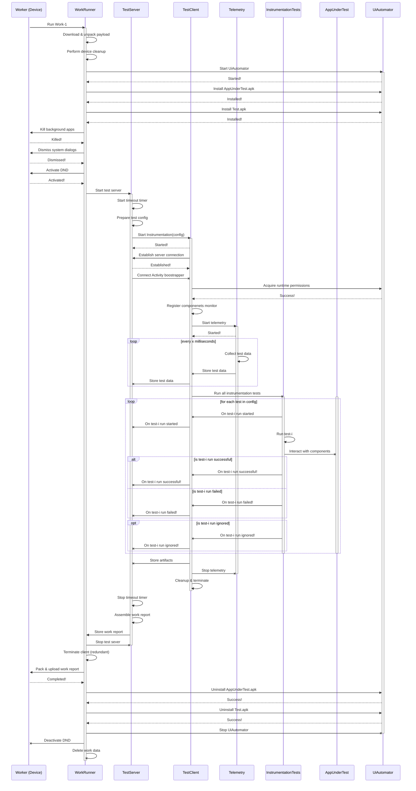
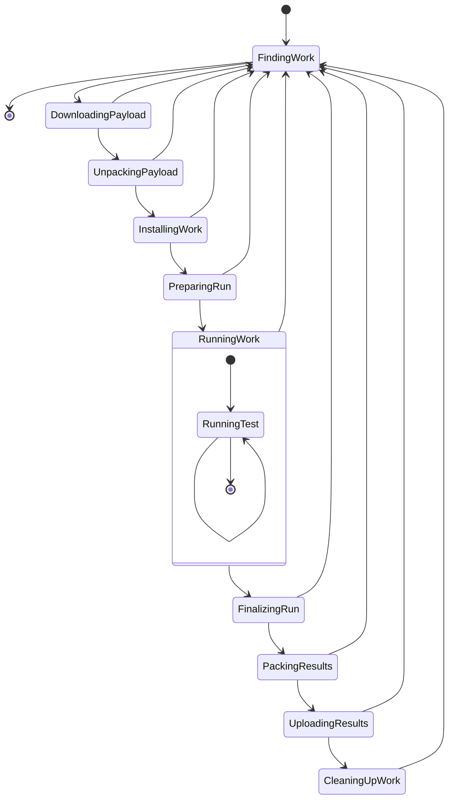

There are currently ~2.5 billion Android devices — consisting of ~1,300 discrete brands and ~24,000 unique device models. I explored tapping into this massive resource pool to make automated testing affordable & unlock a more holistic configuration coverage.

The goal of DART is to enable any Android device to run automated tests — without ADB or complex setups/maintenance. A commercial product could pay people per hour of device use, allowing anyone to utilize idle device time. Each device is subsumed to provide a distributed testbed.

DART is orthogonal to [crowdsourced testing](https://en.wikipedia.org/wiki/Crowdsourced_testing) — the latter requires active human participation.

DART seems to be the best solution to utilize device idle time — the best way to verify that an app works on "Samsung S9" is by executing it on "Samsung S9".  Contrast this to other procedures where phones are usually a suboptimal solution: server hosting, remote computation, etc.

In the demo below, I ran a few test cases on [Mozilla Focus Privacy Browser](https://play.google.com/store/apps/details?id=org.mozilla.focus&hl=en_US&gl=US) without cables/ADB.

<div class="video_wrapper">
    <iframe class="video_frame" width="100%" height="100%" src="https://www.youtube.com/embed/CcHEsx7ODyw" frameborder="0" allow="accelerometer; autoplay; clipboard-write; encrypted-media; gyroscope; picture-in-picture" allowfullscreen></iframe>
</div>

### 1.1. Motivation

The following problems motivated the development of DART.

##### i. Android Device Fragmentation


The top vendors barely cover 1% of the total number of discrete Android devices. Centralized device farms favor depth instead of breadth — maintenance cost increases as more diverse devices are added.

Testing on flagship devices only doesn't always suffice.
>Anecdote: I once spent an entire day debugging an ANR that occurs to a small fraction of our users. I discovered it only affects phones purchased in specific regions. I never was able to reproduce the issue on the same phone bought in the USA.

The Android version distribution exacerbates this problem.


[Headspin](https://www.headspin.io/) aims to alleviate some of these issues. They claim to have a global infrastructure of more than 22,000 (similar) SIM-enabled devices in 150 locations. A big plus as traditional services (like Firebase Testlabs) can't handle geographical concerns. At Headspin's core is the [DeviceFarmer STF](https://github.com/DeviceFarmer/stf) open-source library.

Like its predecessors, Headspin only supports a limited set of device models.

##### ii. Real Device Cost


I created the above box plot using pricing data from the top centralized test farms.

Real devices have an initial cost and require periodic maintenance, hence why they are more expensive than virtual devices.

Running 10 hours of test daily on real devices would cost **$1000/month** (assuming 20 working days of equal levels of productivity).

### 1.2. Product

The video below shows a demo of the app.

<div class="video_wrapper">
    <iframe class="video_frame" width="100%" height="100%" src="https://www.youtube.com/embed/7SotlhlwMDA" frameborder="0" allow="accelerometer; autoplay; clipboard-write; encrypted-media; gyroscope; picture-in-picture" allowfullscreen></iframe>
</div>

A simple dashboard renders the test summary.

<div class="image_row">
  <div class="dual_image_column">
    
  </div>
  <div class="dual_image_column">
    
  </div>
</div>

Distribution ensures there isn't a single point of failure. Because there are only a handful of co-located devices, maintenance cost is minimized.

> "Aside from a single early failure we had within only a few months, all of our devices were doing fine for about two years. However, having reached the 2-3 year mark, several devices have started to experience visibly expanded batteries [...]
In our experience, the system runs just fine most of the time, and any issues are mostly USB-related. You'll usually have to do something about once a week." - [DeviceFramer STF](https://github.com/DeviceFarmer/stf#faq)

Organizations can decide what type of tests are ideal for DART and if the network is made-up of single nodes or clusters of nodes. 


The network can be internal to an organization. An example: `X` devices stored in HQ, each employee can remotely contribute their test device into the system.

It can also be external to an organization. Imagine paying people `$1.5/hour` of device time. Assuming a device runs test overnight (thanks to timezone differences), the estimated monthly earning is `$240` (`$1.5 * 8 hours * 20 working days`).

> The median income in some countries is ~$400/month. 

I prototyped a hardware component that is attached to devices to minimize manual interventions. I might cover this in another post.

### 1.3. Security


There are two perspectives here:

##### i. End-user perspective

The end-user is concerned about malignant binaries & privacy.

Security audits guard devices from malicious binaries. The system is closed — allowing only verified publishers. GooglePlay is leveraged to enforce package name and signature correspondence.

A sandboxed test environment guarantees that private data is inaccessible to apps under test.

[](https://blog.google/products/android-enterprise/android-enterprise-security-assessed-gartner/)

##### ii. Publisher perspective

The publisher cares about test fraud and product leaks.

Proof of work disincentivizes test fraud. The server can use device logs, screenshots, videos with UUID, and past executions to validate submitted data. As this isn't watertight, it is best combined with other strategies: user verifications, [device attestation](https://developer.android.com/training/safetynet), randomization, and device throughput throttling.

Preventing product leaks is hard  — If it runs on a phone, any sufficiently motivated (& knowledgeable) person can figure out a way to access objects. Three good-enough solutions are:

a. Running headless tests.

b. Using a private network of vetted devices.

c. Adopting only for binaries at the later end of the release pipeline.

### 1.4. Going Headless

It is possible to obscure the application under test using a simple overlay. The video below shows the execution of the test cases of the Google IO 2019 app. On the right, the app interactions are invisible. Depending on the strategy, concealing actions do not affect screenshots or videos.

<div class="video_wrapper">
    <iframe class="video_frame" width="100%" height="100%" src="https://www.youtube.com/embed/jxwsoe3T8yE" frameborder="0" allow="accelerometer; autoplay; clipboard-write; encrypted-media; gyroscope; picture-in-picture" allowfullscreen></iframe>
</div>

With framework UI component wrappers, it is possible to borrow some ideas from [Layoutlib](https://android.googlesource.com/platform/frameworks/base/+/4db1f432b853152075923499768639e14403b73a/tools/layoutlib/README) to offer a full headless solution.

`Layoutlib` is a custom version of the android View framework designed to run inside Eclipse. The goal of the library is to provide layout rendering in Eclipse that are very close to their rendering on devices.

### 1.5. Containerization

Tests need to run in an isolated environment. A plugin framework like [VirtualAPK](https://github.com/didi/VirtualAPK) can be built to offer a layer of isolation between apps and the OS. This works using the `DexClassLoader` and some reflection hacks to modify framework components. With this approach, apps can be seamlessly loaded & unloaded without any user interaction.


> The [GooglePlay dynamic feature delivery](https://developer.android.com/guide/app-bundle/play-feature-delivery) system uses some of these reflection techniques to support legacy devices (pre Android 7.0). For instance, `addAssetPath` is called via reflection to allow resources not bundled in an APK to be accessible.


This plugin approach adds cruft that is nonexistent on a regular device. An alternative is using the [Android work profile](https://developer.android.com/work/managed-profiles). Work profile creates a separate, self-contained profile on Android devices that isolates corporate data from personal apps and data [3].

<a href="https://blog.google/products/android-enterprise/work-profile-new-standard-employee-privacy/"></a>

Work profiles appear to be a good fit. They also provide always-on VPN configuration, control of runtime permissions, extra security, etc. Work profiles deviate slightly from the operating mode used by the average user.

> Android allows apps signed with the same key to run in the same process, if the apps so request, so that the system treats them as a single application [3].

### 1.6. Fragility & Flakiness

Automated GUI testing is a fundamental part of the V&V process of every software, but - especially for fast evolving applications - is linked to relevant maintenance costs. Android (and mobile, in general) apps are also particularly prone to fragility, i.e. even minor modifications in the graphical user interface may induce relevant adaptation effort on test code. Based on a preliminary exploration about the evolution and fragility of test suites that we made on a set of nearly 20 thousand Android open-source projects hosted on GitHub, we performed a deeper inspection about the causes underlying the modifications in test classes and methods. We manually examined a set of 423 projects featuring the Espresso automated GUI testing tool, and 945 diff files containing modifications in test methods. We derived a set of 27 different causes of modifications, that we grouped into nine different macro-categories, two related to modifications performed just in code and application logic, and seven pertaining modifications in the GUI functioning and appearance, and hence related to our definition of GUI testing fragility. Based on the set of projects we inspected, we conclude that modifications related to changes in the GUI occured in 55% of modified test methods, a higher frequency than the ones related to changes in test logic only (35%) and to adaptations to modified application logic (27%). The described taxonomy can serve as a basis for further research, aimed at giving guidelines to developers to avoid fragility, and reduce the maintenance costs for automated test suites for Android applications.
[2]


### 1.7. Code Repository

There are four primary directories in the [Github repo](https://github.com/Elvis10ten/dart):

i. `Apollo`: Android project for the client (worker).

ii. `WorkServer`: Kotlin project for the gRPC work server.

iii. `WorkSpecs`: Protobuf definitions shared by both the server & Android client.

iv. 🚧 `Dashboard`: React project for the dashboard displaying past & current test executions.

All projects are still a work in progress. More effort is required to make them more accessible.

## 2. System Overview



Note: I used [Mermaid](https://mermaid-js.github.io/mermaid/#/) for the above sequence diagram. They chose a line with an "x" to represent asynchronous messages.




## 3. Server

```java:title=Context.java
    /**
     * Start executing an {@link android.app.Instrumentation} class.  The given
     * Instrumentation component will be run by killing its target application
     * (if currently running), starting the target process, instantiating the
     * instrumentation component, and then letting it drive the application.
     *
     * <p>This function is not synchronous -- it returns as soon as the
     * instrumentation has started and while it is running.
     *
     * <p>Instrumentation is normally only allowed to run against a package
     * that is either unsigned or signed with a signature that the
     * the instrumentation package is also signed with (ensuring the target
     * trusts the instrumentation).
     *
     * @param className Name of the Instrumentation component to be run.
     * @param profileFile Optional path to write profiling data as the
     * instrumentation runs, or null for no profiling.
     * @param arguments Additional optional arguments to pass to the
     * instrumentation, or null.
     *
     * @return {@code true} if the instrumentation was successfully started,
     * else {@code false} if it could not be found.
     */
    public abstract boolean startInstrumentation(@NonNull ComponentName className,
            @Nullable String profileFile, @Nullable Bundle arguments);
```

Callback AIDL definition
```kt:title=TestCallback.aidl
interface TestCallback {

    void onTestRunStarted(in TestDescription description);

    void onTestRunFinished(in TestResult result);

    void onTestStarted(
        in TestDescription description,
        String logFileName,
        String profilerFileName,
        String autoScreenShotNamePrefix
    );

    void onTestFinished(in TestDescription description);

    void onTestFailure(in TestFailure failure);

    void onTestAssumptionFailure(in TestFailure failure);

    void onTestIgnored(in TestDescription description);

    void onProcessCrashed(in TestDescription failure, String stackTrace);

    void onClientConnected(Finisher finisher);

    void onInterrupted(int reasonId);

    void sendString(String message);
}
```

### 3.1. Remote Storage

```kt:title=RemoteStorageConstants.kt
object RemoteStorageConstants {

    const val PREFIX_CONTENT = "content://"
    const val AUTHORITY = "com.fluentbuild.apollo.runtime.remotestorage"
    const val BASE_URI = "${PREFIX_CONTENT}${AUTHORITY}/"

    const val MODE_READ = "r"
    const val MODE_WRITE = "w"
    const val MODE_APPEND = "wa"
}
```

In the server.
```kt:title=RemoteStorageProvider.kt
private const val REMOTE_STORAGE_DIR = "stash"

class RemoteStorageProvider: ContentProvider() {

    override fun openFile(uri: Uri, mode: String): ParcelFileDescriptor? {
        val child = uri.toString().substringAfter(RemoteStorageConstants.BASE_URI)
        if(child.isBlank()) return null

        return try {
            File(getDir(context!!), child).run {
                Timber.i("Opening file: %s with mode: %s", absolutePath, mode)
                parentFile?.mkdirs()
                openParcelFileDescriptor(mode)
            }
        } catch (e: Exception) {
            null
        }
    }

    companion object {

        fun getDir(context: Context): File {
            return File(context.filesDir, REMOTE_STORAGE_DIR).apply { mkdirs() }
        }
    }
}
```

## 4. Client

```kt:title=TestClient.kt
private const val LOG_TAG = "TestClient"
private const val RUNNER_PACKAGE = "com.fluentbuild.apollo"
private const val RUNNER_SERVICE = "com.fluentbuild.apollo.RunnerService"
private const val SERVICE_CONNECTION_TIMEOUT_MILLIS = 10_000L

/**
 * For the current instrumentation to communicate information back to the RuntimeService.
 *
 */
class TestClient(
    private val instrumentation: Instrumentation,
    private val clientFinalizer: ClientFinalizer,
    private val logWrapper: LogWrapper
): WorkInterruptCallback {

    private val connectionLock = Object()
    private val connectionLatch = CountDownLatch(1)

    @Volatile
    private lateinit var testCallback: TestCallback
    @Volatile
    private var hasRequestedServiceConnection = false
    private var isUsed = false


    private val serviceConnection = object : ServiceConnection {

        override fun onServiceConnected(className: ComponentName, service: IBinder) {
            requireMainThread()
            logWrapper.i(LOG_TAG, "TestClient connected to runner service")
            testCallback = TestCallback.Stub.asInterface(service)
            connectionLatch.countDown()
        }

        override fun onServiceDisconnected(className: ComponentName) {
            requireMainThread()
            logWrapper.e(LOG_TAG, "TestClient is disconnected from runner service")
            instrumentation.finishInstrumentation(Activity.RESULT_CANCELED)
        }
    }

    @WorkerThread
    fun connect() {
        requireNotMainThread()
        logWrapper.i(LOG_TAG, "Connecting to runner service")
        if(isUsed) {
            throw IllegalStateException("TestClient cannot be reconnected to!")
        }

        val intent = Intent()
        intent.setClassName(RUNNER_PACKAGE, RUNNER_SERVICE)

        synchronized(connectionLock) {
            instrumentation.context.requireServiceBind(intent, serviceConnection)
            hasRequestedServiceConnection = true
            isUsed = true

            if(!connectionLatch.await(SERVICE_CONNECTION_TIMEOUT_MILLIS, TimeUnit.MILLISECONDS)) {
                unbindService()
                throw TimeoutException("Couldn't connect to runner service")
            }

            onClientConnected()
        }
    }

    private fun onClientConnected() {
        try {
            testCallback.onClientConnected(object : Finisher.Stub() {

                override fun finish(resultCode: Int) {
                    logWrapper.i(LOG_TAG, "Instrumentation finish requested")
                    clientFinalizer.finalize()
                    instrumentation.finishInstrumentation(resultCode)
                }
            })
        } catch (e: RemoteException) {
            handleRemoteFailure("Unable to notify runner service of connection!", e)
        }
    }

    @MainThread
    fun disconnect() {
        requireMainThread()
        synchronized(connectionLock) {
            unbindService()
        }
    }

    private fun unbindService() {
        if(hasRequestedServiceConnection) {
            instrumentation.context.unbindService(serviceConnection)
            hasRequestedServiceConnection = false
        }
    }

    // Callback to the server
    ... 
}
```

### 4.1. Initialization

We use the bundles to configure the client.

```kotlin:title=TestConfigs.kt
class TestConfigs(private val arguments: Bundle) {

    fun isObscureWindowEnabled() = arguments.getBoolean(ARG_OBSCURE_WINDOW_ENABLED)

    fun shouldRetrieveTestFiles() = arguments.getBoolean(ARG_RETRIEVE_TEST_FILES)

    fun shouldRetrieveAppFiles() = arguments.getBoolean(ARG_RETRIEVE_APP_FILES)

    fun getTestsCount() = arguments.getInt(ARG_TESTS_COUNT)

    fun getProfilerSampleFrequency() = arguments.getInt(ARG_PROFILER_SAMPLE_FREQUENCY)

    fun isClearDataEnabled() = arguments.getBoolean(ARG_CLEAR_DATA)

    fun isAutoScreenShotEnabled() = arguments.getBoolean(ARG_AUTO_SCREEN_SHOT_ENABLED)

    fun getAutoScreenShotFps() = arguments.getInt(ARG_AUTO_SCREEN_SHOT_FPS)

    fun getScreenShotQuality() = arguments.getInt(ARG_AUTO_SCREEN_QUALITY)
}
```

### 4.1.1 Cleaning

Should be done at the end.
Uninstalling and wiping
```kotlin:title=ClearDataTask.kt
internal class ClearDataTask(private val targetContext: Context): Task {

    override fun run() {
        targetContext.externalMediaDirs.forEach { it?.deleteRecursively() }
        targetContext.noBackupFilesDir.deleteRecursively()

        targetContext.cacheDir.deleteRecursively()
        targetContext.codeCacheDir.deleteRecursively()
        targetContext.externalCacheDir?.deleteRecursively()

        targetContext.filesDir.deleteRecursively()
        if(AndroidVersion.isAtLeastNougat()) {
            targetContext.dataDir.deleteRecursively()
        } else {
            targetContext.filesDir.parentFile?.deleteRecursively()
        }
    }
}
```

#### 4.1.1. Permissions
```kotlin:title=PermissionGranter.kt
/**
 * Requests a runtime permission on devices running Android M (API 23) and above.
 *
 * This class is usually used to grant runtime permissions to avoid the permission dialog from
 * showing up and blocking the App's Ui. This is especially helpful for Ui-Testing to avoid loosing
 * control over your application under test.
 *
 * The requested permissions will be granted for all test methods in the test class. Use [addPermissions] to add a permission to the permission list. To request all
 * permissions use the [requestPermissions] method.
 *
 */
interface PermissionGranter {

    /**
     * Adds a permission to the list of permissions which will be requested when [.requestPermissions] is called.
     *
     * Precondition: This method does nothing when called on an API level lower than [Build.VERSION_CODES.M].
     *
     * @param permissions a list of Android runtime permissions.
     */
    fun addPermissions(vararg permissions: String)

    /**
     * Request all permissions previously added using [.addPermissions]
     *
     * Precondition: This method does nothing when called on an API level lower than [ ][Build.VERSION_CODES.M].
     */
    fun requestPermissions()
}
```

### 4.2. Instrumentation

Using `AndroidJUnitRunner` which is a child of `Instrumentation`. We extend the runner in order to intercept the `Instrumentation` callbacks.
I'm omitting the subclass (`AndroidXJUnitRunner`) code as it doesn't contain any interesting code (it just passes the callbacks to the relevant classess).
Every client will have to update their test runner.

```groovy:title=build.gradle
testInstrumentationRunner "androidx.test.runner.AndroidXJUnitRunner"
```

I used reflection to hook into the printer. Passing in the `TestObserver`, which observes the state state and eventually calls into the real printer.

```kt
private fun init(testConfigs: TestConfigs) {
        val printerField = getPrinterField()
        val printer = printerField.get(runner) as InstrumentationResultPrinter
        initializer.init(testConfigs, printer)
        printerField.set(runner, initializer.getTestObserver())
    }

private fun getPrinterField(): Field {
    return AndroidJUnitRunner::class.java.getDeclaredField("instrumentationResultPrinter")
        .apply { isAccessible = true }
}
```

#### 4.2.1. Monitor Components

```kt:title=Monitor.kt
abstract class Monitor<CallbackT> {

    protected val callbacks = mutableListOf<WeakReference<CallbackT>>()

    internal fun registerCallback(callback: CallbackT) {
        if(callbacks.none { it.get() == callback }) {
            callbacks += WeakReference(callback)
        }
    }

    internal fun unregisterCallback(callback: CallbackT) {
        callbacks.removeAll { it.get() == callback }
    }
}
```

For app monitoring

```kt:title=AppMonitor.kt
class AppMonitor: Monitor<AppMonitor.Callback>() {

    private var appRef: WeakReference<Application>? = null

    private fun signalLifecycleChange(application: Application, stage: ApplicationStats.Stage) {
        callbacks.forEach { it.get()?.onStageChanged(application, stage) }
    }

    fun onCallApplicationOnCreate(app: Application, action: () -> Unit) {
        appRef = WeakReference(app)
        signalLifecycleChange(app, ApplicationStats.Stage.PRE_ON_CREATE)
        action()
        signalLifecycleChange(app, ApplicationStats.Stage.CREATED)
    }

    fun getActiveApp(): Application? = appRef?.get()

    interface Callback {
        fun onStageChanged(app: Application, stage: ApplicationStats.Stage)
    }
}
```

For activity monitoring

```kt:title=ActivityMonitor.kt
class ActivityMonitor: Monitor<ActivityMonitor.Callback>() {

    private val activeActivities = WeakHashMap<Activity, ActivityStats.Stage>()

    private fun signalLifecycleChange(activity: Activity, stage: ActivityStats.Stage) {
        activeActivities[activity] = stage
        callbacks.forEach {
            it.get()?.onStageChanged(activity, stage)
        }
    }

    fun onCallActivityOnDestroy(activity: Activity, action: () -> Unit) {
        signalLifecycleChange(activity, ActivityStats.Stage.DESTROYED)
        action()
        activeActivities.remove(activity)
    }

    fun onCallActivityOnRestart(activity: Activity, action: () -> Unit) {
        action()
        signalLifecycleChange(activity, ActivityStats.Stage.RESTARTED)
    }

    fun onCallActivityOnCreate(activity: Activity, bundle: Bundle?, action: () -> Unit) {
        signalLifecycleChange(activity, ActivityStats.Stage.PRE_ON_CREATE)
        action()
        signalLifecycleChange(activity, ActivityStats.Stage.CREATED)
    }

    fun onCallActivityOnCreate(
        activity: Activity,
        bundle: Bundle?,
        persistentState: PersistableBundle,
        action: () -> Unit
    ) {
        signalLifecycleChange(activity, ActivityStats.Stage.PRE_ON_CREATE)
        action()
        signalLifecycleChange(activity, ActivityStats.Stage.CREATED)
    }

    fun onCallActivityOnStart(activity: Activity, action: () -> Unit) {
        action()
        signalLifecycleChange(activity, ActivityStats.Stage.STARTED)
    }

    fun onCallActivityOnStop(activity: Activity, action: () -> Unit) {
        action()
        signalLifecycleChange(activity, ActivityStats.Stage.STOPPED)
    }

    fun onCallActivityOnResume(activity: Activity, action: () -> Unit) {
        action()
        signalLifecycleChange(activity, ActivityStats.Stage.RESUMED)
    }

    fun onCallActivityOnPause(activity: Activity, action: () -> Unit) {
        action()
        signalLifecycleChange(activity, ActivityStats.Stage.PAUSED)
    }
    
    fun getActiveActivities(): Set<Activity>  {
        return activeActivities.keys
    }

    interface Callback {
        fun onStageChanged(activity: Activity, stage: ActivityStats.Stage)
    }
}
```

The action function allows the monitor control when the caller (the Instrumentation) can pass the event downstream.

### 4.3. JUnit

```kotlin:title=Models.kt
data class TestDescription(
    val className: String,
    val methodName: String?,
    val displayName: String
): Parcelable

data class TestFailure(
    val description: TestDescription,
    val trace: String
): Parcelable

data class TestResult(
    val runtimeMillis: Long,
    val ignoreCount: Int,
    val failures: List<TestFailure>
): Parcelable
```

These are parcelable as they are transmitted blah.

```java:title=TestModel*.aidl
parcelable TestModel*;
```

The mapper.

```kotlin:title=ModelsMapper.kt
private const val MAX_TRACE_SIZE = 64 * 1024

internal fun Description.createTestModel(): TestDescription {
    return TestDescription(className, methodName, displayName)
}

internal fun Failure.createTestModel(): TestFailure {
    var stackTrace = trace

    if (stackTrace.length > MAX_TRACE_SIZE) {
        // Since we report failures back to the runtime via a binder IPC, we need to make sure that
        // we don't exceed the Binder transaction limit - which is 1MB per process.
        Log.w(LOG_TAG, "Stack trace too long, trimmed to first $MAX_TRACE_SIZE characters.")
        stackTrace = trace.substring(0, MAX_TRACE_SIZE) + "\n"
    }

    return TestFailure(description.createTestModel(), stackTrace)
}

internal fun Result.createTestModel(): TestResult {
    return TestResult(runTime, ignoreCount, failures.map { it.createTestModel() })
}
```

sfaf

```kt:title=TestObserver.kt
internal class TestObserver(
    private val testClient: TestClient,
    private val wrappedPrinter: InstrumentationResultPrinter,
    private val clientFinalizer: ClientFinalizer,
    private val collatorsManager: CollatorsManager
): InstrumentationResultPrinter() {

    private var startedCount = 0
    private var lastStartedTest: Description? = null

    override fun testRunStarted(description: Description) {
        testClient.testRunStarted(description)
        wrappedPrinter.testRunStarted(description)
    }

    override fun testStarted(description: Description) {
        lastStartedTest = description
        startedCount++
        testClient.testStarted(description, collatorsManager.getInfo())
        wrappedPrinter.testStarted(description)
    }

    override fun testAssumptionFailure(failure: Failure) {
        testClient.testAssumptionFailure(failure)
        restartMeasurement()
        wrappedPrinter.testAssumptionFailure(failure)
    }

    override fun testRunFinished(result: Result) {
        testClient.testRunFinished(result)
        wrappedPrinter.testRunFinished(result)
    }

    override fun sendString(msg: String) {
        testClient.sendString(msg)
        wrappedPrinter.sendString(msg)
    }

    override fun instrumentationRunFinished(
        summaryWriter: PrintStream,
        resultBundle: Bundle,
        junitResults: Result
    ) {
        clientFinalizer.finalize()
        wrappedPrinter.instrumentationRunFinished(summaryWriter, resultBundle, junitResults)
    }

    override fun testFailure(failure: Failure) {
        testClient.testFailure(failure)
        restartMeasurement()
        wrappedPrinter.testFailure(failure)
    }

    override fun testFinished(description: Description) {
        testClient.testFinished(description)
        restartMeasurement()
        wrappedPrinter.testFinished(description)
    }

    override fun testIgnored(description: Description) {
        testClient.testIgnored(description)
        restartMeasurement()
        wrappedPrinter.testIgnored(description)
    }

    override fun reportProcessCrash(throwable: Throwable) {
        testClient.processCrashed(Failure(lastStartedTest, throwable))
        restartMeasurement()
        wrappedPrinter.reportProcessCrash(throwable)
    }

    private fun restartMeasurement() {
        collatorsManager.restart()
    }
}
```

### 4.4. Obscuring Screen

`OverlayView` is just a simple custom view with `MATCH_PARENT` dimension and a background.
The Activity callback is observed and the overlay is attached immediately the system creates an Activity.
This doesn't affect automated test UI interactions. Taking screenshot is still possible using some strategies.

```kotlin:title=WindowOverlay.kt
internal class WindowOverlay(activity: Activity) {

    private val overlayView = OverlayView(activity)

    init {
        activity.window.addContentView(overlayView.rootView, getWindowParams())
    }

    fun updateLabel(labelText: String) {
        overlayView.updateLabel(labelText)
    }

    fun getRoot() = overlayView.rootView

    private fun getWindowParams(): WindowManager.LayoutParams {
        val type = if(AndroidVersion.isAtLeastOreo()) {
            WindowManager.LayoutParams.TYPE_APPLICATION_OVERLAY
        } else {
            @Suppress("DEPRECATION")
            WindowManager.LayoutParams.TYPE_PHONE
        }

        val formats = WindowManager.LayoutParams.FLAG_NOT_TOUCHABLE or
                WindowManager.LayoutParams.FLAG_NOT_FOCUSABLE or
                WindowManager.LayoutParams.FLAG_KEEP_SCREEN_ON or
                WindowManager.LayoutParams.FLAG_FULLSCREEN

        return WindowManager.LayoutParams(
            WindowManager.LayoutParams.MATCH_PARENT,
            WindowManager.LayoutParams.MATCH_PARENT,
            type,
            formats,
            PixelFormat.TRANSPARENT
        )
    }
}
```

### 4.5. User Interrupts
```kotlin:title=NavigationInteractionObserver.kt
private const val SYSTEM_DIALOG_REASON_KEY = "reason"
private const val SYSTEM_DIALOG_REASON_GLOBAL_ACTIONS = "globalactions"
private const val SYSTEM_DIALOG_REASON_RECENT_APPS = "recentapps"
private const val SYSTEM_DIALOG_REASON_HOME_KEY = "homekey"

internal class NavigationInteractionObserver(private val callback: Callback): BroadcastReceiver() {

    override fun onReceive(context: Context, intent: Intent) {
        val reason = intent.getStringExtra(SYSTEM_DIALOG_REASON_KEY)

        if (reason == SYSTEM_DIALOG_REASON_HOME_KEY) {
            callback.onHomePressed()
        } else if (reason == SYSTEM_DIALOG_REASON_RECENT_APPS) {
            callback.onRecentAppsPressed()
        }
    }

    fun start(context: Context) {
        context.registerReceiver(this, IntentFilter(Intent.ACTION_CLOSE_SYSTEM_DIALOGS))
    }

    fun stop(context: Context) {
        context.unregisterReceiver(this)
    }

    interface Callback {

        fun onHomePressed()

        fun onRecentAppsPressed()
    }
}
```

and

```kotlin:title=WindowInteractionObserver.kt
internal class WindowInteractionObserver(private val callback: Callback): ActivityMonitor.Callback {

    override fun onStageChanged(activity: Activity, stage: ActivityStats.Stage) {
        if(stage == ActivityStats.Stage.CREATED) {
            activity.window.callback = object: WindowCallbackWrapper(activity.window.callback) {

                override fun dispatchTouchEvent(event: MotionEvent): Boolean {
                    evaluateUserMotion(event)
                    return super.dispatchTouchEvent(event)
                }

                override fun dispatchKeyEvent(event: KeyEvent): Boolean {
                    evaluateUserKeyInput(event)
                    return super.dispatchKeyEvent(event)
                }
            }
        }
    }

    interface Callback {

        fun onWindowTouchedByUser()

        fun onKeyPressedByUser()
    }
}
```

### 4.6. Telemetry

fsfs

### 4.6.1. Logs

While logcat can directly write to a file, it can't write to our remote storage.

```kotlin:title=LogTunnel.kt
private const val CMD_CLEAR_LOGCAT_BUFFERS = "logcat -b all -c"
private const val CMD_START_LOGCAT = "logcat -b all -v threadtime,epoch,printable --dividers"

class LogTunnel {

    fun start(sink: File) {
        Thread {
            getRuntime().exec(CMD_CLEAR_LOGCAT_BUFFERS)
            val logcat = getRuntime().exec(CMD_START_LOGCAT)

            val sinkFileDescriptor = fileProvider.getAppendableFileDescriptor(sinkFileName)
            logcat.inputStream.pipe(sinkFileDescriptor)
        }.apply {
            name = "LoggerThread"
            start()
        }
    }
}
```

### 4.6.2. Screenshots


### 4.7. Remote Storage
In the client.
```kt:title=FileDescriptorProvider.kt
class FileDescriptorProvider(private val context: Context) {

    @Throws(Exception::class)
    internal fun getReadableDescriptor(fileName: String) = getDescriptor(fileName, MODE_READ)

    @Throws(Exception::class)
    internal fun getWritableDescriptor(fileName: String) = getDescriptor(fileName, MODE_WRITE)

    @Throws(Exception::class)
    internal fun getAppendableDescriptor(fileName: String) = getDescriptor(fileName, MODE_APPEND)

    @Throws(Exception::class)
    private fun getDescriptor(fileName: String, mode: String): ParcelFileDescriptor =
        context.contentResolver.openFileDescriptor(getFileUri(fileName), mode)!!.apply { checkError() }

    private fun getFileUri(filePath: String) = Uri.parse("${BASE_URI}${filePath}")
}
```

### 4.8. Finalizer

```kt:title=ArtifactsCopier.kt
class ArtifactsCopier(
    private val targetContext: Context,
    private val instrumentationContext: Context,
    private val testConfigs: TestConfigs,
) {

    fun copy() {
        if (testConfigs.shouldRetrieveTestFiles()) {
            copyDir(destinationDir = "test_files", sourceDir = instrumentationContext.filesDir)
        }

        if (testConfigs.shouldRetrieveAppFiles()) {
            copyDir(destinationDir = "app_files", sourceDir = targetContext.filesDir)
        }
    }
}
```

### 4.9. Cancelling

The client automatically cancels once a server failure is detected: An error transmitting test state, or when the client/server service connection is disconnected.

The server can also cancel the client using the Finisher interface. RPC. However, this is reserved only for successful cancellation.

```java:title=Finisher.aidl
interface Finisher {
    void finish(int resultCode);
}
```

A last ditch effort in case where the server connection to the client is severed, it can fallback to using a BroadcastReceiver that is always registered when the instrumentation is running.

```kt:title=CancelSignalObserver.kt
class CancelSignalObserver(private val instrumentation: Instrumentation): BroadcastReceiver() {

    override fun onReceive(context: Context, intent: Intent) {
        if(intent.action == ACTION_CANCEL_SIGNAL) {
            instrumentation.finishInstrumentation(Activity.RESULT_CANCELED)
        }
    }

    fun start() {
        instrumentation.targetContext.registerReceiver(
            this,
            IntentFilter(ACTION_CANCEL_SIGNAL)
        )
    }

    fun stop() {
        instrumentation.targetContext.unregisterReceiver(this)
    }
}
```

## 5. Work & Workers

```protobuf:title=Work.proto
message Work {
    /**
     * Unique key of the given work.
     */
    string key = 1;
    string packageName = 18;
    string testPackageName = 19;
    /**
     * Type of the test being performed.
     */
    TestType type = 2;
    /**
     * The APK under test.
     */
    RemoteFile payload = 3;
    /**
     * The max time this test execution can run before it is cancelled (default: 15m).
     * It does not include any time necessary to prepare and clean up the target device.
     * The timeout unit is seconds. The maximum possible testing time is 1800 seconds.
     */
    int32 timeout = 4;
    /**
     * The locale is a two-letter (ISO 639-1) or three-letter (ISO 639-3) representation of the language.
     */
    string locale = 5;
    /**
     * The default orientation of the device.
     */
    ScreenOrientation orientation = 6;

    /**
     * TODO: Update the comment
     * A comma-separated, key=value map of environment variables and their desired values. The environment variables are mirrored as extra options to the am instrument -e KEY1 VALUE1 … command and passed to your test runner (typically AndroidJUnitRunner). Examples:
    Enable code coverage and provide a directory to store the coverage results when using Android Test Orchestrator (--use-orchestrator):

    --environment-variables clearPackageData=true,coverage=true,coverageFilePath=/sdcard/
    Enable code coverage and provide a file path to store the coverage results when not using Android Test Orchestrator (--no-use-orchestrator):

    --environment-variables coverage=true,coverageFile=/sdcard/coverage.ec
     */
    map<string, string> environmentVariables = 8;

    /**
     * Specifies the number of times a test execution should be reattempted if one or more of its test cases fail for any reason. An execution that initially fails but succeeds on any reattempt is reported as FLAKY.
    The maximum number of reruns allowed is 10. (Default: 1, which implies one rerun.)
     */
    int32 numRetriesPerDevice = 9;
    int32 numTestRetries = 27;

    /**
     * Monitor and record performance metrics: CPU, memory, and network usage. Enabled by default.
     */
    bool isPerformanceMonitoringEnabled = 10;
    stats.SampleFrequency sampleFrequency = 24;

    /**
     * Enable video recording during the test. Enabled by default.
     */
    bool isVideoRecordingEnabled = 11;
    /**
     * The fully-qualified Java class name of the instrumentation test runner (default: the last name extracted from the APK manifest).
     */
    string testRunnerClassName = 12;
    /**
     * TODO: Update the comment and think of implementation
     * A list of one or more test target filters to apply (default: run all test targets).
     * Each target filter must be fully qualified with the package name, class name, or test annotation desired.
     * Any test filter supported by am instrument -e … is supported. See https://developer.android.com/reference/android/support/test/runner/AndroidJUnitRunner for more information.
     * Examples:
    --test-targets "package com.my.package.name"
    --test-targets "notPackage com.package.to.skip"
    --test-targets "class com.foo.ClassName"
    --test-targets "notClass com.foo.ClassName#testMethodToSkip"
    --test-targets "annotation com.foo.AnnotationToRun"
    --test-targets "size large notAnnotation com.foo.AnnotationToSkip"
     */
    repeated string testTargets = 13;
    repeated tests.AtomicTest tests = 14;

    /**
     * Whether each test runs in its own Instrumentation instance with the Android Test Orchestrator (default: Orchestrator is not used, same as specifying --no-use-orchestrator).
     * Orchestrator is only compatible with AndroidJUnitRunner v1.0 or higher.
     * See https://developer.android.com/training/testing/junit-runner.html#using-android-test-orchestrator for more information about Android Test Orchestrator.
     */
    bool isIsolated = 15;
    bool shouldClearPackageData = 16;
    bool obscureScreen = 17;
    bool takeWindowAutoShots = 20;
    bool retrieveAppFiles = 21;
    bool retrieveTestFiles = 22;
    bool useSystemProfiler = 23;

    int32 autoScreenShotFps = 25;
    int32 autoScreenShotQuality = 26;
}

message RemoteFile {
    string url = 1;
    int64 sizeBytes = 2;
    int64 lastModified = 3;
}

enum TestType {
    INSTRUMENTATION = 0;
}

enum ScreenOrientation {
    PORTRAIT = 0;
    LANDSCAPE = 1;
}
```

## 6. Network

## References
1. [Automated Testing of Android Apps: A Systematic Literature Review](https://lilicoding.github.io/papers/kong2018automated.pdf)
2. [Maintenance of Android Widget-Based GUI Testing: A Taxonomy of Test Case Modification Causes](https://www.semanticscholar.org/paper/Maintenance-of-Android-Widget-Based-GUI-Testing%3A-A-Coppola-Morisio/87c08837fb583d4fc7e61678b9b5cf64bc45ca35)
3. [Android Enterprise Security White Paper 2019](https://static.googleusercontent.com/media/www.android.com/en//static/2016/pdfs/enterprise/Android_Enterprise_Security_White_Paper_2019.pdf)