## Chapter 1 - Reliable, Scalable, and Maintainable Applications
> The Internet was done so well that most people think of it as a natural resource like the Pacific Ocean, rather than something that was man-made. When was the last time a technology with a scale like that was so error-free?
> — Alan Kay, in interview with Dr Dobb's Journal (2012)

1. Many modern apps are data-intensive as opposed to compute-intensive.
2. Data-intensive apps problems:
   - Amount of data
   - Complexity of data
   - Speed at which it's changing
3. Common data systems of data-intensive apps:
   - **Databases** — Store data for later retrieval.
   - **Caches** — Speed up subsequent reads of an expensive operation.
   - **Search indexes** — Search/filter data in various ways.
   - **Stream processing** — Asynchronous inter-process messaging.
   - **Batch processing** — Periodically crunch accumulated data.

### Thinking About Data Systems
1. While traditionally databases, queues, caches, etc are considered distinct category of tools, new tools blur the boundaries between these categories:
   - **[Redis](https://redis.io/)** is a datastore also used as a message queue.
   - **[Apache Kafka](https://kafka.apache.org/)** is a message queue with database-like durability gurantees.
2. Modern apps have wide-ranging data storage & processing requirements that can't be satified by a single tool
   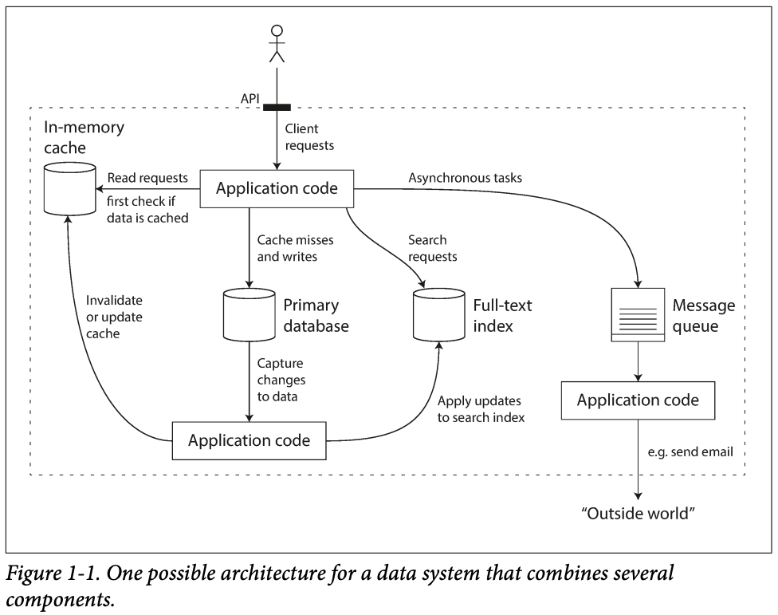
3. Modern apps are also (composite) data-systems made up of general-purpose data systems; they can offer certain gurantees & hide the foundational components behind an API.

This book focuses on three concerns that are important in most software systems:

#### i. Reliability
1. Reliability means continuing to **work correctly** at the **desired level of performance** under the **expected load** even in the face of **adversities** like hardware & software faults; human error; etc.
2. Fault is when one component of a system deviates from its spec.
3. Failure is when the system as a whole stops providing the required service to the user.
   > PNote: Based on this definition, it's impossible to distinguish between a fault and a failure without context — as a component could also be a composite system itself.
4. Systems that can anticipate and cope with faults are called fault tolerant or resilient.
5. Faults could [deliberately be introduced into systems](https://en.wikipedia.org/wiki/Chaos_engineering) to test its fault tolerance.
6. It's impossible to reduce the probability of a fault to zero.

##### Hardware Faults
1. Examples:
   - Hard disk crash
   - Faulty RAM
   - Power blackout
   - Accidental detachment of a network cable
2. Hardware faults are random & independent: One machine's disk failing does not imply that another machine's disk is going to fail. There may be weak correlations, e.g: due to a common cause like the temperature in the server rack.
3. **Solutions**: Redundancies.
4. In the past, single machines sufficed for most apps as their hardware components already have redundancies.
5. Multi-machine redundancies are gaining more usage as they offer additional benefits like rolling upgrades — where one node/machine can be patched at a time without downtime to the entire system.
6. Hard disks are reported as having a mean time to failure (MTTF) of ~10-50 years. Thus, on a storage cluster with 10,000 disks, there should be an average of 1 failure per day.

##### Software Errors
1. Software faults are systematic errors within a system. They are hard to anticipate and are correlated across nodes, leading to more system failures than hardware faults.
2. Software faults often lie dormant until the false assumption about their environment suddenly stops being true.
3. **Solutions**: No quick solution. A few small helpful tec:
   - Carefully thinking about the assumptions & interactions in the system
   - Thorough testing
   - Process isolation
   - Allowing processes to crash and restart
   - Measuring, monitoring & analyzing system behavior in production

##### Human Errors
1. (Unreliably) Humans are both the builders and operators of software systems.
2. [A study](https://www.usenix.org/conference/usits-03/why-do-internet-services-fail-and-what-can-be-done-about-it) on large internet services found that configuration errors by operators were the leading cause of outages, whereas hardware faults played a role in only 10–25% of outages.
3. **Solutions**:
   - Fool proof design
   - Isolation — Sandbox environments that decouple the places where people make the most mistakes from the places where they can cause failures.
   - Unit & Integration testing
   - Failsafe/Reversability
   - Staged rollout
   - Telemetry

#### i. Scalability
Scalability is used to describe a system’s ability to cope with increased load (data volume, traffic volume, complexity).
   > If the system grows in a particular way, what are our options for coping with the growth?

In order to discuss scalability, we first need ways of describing load and performance quantitatively.

##### Describing Load
1. Load parameters are numbers describing the current load on the system.
2. The best choice of parameters depends on the system's architecture:
   - Web server — requests per second
   - Database — ratio of reads to writes
   - App — concurrent users
   - Cache — hit rate

###### Case study — Twitter
Using [data](https://www.infoq.com/presentations/Twitter-Timeline-Scalability/) published in November 2012. Two of Twitter’s main operations are:
1. **Post tweet** — A user can publish a new message to their followers (4.6k requests/sec on average, over 12k requests/sec at peak).
2. **Home timeline** — A user can view tweets posted by the people they follow (300k requests/sec).
---
Two ways of implementing these two operations:
_Approach A_
- **Post tweet** — inserts the new tweet into a global collection of tweets.
- **Home timeline** — Look up all the people they follow, find all the tweets for each of those users, and merge them (sorted by time).
```sql
SELECT tweets.*, users.* FROM tweets
JOIN users ON tweets.sender_id = users.id
JOIN follows ON follows.followee_id = users.id
WHERE follows.follower_id = current_user
```
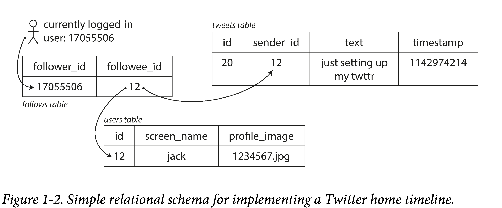

_Approach B_
Maintain a cache for each user’s home timeline — like a mailbox of tweets for each recipient user.
- **Post tweet** — look up all the people who follow that user, and insert the new tweet into each of their home timeline caches.
- **Home timeline** — read from the user's home timeline cache (cheap).
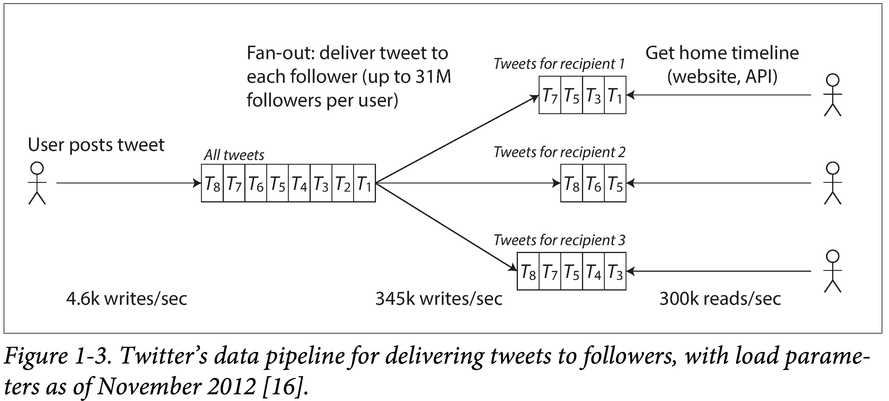

---
Twitter used a hybrid solution of _Approach A_ & _Approach B_:
1. It's preferable to do more work at write time and less at read time (_Approach B_) — given that the average rate of published tweets is almost two orders of magnitude lower than the rate of home timeline reads.
2. For users with millions of followers, _Approach B_ is slow as it leads to millions of writes. Twitter uses _Approach A_ for these users.

##### Describing Performance
1. Two ways to look at performance:
   - When a load parameter is increased and the system resources is kept unchanged, how is the performance of the system affected?
   - When a load parameter is increased, by how much should the resources be increased to keep performance unchanged?
2. Response time = the time between a client sending a request and receiving a response = time to process the request (the service time) + latency.
3. Latency is the duration that a request is waiting to be handled during which it is _latent_, awaiting service. E.g: network delays, queueing delays, etc.
4. Systems' important performance metric (usually):
   - **Batch processing**: Throughput — the number of records that can be processed per second.
   - **Online systems**: Response time.
5. Satisfying a request involves multiple disparate systems that can introduce random latencies — leading to random response time. Thus, response time is best thought of as a distribution of values that can be measured, instead of a single number.
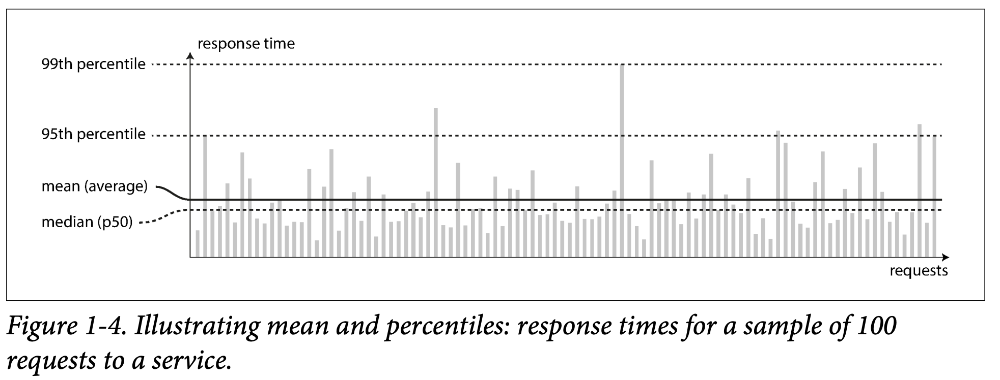
6. The mean is not a very good metric to know the “typical” response time, because it doesn’t tell how many users actually experienced that delay.
7. Percentiles are preferred.
   - 50th percentile = Median = p50
   - 95th percentile = p95
   - 99th percentile = p99
   - 99.9th percentile = p999
8. An `X`-th percentile is the response time thresholds at which `X%` of requests are faster than that particular threshold.
   > E.g: if the 95th percentile response time is 1.5 seconds, that means 95 out of 100 requests take less than 1.5 seconds.
9. High percentiles of response times, also known as `tail latencies` are used to figure out how bad the outliers are.
10. [Amazon](http://glinden.blogspot.com/2006/12/slides-from-my-talk-at-stanford.html) observed that a 100 ms increase in response time reduces sales by 1%. [Others](https://ai.googleblog.com/2009/06/speed-matters.html) report that a 1-second slowdown reduces a customer satisfaction metric by 16%.
11. It only takes a small number of slow requests to hold up the processing of subsequent requests — an effect sometimes known as `head-of-line blocking`.
    > When generating load artificially in order to test the scalability of a system, the load generating client needs to keep sending requests independently of the response time.
    > If the client waits for the previous request to complete before sending the next one, that behavior has the effect of artificially keeping the queues shorter in the test than they would be in reality, which skews the measurements
    > [Everything You Know About Latency Is Wrong](https://bravenewgeek.com/everything-you-know-about-latency-is-wrong/)
12. Even if only a small percentage of backend calls are slow, the chance of getting a slow call increases if an end-user request requires multiple backend calls, and so a higher proportion of end-user requests end up being slow — an effect known as `tail latency amplification`.
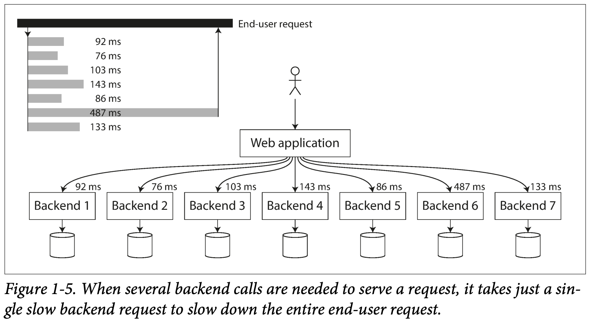

##### Percentiles in Practice
To add response time percentiles to the monitoring dashboards, they need to be efficiently calculated on an ongoing basis.

_Example:_
1. Keep a rolling window of response times of requests in the last 10 minutes.
2. Every minute, calculate the median and various percentiles over the values in that window and plot those metrics on a graph.
3. Calculation implementation:
   - **Naïvely** — keep a list of response times for all requests within the time window and sort that list every minute.
   - **Efficiently** — there are algorithms that can calculate a good approximation of percentiles at minimal CPU and memory cost, such as:
     - [Forward decay](https://ieeexplore.ieee.org/document/4812398)
     - [t-digest](https://www.sciencedirect.com/science/article/pii/S2665963820300403)
     - [HdrHistogram](http://hdrhistogram.org/)
> Beware that averaging percentiles, e.g., to reduce the time resolution or to combine data from several machines, is mathematically meaningless — the right way of aggregating response time data is to add the histograms [28].

##### Approaches for Coping with Load
> how do we maintain good performance even when our load parameters increase by some amount?
1. How to scale machines:
   - **Scale up** — Scale vertically, i.e: moving to a more powerful machine. A system that can run on a single machine is often simpler, but there is a limit to how powerful a single machine can be.
   - **Scale out** — Scale horizontally, i.e: distributing the load across multiple smaller machines. Distributing load across multiple machines is aka a `shared-nothing architecture`.
2. How to scale out machines:
   - **Elasticly** — automatically add computing resources when load increase is detected. Useful when load is highly unpredictable.
   - **Manually** — a human analyzes the capacity and decides to add more machines to the system. This is simpler and may have fewer operational surprises.
3. An architecture that scales well for a particular app is built around assumptions of which operations will be common and which will be rare — the load parameters. This means that the architecture of systems that operate at large scale is usually highly specific to the application.

#### iii. Maintainability
1. It is well known that the majority of the cost of software is not in its initial development, but in its ongoing maintenance.
2. Three design principles for maintainable software systems:
   - **Operability** — Make it easy for operations teams to keep the system running smoothly. Good operability means having good visibility into the system’s health and having effective ways of managing it.
   - **Simplicity** — Make it easy for new engineers to understand the system, by removing as much complexity as possible from the system. Good abstractions can help reduce complexity and make the system easier to modify and adapt for new use cases.
   - **Evolvability** — Make it easy for engineers to make changes to the system in the future, adapting it for unanticipated use cases as requirements change. 


## Chapter 2 — Data Models & Query Language
> This chapter looks at 3 general-purpose data models for data storage and querying:
> - Relational model
> - Document model
> - Graph models

1. Data models affect:
   - How software is written
      > The limits of my language mean the limits of my world. — Ludwig Wittgenstein, Tractatus Logico-Philosophicus (1922)
   - How the problem being solved is thought about
2. Most apps are built using layered data models. For each layer, the key question is:
   > How is it represented in terms of the next-lower layer
3. Data-model layering example:
   - App developers model the real world in terms of data-structures (usually) specific to their app.
   - To store those data-structures, they are expressed in terms of a general-purpose data model like: JSON/XML documents, SQL tables, graph models, etc.
   - The database represents the general-purpose data model in terms of bytes in memory, on disk, or on a network.
   - At the hardware level, bytes are represented in terms of electrical currents, pulses of light, magnetic fields, etc.
4. Each layer hides the complexity of the layers below it by providing a "clean data model". Abstractions like these allow different group of people to work together effectively.

### Relational Model Versus Document Model
1. SQL is based on the relational model which was proposed by Edgar Codd in 1970:
   - Data is organized into relations (called tables in SQL)
   - Each relation is an unordered collection of tuples (rows in SQL)
2. The roots of relational databases lie in business data processing, which was performed on mainframes in the 1960s-1970s:
   - Transaction processing (like entering sales/banking transactions)
   - Batch processing (like payroll)
3. > Other databases at that time forced application developers to think a lot about the internal representation of the data in the database. The goal of the relational model was to hide that implementation detail behind a cleaner interface.
4. Each competitor to the relational model generated a lot of hype in its time, but it never lasted:
   - Network model (_1970s & 1980s_)
   - Hierachical model (_1970s & 1980s_)
   - Object databases (_1980s & 1990s_)
   - XML databases (_2000s_)
5. Relational databases turned out to generalize well, beyond their original scope of **business data processing**, to a broad variety of use cases.

#### The Birth of NoSQL
1. NoSQL doesn't refer to any particular technology — it was coined as a catchy Twitter hastag for a meetup.
2. Retroactively, it's interpreted as Not Only SQL.
3. Some driving forces behind the adoption of NoSQL databases:
   - Scalability: for very large datasets or very high write throughput.
   - Preference for open-source.
   - Specialized query operations.
   - More expressive data model.
   - Flexible/Schemaless.

> [**Polyglot persistence**](https://en.wikipedia.org/wiki/Polyglot_persistence) is a term that refers to using multiple data storage technologies for varying data storage needs within an app.

#### The Object-Relational Impedance Mismatch
> If data is stored in relational tables, an awkward translation layer is required between the objects in the application code (written in an **OOP language**) and the database model of tables, rows, and columns.

1. Object-relational mapping (ORM) frameworks like ActiveRecord and Hibernate reduce the amount of boilerplate code required for this translation layer **only to an extent**.

##### Representing a LinkedIn profile using a relational schema
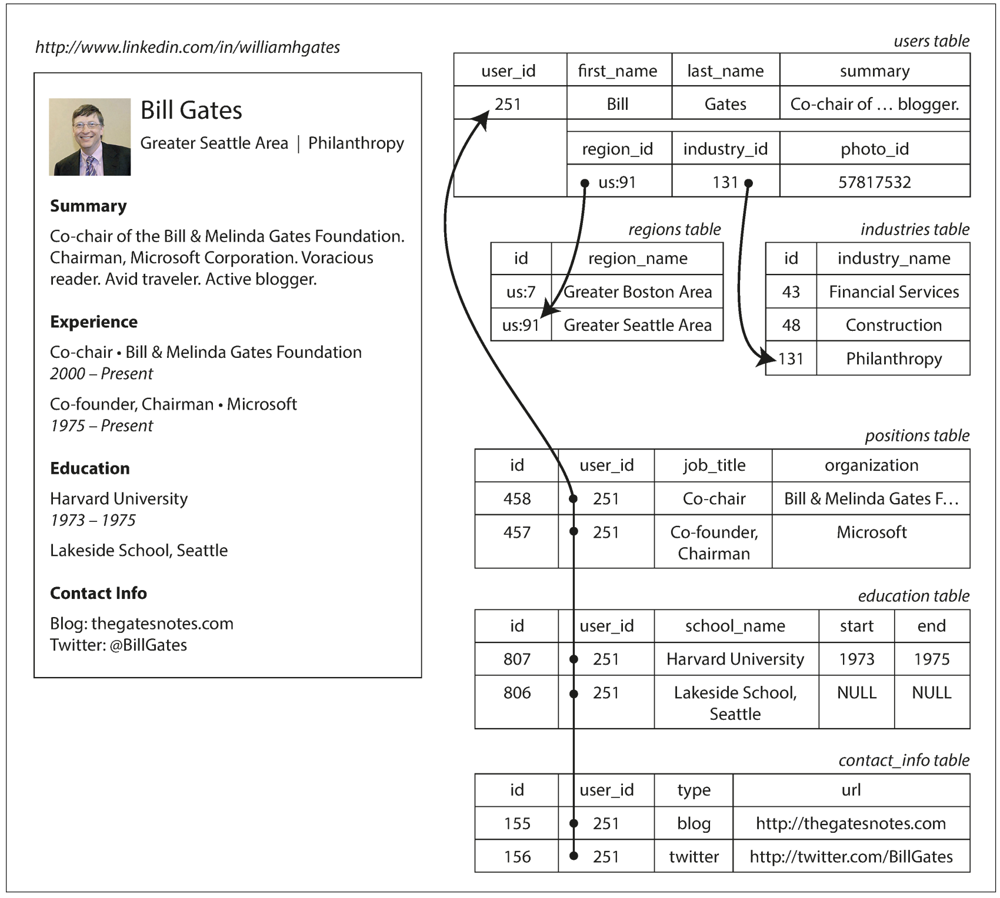
<small id="fig2.1">Figure 2-1</small>

1. The profile as a whole can be identified by a unique identifier, `user_id`.
2. **One-to-one relationships** — Fields like `first_name` and `last_name` are modeled as columns on the users table because they appear exactly once per user.
3. **One-to-many relationships** — Users can have more than one career position, varying periods of education, and contact information. Ways to represent:
   - The common normalized representation is to put positions, education, and contact information in separate tables, with a `foreign key` reference to the users table.
   - Later versions of the SQL standard added support for structured datatypes and XML data; this allowed multi-valued data to be stored within a single row, with support for querying and indexing inside those documents.
   - Encode jobs, education, and contact info as a JSON or XML document, store it on a text column in the user table, and let the application interpret its structure and content.

##### Representing a LinkedIn profile using JSON (Document Data Model)
```json
{
  "user_id": 251,
  "first_name": "Bill",
  "last_name": "Gates",
  "summary": "Co-chair of the Bill & Melinda Gates... Active blogger.",
  "region_id": "us:91",
  "industry_id": 131,
  "photo_url": "/p/7/000/253/05b/308dd6e.jpg",
  "positions": [
    {
      "job_title": "Co-chair",
      "organization": "Bill & Melinda Gates Foundation"
    },
    {
      "job_title": "Co-founder, Chairman",
      "organization": "Microsoft"
    }
  ],
  "education": [
    {
      "school_name": "Harvard University",
      "start": 1973,
      "end": 1975
    },
    {
      "school_name": "Lakeside School, Seattle",
      "start": null,
      "end": null
    }
  ],
  "contact_info": {
    "blog": "http://thegatesnotes.com",
    "twitter": "http://twitter.com/BillGates"
  }
}
```
1. Pros:
   - Can reduce the impeadance mismatch between the app code and storage layer.
   - Schema flexibility.
   - Better locality — All the data is in one place, available with one query — compared to the relational example which requires:
      - Multiple queries or
      - Joins between the users table and its subordinate tables.
   - Appropriate for a self-contained document like this.
   - Simpler than XML.
   - The one-to-many relationships imply a tree structure in the data, and the JSON representation makes this explicit:
   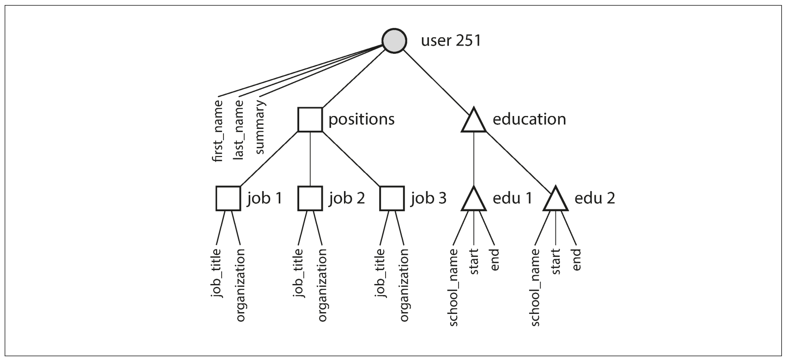
   <small id="fig2.2">Figure 2.2</small>

#### Many-to-One and Many-to-Many Relationships
1. In the preceding section, `region_id` and `industry_id` are given as IDs, not as plain-text strings.
   > Whether to store an ID or a text string is a question of **duplication**:
   > - With an ID, the information that is meaningful to humans (such as the word "Philanthropy") is stored in only one place, and everything that refers to it uses an ID (which only has meaning within the database).
   > - With the text directly, you are duplicating the human-meaningful information in every record that uses it. Maintaining consistency or updating all the redundant copies is difficult.
2. The advantage of using an ID is that because it has no meaning to humans, it never needs to change: the ID can remain the same, even if the information it identifies changes.
3. Removing such duplication is the key idea behind `normalization` in databases.
4. Normalizing this data requires many-to-one relationships, which don’t fit nicely into the document model:
   - many people work in one particular industry
5.  In relational databases, it’s normal to refer to rows in other tables by ID, because joins are easy.
6.  In document databases, joins are not needed for one-to-many tree structures, and support for joins is often weak.
7.  If the database itself does not support joins, the app developer have to emulate a join in app code by making multiple queries to the database.
8.  The profile in the preceeding section can have new product requirements that introduce many-to-many relationships. E.g:
    - Making organizations and schools as entities (i.e: tables with features) instead of plain string.
    - User recommendations
   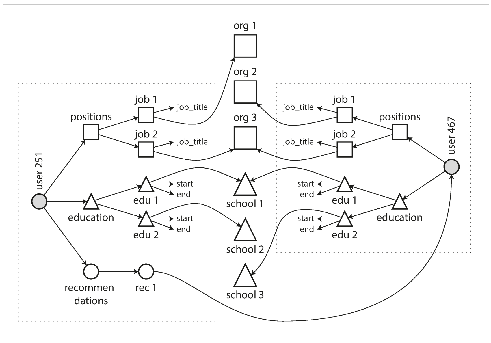
   <small id="fig2.4">Figure 2.4: The data within each dotted rectangle can be grouped into one document, but the references to organizations, schools, and other users need to be represented as references, and require joins when queried.</small>

#### Are Document Databases Repeating History?
##### Hierarchical model
1. Popular in the 1970s. It represented all data as a tree of records nested within records, much like the JSON structure of [Fig2.2](#fig2.2)
2. Cons:
   - Worked well for one-to-many relationships, but it made many-to-many relationships difficult.
   - No support for joins.
3. Two models were proposed to solve the limitations of the hierarchical model:

###### a. The network/CODASYL model
1. Standardized by a committee called the Conference on Data Systems Languages (CODASYL).
2. The CODASYL model was a generalization of the hierarchical model:
   - In the hierarchical model, every record has exactly one parent.
   - In the network model, a record could have multiple parents.
3. For example, there could be one record for the "Greater Seattle Area" region, and every user who lived in that region could be linked to it. This allowed many-to-one and many-to-many relationships to be modeled.
   > The links between records in the network model were not foreign keys, but more like pointers in a programming language (while still being stored on disk). The only way of accessing a record was to follow a path from a root record along these chains of links. This was called an **access path**.
4. Cons:
   - Difficult to make changes to the app's data model — because this usually requires changing all the handwritten database query code to handle the new access paths
   - Complexity in app code — A query in CODASYL was performed by moving a cursor through the database by iterating over lists of records and following access paths.

###### b. The relational model
1. What the relational model did, by contrast, was to lay out all the data in the open: a relation (table) is simply a collection of tuples (rows). There are no complicated access paths to follow if you want to look at the data.
2. The query optimizer automatically decides which parts of the query to execute in which order, and which indexes to use. Those choices are effectively the “access path”.

##### Comparison to document databases
1. Document databases reverted back to the hierarchical model in one aspect: storing nested records within their parent record rather than in a separate table.
> However, when it comes to representing many-to-one and many-to-many relationships, relational and document databases are not fundamentally different: in both cases, the related item is referenced by a unique identifier, which is called a `foreign key` in the relational model and a `document reference` in the document model. That identifier is resolved at read time by using a join or follow-up queries. To date, document databases have not followed the path of CODASYL.

#### Relational Versus Document Databases Today

##### Which data model leads to simpler application code?
1. This question hinges on the relationships that exist between data items.
2. For tree like structures, the document model shines.
3. For many-to-many or many-to-one relationships, the relational model shines.

> With the document model you cannot refer directly to a nested item within a document, but instead you need to say something like “the second item in the list of positions for user 251” (much like an access path in the hierarchical model).

##### Schema flexibility in the document model
1. Schema-on-read: the structure of the data is implicit, and only interpreted when the data is read. Also known as schemaless, but this term is misleading, as the code that reads the data usually assumes some kind of structure—i.e., there is an implicit schema, but it is not enforced by the database.
2. **Schema-on-write**: the traditional approach of relational databases, where the schema is explicit and the database ensures all written data conforms to it.
3. Most document databases are schema-on-read.
4. Schema-on-read is similar to dynamic (runtime) type checking in programming languages, whereas schema-on-write is similar to static (compile-time) type checking.

##### Data locality for queries
1. A document is usually stored as a single continuous string, encoded as JSON, XML, BSON (MongoDB), etc.
2. This locality leads to less disk seek and can lead to better performance ONLY if a large part of the document is needed at the same time.

> The idea of grouping related data together for locality is not limited to the document model. For example, Google’s Spanner database offers the same locality properties in a relational data model, by allowing the schema to declare that a table’s rows should be interleaved (nested) within a parent table.

##### Convergence of document and relational databases
1. Most modern relational databases have support for JSON and XML documents.
2. Some document databases either have support for relational like joins (like RethinkDB) or handle them in their client-side driver (MongoDB).

### Query Languages for Data
1. In a declarative query language, like SQL or relational algebra, the pattern of the data required is specified — what conditions the results must meet, and how the data should be transformed (e.g., sorted, grouped, and aggregated) — but not how to achieve that goal. It is up to the database system’s query optimizer to decide which indexes and which join methods to use, and in which order to execute various parts of the query.
   ```sql
   SELECT * FROM animals WHERE family = 'Sharks';
   ```
2. An imperative language tells the computer to perform certain operations in a certain order. Imagine stepping through the code line by line, evaluating conditions, updating variables, and deciding whether to go around the loop one more time.
   ```javascript
   function getSharks() {
      var sharks = [];
      for (var i = 0; i < animals.length; i++) {
         if (animals[i].family === "Sharks") {
            sharks.push(animals[i]);
         }
      }
      return sharks;
   }
   ```
3. Pros of declarative query language:
   - Concise.
   - Easier to work with.
   - Hides implementation details of the database.
   - It's less powerful, giving the database room for auto optimizations.
   - Lends itself to parallel execution

### Graph-Like Data Models
1. A graph consists of two kinds of objects:
   - Vertices (also known as nodes or entities)
   - Edges (also known as relationships or arcs).
   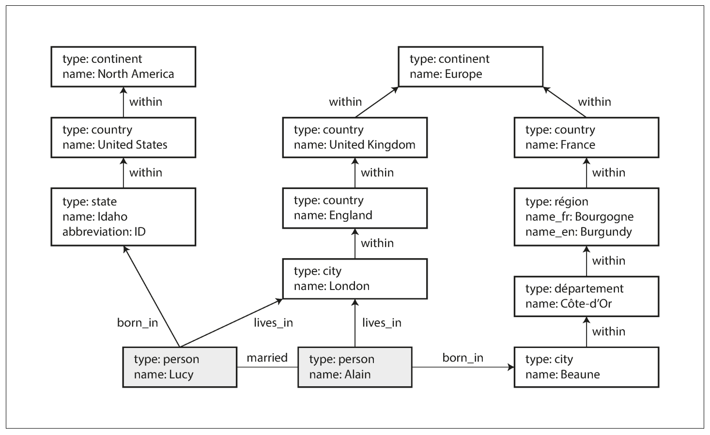
   <small id="fig2.5">Figure 2.5: Example of graph-structured data (boxes represent vertices, arrows represent edges).</small>
2. There are several different, but related, ways of structuring and querying data in graphs.

#### Property Graphs
1. In the property graph model, each vertex consists of:
   - A unique identifier
   - A set of outgoing edges
   - A set of incoming edges
   - A collection of properties (key-value pairs)
2. Each edge consists of:
   - A unique identifier
   - The vertex at which the edge starts (the tail vertex)
   - The vertex at which the edge ends (the head vertex)
   - A label to describe the kind of relationship between the two vertices
   - A collection of properties (key-value pairs)
3. Relational equivalent:
    - one table for vertices.
    - one table for edges.
    - The head and tail vertex are stored for each edge; to get the set of incoming or outgoing edges for a vertex, query the edges table by `head_vertex` or `tail_vertex`, respectively.
   ```sql
   CREATE TABLE vertices (
      vertex_id integer PRIMARY KEY,
      properties json
   );

   CREATE TABLE edges (
      edge_id integer PRIMARY KEY,
      tail_vertex integer REFERENCES vertices (vertex_id),
      head_vertex integer REFERENCES vertices (vertex_id),
      label text,
      properties json
   );

   CREATE INDEX edges_tails ON edges (tail_vertex);
   CREATE INDEX edges_heads ON edges (head_vertex);
   ```
4. Some important aspects of this model are:
   - Any vertex can have an edge connecting it with any other vertex. There is no schema that restricts which kinds of things can or cannot be associated. This is useful for evolvability: E.g: [Fig 2.5](#fig2.5) can be extended to include allergen vertices, which can have edges to people and food items that contain such substances.
   - Given any vertex, you can efficiently find both its incoming and its outgoing edges, and thus traverse the graph—i.e., follow a path through a chain of vertices — both forward and backward.
   - By using different labels for different kinds of relationships, you can store several different kinds of information in a single graph, while still maintaining a clean data model.

#### The Cypher Query Language
1. Cypher is a declarative query language for property graphs, created for the Neo4j graph database.
2. ```cypher
   CREATE
      (NAmerica:Location {name:'North America', type:'continent'}), // Vertex symbolic name: NAmerica
      (USA:Location {name:'United States', type:'country' }),
      (Idaho:Location {name:'Idaho', type:'state' }),
      (Lucy:Person {name:'Lucy' }),
      (Idaho) -[:WITHIN]-> (USA) -[:WITHIN]-> (NAmerica), // creates an edge labeled WITHIN, with Idaho as the tail node and USA as the head node.
      (Lucy) -[:BORN_IN]-> (Idaho)
   ```
   <small>A subset of the data in [Fig 2.5](#fig2.5), represented as a Cypher query</small>
3. **Query**: Find the names of all the people who emigrated from the United States to Europe.<span id="#cypher-query-example"></span>
   ```cypher
   MATCH
      (person) -[:BORN_IN]-> () -[:WITHIN*0..]-> (us:Location {name:'United States'}),
      (person) -[:LIVES_IN]-> () -[:WITHIN*0..]-> (eu:Location {name:'Europe'})
   RETURN person.name

   // `(person) -[:BORN_IN]-> ()` matches any two vertices that are related by an edge labeled `BORN_IN`. The tail vertex of that edge is bound to the variable `person`, and the head vertex is left unnamed.
   ```
   Interpretation:
   Find any vertex (call it `person`) that meets both of the following conditions:
   - `person` has an outgoing `BORN_IN` edge to some vertex. From that vertex, you can follow a chain of outgoing `WITHIN` edges until eventually you reach a vertex of type `Location`, whose name property is equal to **"United States"**.
   - That same `person` vertex also has an outgoing `LIVES_IN` edge. Following that edge, and then a chain of outgoing `WITHIN` edges, you eventually reach a vertex of type `Location`, whose name property is equal to **"Europe"**.
   
   For each such person vertex, return the name property.

#### Graph Queries in SQL
1. While graph data can be queried with SQL, it is more difficult:
   >  In a relational database, you usually know in advance which joins you need in your query.
   > In a graph query, you may need to traverse a variable number of edges before you find the vertex you’re looking for — that is, the number of joins is not fixed in advance.
   > In the [previous example](#cypher-query-example), this happens in the `() -[:WITHIN*0..]-> ()` rule in the Cypher query.
2. Since SQL:1999, this idea of variable-length traversal paths in a query can be expressed using something called recursive common table expressions (the `WITH RECURSIVE` syntax).

#### Triple-Stores and SPARQL
1. The triple-store model is mostly equivalent to the property graph model, using different words to describe the same ideas.
2. In a triple-store, all information is stored in the form of very simple three-part statements: `(subject, predicate, object)`, e.g: (Jim, likes, bananas)
3. The subject of a triple is equivalent to a vertex in a graph. The object is one of two things:
   - Primitive data: e.g: `(lucy, age, 33)`. The predicate and object of the triple are equivalent to the key and value of a property on the subject vertex.
   - Vertex: e.g: `(lucy, marriedTo, alain)`. The predicate is the label of an edge in the graph, the subject is the tail vertex, and the object is the head vertex.
4. ```turtle
   @prefix : <urn:example:>.
   _:lucy a :Person.
   _:lucy :name "Lucy".
   _:lucy :bornIn _:idaho.
   _:idaho a :Location.
   _:idaho :name "Idaho".
   _:idaho :type "state".
   _:idaho :within _:usa.
   _:usa a :Location.
   _:usa :name "United States".
   _:usa :type "country".
   _:usa :within _:namerica.
   _:namerica a :Location.
   _:namerica :name "North America".
   _:namerica :type "continent".
   ```
   <small>A subset of the data in [Figure 2.5](#fig2.5), represented as Turtle triples</small>

##### The SPARQL query language
1. Query: The same query as before — finding people who have moved from the US to Europe:
   ```sparql
   PREFIX : <urn:example:>

   SELECT ?personName WHERE {
      ?person :name ?personName.
      ?person :bornIn / :within* / :name "United States".
      ?person :livesIn / :within* / :name "Europe".
   }
   ```
2. The structure is very similar. The following two expressions are equivalent (variables start with a question mark in SPARQL):
   ```cypher
   // Cypher
   (person) -[:BORN_IN]-> () -[:WITHIN*0..]-> (location)
   ```

   ```sparql
   # SPARQL
   ?person :bornIn / :within* ?location.
   ```

#### Graph Databases Compared to the Network Model
1. In a graph database, any vertex can have an edge to any other vertex. In CODASYL, a database had a schema that restricted/controlled nesting.
2. In a graph database, you can refer directly to any vertex by its unique ID, or you can use an index to find vertices with a particular value. In CODASYL, you have to use the record's access path.
3. In a graph database, vertices and edges are not ordered (you can only sort the results when making a query). In CODASYL, the children of a record were an ordered set.
4. Graph databases support high-level declarative query languages. CODASYL relied on imperative queries.

#### The Foundation: Datalog
1. Datalog is a much older language than SPARQL or Cypher.
2. It's the query language of Datomic.
3. Cascalog is a Datalog implementation for querying large datasets in Hadoop.
4. Datalog’s data model is similar to the triple-store model. Instead of writing a triple as `(subject, predicate, object)`, it's written as `predicate(subject, object)`.
5. ```prolog
   name(namerica, 'North America').
   type(namerica, continent).
   name(usa, 'United States').
   type(usa, country).
   within(usa, namerica).
   name(idaho, 'Idaho').
   type(idaho, state).
   within(idaho, usa).
   name(lucy, 'Lucy').
   born_in(lucy, idaho).
   ```
   <small>A subset of the data in [Figure 2.5](#fig2.5), represented as Datalog facts</small>
6. Query: The same query as before — finding people who have moved from the US to Europe:
   ```prolog
   within_recursive(Location, Name) :- name(Location, Name). /* Rule 1 */
   
   within_recursive(Location, Name) :- within(Location, Via), /* Rule 2 */

   within_recursive(Via, Name).

   migrated(Name, BornIn, LivingIn) :- name(Person, Name), /* Rule 3 */
                                       born_in(Person, BornLoc),
                                       within_recursive(BornLoc, BornIn),
                                       lives_in(Person, LivingLoc),
                                       within_recursive(LivingLoc, LivingIn).
   
   ?- migrated(Who, 'United States', 'Europe').
   /* Who = 'Lucy'. */
   ```
7. We define rules that tell the database about new predicates. Here, we define: `within_recursive` and `migrated`. These predicates aren’t triples stored in the database, but instead they are derived from data or from other rules.
8. In rules, words that start with an uppercase letter are variables. For example, name `(Location, Name)` matches the triple `name(namerica, 'North America')` with variable bindings `Location = namerica` and `Name = 'North America'`.

## Chapter 3 — Storage & Retrieval

## Chapter 4 - Encoding & Evolution

1. Compatibility is a relationship between one process that encodes the data, and another process that decodes it.
2. Backward compatibility: Newer code can read data that was written by older code.
3. Forward compatibility: Older code can read data that was written by newer code.
4. Schemaless databases can contain a mixture of data in older and newer formats.
5. Database with schemas enforce data conformity as schema changes.

## Formats for Encoding Data

1. Programs usually work with data in two different representation:
   - In-memory: Data is kept in objects, arrays, lists, hash tables, etc.
   - Self-contained byte sequence: Used when writing data to a file or network.
2. Translation is needed between the two representations:
   - In-memory to byte sequence — Known as serialization, or encoding, or marshalling
   - Byte sequence to in-memory — Known as deserailization, or decoding, or unmarshalling, or parsing.

### Language-Specific Formats
1. Many programming languages come with built-in support for encoding in-memory objects into byte sequences:
   - Java has java.io.Serializable.
   - Ruby has Marshal.
   - Python has pickle, ...
2. Pro:
   - Convenient: It's already included in the programming language.
3. Cons:
   - Coupled to the programming language.
   - Security concern as arbitrary classes can be instantiated.
   - Versoning is absent or abysmal.
   - Inefficiencies in CPU usage and size of encoded structure.

### JSON, XML, & CSV Formats
1. These are standardized textual (human readable) encoding formats that are used in many programming languages.
2. XML is verbose and unnecessarily complicated; JSON is popular and simpler than XML; CSV is less powerful than both.
3. Cons:
   - Number encoding ambiguity: JSON doesn't distinguish integers and floating-point numbers; XML and CSV doesn't distinguish numbers and strings (without an external schema).
   - JSON & XML don't support binary strings (sequences of bytes without a character encoding). Albeit inefficient, Base64 encoding binary data is used to circumvent this limitation.
   - Optional & complicated schema support for XML & JSON. Consumers that don't use the schema have to hardcode the appropriate encoding/decoding logic (for correct interpretation: Is it base64 encoded? is it a number?).
   - No schema support for CSV. Applications define the meaning of each column & row.

#### Binary Encoding
```json
{
    "userName": "Martin",
    "favoriteNumber": 1337,
    "interests": ["daydreaming", "hacking"]
}
```
<small id="example4.1">Example record used in several binary formats below.</small>

1. Binary encoding format for JSON: MessagePack, BSON, BJSON, UBJSON, BISON, Smile, ...
2. Binary encoding format for XML: WBXML, Fast Infoset, ...
3. These binary formats can extend the set of datatypes:
   - Distinguishing integers & floating-point numbers
   - Binary string support
4. Because these binary formats don't pescribe a schema, they need to include all the object field names within the encoded data.
5. The [example record](#example4.1) encoded with MessagePack is `66 bytes` long, compared to the `81 bytes` taken by the textual JSON encoding (with whitespace removed).
   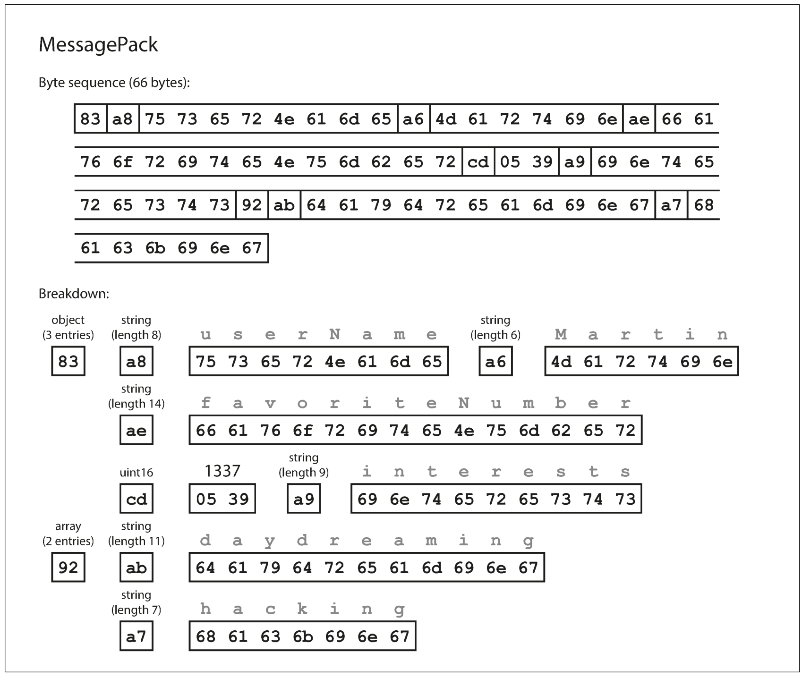
6. The downside of binary encoding is that data needs to be decoded before it is human-readable.

### Thrift & Protocol Buffers
1. Apache Thrift & Protocol Buffers (protobuf) are binary encoding formats.
2. Both have code generation tools that use a required schema definition to produce classes that implement the schema in various programming languages.
   ```thrift
   struct Person {
      1: required string userName,
      2: optional i64 favoriteNumber,
      3: optional list<string> interests
   }
   ```
   <small>Schema for the [example record](#example4.1) in Thrift IDL.</small>

   ```protobuf
   message Person {
      required string user_name = 1;
      optional int64 favorite_number = 2;
      repeated string interests = 3;
   }
   ```
   <small>Schema for the [example record](#example4.1) with Protobuf.</small>
3. Required/optional markers are only used for runtime verification.
4. Thrift has two encoding formats: BinaryProtocol & CompactProtocol.
5. [Example record](#example4.1) encoded with Thrift's BinaryProtocol takes `59 bytes`.
   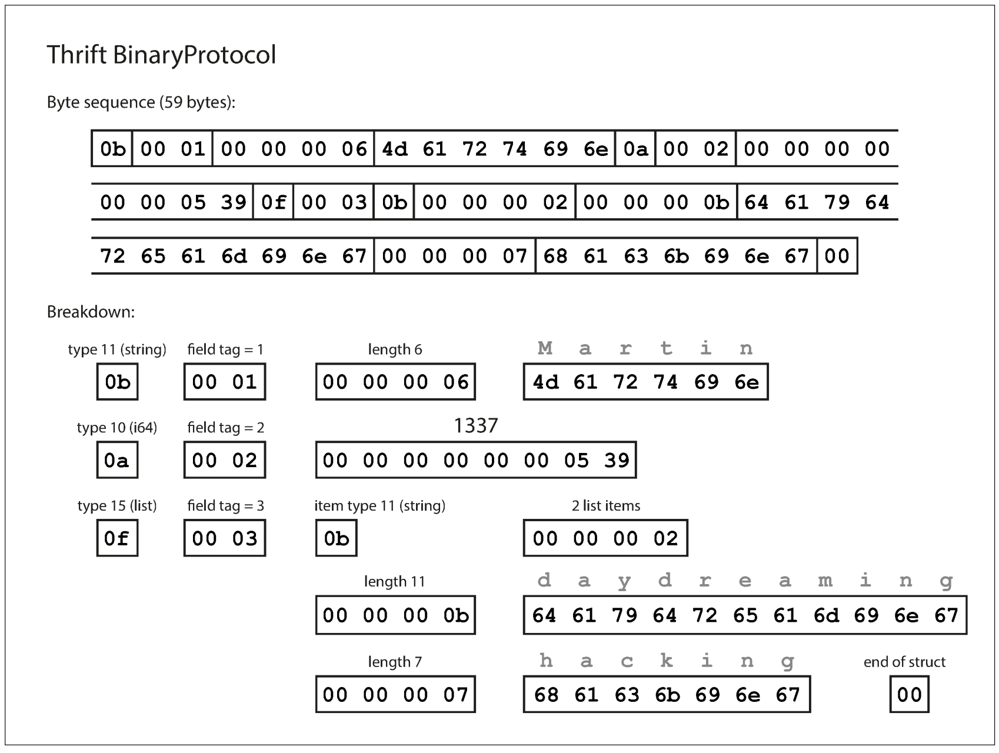
   
   **Note**: No field names — Instead field tags from the schema definition is used.
6. Thrift's CompactProtocol is semantically equivalent to BinaryProtocol, but packs the same information into `34 bytes`.
   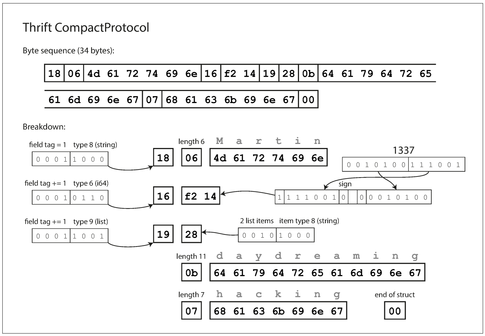
   
   - It packs the field tag & type into one byte
   - Uses variable length integers: Rather than using a full eight bytes for the number **1337**, it's encoded in two bytes, with the top bit of each byte used to indicate whether there are still more bytes to come. This means numbers between –64 and 63 are encoded in one byte, numbers between –8192 and 8191 are encoded in two bytes, etc.
7. [Example record](#example4.1) encoded with Protobuf takes `33 bytes`.
   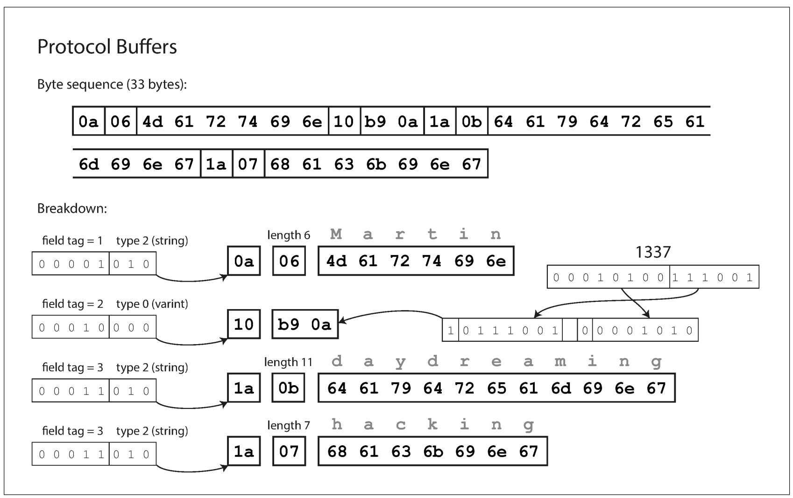

#### Field tags & Schema evolution
1. An encoded record is just a concantenation of its encoded fields. Each field is identified by its tag number and annotated with a datatype.
2. Unset field are omitted from the encoded record.

##### Maintaining forward-compatibility
1. Field names can be changed, but field tag numbers can't be changed without invalidating existing encoded data.
2. Fields can be added to a schema, using distinct tag numbers — Old code simply ignores it.
3. Required fields can't be removed afterwards.

##### Maintaining backward-compatibility
1. New code can read old data as long as field tag numbers are unique.
2. New fields can't be required as old code can't write it. They must be optional or have a default value.
3. Removed fields tag numbers must be reserved.

##### Datatype & Schema evolution
1. Changing the datatype for numbers is possible, but could lose precision or get truncated.
2. Protobuf has a `repeated` marker instead of a list or array datatype — this allows evolution from single-valued fields into repeated (multi-valued) fields of the same type.
3. Thrift has a dedicated list datatype, which has the advantage of supporting nested lists.

### Avro
1. Apache Avro is a binary encoding format.
2. Apache Avro have two schema languages:
   - Avro IDL (intended for human editing)
   ```avro
   record Person {
      string userName;
      union { null, long } favoriteNumber = null;
      array<string> interests;
   }
   ```
   - JSON (more machine readable)
   ```json
   {
      "type": "record",
      "name": "Person",
      "fields": [
         {
            "name": "userName",
            "type": "string"
         },
         {
            "name": "favoriteNumber",
            "type": ["null", "long"],
            "default": null
         },
         {
            "name": "interests",
            "type": {
                "type": "array",
                "items": "string"
            }
         }
      ]
   }
   ```
3. [Example record](#example4.1) encoded with Avro takes `32 bytes`.
   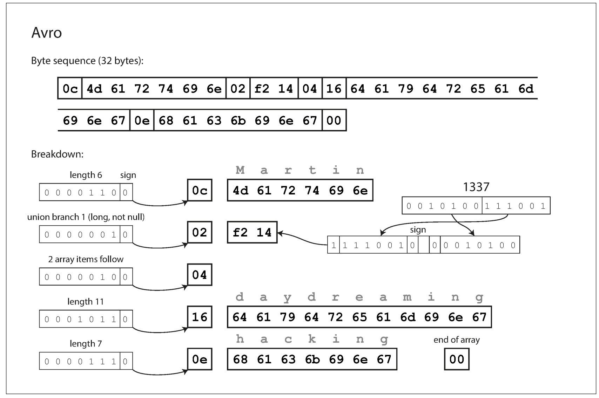
4. Compared to Thrift or Protobuf, there is no field tag number with an annotated data-type in the encoded data, instead, the schema is used to determine the order and data-type of fields in the encoded data. Thus the writer and reader schemas' must be compatible.

#### Writer & Reader Schema
1. The writer’s schema and the reader’s schema don’t have to be the same — they only need to be compatible.
2. During decoding, the Avro library resolves the differences by looking at the writer’s schema and the reader’s schema side by side and translating the data from the writer’s schema into the reader’s schema.

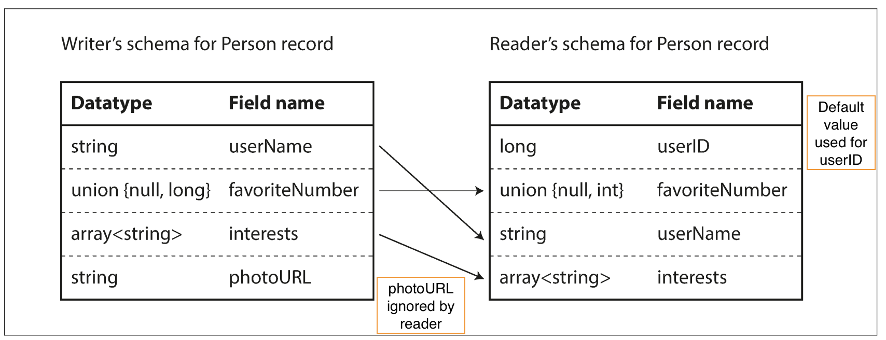

### The Merits of Schemas
1. Compact since field names can be omitted.
2. Schema is a form of documentation.
3. Database of schema enables validation of backward & forward compatibility.
4. Code-gen from the schema enables compile-time type checking in statically typed languages.

### Modes of Dataflow

#### Dataflow Through Databases
1. In a database, the process that writes to the database encodes the data, and the process that reads from the database decodes it.
2. Data outlives code.
3. When an older version of the application updates data previously written by a newer version of the application, data may be lost if you’re not careful.
   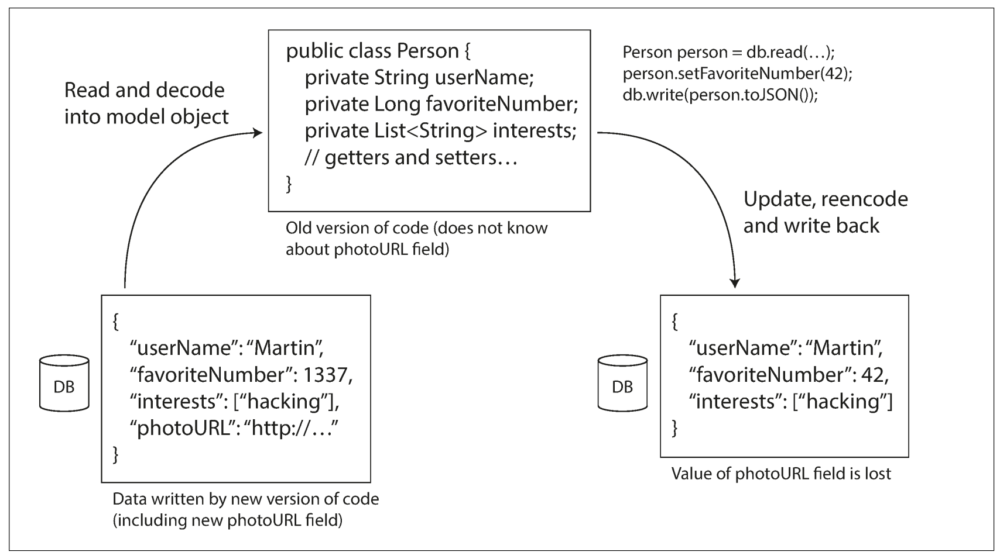

#### Dataflow Through Services: REST and RPC
1. Client-server is a common arrangement for processes that want to communicate over a network.
2. The servers expose an API over the network, and the clients can connect to the servers to make requests to that API. The API exposed by the server is known as a service.
3. The client encodes a request, the server decodes the request and encodes a response, and the client finally decodes the response.
4. An application can be decomposed into smaller services by area of functionality, such that one service is a client of another. This is known as `Service oriented architecture (SOA)` or `Microservices architecture`.

##### Web services
1. When HTTP is used as the underlying protocol for talking to the service, it's called a web service. This is a misnomer tho as web services are not only used on the web.
2. REST is not a protocol, but rather a design philosophy that builds upon the principles of HTTP. It emphasizes simple data formats, using URLs for identifying resources and using HTTP features for cache control, authentication, and content type negotiation.
3. An API designed according to the principles of REST is called RESTful.
4. A definition format such as OpenAPI (aka Swagger), can be used to describe RESTful APIs and produce documentation.
5. By contrast, SOAP is an XML-based protocol for making network API requests. Although it is most commonly used over HTTP, it aims to be independent from HTTP and avoids using most HTTP features.
6. The API of a SOAP web service is described using an XML-based language called the Web Services Description Language, or WSDL.

##### The problems with remote procedure calls (RPCs)
1. The RPC model tries to make a request to a remote network service look the same as calling a local function (this abstraction is called location transparency).
2. RPC is flawed because a network request is different from a local function call:
   - A local function call is predictable and either succeeds or fails, depending only on parameters that are under your control.
   - A network request can timeout. A local function call always: returns a result or throws an exception or never returns.
   - Network request responses' can get lost.
   - A network request latency is wildly variable.
   - References (pointers) to objects in local memory can be efficiently passed to local functions.
   - Translation of data-types is necessary if the client & server are written in different programming languages.

##### Current directions for RPC
1. Thrift and Avro come with RPC support included.
2. gRPC is an RPC implementation using Protocol Buffers.
3. Finagle uses Thrift.
4. Rest.li uses JSON over HTTP.
5. The new generation of RPC frameworks are more explicit about the fact that a remote request is different from a local function call.

#### Message-Passing Dataflow
1. Asynchronous message-passing systems are somewhere between RPC and databases:
   - They are similar to RPC in that a client’s request (usually called a message) is delivered to another process with low latency.
   - They are similar to databases in that the message is not sent via a direct network connection, but goes via an intermediary called a `message broker` (also called a message queue or message-oriented middleware), which stores the message temporarily.
2. Using a message broker has several advantages compared to direct RPC:
   - It can act as a buffer if the recipient is unavailable or overloaded, and thus improve system reliability.
   - It can automatically redeliver messages to a process that has crashed, and thus prevent messages from being lost.
   - It avoids the sender needing to know the IP address and port number of the recipient.
   - It allows one message to be sent to several recipients.
   - It logically decouples the sender from the recipient (the sender just publishes messages and doesn’t care who consumes them).
3. Message-passing communication is usually one-way: a sender normally doesn’t expect to receive a reply to its messages.
4. This communication pattern is asynchronous: the sender fires & forget.

##### Message brokers
1. Open source implementations: RabbitMQ, ActiveMQ, HornetQ, NATS, Apache Kafka, etc.
2. The detailed delivery semantics vary by implementation and configuration, but in general, message brokers are used as follows:
   > One process sends a message to a `named queue/topic`, and the `broker` ensures that the message is delivered to one or more `consumers of` or `subscribers to` that `queue/topic`. There can be many producers and many consumers on the same topic.
3. Message brokers typically don’t enforce any particular data model — a message is just a sequence of bytes with some metadata.
4. Messages are encoded by the sender and decoded by the recipient.

##### Distributed actor frameworks
1. The actor model is a programming model for concurrency in a single process:
   - Rather than dealing directly with threads, logic is encapsulated in actors.
   - Each actor typically represents one client or entity, it may have some local state (which is not shared with any other actor)
   - It communicates with other actors by sending and receiving asynchronous messages.
   - Message delivery is not guaranteed: in certain error scenarios, messages will be lost.
   - Since each actor processes only one message at a time, it doesn’t need to worry about threads, and each actor can be scheduled independently by the framework.
2. In distributed actor frameworks, this programming model is used to scale an application across multiple nodes. Messages are transparently encoded into a byte sequence, sent over the network, and decoded on the other side.
3. Location transparency works better in the actor model than in RPC, because the actor model already assumes that messages may be lost, even within a single process.
4. A distributed actor framework essentially integrates a message broker and the actor programming model into a single framework.
5. Three popular distributed actor frameworks:
   - Akka
   - Orleans
   - Erlang OTP

> Aside: "`Rolling upgrades` is where a new version of a service is gradually deployed to a few nodes at a time, rather than deploying to all nodes simultaneously.
> Rolling upgrades allow new versions of a service to be released without downtime (thus encouraging frequent small releases over rare big releases) and make deployments less risky (allowing faulty releases to be detected and rolled back before they affect a large number of users)."


## Chapter 5 — Replication
> The major difference between a thing that might go wrong and a thing that cannot possibly go wrong is that when a thing that cannot possibly go wrong goes wrong it usually turns out to be impossible to get at or repair.
> — Douglas Adams, Mostly Harmless (1992)
1. Replication means keeping a copy of the same data on multiple machines that are connected via a network.
2. Benefits:
   - Low latency: Data can be kept geographically close to users.
   - High availability: The system can continue working even if some machines fail.
   - Scalability: Increased throughput with many machines.
3. Each node that stores a copy of the database is called a replica.

### Single leader replication
1. aka: leader-based, active/passive or master–slave replication.
2. How it works:
   - One of the replicas is designated the `leader` (aka: master or primary). All writes goes to the leader.
   - The other replicas are known as `followers` (aka: read replicas, slaves, secondaries, or hot standbys).
   - Whenever data is written to the leader, it also sends the data change to all of its followers as part of a replication log or change stream. The followers use this log to update their local copy of the database.
   - A client can read from either the leader or any of the followers. Followers are read-only from the client's POV.
   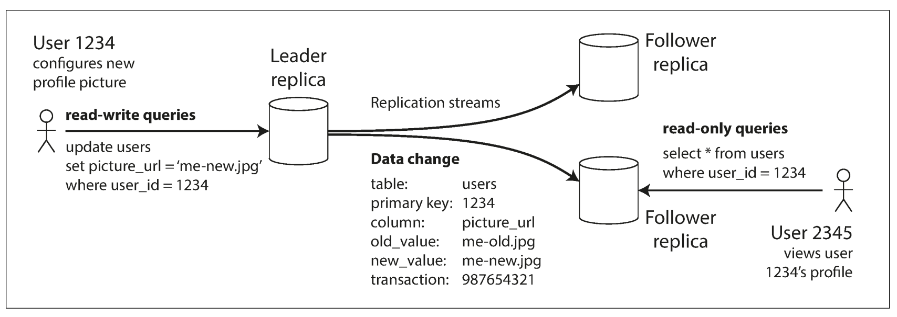
3. Used by:
   - Relational databases: PostgreSQL, MySQL.
   - Nonrelational databases: MongoDB, RethinkDB, and Espresso.
   - Distributed message brokers: Kafka, RabbitMQ.

#### Synchronous Versus Asynchronous Replication
1. Semi-synchronous example: The replication to follower 1 is synchronous, and the replication to follower 2 is asynchronous.
   
2. Advantage of synchronous replication: the follower is guaranteed to have an up-to-date copy of the data that is consistent with the leader.
3. Disadvantage of synchronous replication: Writes can't be processed if the synchronous replica is unavailable.
4. Advantage of full asynchronous replication: the leader can continue processing writes, even if all of its followers have fallen behind.
5. Disadvantage of full asynchronous replication: writes are not guaranteed to be durable, even if it has been confirmed to the client.

#### Setting Up New Followers
1. Setting up a new follower without downtime:
   - Take a **consistent** snapshot of the leader’s database at some point in time. A standard file copy is insufficient as the database can be modified in between the copy operation.
   - Copy the snapshot to the new follower node.
   - The follower connects to the leader and requests all the data changes that have happened since the snapshot was taken.
   - When the follower has processed the backlog of data changes since the snapshot we say it has caught up.

#### Handling Node Outages
How to achieve high availability with leader-based replication.

##### Follower failure: Catch-up recovery
1. After a failure, a follower can recover by requesting from the leader all the changes between its last processed transaction and now. Similar to the last two steps mentioned in [setting up new followers](#setting-up-new-followers).

##### Leader failure: Failover
1. Failover is the process of handling a leader failure:
   - one of the followers needs to be promoted to be the new leader,
   - clients need to be reconfigured to send their writes to the new leader, and
   - the other followers need to start consuming data changes from the new leader.
2. An automatic failover process usually consists of the following steps:
   - Determining that the leader has failed: Timeouts are usually used as there is no better alternative.
   - Choosing a new leader: Through an election process or a single elected controller node. The replica with the most recent changes is the best candidate given this minimizes data loss.
   - Reconfiguring the system to use the new leader and ensuring that the old leader becomes a follower whenever it comes back on the network.
3. Failover is fraught with things that can go wrong:
   - If asynchronous replication is used, the new leader may not have received all the writes from the old leader before it failed, leading to potential data loss.
   - Discarding writes is especially dangerous if other storage systems outside of the database need to be coordinated with the database contents.
   - In certain fault scenarios, it could happen that two nodes both believe that they are the leader. This situation is called split brain and it can lead to data loss or corruption.
   - What is the right timeout before the leader is declared dead?
     - Short timeout: can lead to unncessary failovers.
     - Long timeout: leads to longer recovery times.

#### Implementation of Replication Logs
Several different leader-based replication methods are used in practice.

##### Statement-based replication
1. The leader logs every write request (statement) that it executes and sends that statement log to its followers.
2. For a relational database, this means that every `INSERT`, `UPDATE`, or `DELETE`m statement is forwarded to followers.
3. Issues:
   - Nondeterministic functions (like `NOW()`, `RAND()`) in statements can produce different values on replicas.
   - If a statement depends on existing data in the database, they must be executed in exactly the same order on each replica in order to have the same effect.
   - Statements that have side effects (e.g: triggers, stored procedures, user-defined functions) may result in different side effects occurring on each replica.
4. Some of the issues can be addressed, like replacing `NOW()` with an exact date-time on the leader. However, there are so many edge cases.
5. VoltDB uses statement-based replication, and makes it safe by requiring transactions to be deterministic.

##### Write-ahead log (WAL) shipping
1. As discussed in [Chapter 3](#chapter-3--storage--retrieval), storage engines maintain a log that is an append-only sequence of bytes containing all writes to the database.
2. This log can be used to build a replica on another node: besides writing the log to disk, the leader also sends it across the network to its followers.
3. Disadvantages:
   - Couples replication to the storage engine: the log describes the data on a very low level — a WAL contains details of which bytes were changed in which disk blocks. If the database changes its storage format, upgrading to this version will require downtime if replicas can't use the same log.
4. Used by: PostgreSQL, Oracle, etc.

##### Logical (row-based) log replication
1. An alternative is to use different log formats for replication and for the storage engine, which allows the replication log to be decoupled from the storage engine internals.
2. This kind of replication log is called a `logical log`, to distinguish it from the storage engine’s (`physical`) data representation.
3. A logical log for a relational database is usually a sequence of records describing writes to database tables at the granularity of a row:
   - For an inserted row, the log contains the new values of all columns.
   - For a deleted row, the log contains enough information to uniquely identify the row that was deleted.
   - For an updated row, the log contains enough information to uniquely identify the updated row, and the new values.

##### Trigger-based replication
1. Unlike the methods above that are done at the database level, this is done at the application level.
2. Triggers and stored procedures can be used to implement this.
3. Pros compared to database level replication:
   - Flexible
4. Cons compared to database level replication:
   - Greater overhead
   - Prone to bugs and limitations

### Problems with Replication Lag


## Chapter 10 — Batch Processing

Three types of systems:

1. Services (Online systems): Handle client requests as they arrive. Primary performance metric is response time.
   
2. Batch processing systems (offline systems): (Periodically) takes a large amount of input data, runs a job to process it, and produces some output data. Primary performance metric is throughput.

3. Stream processing systems (near-real-time systems): Somewhere between (1) & (2). Like (2), a stream processor consumes inputs and produces outputs (rather than responding to requests). However, a stream job operates on events shortly after they happen.

### Bash Processing with Unix Tools

```
216.58.210.78 - - [27/Feb/2015:17:55:11 +0000] "GET /css/typography.css HTTP/1.1"
200 3377 "http://martin.kleppmann.com/" "Mozilla/5.0 (Macintosh; Intel Mac OS X
10_9_5) AppleWebKit/537.36 (KHTML, like Gecko) Chrome/40.0.2214.115
Safari/537.36"
```

For a file containing log lines (like above), a simple unix tool can be used to do log analysis.

For example, to find the five most popular pages:

```bash
cat /var/log/nginx/access.log |
awk '{print $7}' |
sort |
uniq -c |
sort -r -n |
head -n 5
```

Writing an equivalent simple program with a hash table is possible. The unix approach has some advantages -- sort for example uses multiple threads, and if a data doesn't fit in memory, it is written to disk.

### The Unix Philoshophy

1. Make each program do one thing well. To do a new job, build afresh rather than complicate old programs by adding new “features”.
2. Expect the output of every program to become the input to another, as yet unknown, program. Don’t clutter output with extraneous information. Avoid stringently columnar or binary input formats. Don’t insist on interactive input.
3. Design and build software, even operating systems, to be tried early, ideally within weeks. Don’t hesitate to throw away the clumsy parts and rebuild them.
4. Use tools in preference to unskilled help to lighten a programming task, even if you have to detour to build the tools and expect to throw some of them out after you’ve finished using them.

#### Uniform Interface

All programs must use the same I/O interface to be able to connect any program’s output to any program’s input. In Unix, that interface is a file (or, more precisely, a file descriptor). A file is just an ordered sequence of bytes.

Unix programs read from `stdin` (default: keyboard) and write to `stdout` (default: screen). Because of the loose coupling, it is possible to pipe a program `stdout` to another program `stdin`, or have `stdin/stdout` be an arbirtrary file.

Running on a single machine is the biggest limitation of Unix tools.

### MapReduce & Distributed Filesystems

Like Unix tools, MapReduce normally doesn't have side-effects -- It takes in input, and produces an output.

MapReduce jobs read and write files on a distributed filesystem -- HDFS (Hadoop Distributed Filesystem) in Hadoop's implementation of MapReduce.

HDFS is based on the shared-nothing principle.

HDFS consists of a daemon process running on each machine, exposing a network service that allows other nodes to access files stored on that machine.

A central server called the `NameNode` keeps track of which file blocks are stored on which machine.

Conceptually, it is one big filesystem that can use the space on the disks of all machines running the daemon.


Replication is used to tolerate machine and disk failures. Replication may mean simply several copies of the same data on multiple machines, or an erasure coding scheme such as Reed–Solomon codes, which allows lost data to be recovered with lower storage overhead than full replication.

#### MapReduce Job Execution

MapReduce is a programming framework with which you can write code to process large datasets in a distributed filesystem like HDFS.

The pattern of MapReduce is similar to the example above in Simple Log Analysis:

1. Read a set of input files, and break it up into records. In the web server log example, each record is one line in the log (that is, \n is the record separator).

2. Call the mapper function to extract a key and value from each input record. In the preceding example, the mapper function is `awk '{print $7}'`: it extracts the URL ($7) as the key, and leaves the value empty.

3. Sort all of the key-value pairs by key. In the log example, this is done by the first sort command.

4. Call the reducer function to iterate over the sorted key-value pairs. If there are multiple occurrences of the same key, the sorting has made them adjacent in the list, so it is easy to combine those values without having to keep a lot of state in memory. In the preceding example, the reducer is implemented by the command `uniq -c`, which counts the number of adjacent records with the same key.

Those four steps can be performed by one MapReduce job. Steps 2 (map) and 4 (reduce) are where you write your custom data processing code. Step 1 (breaking files into records) is handled by the input format parser. Step 3, the sort step, is implicit in MapReduce—you don’t have to write it, because the output from the mapper is always sorted before it is given to the reducer.

To create a MapReduce job, two callback functions implementation are needed: mapper & reducer.

Mapper: The mapper is called once for every input record, and its job is to extract the key and value from the input record. For each input, it may generate any number of key-value pairs (including none). It does not keep any state from one input record to the next, so each record is handled independently.

Reducer: The MapReduce framework takes the key-value pairs produced by the mappers, collects all the values belonging to the same key, and calls the reducer with an iterator over that collection of values. The reducer can produce output records.

In the web server log example, we had a second sort command in step 5, which ranked URLs by number of requests. In MapReduce, if you need a second sorting stage, you can implement it by writing a second MapReduce job and using the output of the first job as input to the second job.

##### Distributed execution of MapReduce

Without explicitly writing code to handle parallelism, MapReduce can help parallize a computation across many machines. The mapper and reducer only operate on one record at a time; they don’t need to know where their input is coming from or their output is going to, so the framework can handle the complexities of moving data between machines.

In Hadoop MapReduce, the mapper and reducer are each a Java class that implements a particular interface. In MongoDB and CouchDB, mappers and reducers are JavaScript functions.

Figure 10-1 shows the dataflow in a Hadoop MapReduce job. Its parallelization is based on partitioning (see Chapter 6): the input to a job is typically a directory in HDFS, and each file or file block within the input directory is considered to be a separate partition that can be processed by a separate map task (marked by m 1, m 2, and m 3 in Figure 10-1).

Each input file is typically hundreds of megabytes in size. The MapReduce scheduler (not shown in the diagram) tries to run each mapper on one of the machines that stores a replica of the input file, provided that machine has enough spare RAM and CPU resources to run the map task [26]. This principle is known as putting the computation near the data [27]: it saves copying the input file over the network, reducing network load and increasing locality.


Figure 10-1. A MapReduce job with three mappers and three reducers.

In most cases, the application code that should run in the map task is not yet present on the machine that is assigned the task of running it, so the MapReduce framework first copies the code (e.g., JAR files in the case of a Java program) to the appropriate machines. It then starts the map task and begins reading the input file, passing one record at a time to the mapper callback. The output of the mapper consists of keyvalue pairs.

The reduce side of the computation is also partitioned. While the number of map tasks is determined by the number of input file blocks, the number of reduce tasks is configured by the job author (it can be different from the number of map tasks). To ensure that all key-value pairs with the same key end up at the same reducer, the framework uses a hash of the key to determine which reduce task should receive a particular key-value pair (see “Partitioning by Hash of Key” on page 203).

The key-value pairs must be sorted, but the dataset is likely too large to be sorted with a conventional sorting algorithm on a single machine. Instead, the sorting is performed in stages. First, each map task partitions its output by reducer, based on the hash of the key. Each of these partitions is written to a sorted file on the mapper’s local disk, using a technique similar to what we discussed in “SSTables and LSMTrees”.

Whenever a mapper finishes reading its input file and writing its sorted output files, the MapReduce scheduler notifies the reducers that they can start fetching the output files from that mapper. The reducers connect to each of the mappers and download the files of sorted key-value pairs for their partition. The process of partitioning by reducer, sorting, and copying data partitions from mappers to reducers is known as the shuffle [26] (a confusing term—unlike shuffling a deck of cards, there is no randomness in MapReduce).

The reduce task takes the files from the mappers and merges them together, preserving the sort order. Thus, if different mappers produced records with the same key, they will be adjacent in the merged reducer input.

The reducer is called with a key and an iterator that incrementally scans over all records with the same key (which may in some cases not all fit in memory). The reducer can use arbitrary logic to process these records, and can generate any number of output records. These output records are written to a file on the distributed filesystem (usually, one copy on the local disk of the machine running the reducer, with replicas on other machines).

##### MapReduce workflows

The range of problems you can solve with a single MapReduce job is limited. Referring
back to the log analysis example, a single MapReduce job could determine the
number of page views per URL, but not the most popular URLs, since that requires a
second round of sorting.

Thus, it is very common for MapReduce jobs to be chained together into workflows,
such that the output of one job becomes the input to the next job. The Hadoop Map‐
Reduce framework does not have any particular support for workflows, so this chaining
is done implicitly by directory name: the first job must be configured to write its
output to a designated directory in HDFS, and the second job must be configured to
read that same directory name as its input. From the MapReduce framework’s point
of view, they are two independent jobs.

A batch job’s output is only considered valid when the job has completed successfully
(MapReduce discards the partial output of a failed job). Therefore, one job in a workflow
can only start when the prior jobs—that is, the jobs that produce its input directories—
have completed successfully.

To handle these dependencies between job executions, various workflow schedulers for Hadoop have been developed, including
Oozie, Azkaban, Luigi, Airflow, and Pinball [28].
These schedulers also have management features that are useful when maintaining a
large collection of batch jobs. Workflows consisting of 50 to 100 MapReduce jobs are
common when building recommendation systems

#### Reduce-Side Joins and Grouping

### The Output of Batch Workflows

#### Building search indexes

Google’s original use of MapReduce was to build indexes for its search engine, which
was implemented as a workflow of 5 to 10 MapReduce jobs

#### Key-value store

Another common use for batch processing is to build machine learning
systems such as classifiers (e.g., spam filters, anomaly detection, image recognition)
and recommendation systems (e.g., people you may know, products you may be
interested in, or related searches [29]).

So how does the
output from the batch process get back into a database where the web application can
query it?

The most obvious choice might be to use the client library for your favorite database
directly within a mapper or reducer, and to write from the batch job directly to the
database server, one record at a time. This will work (assuming your firewall rules
allow direct access from your Hadoop environment to your production databases), but it is a bad idea for several reasons:

• As discussed previously in the context of joins, making a network request for
every single record is orders of magnitude slower than the normal throughput of
a batch task. Even if the client library supports batching, performance is likely to
be poor.

• MapReduce jobs often run many tasks in parallel. If all the mappers or reducers
concurrently write to the same output database, with a rate expected of a batch
process, that database can easily be overwhelmed, and its performance for queries is likely to suffer. This can in turn cause operational problems in other parts
of the system [35].

• Normally, MapReduce provides a clean all-or-nothing guarantee for job output:
if a job succeeds, the result is the output of running every task exactly once, even
if some tasks failed and had to be retried along the way; if the entire job fails, no
output is produced. However, writing to an external system from inside a job
produces externally visible side effects that cannot be hidden in this way. Thus,
you have to worry about the results from partially completed jobs being visible to
other systems, and the complexities of Hadoop task attempts and speculative
execution.

A much better solution is to build a brand-new database inside the batch job and
write it as files to the job’s output directory in the distributed filesystem, just like the
search indexes in the last section. Those data files are then immutable once written,
and can be loaded in bulk into servers that handle read-only queries. Various keyvalue
stores support building database files in MapReduce jobs, including Voldemort
[46], Terrapin [47], ElephantDB [48], and HBase bulk loading [49].

By treating inputs as immutable and avoiding side effects (such as writing to external databases), batch jobs not only achieve good performance but also become much easier to maintain.

#### Philosophy of batch process outputs

By treating
inputs as immutable and avoiding side effects (such as writing to external databases),
batch jobs not only achieve good performance but also become much easier to
maintain.

### Comparing Hadoop to Distributed Databases

When MapReduce paper was published, it wasn't entirely new -- similar ideas had already been implemented in massively parallel processing (MPP) databases about a decade ago.

The biggest difference is that MPP databases focus on parallel execution of analytic
SQL queries on a cluster of machines, while the combination of MapReduce and a
distributed filesystem [19] provides something much more like a general-purpose
operating system that can run arbitrary programs.

#### Diversity of Storage

Databases require you to structure data according to a particular model (e.g., relational
or documents), whereas files in a distributed filesystem are just byte sequences,
which can be written using any data model and encoding.

To put it bluntly, Hadoop opened up the possibility of indiscriminately dumping data
into HDFS, and only later figuring out how to process it further [53]. By contrast,
MPP databases typically require careful up-front modeling of the data and query patterns
before importing the data into the database’s proprietary storage format.

Data lake or enterprise data hub.

Sushi principle: “raw data is better”. Indiscriminate data dumping shifts the burden of interpreting the data: instead of
forcing the producer of a dataset to bring it into a standardized format, the interpretation
of the data becomes the consumer’s problem

Thus, Hadoop has often been used for implementing ETL processes (see “Data Warehousing”
on page 91): data from transaction processing systems is dumped into the
distributed filesystem in some raw form, and then MapReduce jobs are written to
clean up that data, transform it into a relational form, and import it into an MPP data
warehouse for analytic purposes. Data modeling still happens, but it is in a separate
step, decoupled from the data collection. This decoupling is possible because a distributed
filesystem supports data encoded in any format.

#### Diversity of Processing Models

MPP uses SQL but not all kinds of processing can be sensibly expressed as SQL queries. MapReduce gave engineers the ability to easily run their own code over large datasets.
If you have HDFS and MapReduce, you can build a SQL query execution engine
on top of it, and indeed this is what the Hive project did

The Hadoop ecosystem includes both random-access OLTP databases such as HBase
(see “SSTables and LSM-Trees” on page 76) and MPP-style analytic databases such as
Impala [41]. Neither HBase nor Impala uses MapReduce, but both use HDFS for
storage. They are very different approaches to accessing and processing data, but they
can nevertheless coexist and be integrated in the same system.

#### Designing for frequent faults

Handling faults and the use of memory and disk.

If a node crashes while a query is executing, most MPP databases abort the entire
query, and either let the user resubmit the query or automatically run it again [3]. As
queries normally run for a few seconds or a few minutes at most, this way of handling
errors is acceptable, since the cost of retrying is not too great. MPP databases also
prefer to keep as much data as possible in memory (e.g., using hash joins) to avoid
the cost of reading from disk.

On the other hand, MapReduce can tolerate the failure of a map or reduce task
without it affecting the job as a whole by retrying work at the granularity of an individual
task. It is also very eager to write data to disk, partly for fault tolerance, and
partly on the assumption that the dataset will be too big to fit in memory anyway.

Even if recovery at the granularity of an individual task
introduces overheads that make fault-free processing slower, it can still be a reasonable
trade-off if the rate of task failures is high enough.

While machine faults are infrequent, the MapReduce design choices can be traced back to Google (the creators). Google has mixed-use datacenters, in which online production services and
offline batch jobs run on the same machines. Every task has a resource allocation
(CPU cores, RAM, disk space, etc.) that is enforced using containers. Every task also
has a priority, and if a higher-priority task needs more resources, lower-priority tasks
on the same machine can be terminated (preempted) in order to free up resources.
Priority also determines pricing of the computing resources: teams must pay for the
resources they use, and higher-priority processes cost more.

This architecture allows non-production (low-priority) computing resources to be
overcommitted, because the system knows that it can reclaim the resources if necessary.
Overcommitting resources in turn allows better utilization of machines and
greater efficiency compared to systems that segregate production and nonproduction
tasks. However, as MapReduce jobs run at low priority, they run the risk
of being preempted at any time because a higher-priority process requires their
resources. Batch jobs effectively “pick up the scraps under the table,” using any computing
resources that remain after the high-priority processes have taken what they
need.

At Google, a MapReduce task that runs for an hour has an approximately 5% risk of
being terminated to make space for a higher-priority process. This rate is more than
an order of magnitude higher than the rate of failures due to hardware issues,
machine reboot, or other reasons [59]. At this rate of preemptions, if a job has 100
tasks that each run for 10 minutes, there is a risk greater than 50% that at least one
task will be terminated before it is finished.

And this is why MapReduce is designed to tolerate frequent unexpected task termination:
it’s not because the hardware is particularly unreliable, it’s because the freedom
to arbitrarily terminate processes enables better resource utilization in a computing
cluster.

### Beyond MapReduce

#### Materialization of Intermediate State

every MapReduce job is independent from every other job.
The main contact points of a job with the rest of the world are its input and output
directories on the distributed filesystem. If you want the output of one job to become
the input to a second job, you need to configure the second job’s input directory to be
the same as the first job’s output directory, and an external workflow scheduler must
start the second job only once the first job has completed.

The process of writing out this intermediate state to files is called materialization.
(It means to eagerly compute
the result of some operation and write it out, rather than computing it on
demand when requested.)

MapReduce’s approach of fully materializing intermediate state has downsides compared
to Unix pipes:

• A MapReduce job can only start when all tasks in the preceding jobs (that generate
its inputs) have completed, whereas processes connected by a Unix pipe are
started at the same time, with output being consumed as soon as it is produced.
Skew or varying load on different machines means that a job often has a few
straggler tasks that take much longer to complete than the others. Having to wait
until all of the preceding job’s tasks have completed slows down the execution of
the workflow as a whole.

• Mappers are often redundant: they just read back the same file that was just written
by a reducer, and prepare it for the next stage of partitioning and sorting. In
many cases, the mapper code could be part of the previous reducer: if the reducer
output was partitioned and sorted in the same way as mapper output, then
reducers could be chained together directly, without interleaving with mapper
stages.

• Storing intermediate state in a distributed filesystem means those files are replicated
across several nodes, which is often overkill for such temporary data.

##### Dataflow engines

In order to fix these problems with MapReduce, several new execution engines for
distributed batch computations were developed, the most well known of which are
Spark [61, 62], Tez [63, 64], and Flink [65, 66]. There are various differences in the
way they are designed, but they have one thing in common: they handle an entire
workflow as one job, rather than breaking it up into independent subjobs.

Since they explicitly model the flow of data through several processing stages, these
systems are known as dataflow engines. Like MapReduce, they work by repeatedly
calling a user-defined function to process one record at a time on a single thread.
They parallelize work by partitioning inputs, and they copy the output of one function
over the network to become the input to another function.