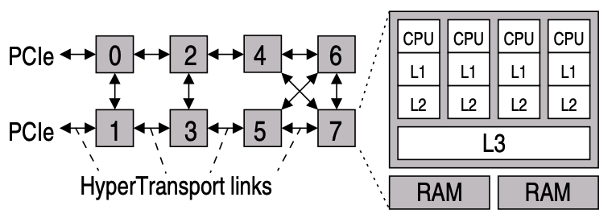

This post summarizes the key topics in this very accessible [paper](https://barrelfish.org/publications/barrelfish_hotos09.pdf) published in 2009.

> We argue that a new OS for a multicore machine should be designed ground-up as a distributed system, using concepts from that field. 
> Modern hardware resembles a networked system even more than past large multi-processors: in addition to familiar latency effects, it exhibits node heterogeneity and dynamic membership changes.  

## Observation
1. A modern computer is a networked system of point-to-point links exchanging messages.
   > A single machine today consists of a **dynamically** changing collection of **heterogeneous** processing elements, communicating via channels (whether messages or shared-memory) with diverse **latencies**.

   
   <small>Figure 1: Node layout of a commodity 32-core machine</small>
1. Distributed systems are historically distinguished from centralized ones by three additional challenges:
    * **Node heterogeneity**:
        * Centralized computer systems traditionally assume that all the processors which share memory have the same architecture and performance trade- offs.
        * This assumption is barely true with modern commodity computers.
        * Non-coherent compromises are used to address the fact that mainstream operating systems cannot easily represent different processing architectures within the same kernel.
    * **Node Dynamicity**: Nodes (CPU, memory, etc) come and go due to partial failures and other reconfigurations — however, the hardware of a computer from the OS perspective is not viewed in this manner.
    * **Communication Latency**: The problem of latency in [cache-coherent](https://en.wikipedia.org/wiki/Cache_coherence) [NUMA](https://en.wikipedia.org/wiki/Non-uniform_memory_access) machines is well-known.

        | Access | Cycles | Normalized to L1 | Per-hop cost |
        |--------|--------|------------------|--------------|
        L1 cache | 2 | 1 | - |
       L2 cache | 15 | 7.5 | - |
       L3 cache | 7 |5 37.5 | - |
       Other L1/L2 | 130 | 65 | - |
       1-hop cache | 190 | 95 | 60 |
       2-hop cache | 260 | 130 | 70 |
       
       <small>Table 1: Latency of cache access for the PC in Figure 1.</small>

## Implications
### Message passing vs. shared memory
1. Traversing a shared data structure in a modern cache-coherent system is equivalent to a series of synchronous RPCs to fetch remote cache lines.
2. Pros of message passing:
    * Facilitates interoperation between heterogeneous processors.
    * Amenable to both informal and formal analysis.
    *  In an OS, a message-passing primitive can make more efficient use of the interconnect and reduce latency over sharing data structures between cores.

### Replication
1. Replication of data is used in distributed systems to **increase throughput** for read-mostly workloads and to **increase availability**.
2. Processor caches and [TLBs](https://en.wikipedia.org/wiki/Translation_lookaside_buffer) replicate data in hardware for performance.
3. Replication in current OSes is treated as an optimization of the shared data model. The authors suggest that it is useful to instead see replication as the default model:
   > The principal impact on clients is that they now invoke an agreement protocol (propose a change to system state, and later receive agreement or failure notification) rather than modifying data under a lock or transaction.  
### Consistency
1. Maintaining the consistency of replicas in current operating systems is simple: Typically an initiator synchronously contacts all cores, often via a global [IPI](https://en.wikipedia.org/wiki/Inter-processor_interrupt), and waits for a confirmation.
2. The authors argue that OS designers are missing out from the vast design space of agreement and consensus protocols.
### Network effects
1. Routing, congestion, and queueing effects within a computer are already an issue.
   > Closer to the level of system software, routing problems emerge when considering where to place buffers in memory as data flows through processors, [DMA](https://en.wikipedia.org/wiki/Direct_memory_access) controllers, memory, and peripherals. 
   > For example, data that arrives at a machine and is immediately forwarded back over the network should be placed in buffers close to the [NIC](https://en.wikipedia.org/wiki/Network_interface_controller), whereas data that will be read in its entirety should be DMAed to memory local to the computing core.  

### Heterogeneity
1. Heterogeneity (and interoperability) have been tackled in distributed systems:
    * At the data level using standardized messaging protocols.
    * At the interface level using logical descriptions of distributed services that software can reason about.

## The multikernel architecture
1. In this section, the authors sketch out an example multi-kernel architecture for an operating system built from the ground up as a distributed system, targeting modern multicore processors, intelligent peripherals, and heterogeneous multiprocessors, and incorporating the **ideas above**.

<small>Figure 2: The multikernel architecture</small>

## Open questions
1. The authors do not advocate blindly importing distributed systems ideas into OS design.

### What are the appropriate algorithms, and how do they scale?
1. Intuitively, distributed algorithms based on messages should scale just as well as cache-coherent shared memory, since at some level the latter is based on the former.

### Where does the analogy break?
1. There are important differences limiting the degree to which distributed algorithms can be applied to OS design.
2. Many arise from the hardware-based message transport, such as fixed transfer sizes, no ability to do in-network aggregation, static routing, and the need to poll for incoming messages.
3. Others (reliable messaging, broadcast, simpler failure models) may allow novel optimizations.

### Why stop at the edge of the box?
1. Viewing a machine as a distributed system makes the boundary between physical machines (traditionally the network interface) less clear-cut, and more a question of degree (overhead, latency, bandwidth, reliability).

## My thoughts
1. It provides a unique way to look at single machines.
2. I was hoping to see a section on complexity: While I found the ideas interesting, I couldn’t help but wonder how this could make current software more complicated. The surface simplicity might be worth the internal cost/compromises?