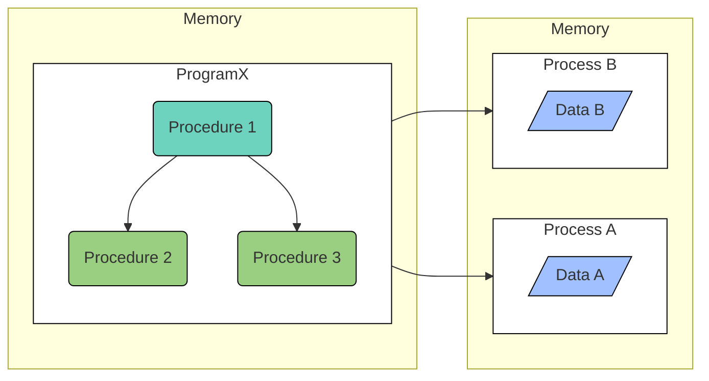
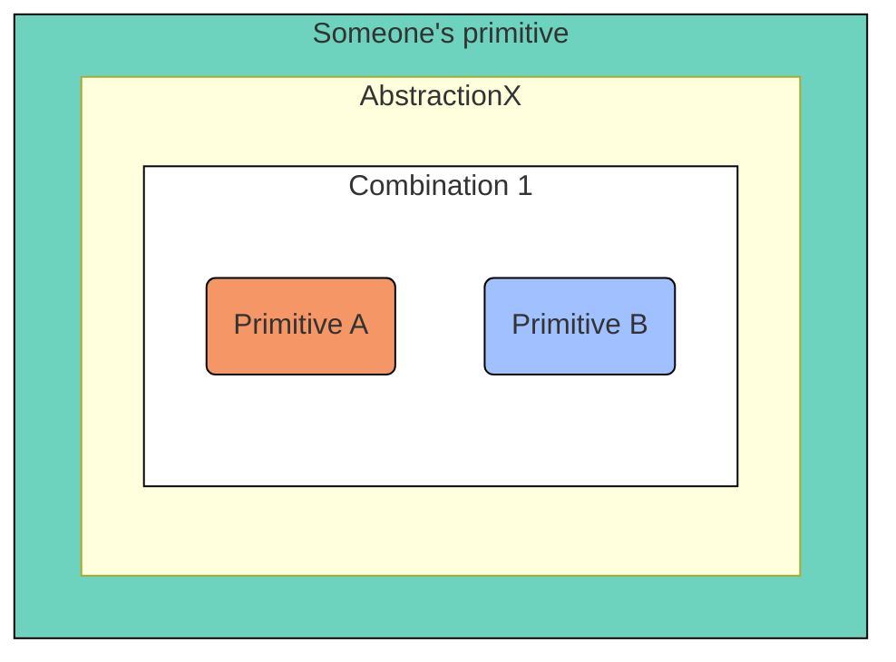

This is my summary and notes from [Structure and Interpretation of Computer Programs](https://www.amazon.com/Structure-Interpretation-Computer-Programs-Engineering/dp/0262510871) by Harold Abelson & Gerald Jay Sussman . Please use the link if you decide to buy the book after reading this as it contains my affiliate code. Thanks.

> SICP uses [Scheme](https://en.wikipedia.org/wiki/Scheme_(programming_language)) (a dialect of Lisp).

1. Every computer program is a model, hatched in the mind, of a real or mental process. These processes arise from human experience or thought and are only partially understood at any time — leading to the constant evolution of programs.

2. Avoid complexities of control and concentrate on organizing the data to reflect the real structure of the world being modeled.

3. > It is better to have 100 functions operate on one data structure than to have 10 functions operate on 10 data structures.

   — Alan J. Perlis

4. Computer science (CS) isn’t about computers (that’s electrical engineering) and it isn’t primarily a science (things are invented more than they are discovered).

5. CS is partly a form of engineering (concerned with building reliable, efficient mechanisms, but in software instead of metal) and partly an art form (using programming as a medium for creative expression).

## Chapter 1: Building Abstractions with Procedures

> The acts of the mind, wherein it exerts its power over simple ideas, are chiefly these three:
> 1. Combining several simple ideas into one compound one, and thus all complex ideas are made.
> 2. Bringing two ideas, whether simple or complex, together, and setting them by one another so as to take a view of them at once, without uniting them into one, by which it gets all its ideas of relations.
> 3. The third is separating them from all other ideas that accompany them in their real existence: this is called abstraction, and thus all its general ideas are made.
> — [John Locke, An Essay Concerning Human Understanding (1690)](https://en.wikipedia.org/wiki/An_Essay_Concerning_Human_Understanding)

1. **Declarative knowledge** talks about what is true. It makes statements of fact that can be used to reason about things.
   > **√x = y**<br/>
   > such that:<br/>
   > y² = x and y >= 0
2. **Imperative knowledge** talks about "how to" knowledge.
   > **To find the √x:**
   > 1. Make a guess G
   > 2. Is G² close enough to x?
   > 3. If no, average G and x / G
   > 4. If yes, done.
3. A **procedure** is a description of a series of specific, mechanical steps to be followed in order to deduce a particular value associated with some problem, using a predefined set of operations.
4. A **process** is the actual sequence of steps within the computer that cause the "how to" knowledge to evolve. By evaluating an expression that applies the procedure to some values, the "how to" knowledge is used to find the value associated with a particular instantiation of the problem by transforming one set of facts into a new set.
5. **Procedures** (dormant description) are a pattern of rules written in a programming language that directs a **process** (active).
6. Computational processes manipulate data as they evolve, as defined in a procedure.
7. Well designed computational systems have a modular design — allowing individual parts to be constructed, replaced or debugged separately.
8. The constraints imposed in building large software systems are the limitations of the human mind; opposed to the physical systems' constraints in other kinds of engineering.



### 1.1 The Elements of Programming
1. Two kinds of elements in programming:
   - **Data**: Stuff to be manipulated (dormant).
   - **Procedures**: Description of the rules for manipulating data.
   > Lisp treats procedures as data
2. Besides instructing the computer to perform tasks, powerful programming languages also serve as a framework to organize ideas about processes.
3. Every powerful language has 3 mechanisms for building complex ideas from simple ones:
   - **Primitive expressions**: represents the simplest elements the language is concerned with. Eg:
     - Primitive procedures
     - Primitive data (Numbers, etc)
   - **Means of combination**: by which compound elements are built from primitives. Eg:
     - Combinations
     - Construction of compound data
   - **Means of abstraction**: by which compound elements can be named and treated as primitives. Eg:
     - Definitions
     - Data abstraction
4. Abstraction lets us talk more nearly in a problem’s own terms and less in terms of the computer’s mechanisms or capabilities.
5. The idea of isolating the use of a procedure from its actual implementation is used to control complexity of large systems.
6. > The key to understanding complicated things is to know what not to look at, what not compute, and what not to think.



#### Features of a programming language

1. **Vocabulary**: a set of words that are used to build procedures. These will be the basic elements of computation, the fundamental representations of information and the fundamental procedures that we use to describe all other procedures.

2. **Syntax**: a set of rules for legally connecting elements together — i.e, how to build more complex parts of a procedure out of more basic ones.

3. **Semantics**: a set of rules for deducing the meaning associated with (simple/compound) elements.

#### 1.1.1 Expressions

1. **Self-evaluating expressions** are the simplest class of primitives — their value is the object or expression itself. Examples are numbers, strings, and boolean.

2. **Combinations** are compound expressions that applies input expressions to an expression representing a procedure (eg: `+` or `*`)

   ```scheme
   (+ 137 349) ; Combinations are formed by delimiting a list of expressions within parentheses in order to denote procedure application
   ```

3. Combinations can be nested — an operator or operand can itself be another combination.
   
   ```scheme
   (define (a-plus-abs-b a b)
      ((if (> b 0) + -)
         a
         b
      ))
   ```

4. The convention of placing the operator to the left of the operands is known as **prefix notation**.

5. Prefix notation accomodates procedures that take arbitrary number of arguments.

   ```scheme
   (+ 21 35 12 7)

   (+ 25 4)
   ```

   No ambiguity can arise, because the operator is always the leftmost element and the entire combination is delimited by the parentheses.

6. Prefix notation extends in a straightforward way to allow combinations to be nested:

   ```scheme
   (+ (* 3 5) (- 10 6))
   ```

7. The lisp interpreter runs in a **read-evaluate-print loop** (REPL).

8. In lisp, every expression has a value and every value has a type.

##### Syntax for a combination

1. An open parenthesis, 
2. An expression whose value is a procedure (**operator**),
3. A list of expressions (**operands**), and
4. A close parenthesis.

```scheme
(procedure_expression operand_expression1 operand_expression2)
```

##### Semantics of a combination

The value of a **combination** is obtained by applying the **procedure** specified by the **operator** to the **arguments** that are the values of the **operands**.

#### 1.1.2 Naming and the Environment

1. In scheme, objects are named with `define`. The names identifies a variable whose value is the object. The last sentence separates putting a value in a variable and giving it a name.

   ```scheme
   (define size 2) ; name (size) is used to refer to the computational object (2)
   ``` 

2. `define` is Scheme's simplest means of abstraction — it allows the usage of simple names to refer to the results of compound operations.

3. Complex programs are constructed by building, step by step, computational objects of increasing complexity.

4. The environment is the memory the interpreter uses to hold the association between names and objects.

#### 1.1.3 Evaluating Combinations
1. The interpreter follows a procedure to evaluate combinations:

   - Evaluate all the subexpressions of the combination (in any order).
   - Apply the procedure that is the value of the leftmost subexpression (the `operator`) to the arguments that are the values of the other subexpressions (the `operands`).
   
2. The evaluation rule is recursion — To evaluate a combination, the interpreter must first evaluate the elements of the combination, and so on.

3. Paretheses in Lisp is used for combinations. They are a way to write 2d combination trees as a linear character string.

Example:
```scheme
(* (+ 2
      (* 4 6))
   (+ 3 5 7))
```


##### Lisp evaluation rule
1. If self-evaluating, return value (base case).
2. If a name, return value associated with name in environment (base case).
3. If a special form (like `define`), use its own evaluation rule.
4. If a combination, then use the evaluation procedure described above.

> Lisp doesn't make artificial distinctions between elements that are primitive to the language and custom built elements.

##### `Define` special evaluation rule
1. Evaluate only the last sub-expression,
2. Pair the value with the name symbol in the environment.

```scheme
(define name_symbol last_expression)
```

#### 1.1.4 Compound Procedures

**Procedure definition** is a powerful abstraction technique by which a compound operation can be given a name and then referred to as a unit.

##### General form of a procedure definition

```scheme
(define (⟨name⟩ ⟨formal parameters⟩) ⟨body⟩)
```

1. The `⟨name⟩` is a symbol to be associated with the procedure definition in the environment.
2. The `⟨formal parameters⟩` are the names used within the body of the procedure to refer to the corresponding arguments of the procedure.
3. The `⟨body⟩` is an expression that will yield the value of the procedure when it's applied.
4. The `⟨name⟩` and the `⟨formal parameters⟩` are grouped within parentheses, just as they would be in an actual call to the procedure being defined.
5. The `⟨body⟩` is not evaluated when the procedure is evaluated, it's evaluated when the procedure is applied.
6. If the `⟨body⟩` contains more than one expression, each is evaluated in sequence and the value of the last one is returned.
7. Evaluating the definition creates a compound procedure and associates it with the name. The last sentence separates creating a procedure and giving it a name. Because it's possible to create a naemeless procedures or to give an existing procedure a name.

> The argument’s name comes from the function’s definition; the argument’s value comes from the invocation.

```scheme
(define elvis +) ; Even primitive procedure symnols are just names bound to a procedure value
(elvis 5 10)
```

###### Terminology
1. The **formal parameter** is the name of the argument inside the function body.
2. The **actual argument expression** is the expression used in the invocation `(procedure_name (+ 2 3))`.
3. The **actual argument value** is the value of the argument in the invocation `(procedure_name 5)`.

##### Lambda expression

```scheme
(define ⟨name⟩ (lambda (⟨formal parameters⟩) ⟨body⟩))
```

1. The general form is syntatic sugar for a lambda expression.

2. Syntatic sugar is having more convenient surface forms for typing something.

3. The lambda symbol is Lisp's way of saying "make a procedure".

4. The semantics says that the value of a lambda expression is a procedure object. It's some internal representation of the procedure that includes information about the formal parameters and the body.

Example:

```scheme
(lambda (x y) (/ (+ x y) 2))
```

#### 1.1.5 The Substitution Model for Procedure Application

1. The interpreter follows the same process when evaluating combinations with either compound or primitive procedure.

2. The **substitution model for procedure application**:
   
   > To apply a procedure to arguments, evaluate the body of the procedure with each formal parameter replaced by the corresponding argument.

3. The purpose of the substitution is to help reason about procedure application, not to provide a description of how the interpreter really works.<br/>
   Typical interpreters do not apply procedures by manipulating the text of a procedure to substitute values for the formal parameters. In practice, the “substitution” is accomplished by using a local environment for the formal parameters.

4. There are more elaborate models — the substitution model is only a way to get started thinking formally about the evaluation process.

5. In general, when modeling phenomena in science and engineering, simplified incomplete models are first used. As things are examined in greater detail, these simple models become inadequate and must be replaced by more refined models.

#### Normal Order
Fully expand and then reduce — I.e Operand expressions are substituted for parameters until an expression involving only primitive operators is obtained, only then is evaluation performed.

#### Applicative Order
Evaluate the arguments and then apply — Operand expressions are evaluated and then applied to a procedure.

Lisp uses applicative-order evaluation because:

1. Additional efficiency obtained from avoiding multiple evaluations of expressions.
2. Normal-order evaluation becomes much more complicated to deal with outside the realm of procedures that can be modeled by substitution.

> In functional programming, the same answer is obtained regardless of order of evaluation.

#### 1.1.6 Conditional Expressions and Predicates

1. Conditional expression enables **case analysis**.
2. The general form of a conditional expression is:

   ```scheme
   (cond (⟨p₁⟩ ⟨e₁⟩)
      (⟨p₂⟩ ⟨e₂⟩)
      ...
      (⟨pₙ₋₁⟩ ⟨eₙ₋₁⟩)
      (else ⟨eₙ⟩)
   )
   ```

3. It consists of the symbol `cond` followed by parenthesized pairs of expressions called **clauses**.
4. The first expression in each clause is a predicate — i.e, an expression whose value is interpreted as either true or false.
5. The second expression in each clause is called a consequent expression.

Example:

```scheme
(define (abs x)
   (cond ((> x 0) x)
         ((= x 0) 0)
         ((< x 0) (- x))))
```

##### Conditional expressions evaluation rule:

1. The predicate `⟨p₁⟩` is evaluated first.
2. If its value is false, then `⟨p₂⟩` is evaluated.
3. This process continues until a predicate is found whose value is true or the special symbol `else` is found, in which case the interpreter returns the value of the corresponding consequent expression `⟨e⟩` as the value of the conditional expression.
4. If nothing matches, the value of the conditional expression is undefined.

##### If expressions

The general form for the special form `if` (a restricted type of conditional that allows only two cases in a case analysis)  is:

```scheme
(if ⟨predicate⟩ ⟨consequent⟩ ⟨alternative⟩)
```

###### If expressions evaluation rule

1. If the `⟨predicate⟩` evaluates to a true value, the interpreter then evaluates the `⟨consequent⟩` and returns its value.
2. Otherwise it evaluates the `⟨alternative⟩` and returns its value.

##### Logical operators
1. In addition to primitive predicates such as `<`, `=`, and `>`, there are logical composition operations, which enables the construction of compound predicates:

   - `(and ⟨e₁⟩ ⟨e₂⟩ ... ⟨eₙ⟩)`
   - `(or ⟨e₁⟩ ⟨e₂⟩ ... ⟨eₙ⟩)`
   - `(not ⟨e₁⟩)`

2. Notice that `and` & `or` are special forms, not procedures, because the subexpressions are not necessarily all evaluated (because of short circuiting).
3. `not` is an ordinary procedure.

##### Exercise 1.3

Define a procedure that takes three numbers as arguments and returns the sum of the squares of the two larger numbers:

```scheme
 (define (sum-of-square-biggest x y z)
         (cond ((and (> x z) (> y z)) (sum-of-square x y))
               ((and (> y x) (> z x)) (sum-of-square y z))
               ((and (> x y) (> z y)) (sum-of-square x z))
 ))

 (define (sum-of-square x y)
    (+ (* x x) (* y y))
 )
```

#### 1.1.7 Example: Square Roots by Newton’s Method

The newton method of successive approximations can be used to calculate the square root.

> **To find the √x:**
> 1. Make a guess `y`
> 2. Is `y²` close enough to `x`?
> 3. If no, improve guess by averaging `y` and `x / y`
> 4. If yes, done.

```
Example: Find √2
Initial guess: 1

Guess       Quotient              Average                 Improved guess
1           (2/1) = 2             ((2 + 1)/2)             1.5
1.5         (2/1.5) = 1.3333      ((1.3333 + 1.5)/2)      1.4167
1.4167      (2/1.4167) = 1.4118   ((1.4118 + 1.4167)/2)   1.4142
1.4142 ...
```

> One useful way of thinking about defining procedures is as a means of generalizing a common pattern of operations — i.e an abstraction. This is captured by giving a name to the part of the pattern that changes with each instantiation; identifying that name as a formal parameter; and then capturing that pattern as the body of a lambda expression.

Stages in capturing common patterns of computation
1. Identify modules or stages of process
2. Capture each module within a procedural abstraction
3. Constrcut a procedure to control the interactions between the modules
4. Repeat the process within each module as necessary

```scheme
(define (square x)
   (* x x))

(define (average x y)
   (/ (+ x y) 2))

(define (improve guess randicand)
   (average guess (/ randicand guess)))

(define tolerance 0.001)

; The idea is to improve the answer until it is close enough so that its square differs from the radicand by less than a predetermined tolerance.
(define (good-enough? guess randicand)
   (< (abs (- (square guess)
            randicand))
      tolerance))

(define (sqrt-iter guess randicand)
   (if (good-enough? guess randicand)
      guess
      (sqrt-iter (improve guess randicand) randicand)
   )
)

(define (sqrt randicand)
   (sqrt-iter 1.0 randicand))
```

> ...I think people who really believe that you design everything before you implement it basically are people who haven’t designed very many things.
>
>The real power is that you can pretend that you’ve made the decision and then later on figure out which one is right, which decision you ought to have made. And when you can do that, you have the best of both worlds.

— Abelson

> The way in which you would construct a recursive process is by wishful thinking. You have to believe.

— Sussman

#### 1.1.8 Procedures as Black-Box Abstractions

In the `good-enough?` procedure above, `square` is an abstraction of a procedure (aka **procedural abstraction**). At this level of abstraction, any procedure that computes the square is equally good.

##### Local names

1. The choice of names for the procedure’s formal parameters should not matter to the user of the procedure. The following procedures should not be distinguishable:

   ```scheme
   (define (square x) (* x x))
   (define (square y) (* y y))
   ```

2. Formal parameters are bound variables — Their names don't matter.
3. The procedure definition binds its formal parameters.
4. A bound variable is a variable that was previously free, but has been bound to a specific value or set of values called domain of discourse or universe
5. Free variable refers to variables used in a function that are neither local variables nor parameters of that function.
6. If a variable is not bound, it's free.
7. The set of expressions for which a binding defines a name is called the scope of that name.
8. Formal parameters scope is the procedure's body.
9. Whether a variable is free or bound is relative to the object in question.

> In the definition of `good-enough?` above, **guess** and **x** are bound variables but **<**, **-**, **abs**, and **square** are free.

##### Internal definitions and block structure

In the `sqrt` procedure above, the auxiliary procedures can be private and internal to it:

```scheme
(define (sqrt randicand)

   ; Notice: No need to pass randicand
   (define (good-enough? guess) ...)

   (define (improve guess) ...)

   (define (sqrt-iter guess) ...)

   (sqrt-iter 1.0)
)
```

Putting a definition in the body of a procedure makes it local to that procedure. This nesting is called block structure.

By internalizing auxiliary procedures, we can often eliminate bindings by allowing variables to remain free.

##### Lexical scoping

Scheme uses lexical scoping. Lexical scoping dictates that free variables in a procedure are taken to refer to bindings made by enclosing procedure definitions; that is, they are looked up in the environment in which the procedure was defined.

### 1.2 Procedures and the Processes They Generate

> To become experts, we must learn to visualize the processes generated by various types of procedures. Only after we have developed such a skill can we learn to reliably construct programs that exhibit the desired behavior.

A procedure is a pattern for the local evolution of a computational process. It specifies how each stage of the process is built upon the previous stage.

#### 1.2.1 Linear Recursion & Iteration — Finding the Factorial

| Feature | Linear recursive process | Linear iterative process |
|---------|-----------|-----------|
| Definition | A recursive process is characterized by a chain of deferred operations. | An iterative process is one whose state can be summarized by a fixed number of state variables, together with a fixed rule that describes how the state variables should be updated as the process moves from state to state and an (optional) end test that specifies conditions under which the process should terminate. |
| State | There is some additional “hidden” information, maintained by the interpreter and not contained in the program variables, which indicates “where the process is” in negotiating the chain of deferred operations. | The program variables provide a complete description of the state of the process at any point.<br/><br/>If the computation is stopped between steps, all that is needed to resume the conputation is to supply the interpreter with the values of the program variables. |
| Shape | The substitution model reveals a "shape" of expansion followed by contraction.<br/><br/>The expansion occurs as the process builds up a chain of deferred operations.<br/><br/>The length of the deferred operations is proportional to `n`.<br/><br/>The contraction occurs as the operations are actually performed. | The substitution model reveals a "shape" with no expansion/contraction. |
| Number of required steps | Grows linearly with `n` | Grows linearly with `n` |
| Space | Grows linearly with `n` (i.e proportional to `n`)<br/><br/>The interpreter has to keep track of the deferred operations. | Constant

Factorial function definition:

> **n!** = n * (n - 1) * (n - 2) ... 3 * 2 * 1

##### Linear Recursion

Rules to find `n!`:
1. When `n > 1`:
   > n! = n * **(n - 1)!**
2. When `n = 1`:
   > 1! = 1

The rules translate directly into a linear recursive procedure:

```scheme
(define (factorial n)
   (if (= n 1)
      1
      (* n (factorial (- n 1)))
   )
)
```

Visualizing the process of computing `6!` using the substitution model:

```scheme
(factorial 6)
(6 * (factorial 5)) ; Expansion starts (deferred chain of multiplications)
(6 * (5 * (factorial 4)))
(6 * (5 * (4 * (factorial 3))))
(6 * (5 * (4 * (3 * (factorial 2)))))
(6 * (5 * (4 * (3 * (2 * (factorial 1)))))) ; Expansion ends
(6 * (5 * (4 * (3 * (2 * 1))))) ; Contraction starts (operations are actually performed)
(6 * (5 * (4 * (3 * 2))))
(6 * (5 * (4 * 6)))
(6 * (5 * 24))
(6 * 120) ; Contraction ends
720
```

##### Linear Iteration

Rules to find `n!`:

1. ```scheme
   product = 1; Running product
   counter = 1; Range: [1, n]
   ```
2. Iterate
   ```scheme
   product = (* counter product)
   counter = (+ counter 1)
   ```

   Until
   ```scheme
   (> counter n)
   ```
4. `n!` = Final value of `product`

The rules translate directly into a linear iterative procedure:

```scheme
(define (factorial n)
   (define (factorial-iterate product counter)
      (if (> counter n)
          product
          (factorial-iterate (* counter product)
                             (+ counter 1)
          )
      )
   )

   (iterate 1 1)
)
```

Visualizing the process of computing `6!` using the substitution model:

```scheme
(factorial 6)
(factorial-iterate 1 1)
(factorial-iterate 1 2)
(factorial-iterate 2 3)
(factorial-iterate 6 4)
(factorial-iterate 24 5)
(factorial-iterate 120 6)
(factorial-iterate 720 7)
720
```

!> A **recursive procedure** refers to the syntactic fact that a procedure definition refers (either directly/indirectly) to the procedure itself.
<br/><br/>A **recursive process** refers to how the process evolves, not about the syntax of how a procedure is written.
<br/><br/>The `factorial-iterate` is a recursive procedure that generates an iterative process: Its state is captured completely by its three state variables (counter, product, n), and an interpreter need keep track of only three variables in order to execute the process.
<br/><br/>Common languages like `C` have a defect: A recursive procedure always consumes an amount of memory that grows with the number of procedure calls, even when the process described is, in principle, iterative. These languages resort to special-purpose "looping constructs" like `while`, `for`.

##### Exercise 1.9

```scheme
; Procedure#1
(define (+ a b)
   (if (= a 0)
       b 
       (inc (+ (dec a) b))
   )
)

; Procedure#2
(define (+ a b)
   (if (= a 0)
       b
       (+ (dec a)
          (inc b)
       )
   )
)

```

1. The substitution model shows that `procedure#1` generates a recursive process.
   ```scheme
   (+ 4 5)
   (inc (+ 3 5))
   (inc (inc (+ 2 5)))
   (inc (inc (inc (+ 1 5))))
   (inc (inc (inc (inc (+ 0 5)))))
   (inc (inc (inc (inc 5))))
   (inc (inc (inc 6)))
   (inc (inc 7))
   (inc 8)
   9
   ```

2. The substitution model shows that `procedure#2` generates an iterative process.
   ```scheme
   (+ 4 5)
   (+ 3 6)
   (+ 2 7)
   (+ 1 8)
   (+ 0 9)
   9
   ```

##### Exercise 1.10
```scheme
; Ackermann’s function
(define (A x y)
   (cond ((= y 0) 0)
         ((= x 0) (* 2 y))
         ((= y 1) 2)
         (else (A (- x 1) (A x (- y 1))))
   )
)

(define (f n) (A 0 n))

(define (g n) (A 1 n))

(define (h n) (A 2 n))

(define (k n) (* 5 n n))
```

1. What are the values of the following expressions?
   - `(A 1 10)` = 1024
   - `(A 2 4)` = (A 1 16) = 65536
   - `(A 3 3)` = (A 2 4) = 65536

2. Give concise mathematical definitions for the functions computed by the procedures `f`, `g`, and `h` for positive integer values of `n`.
   - `(f n)` computes <b>2n</b>, because `(A 0 n)` => `(* 2 n)`.
   - `(g n)` computes <b>2<sup>n</sup></b>, because `(A 1 n)` => `(A 0 (A 1 (- n 1)))` => `(f (g (- n 1)))`.
   -  `(h n)` computes <b><sup>n</sup>2</b> ([tetration](https://en.wikipedia.org/wiki/Tetration)), because `(A 2 n)` => `(A 1 (A 2 (- n 1)))` => `(g (h (- n 1)))`.
   -  `(k n)` computes `5n^2`, as stated in the exercise.

#### 1.2.2 Tree Recursion — Finding Fibonacci Numbers

With tree recursion, the procedure invokes itself more than once, causing the process to evolve in the shape of a tree.

Fibonacci numbers can be defined by the rule:


> E.g: 0, 1, 1, 2, 3, 5, 8, 13, 21, ...

Expressed as a recursive procedure for computing Fibonacci numbers:

```scheme
(define (fib n)
   (cond
      ((= n 0) 0)
      ((= n 1) 1)
      (else (+ (fib (- n 1)) (fib (- n 2))))
   )
)
```

The diagram below shows the tree-recursive process generated in computing `(fib 5)`. Notice that the branches split into two at each level (except at the bottom); this reflects the fact that the `fib` procedure calls itself twice each time it is invoked.


1. The number of times the procedure will compute `(fib 1)` or `(fib 0)` (the number of leaves in the above tree, in general) is precisely `Fib(n + 1)`.
2. The process uses a number of steps that grows exponentially with the input.
3. The space required grows linearly with the input, because we need keep track only of which nodes are above us in the tree at any point in the computation.
4. In general, the **number of steps** required by a tree-recursive process will be proportional to the **number of nodes** in the tree, while the **space** required will be proportional to the **maximum depth** of the tree.
5. Tree recursion is a natural and powerful tool when considering processes that operate on hierarchically structured data rather than numbers. The interpreter itself evaluates expressions using a tree-recursive process.

##### Linear Iteration — Finding Fibonacci Numbers

The idea is to use a pair of integers `a` and `b`, initialized to `Fib(1) = 1` and `Fib(0) = 0`, and to repeatedly apply the simultaneous transformations:

> a ← a + b,<br/>
> b ← a.

After applying this transformation `n` times, `a`
and `b` will be equal, respectively, to `Fib(n + 1`) and `Fib(n)`.

```scheme
(define (fib n)
   (fib-iter 1 0 n)
)

(define (fib-iter a b count)
   (if (= count 0)
       b
       (fib-iter (+ a b) a (- count 1))
   )
)
```

Tree-recursive processes can be useful in helping us to understand and design programs. For instance, although the first `fib` procedure is much less efficient than the second one, it's more straightforward, being little more than a translation into Lisp of the definition of the Fibonacci sequence.

#### 1.2.3 Orders of Growth

processes can differ considerably
in the rates at which they consume computational resources. One convenient
way to describe this difference is to use the notion of order of
growth to obtain a gross measure of the resources required by a process
as the inputs become larger.

Let n be a parameter that measures the size of the problem, and let
R(n) be the amount of resources the process requires for a problem of
size n.

In our previous examples we took n to be the number for which
a given function is to be computed, but there are other possibilities. For
instance, if our goal is to compute an approximation to the square root of
a number, we might take n to be the number of digits accuracy required.
For matrix multiplication we might take n to be the number of rows in
the matrices. In general there are a number of properties of the problem
with respect to which it will be desirable to analyze a given process.

Similarly, `R(n)` might measure the number of internal storage registers
used, the number of elementary machine operations performed, and so
on. In computers that do only a fixed number of operations at a time, the
time required will be proportional to the number of elementary machine
operations performed.

We say that `R(n)` has order of growth `(f(n))`, written `R(n) = Θ(f(n))`
(pronounced “theta of `f(n)`”), if there are positive constants **k1** and **k2**
independent of **n** such that `k1 * f(n) ≤ R(n) ≤ k2 * f(n)` for any sufficiently
large value of **n**. (In other words, for large **n**, the value **R(n)** is sandwiched
between `[k1 * f(n)]` and `[k2 * f(n)]`.)

For instance, with the linear recursive process for computing factorial
described in Section 1.2.1 the number of steps grows proportionally
to the input **n**. Thus, the steps required for this process grows as **Θ(n)**.
We also saw that the space required grows as **Θ(n)**. For the iterative
factorial, the number of steps is still **Θ(n)** but the space is **Θ(1)**.

The tree-recursive Fibonacci computation requires **Θ(ϕn)** steps and space **Θ(n)**, where **ϕ** is the golden ratio.

Orders of growth provide only a crude description of the behavior
of a process. For example, a process requiring **n²** steps and a process
requiring **1000n²** steps and a process requiring **3n² + 10n + 17** steps all
have**Θ(n²)** order of growth.

On the other hand, order of growth provides
a useful indication of how we may expect the behavior of the process to
change as we change the size of the problem. For a Θ(n) (linear) process,
doubling the size will roughly double the amount of resources used. For
an exponential process, each increment in problem size will multiply the
resource utilization by a constant factor. In the remainder of Section 1.2
we will examine two algorithms whose order of growth is logarithmic,
so that doubling the problem size increases the resource requirement
by a constant amount.

#### 1.2.4 Exponentiation

1. A procedure that takes as arguments a base `b` and a positive integer exponent `n` and computes `b^n`.
2. Recursively:
   > b<sup>n</sup> = b * b<sup>n - 1</sup>,<br/>
   > b<sup>0</sup> = 1

   Which translates into the procedure below (that generates a linear recursive process)

   ```scheme
   (define (expt b n)
      (if (= n 0)
          1
          (* b (expt b (- n 1)))
      )
   )
   ```

3. Iteratively:
   ```scheme
   (define product 1)
   (define counter n) ; n is the exponent
   ```
   
   Then, iterate:
   ```scheme
   (define product (* b product)) ; b is the base
   (define counter (- counter 1))
   ```
   
   Until:
   ```scheme
   (= counter 0)
   ```

   Which translates into the procedure below (that generates a linear iterative process)

   ```scheme
   (define (expt b n)
      (expt-iter b n 1)
   )

   (define (expt-iter b counter product)
      (if (= counter 0)
         product
         (expt-iter  b
                     (- counter 1)
                     (* b product)
         )
      )
   )
   ```

4. Successive squaring can be used to reduce the number of steps.
   
   Example: `b^8`
   
   Instead of:
   > b * (b * (b * (b * (b * (b * (b * b))))))

   It can be computed using three multiplications

   > b<sup>8</sup> = b<sup>4</sup> * b<sup>4</sup> = ((b<sup>2</sup>)<sup>2</sup>)<sup>2</sup><br/>
   > b<sup>2</sup> = b * b<br/>

5. Successive squaring can be generalized to work with odd powers too

   > b<sup>n</sup> = (b<sup>n/2</sup>)<sup>2</sup> if n is even;<br/>
   > b<sup>n</sup> = b * b<sup>n-1</sup> if n is odd.

   Expressed as a procedure:
   ```scheme
   (define (even? n)
      (= (remainder n 2) 0)
   )

   (define (fast-expt b n)
      (cond ((= n 0) 1)
            ((even? n) (square (fast-expt b (/ n 2))))
            (else (* b (fast-expt b (- n 1)))))
   )
   ```

6. The process evolved by `fast-expt` grows logarithmically with `n` in both space and number of steps.<br/>
   - To see this, observe that computing <b>b<sup>2n</sup></b> using `fast-expt` requires only one more multiplication than computing <b>b<sup>n</sup></b>.
   - The size of the exponent we can compute therefore doubles (approximately) with every new multiplication that are allowed.
   - Thus, the number of multiplications required for an exponent of `n` grows about as fast as the logarithm of `n` to the `base 2`.
   - The process has `O(log n)` growth.

7. The difference between `O(log n)` growth and `O(n)` growth becomes striking as `n` becomes large. For example, `fast-expt` for `n = 1000` requires only **14** multiplications.

##### Exercise 1.16
Design a procedure that evolves an iterative exponentiation process that uses successive squaring and uses a logarithmic number of steps, as does `fast-expt`.

(Hint: Using the observation that <code>(b<sup>n/2</sup>)<sup>2</sup></code> = <code>(b<sup>2</sup>)<sup>n/2</sup></code>, keep, along with the exponent `n` and the base `b`, an additional state variable `a`, and define the state transformation in such a way that the product <code>ab<sup>n</sup></code> is unchanged from state to state. At the beginning of the process `a` is taken to be **1**, and the answer is given by the value of `a` at the end of the process. In general, the technique of defining an **invariant quantity** that remains unchanged from state to state is a powerful way to think about the design of iterative algorithms.)

> <code>b<sup>n</sup></code> = <code>(b<sup>2</sup>)<sup>n/2</sup></code> (Using exponent product rule)<br/>
> <code>b<sup>n</sup></code> = <code>b<sup>1</sup> * b<sup>n-1</sup></code> (Using exponent product rule)

> <code>b<sup>n</sup></code> can be expressed as: <code>ab<sup>n</sup></code><br/>
> Where `a = 1` initially.

> When `n` is even:<br/>
> <code>ab<sup>n</sup></code> = <code>a(b<sup>2</sup>)<sup>n/2</sup></code> = <code>a<sup>'</sup>(b<sup>'</sup>)<sup>n'</sup></code><br/>
> <code>a<sup>'</sup></code> = `a`<br/>
> <code>b<sup>'</sup></code> = <code>b<sup>2</sup></code><br/>
> <code>n<sup>'</sup></code> = `n/2`

> When `n` is odd:<br/>
> <code>ab<sup>n</sup></code> = <code>abb<sup>n-1</sup></code> = <code>(ab)b<sup>n-1</sup></code> = <code>a<sup>'</sup>(b<sup>'</sup>)<sup>n'</sup></code><br/>
> <code>a<sup>'</sup></code> = `ab`<br/>
> <code>b<sup>'</sup></code> = `b`<br/>
> <code>n<sup>'</sup></code> = `n - 1`

```scheme
(define (even? n)
   (= (remainder n 2) 0)
)

(define (expt b n)
   (define (expt-iter a b n)
      (cond
         ((= n 0) a)
         ((even? n) (expt-iter a (* b b) (/n 2)))
         (else (expt-iter (* a b) b (- n 1)))
      )
   )
   (expt-iter 1 b n)
)
```

##### Exercise 1.17 — Recursive [Russian peasant method of multiplication](https://en.wikipedia.org/wiki/Ancient_Egyptian_multiplication)
Recursive, successive doubling: `Θ(logn)` time, `Θ(logn)` space.

> Case: When `a` is 1:
> `a * b` = `b`

> Case: When `a` is odd:<br/>
> `a * b` = `[(a - 1) * b] + b`

> Case: When `a` is even:<br/>
> `a * b` = `[(a / 2) * b] * 2`

```scheme
(define (* a b)
   (cond
      ((= a 1) b)
      ((even? a) (double (* (half a) b)))
      (else (+ b (* (- a 1) b)))
   )
)

(define (even? n)
   (= (remainder n 2) 0)
)

(define (double n)
   (+ n n)
)

(define (half n)
   (/ n 2)
)
```

##### Exercise 1.18 — Iterative [Russian peasant method of multiplication](https://en.wikipedia.org/wiki/Ancient_Egyptian_multiplication)

> `a * b` can be expressed as: `m + a * b`<br/>
> Where `m = 0` initially.

> When `a` is even:<br/>
> `a * b` = `m + b/2 * a/2 * b` = `m' + a' + b'`<br/>
> `m'` = `m + b/2`<br/>
> `a'` = `a/2`<br/>
> `b'` = `b`

> When `a` is odd:<br/>
> `a * b` = `m + b * (a-1) * b` = `m' + a' + b'`<br/>
> `m'` = `m + b`<br/>
> `a'` = `a-1`<br/>
> `b'` = `b`<br/>

When `a` is one, the answer is equal to `m`.

Iterative, successive doubling: Θ(logn) time, Θ(1) space.
```scheme
(define (* a b)
   (define (*-iter m new-a)
      (cond
         ((= new-a 1) m)
         ((even? new-a) (*-iter (+ m (double b)) (half new-a)))
         (else (*-iter (+ m b) (- new-a 1)))
      )
   )
   (*-iter 0 a)
)

(define (even? n)
   (= (remainder n 2) 0)
)

(define (double n)
   (+ n n)
)

(define (half n)
   (/ n 2)
)
```

##### Exercise 1.19

TODO()

#### 1.2.5 Greatest Common Divisors

1. The greatest common divisor (GCD) of two integers `b` and `c` is the largest integer that divides both `b` and `c` with no remainder.

   > Eg: GCD(16, 28) = 4

##### Naive algorithm for GCD

Factor the two integer arguments and search for common factors.

##### Euclidean algorithm for GCD

If `r` is the remainder when `b` is divided by `c`, then the common divisors of `b` and `c` are precisely the same as the common divisors of `c` and `r`.
   
> GCD(b, c) = GCD(c, r)

This is used to successively reduce the problem of computing a GCD to the problem of computing the GCD of smaller and smaller pairs of integers. Eg:

```scheme
; GCD(206, 40) =
(gcd 206 40)
(gcd 40 6)
(gcd 6 4)
(gcd 4 2)
(gcd 2 0)
2
```

This always reduces to a pair where the second number is zero, and the other number is the GCD of the original pair.

Expressed as a procedure:

```scheme
(define (gcd a b)
   (if (= b 0)
      a
      (gcd b (remainder a b))
   )
)
```

This generates an iterative process, whose number of steps grows as the logarithm of the numbers involved.

#### 1.2.6 Example: Testing for Primality

##### Searching for divisors

> If `d` is a divisor of `n`, then so is `n/d`. But `d` & `n/d` cannot both be greater than `sqrt(n)`.
> 
The end test for `find-divisor` is based on the fact that if `n` is not prime it must have a divisor less than or equal to `sqrt(n)`.

```scheme
; n is prime IFF n is its own smallest divisor.
(define (prime? n)
   (= n (smallest-divisor n))
)

; finds the smallest integral divisor (greater than 1) of a given number n.
(define (smallest-divisor n) (find-divisor n 2))

; testing n for divisibility by successive integers [2, 3, 4 ... sqrt(n))
(define (find-divisor n test-divisor)
   (cond ((> (square test-divisor) n) n)
         ((divides? test-divisor n) test-divisor)
         (else (find-divisor n (+ test-divisor 1)))
   )
)

(define (divides? a b) (= (remainder b a) 0))
```

The number of steps required to identify `n` as prime will have order of growth `O(sqrt(n))`.

##### The Fermat test

> **Fermat’s Little Theorem:** If `n` is a prime number and `b` is any positive integer less than `n`, then `b` raised to the `n`<sup>th</sup> power is congruent to `b` modulo `n`. I.e:<br/>
> b<sup>n</sup> modulo n = b modulo n<br/><br/>
> However, if `b < n`, then `b modulo n = b`. Therefore, this simplifes to:<br/>
> b<sup>n</sup> modulo n = b

If `n` is not prime, then, in general, most of the numbers `b < n` will not satisfy the above relation. This leads to the following algorithm for testing primality:

> **Fermat test:**
> 1. Given a number `n`, pick a random number `b` such that `b < n`.
> 2. Compute `b`<sup>n</sup> modulo `n`.
> 3. If the result is not equal to `b`, then `n` is certainly not prime.
> 4. If it is `b`, then chances are good that `n` is prime.
> 5. Repeat test using another random number to improve confidence that `n` is prime.

```scheme
; runs fermat-test multiple times as specified by the times parameter
(define (fast-prime? n times)
   (cond ((= times 0) true)
         ((fermat-test n) (fast-prime? n (- times 1)))
         (else false)
   )
)

(define (fermat-test n)
   (define (try-it a)
      (= (expmod a n n) a))
   
   ; Random range: [0, arg)
   (try-it (+ 1 (random (- n 1))))
)

; computes the exponential of a number modulo another number
(define (expmod base exp m)
   ; uses successive squaring — like the fast-expt procedure
   (cond ((= exp 0) 1)
         ((even? exp)
            (remainder
               (square (expmod base (/ exp 2) m))
               m
            )
         )
         (else
            (remainder
               (* base (expmod base (- exp 1) m))
               m
            )
         )
   )
)
```

e reduction steps in the cases where the exponent e is greater than 1 are based
on the fact that, for any integers x, y, and m, we can find the remainder of x times y
modulo m by computing separately the remainders of x modulo m and y modulo m,
multiplying these, and then taking the remainder of the result modulom. For instance,
in the case where e is even, we compute the remainder of be=2 modulo m, square this,
and take the remainder modulo m. is technique is useful because it means we can
perform our computation without ever having to deal with numbers much larger than
m.

###### Probabilistic methods

if n ever
fails the Fermat test, we can be certain that n is not prime. But the fact
that n passes the test, while an extremely strong indication, is still not
a guarantee that n is prime. What we would like to say is that for any
number n, if we perform the test enough times and find that n always
passes the test, then the probability of error in our primality test can be
made as small as we like.

Unfortunately, this assertion is not quite correct. ere do exist numbers
that fool the Fermat test: numbers n that are not prime and yet have
the property that an is congruent to a modulo n for all integers a < n.
Such numbers are extremely rare, so the Fermat test is quite reliable in
practice.

Numbers that fool the Fermat test are called Carmichael numbers, and lile is
known about them other than that they are extremely rare. ere are 255 Carmichael
numbers below 100,000,000. e smallest few are 561, 1105, 1729, 2465, 2821, and 6601.
In testing primality of very large numbers chosen at random, the chance of stumbling
upon a value that fools the Fermat test is less than the chance that cosmic radiation will
cause the computer to make an error in carrying out a “correct” algorithm. Considering
an algorithm to be inadequate for the first reason but not for the second illustrates the
difference between mathematics and engineering.