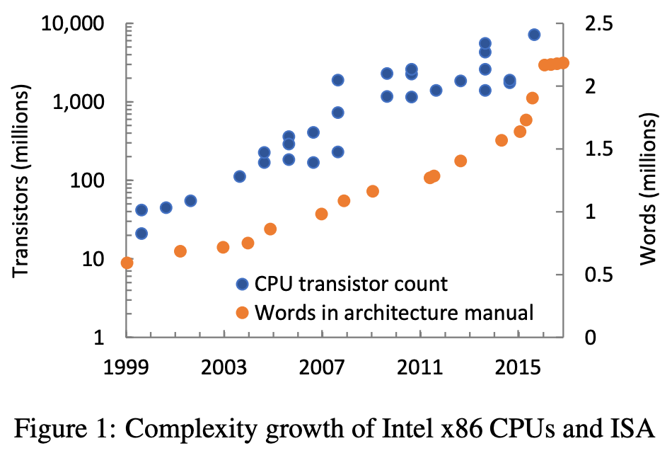

Today's summary is about a [paper](https://www.microsoft.com/en-us/research/wp-content/uploads/2017/05/baumann-hotos17.pdf) written by Andrew Baumann (Microsoft Research) in 2017.

-----

1. Moore’s Law may be slowing, but, perhaps as a result, other measures of processor complexity are (rapidly) acceler­ating.
2. The paper examines the causes of this rapid growth, and speculate about the underlying trends driving it.
3. While the paper focuses on Intel x86 architecture and its recent extensions, the author doubt these trends are unique to Intel.
4. The paper espouses that these extensions are now approaching software-like levels of complexity, yet carry all the attendant drawbacks of a hardware implementation and the slow deployment cycle that implies.
5. An [instruction set architecture (ISA)](https://en.wikipedia.org/wiki/Instruction_set_architecture) is the key interface between the lowest-levels of software and the CPU.
6. The [x86 ISA](https://en.wikipedia.org/wiki/X86_instruction_listings) is a complex but enduring set of semantics for in­structions, registers, memory, and core devices that must be respected by CPUs, emulators and virtual machines, and all the software that runs on top.
7. Like any successful product, successful ISAs grow over time.
8. While new instructions add CPU implementation com­plexity, past system designers could, for the most part, ignore such changes because they didn’t substan­tially change systems interfaces or add too many instructions at a time.
9. Whereas past extensions largely focused on performance improvements through new data-processing instructions; Recent extensions introduce new system-level functionality, often change the semantics of existing instructions, and exhibit complex interactions with other extensions and prior ar­chitectural features.
10. Such past extensions include:
    * Vector extensions (MMX, SSE, and AVX) 
    * 64-bit mode and virtualisation extensions
8. 
9. The figure above plots the transistor count of Intel x86 CPU implementations (on a log scale), as well as the number of words in the Intel architecture software developer’s manual (on a linear scale).
10. The two data sets are not comparable, but some trends are evident:
    * Moore’s Law
    * The steady growth, and recent 2015–2016 jump in the general complexity of x86. The jump is due to extensions introduced with the “Sky­lake” microarchitecture, and dwarfs even 64-bit mode and virtual-machine extensions (both added in 2007).
11. It’s likely that the explosion in extensions is a deliberate strategy:
    > The slowing pace of Moore’s Law will make it harder to sell CPUs: absent improvements in microarchitecture, they won’t be substantially faster, nor substantially more power efficient, and they will have about the same num­ber of cores at the same price point as prior CPUs. Why would anyone buy a new CPU? One reason to which In­tel appears to be turning is features: if the new CPU im­plements an important ISA extension—say, one required by software because it is essential to security—consumers will have a strong reason to upgrade.

### Case study: SGX
1. The new instructions introduced by [software guard exten­sions](https://en.wikipedia.org/wiki/Software_Guard_Extensions) enable strong isolation and remote attestation of software enclaves.
2. An enclave is an isolated region of virtual address space, whose contents are protected from access by code outside the enclave.
3. However, SGX introduces substantial complexity: 26 instructions described by nearly 200 pages of En­glish/pseudocode specification.
4. The paper goes on to describe the complexity introduced by SGX because of how some features are implemented and the decision to be compatible with existing OSes.

### Case study: CET
1. [Control-flow enforcement technology](https://en.wikipedia.org/wiki/Control-flow_integrity) defends against code-reuse attacks such as [return-oriented programming (ROP)](https://en.wikipedia.org/wiki/Return-oriented_programming).
2. These attacks exploit vulnerabilities in unsafe code like buffer overflows, but rather than directly inject­ing executable code, manipulate the program’s control-­flow to execute legitimate instructions in an unintended context.
3. CET consists of two mechanisms: a shadow stack, and indirect branch tracking:
    > At its core, a shadow stack is a straightforward mecha­nism: on a function call, the processor saves the return ad­dress on both the regular and shadow stacks. The shadow stack stores only return addresses, and is inaccessible to normal code.
    > 
    > On a return, the addresses from both stacks are popped and compared, and an exception raised if they differ, defeating ROP.
    > 
    > The advantage of CET compared to software implementations of shadow stacks is perfor­mance, compatibility and security: by modifying the se­mantics of CALL and RET instructions, no program mod-ifications are needed, and the shadow stack can be made easily and cheaply inaccessible to software through the use of a new page table attribute which protects shadow stacks from access by regular loads and stores.

    > CET also includes indirect branch tracking to prevent misdirection of function pointers: after an indirect JMP or CALL, an exception is raised unless the next instruction is a valid programmer-intended branch target, as signified by a new form of NOP instruction. While this is not full control-flow integrity [1], it restricts the available gadgets.
4. Similarly, the paper describes how CET adds complexity because of the way it interacts/modifies existing instructions/features.

### Implications
1. **Sustainability**: Given the rate of change + complexity, criticality of the x86 ISA, and particularly given the complex interactions between recent features, the paper questions whether the core x86 promise of indefinite backwards compatibility across many implementations is sustainable.
2. **Timescales**: Since they depend on deploying new CPUs, ISA features are slow to be adopted. Example: The original SGX specification was published in 2013, but the first CPUs to implement it didn’t ship until late 2015, and at the time of writing [the paper] (early 2017) server-class CPUs with SGX support are yet to appear.
3. **Hardware is the new software**: From a careful reading of Intel patents, some researchers conclude that SGX instructions are implemented entirely in microcode. This is logical from an engineering per­spective:
    * EPCM updates are off the critical path
    * Too complex to implement in silicon
    * Allows errata to be cor­rected by updates.
    
    The paper posit an al­ternative future with the ultimate goal of decoupling new ISA features from the underlying hardware. Two strategies were proposed.
4. **Security**: A key selling point for many recent security features, SGX in particular, is that no software is trusted. Does the implementation of these features in microcode change this? We argue that microcode is more reliable than current software, but not as inherently secure as we might assume.

### Conclusion
The paper calls for a rethink of how we approach the instruc­tion set.

> It’s time to rethink the notion of an instruction set. It’s no longer the boundary between hardware and software, but rather just another translation layer in the stack.
