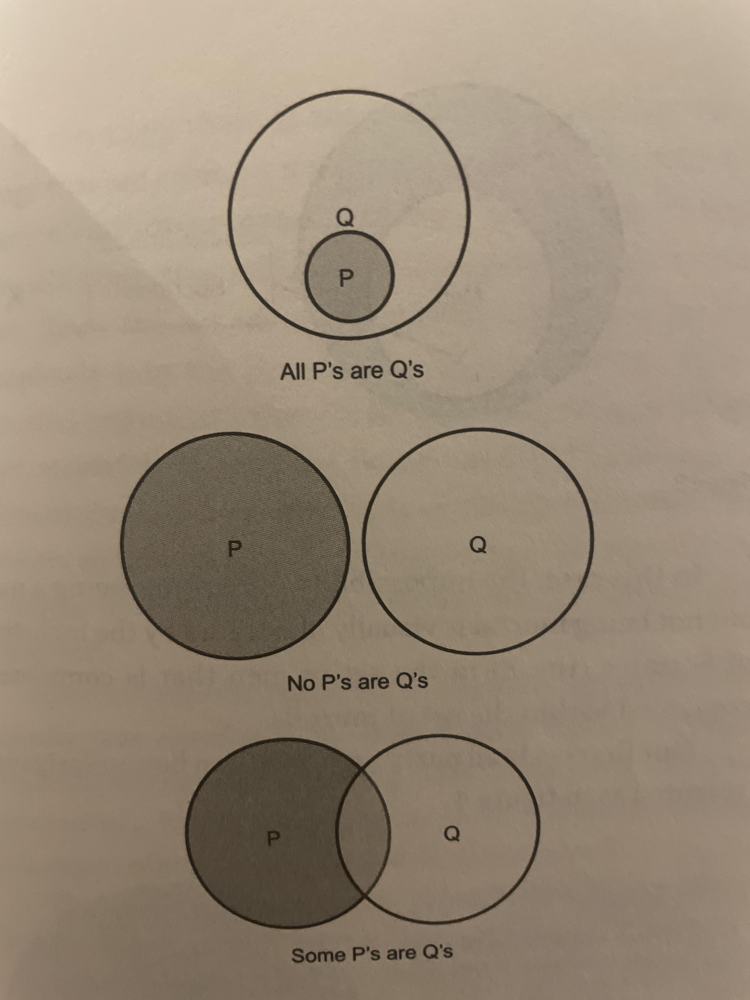

This is my notes & summary of "[Critical Thinking (The MIT Press Essential Knowledge series)](https://amzn.to/3C7RaZE)" written by Jonathan Haber.

-----

## Notes

First, on the **principle of charity**: This is unfortunately rare in most discussions. I was just reflecting on several recent examples where:
   * People (destructively) focused on the weakest link of an argument — while ignoring the crux or its strong parts.
   * People didn't factor in cultural baggage — Something as subtle as how a word was used.

All these are easy and an easy way to score points. What is hard is helping people build a strong version of their argument, then verifying our understanding of it, and finally debating.
> [...] The process of charitable translation requires you to act as if you were going to present your logical translation of another person's argument to that other person and ask them if you properly and honestly captured what they were trying to say before proceeding to debate the topic. Such a process requires empathy, the ability to enter the mind of another person to discover what they believe and why they believe it.

Lastly, I was thinking about this question while reading about **holding ideas tentatively**:

```
When was the last time you changed your mind on a deeply held idea?
```

-----

## Summary

1. Critical thinking consists of three interconnected parts:
    * **Knowledge** — Including knowledge of components of critical thinking such as logic, language, and argumentation.
    * **Skills** — The ability to put those components of critical thinking to use in real-world situations.
    * **Dispositions** — The personal characteristics needed to prioritize reasoning over other ways of learning or making decisions, the willingness and readiness to put the tools of critical thinking to use, and meta-cognition.
2. Critical thinkers must be able to look at a problem from different perspectives.
3. For most of modern history those working in scientific fields were referred to not as "**scientists**" but as "**natural philosophers**"
4. Concepts born from philosophy, such as the central role of evidence, the need for explanation (in the form of mechanisms and models), and skepticism as a means to advance knowledge helped give birth to a new form of scientific inquiry.
5. Students across the world are taught the scientific method:
> Using this technique, you pose a question, propose an answer to it (called a "**hypothesis**"), and then hold the `hypothesis as tentative` while you gather evidence to support or disprove it. Hypotheses that withstand such scrutiny become "**theories**" that, while still not declared to be forever and unquestionably true, are considered a strong enough foundation to use as a basis for further inquiry.  
6. Are we taught to hold conditional beliefs, put them to honest tests, and stand ready to reject them if they do not conform with facts and observations, regardless of the subject under consideration?
7. A critical-thinking approach requires you to not jump to an answer but to propose one, test it for reasonableness, and reach a conclusion based on the results of those tests
8. The human mind does not apply the full force of reason to every situation but instead takes shortcuts to more efficiently manage the flow of information coming from our senses and turn that information into understanding upon which decisions can be based. These shortcuts, called "**heuristics**," likely resulted from natural selection.
9. These same heuristics create **biases** that can cause reason to fail.
10.  A list of some biases:
  * **Anchoring effect**: Any number that you are asked to consider as a possible solution to an estimation problem will induce an anchoring effect.
  * **Availability heuristic**: which can bias people toward making choices based on comparisons that come easily to mind.
  * **Effect heuristic**: associates experiences with emotional states — often unrelated to the experience itself.
  * **Confirmation bias**: the human tendency to accept information that conforms with our existing beliefs and reject information that contradicts those beliefs.
11.   The presence of biases means being able to think critically requires more than just understanding mental tools such as logic and the skills developed by putting those tools to use. It also requires us to understand the prejudices our reasoning is susceptible to and train ourselves to reflect on and control for those shortcomings.
12.   **Formal logic** focuses on the structure of arguments, and many varieties of formal logic provide powerful symbolic representations of statements and ideas that have proven incredibly useful.
13.   **Informal logic** looks at both the structure of arguments and the meaning of the words within them in order to apply logical principles to everyday communication.
14.   Both formal and informal logic use a set of common terms, including:
    * **Argument**: A set of statements that provide evidence in support of a conclusion.
    * **Premises**: Statements in an argument that the arguer is asking you to accept as true and further claiming that those premises lead logically to the argument's conclusion.
    * **Conclusion**: The claim in an argument that the arguer is asking to be accepted as true if the premises are true.
    * **Inference**: Steps in logical reasoning leading from the premises to the conclusion.
    * **Logical Form**: The abstract structure of an argument, which can be expressed symbolically, separate from the words that make up the argument.
    * **Valid argument**: A deductive argument is valid if accepting the premises requires you to accept the conclusion.
    * **Soundness**: an argument is sound if
        * It’s valid and
        * The premises of the argument are true.
15.  **Deductive arguments** are "self-contained" in that everything needed to determine whether the conclusion is true can be found in the premises and the form that the argument takes. The term "valid" refers to a deductive argument that requires you to accept the conclusion as true if you accept the premises as true. Similarly, a deductive, valid argument in which the premises are actually true is said to be sound.
16.  With **inductive arguments**, accepting the premises as true can provide support that the conclusion is likely to be true, rather than must be true. In contrast to the all-or-nothing nature of deductive arguments that are valid or not, inductive arguments can be evaluated on a continuum of strength and weakness. This can be based on the probability of the conclusion being true and the acceptability, relevance, and sufficiency of an argument's premises.
17.  The fact that inductive arguments are, by definition, invalid (since you can always find a counter-example that lets you accept the premises as true, but still reject the conclusion) might make you think that deductive reasoning is superior to inductive. Yet many, if not most, of the arguments we are exposed to in everyday life, are inductive rather than deductive. For instance, debates over what to do in the future — such as changing a tax code or buying one brand of dishwasher over another — almost always include premises or a conclusion that describe something that has not yet happened, making them unprovable until after a decision resulting from the argument is made.
18.  Even science, which represents one of the most successful applications of reasoning in human history, relies primarily on inductive reasoning:
    * An argument that the sun will come up tomorrow, for instance, is based on high probability rather than certainty, given that the sun has come up every day in recorded history.
    * Similarly, when Sherlock Holmes "deduced" this or that conclusion from available evidence, he was more often than not using inductive reasoning to determine the most likely explanation for what he observed.
19.  **Aristotle's Syllogisms**: an argument made up of only three statements:
    * Two premises (the things you are asking someone to accept as true) and
    * The conclusion (the statement you are saying someone must believe is true if they accept the premises as true).
20. In a syllogism, both premises and the conclusion must be written in one of the following ways:
    * All **P**'s are **Q**'s (called an A statement).
    * No **P**'s are **Q**'s (called an E statement).
    * Some **P**'s are **Q**'s (an I statement).
    * Some **P**'s are not **Q**'s (an O statement).
21. Here is a simple example:
    * `Premise 1`: All _dogs_ are _animals_.
    * `Premise 2`: All **collies** are _dogs_.
    * `Conclusion`: Therefore, all **collies** are _animals_
22. Note that these statements are written in a specific form consisting of:
    * a major premise (the first statement) — includes the major term (in italics in the example above) which appears in one premise and serves as the predicate of the conclusion.
    * a minor premise (the second statement) — includes the minor term (in bold) which is also in one premise and appears as the subject of the conclusion. A middle term (underlined) appears in both premises but not in the conclusion.
    * The conclusion (the last statement).
23. There are **256** different combinations of A, E, I, and O statements that can be built into a three-statement syllogism written in proper form, only **24** of which produce valid arguments.
24. Two other valid logical forms that emerge frequently in logical argumentation are **modus ponens** and **modus tollens**.
25. **Modus ponens** arguments take the general form:
    * `Premise 1`: If **P**, then _Q_.
    * `Premise 2`: **P**.
    * `Conclusion`: Therefore, _Q_
26. The first premise sets up a general condition with the second premise establishing whether this condition has been met or not. Example:
    * `Premise 1`: If **Socrates** is a _man_, then **Socrates** is _mortal_.
    * `Premise 2`: **Socrates** is a _man_.
    * `Conclusion`: Therefore, **Socrates** is _mortal_.
27. **Modus tollens** arguments take the general form:
    * `Premise 1`: If **P**, then _Q_.
    * `Premise 2`: _Not_ _Q_.
    * `Conclusion`: Therefore, _Not_ **P**.
28. Example:
    * `Premise 1`: If **Erica** graduated college, she would have a _diploma_.
    * `Premise 2`: **Erica** does not have a _diploma_.
    * `Conclusion`: Therefore, **Erica** did not graduate college.
29. As with our modus ponens examples, this modus tollens argument is valid. It can be challenged, for example, by questioning whether having or not having a diploma is required to establish whether someone graduated college. But this challenge targets the truth of one of the premises (Premise 1), not the inference that connects the premises to the conclusion. If we could demonstrate that having a diploma is not required to establish college graduation, that would show that the argument, while still valid, is unsound (since one of its premises is false).
30. Aristotle called hidden premises **enthymemes** and teasing out such unstated premises is one of the most productive steps in argument analysis since the most important point of an argument is often implied but not stated directly. For example, arguments over whether abortion is a surgical procedure or murder rest on the often-unstated premise of whether a fetus is a human being.
31. If one premise in a deductive argument fails, then the entire argument, while still valid, is unsound (and thus no good).
32. Bad arguments are often "broken" or flawed in similar ways. These frequently occurring errors are called **fallacies**.
33. Fallacies stemming from structural flaws are called **formal fallacies**. Examples:
    * **Denying the antecedent** — is an invalid logical form with the following structure:
        * `Premise 1`: If **P**, then _Q_.
        * `Premise 2`: Not **P**.
        * `Conclusion`: Therefore, not _Q_.
    * **Affirming the consequent** — is based on this invalid form:
        * Premise 1: If **P**, then _Q_.
        * Premise 2: _Q_.
        * Conclusion: Therefore, **P**.
34.  **Informal fallacies** are problems that arise owing to the content rather than the structure of an argument. Examples:
    * **Composition fallacy** — mistakenly attributing characteristics of a member of a group to the entire group.
    * **Association fallacy** — commonly referred to as "guilt by association, is committed by the person who accuses her neighbor of being a vandal because her brother's wife's mailman was caught throwing a rock through a store window.
    * **False dichotomy** — "Either you pass my budget or millions will starve."
    * **Hasty generalization** — drawing a conclusion from too little information.
    * **Ad hominem** — attacking the arguer.
    * **Straw man** — presenting an oversimplified or distorted version of an opponent's argument and attacking this parody, rather than the actual argument.
35. Our toolkit for determining the quality of arguments need not be limited to words. For instance, Venn diagrams similar to the ones elementary school students are taught when they learn about sets can be used to map out statements in an argument:

36.   Since humans are not machines that communicate entirely through formally structured statements, a critical thinker must be skilled at translating normal human language into the premises and conclusion that make up a structured argument so that those statements can be used as the basis for logical analysis.
37.   Requirements for translation:
    * **Translations should be accurate**. -Errors can enter the translation process either intentionally or unintentionally.
    * **Translation should be economical** — Given the importance of making our words clear, simplicity that respects accuracy should always be the goal. Economy also involves trying to capture an argument in the fewest number of premises possible.
    * **Translations should be charitable**: On the surface, this might just seem like an alternative version of our call to be accurate, but the principle of charity goes beyond just honest translation, asking us to engage with the strongest version of an argument rather than intentionally weakening it through an uncharitable translation.
38.   **Inference to the best explanation** — prefers simpler explanations over more complex ones. This philosophical principle provides guidance when dealing with questions that cannot be definitively answered, such as whether God exists.
39.   Persuasive communication (rhetoric): there are ways of communicating in writing or in a speech that have a powerful impact on audiences, regardless of the subject being communicated.
40.   Some of these rhetorical devices:
    * **Alliteration** — repeating an initial consonant sound
    * **Rhyming**
    * **Anaphora** — the intentional repetition of words for effect. For example, when presidential candidate Hillary Clinton appealed to "my supporters, my champions ... my sisterhood!" those extra "my's," which might seem awkward when read, made the spoken version of this phrase more compelling.
    * **Tricolon** — caps part of a speech with a group of three words or phrases, groups of three being particularly effective in speechmaking.
    * **Chiasmus** — is the intentional switching of word order within a phrase or sentence, best exemplified by John F. Kennedy's still-remembered inaugural show-stopper "Ask not what your country can do for you, ask what you can do for your country."
41.   The act of explaining is designed to increase the audience's comprehension, the act of arguing is aimed at enhancing the acceptability of a standpoint.
42.   Thought processes are intertwined with what is being thought about.
43.   When it comes to critical thinking the bottom line is you cannot think critically about a subject if you don't know what you're talking about.

According to Richard Alum and Josipa Roska in their popular 2011 book **Academically Adrift**:
> Gains in critical thinking, complex reasoning, and writing skills (i.e., general collegiate skills) during the first two years of college are either exceedingly small or empirically nonexistent for a large proportion of students.  

This is despite the fact that, per a report cited by the authors
> 99 percent of college faculty say that developing students' ability to think critically is a 'very important' or 'essential goal of undergraduate education.