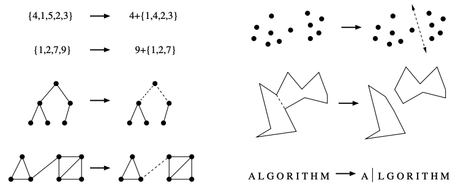

> Pet Peeve: The author sometimes skips steps without an explaination (like the integer truncation in "stop and think: incremental correctness"). Some examples are hard to follow for an international student (like understanding the lottery system in "war story: pschic modeling").

## Chapter 1 — Introduction to Algorithm Design
1. An `algorithmic problem` is specified by describing the complete set of **instances** it must work on and of its output after running on one of these instances.
2. An `algorithm` is a procedure that takes any of the possible input instances and transforms it to the desired output.
3. There is a distinction between a general problem and an instance of a problem. E.g:
   > **Problem**: Sorting<br/>
   > **Input**: A sequence of `n` keys a<sub>1</sub>,...,a<sub>n</sub>.<br/>
   > **Output**: The permutation (reordering) of the input sequence such that: a′<sub>1</sub> ≤ a′<sub>2</sub> ≤ ··· ≤ a′<sub>n−1</sub> ≤ a′<sub>n</sub>.<br/>
   > **Instance of sorting problem**: { Mike, Bob, Sally}; { 154, 245 }
4. Insertion sort is an algorithm to the sorting problem:
   **English description**: 
   > Start with a single element (thus forming a trivially sorted list) and then incrementally inserts the remaining elements so that the list stays sorted.
   
   **Pseudocode**:
   ```pseudocode
   array = input sequence
   n = array size
   i = 0

   while i < n
      j = i
      while j > 0 AND array[j] < array[j - 1]
          swap element at `j` with element at `j - 1` in array
          decrement j by 1
      increment i by 1
   ```

   **Code**:
   ```c
   insertion_sort(item s[], int n)
    {
      int i,j; /* counters */
      for (i=0; i<n; i++) {
        j=i;
        
        while ((j>0) && (s[j] < s[j-1])) {
          swap(&s[j],&s[j-1]);
          j = j-1;
        }
      }
    }
   ```
    
  An animation of the logical flow of this algorithm on a particular instance (the letters in the word `“INSERTIONSORT”`) 
    

5. There is a fundamental difference between algorithms,
which always produce a correct result, and heuristics, which may usually do a
good job but without providing any guarantee.
6. Three desirable properties for a good algorithm:
   - correct
   - efficient
   - easy to implement
7. Correct algorithms usually come with a proof of correctness, which is an explanation of why we know that the algorithm must take every instance of the problem to the desired result.

### Robot Tour Optimization
> **Problem**: Robot Tour Optimization (aka: Traveling Salesman Problem [TSP]).<br/>
> **Input**: A set `S` of `n` points in the plane.<br/>
> **Output**: What is the shortest cycle tour that visits each point in the set `S`?

#### Nearest-neighbor heuristic


1. English Description:
   > Starting from some point `p0`, we walk first to its nearest neighbor `p1`
   > From `p1`, we walk to its nearest unvisited neighbor.
   > Repeat this process until we run out of unvisited points
   > After which we return to `p0` to close off the tour.
2. Pseudocode:
   ```pseudocode
   NearestNeighbor(P)
      Pick and visit an initial point p₀ from P
      p = p₀
      i = 0
      
      While there are still unvisited points
          i = i + 1
          Select pᵢ to be the closest unvisited point to pᵢ₋₁
          Visit pᵢ
      Return to p₀ from pₙ₋₁
   ```
3. Pros:
   - Easy to understand & implement
   - Reasonably efficient
4. Cons: It's wrong — It always finds a tour, but it doesn’t necessarily find the shortest possible tour.
   E.g: A bad instance for the nearest-neighbor heuristic (top) & the optimal solution (bottom):
   

#### Closest-pair heuristic
1. English description:
   > Repeatedly connect the closest pair of endpoints whose connection will not create a problem, such as premature termination of the cycle.
   > Each vertex begins as its own single vertex chain.
   > After merging everything together, we will end up with a single chain containing all the points in it. Connecting the final two endpoints gives us a cycle.
   > At any step during the execution of this closest-pair heuristic, we will have a set of single vertices and vertex-disjoint chains available to merge.
2. Pseudocode:

### Reasoning about Correctness
1. We need tools to distinguish correct algorithms from incorrect ones, the primary one of which is called a `proof`.
2. A proper mathematical proof consists of several parts:
    * A clear, precise statement of what you are trying to prove.
    * A set of assumptions of things that are taken to be true, and hence can be used as part of the proof.
    * A chain of reasoning that takes you from these assumptions to the statement you are trying to prove.
    * A little square (■) or `QED` at the bottom to denote that you have finished, representing the Latin phrase for "thus it is demonstrated."
3. A proof is indeed a demonstration. Proofs are useful only when they are honest, crisp arguments that explain why an algorithm satisfies a non-trivial correctness property.

#### Problems and Properties
1. It is impossible to prove the correctness of an algorithm for a fuzzily-stated problem.
2. Problem specifications have two parts:
    * The set of allowed input instances.
    * The required properties of the algorithm's
output.
3. An important technique in algorithm design is to narrow the set of allowable instances until there is a correct and efficient algorithm. For example, we can restrict a graph problem from general graphs down to trees, or a geometric problem from two dimensions down to one.
4. There are two common traps when specifying the output requirements of a
problem:
    * Asking an ill-defined question. E.g: Asking for the best route between two places on a map is a silly question, unless you define what best means.
    * Creating compound goals. E.g: A goal like find the shortest route from **a** to **b** that doesn't use more than twice as many turns as necessary is perfectly well defined, but complicated to reason about and solve.

#### Expressing Algorithms
1. The heart of any algorithm is an idea. If your idea is not clearly revealed when you express an algorithm, then you are using too low-level a notation to describe it.
2. The three most common forms of algorithmic notation are
    * English
    * Pseudocode (a programming language that never complains about syntax errors)
    * A real programming language.
3. All three methods are useful because there is a natural tradeoff between
greater ease of expression and precision.

#### Demonstrating Incorrectness
1. The best way to prove that an algorithm is incorrect is to produce a counter example, i.e: an instance on which it yields an incorrect answer.
2. Good counterexamples have two important properties:
    * **Verifiability**: To demonstrate that a particular instance is a counterexample to a particular algorithm, you must be able to:
        * calculate what answer your algorithm will give in this instance, and
        * display a better answer so as to prove that the algorithm didn't find it.
    * **Simplicity** - Good counter-examples have all unnecessary details stripped away. They make clear exactly why the proposed algorithm fails. Simplicity is important because you must be able to hold the given instance in your head in order to reason about it.

### Induction and Recursion
1. Recursion is mathematical induction in action. In both, we have general and boundary conditions, with the general condition breaking the problem into smaller and smaller pieces. The initial or boundary condition terminates the recursion.
2. The simplest and most common form of mathematical induction infers that a statement involving a natural number `n` (that is, an integer `n ≥ 0`) holds for all values of `n`. The proof consists of two steps:
    * The **initial** or **base case**: prove that the statement holds for a fixed natural number (usually 0 or 1).
    * The **induction/inductive step**: assume that the statement holds for some arbitrary natural number `n = k`, and prove that the statement holds for `n = k + 1`.
3. The hypothesis in the inductive step, that the statement holds for `n = k`, is called the **induction/inductive hypothesis**. You're doing a thought experiment of what would happen if it was true for `n = k`. It might be clearer to use the phrase "suppose true when `n = k`" rather than "assume true when `n = k`" to emphasise this.
4. To prove the inductive step, one assumes the induction hypothesis for `n = k` and then uses this assumption to prove that the statement holds for `n = k + 1`. We try to manipulate the statement for  `n = k + 1` so that it involves the case for `n = k` (which we assumed to be true).

#### Inductive proof for Insertion sort
1. The basis case consists of a single element, and by definition a one-element array is completely sorted.
2. We assume that the first `n - 1` elements of array `A` are completely sorted after `n - 1` iterations of insertion sort.
3. To insert one last element `x` to `A`, we find where it goes, namely the unique
spot between the biggest element less than or equal to `x` and the smallest element greater than `x`. This is done by moving all the greater elements
back by one position, creating room for `x` in the desired location. ■
### Modeling the Problem
1. Modeling is the art of formulating your application in terms of precisely described, well-understood problems.
2. Proper modeling is the key to applying algorithmic design techniques to real-world problems — it can eliminate the need to design an algorithm, by relating your application to what has been done before.
3. Real-world applications involve real-world objects — like a system to route traffic in a network or find the best way to schedule classrooms in a university.
4. Most algorithms, however, are designed to work on rigorously defined abstract structures such as permutations, graphs, and sets.
5. To exploit the algorithms literature, you must learn to describe your problem abstractly, in terms of procedures on such fundamental structures.
6. The act of modeling reduces your application to one of a small number of existing problems and structures. Such a process is inherently constraining, and certain details might not fit easily into the given target problem.
7. Certain problems can be modeled in several different ways, some much better than others.
8. Modeling is only the first step in designing an algorithm for a problem. Be
alert for how the details of your applications differ from a candidate model, but don't be too quick to say that your problem is unique and special.

#### Combinatorial Objects
1. **Permutations** are arrangements, or orderings, of items. E.g: `{1,4,3,2}` and `{4,3,2,1}` are two distinct permutations of the same set of four integers.
2. **Subsets** represent selections from a set of items. E.g: `{1,3,4}` and `{2}` are two distinct subsets of the first four integers. Order does not matter in subsets the way it does with permutations.
3. **Trees** represent hierarchical relationships between items.
4. **Graphs** represent relationships between arbitrary pairs of objects.
5. **Points** define locations in some geometric space.
6. **Polygons** define regions in some geometric spaces.
7. **Strings** represent sequences of characters, or patterns.


<small> Modeling real-world structures with trees and graphs</small>

#### Recursive Objects
> Learning to think recursively is learning to look for big things that are made from smaller things of exactly the same type as the big thing.<br/>
> If you think of houses as sets of rooms, then adding or deleting a room still leaves a house behind.  

1. **Permutations**: Delete the first element of a permutation of `n` things `{1, ..., n}` and you get a permutation of the remaining `n-1` things. Basis case: {}
2. **Subsets**: Every subset of `{1, ..., n}` contains a subset of `(1, ..., n - 1)` obtained by deleting element `n`. Basis case: {}
3. **Trees**: Delete the root of a tree and you get a collection of smaller trees. Delete any leaf of a tree and you get a slightly smaller tree. Basis case: 1 vertex.
4. **Graphs**: Delete any vertex from a graph, and you get a smaller graph. Now divide the vertices of a graph into two groups, left and right. Cut through all edges that span from left to right, and you get two smaller graphs, and a bunch of broken edges. Basis case: 1 vertex.
5. **Point sets**: Take a cloud of points, and separate them into two groups by drawing a line. Now you have two smaller clouds of points. Basis case: 1 point.
6. **Polygons**: Inserting any internal chord between two non-adjacent vertices of a simple polygon cuts it into two smaller polygons. Basis case: triangle.
7. **Strings**: Delete the first character from a string, and you get a shorter string. Basis case: empty string.

> Recursive descriptions of objects require both decomposition rules and basis cases, namely the specification of the smallest and simplest objects where the decomposition stops.  


<small>Recursive decompositions of combinatorial objects. (left column) Permutations, subsets, trees, and graphs. (right column) Point sets, polygons, and strings</small>

### Proof by Contradiction
1. The basic scheme of a contradiction argument is as follows:
    * Assume that the hypothesis (the statement you want to prove) is false.
    * Develop some logical consequences of this assumption.
    * Show that one consequence is demonstrably false, thereby showing that the assumption is incorrect and the hypothesis is true.
2. The classic contradiction argument is Euclid's proof that there are an infinite number of prime numbers:
     * The negation of the claim would be that there are only a finite number of primes, say `m`, which can be listed as `p₁,..., pₘ`. So let's assume this is the case and work with it.
     * Prime numbers have particular properties with respect to division. Suppose we construct the integer formed as the product of "all" of the listed primes:
     \[
      N = \prod_{i = 1}^{m} p_{i}
     \]
     * This integer `N` has the property that it is divisible by each and every one of the known primes, because of how it was built.
     * But consider the integer `N + 1`. It can't be divisible by `p₁ = 2`, because `N` is.
     * The same is true for `p₂ = 3` and every other listed prime. Since a +1 can’t be evenly split by any of the prime numbers because they are bigger.
     * Since `N + 1` doesn't have any non-trivial factor, this means it must be prime.
     * But you asserted that there are exactly `m` prime numbers, none of which are `N + 1`, because `N + 1 > m`.
     * This assertion is false, so there cannot be a bounded number of primes.
3. For a contradiction argument to be convincing, the final consequence must be clearly, ridiculously false.

### Estimation
1. Principled guessing is called estimation.
2. Estimation problems are best solved through some kind of logical reasoning process, typically a mix of principled calculations and analogies.
3. Principled calculations give the answer as a function of quantities that either you already know, can look up on Google, or feel confident enough to guess.
4. Analogies reference your past experiences, recalling those that seem similar to some aspect of the problem at hand.

### Exercises
#### Finding counter examples
1. Show that `a + b` can be less than `min(a, b)`.
  >When:<br/>
  >&nbsp;&nbsp; `a and b < 0` (i.e: negative)<br/>
  >&nbsp;&nbsp; `a <= b`<br/> 
  >Then:<br/>
  >&nbsp;&nbsp; `min(a, b) = a`<br/>
  >&nbsp;&nbsp; `a + b < a`<br/>
  >Example:<br/>
  >&nbsp;&nbsp; `min(-6, -5) = -6`<br/>
  >&nbsp;&nbsp; `-6 + -5 = -6 -5 = -11`<br/>
  >&nbsp;&nbsp; `-11 < -6`

2. Show that `a × b` can be less than `min(a, b)`.
  > When:<br/>
  >&nbsp;&nbsp; `a < 0` (i.e: negative)<br/>
  >&nbsp;&nbsp; `b > 0` (i.e: positive)<br/>
  >Then:<br/>
  >&nbsp;&nbsp; `min(a, b) = a`<br/>
  >&nbsp;&nbsp; `a * b < a`<br/>
  >Example:<br/>
  >&nbsp;&nbsp; `min(-3, 4) = -3`<br/>
  >&nbsp;&nbsp; `-3 * 4 = -12`<br/>
  >&nbsp;&nbsp; `-12 < -3`

3. Design/draw a road network with two points a and b such that the fastest route between a and b is not the shortest route.
  ```ascii
  a──────c──────b
  │             │
  │             │
  └────d────────┘

  Route `acb` have a toll gate, is in development and have a speed limit.
  Route `adb` is longer, but has none of these impediment.

  Route `adb` will be faster than the shorter `acb` route.
  ```

4. Design/draw a road network with two points a and b such that the shortest route between a and b is not the route with the fewest turns.
   ```ascii
   a────┐   ┌────b
   │    └─c─┘    │
   │             │
   └──────d──────┘
   
   Route `acb` is the shortest but has 4 turns.
   Route `adb` is the longest and has only 2 turns.
   ```

#### Induction
1. Prove that $\sum_{i = 1}^{n} i = \frac{n(n + 1)}{2}$ for n ≥ 0, by induction.

## Chapter 2: Algorithm Analysis
We use two tools to compare the efficiency of algorithms:
1. The RAM model of computation
2. The asymptotic analysis of computational complexity.

### The RAM model of computation
Machine-independent algorithm design depends upon a hypothetical computation model called the **Random Access Machine** (RAM) where:
* Each simple operation (`+`, `*`, `-`, `=`, `if`, `call`) takes exactly one time step.
* Loops and subroutines are the composition of many single-step operations.
* Each memory access takes exactly one time step, regardless of whether your data was in cache or disk.
* There is unlimited memory.

The RAM is a simple model of how computers perform. It’s doesn’t capture the full complexity of real computers. However, the RAM is an excellent model for understanding how an algorithm will perform on a real computer.

>  A model is a simplification or approximation of reality and hence will not reflect all of reality. […] "all models are wrong, but some are useful." — [Model Selection and Multimodel Inference](https://link.springer.com/book/10.1007/b97636)

Under the RAM model, we measure run time by counting the number of steps an algorithm takes on a given problem instance.

To understand how good or bad an algorithm is in general, we must know how it works over all possible input instances. For the problem of sorting, the set of possible input instances includes every possible arrangement of `n` keys, for all possible values of `n` (number of items to sort).

Time complexity defines the running time of any given algorithm as a function of input size. There are three types:
* The **worst-case complexity** of an algorithm is the function defined by the maximum number of steps taken in any instance of size `n`.
* The **best-case complexity** of an algorithm is the function defined by the minimum number of steps taken in any instance of size `n`.
* The **average-case complexity** of an algorithm is the function defined by the average number of steps over all instances of size `n`.

Figure2.1

In practice, the worst-case complexity is the most useful because:
* The best-case is usually unlikely.
* The average-case is difficult to establish.

## Chapter 3: Data structures
1. A **data type** (or simply **type**) is a collection of data values, usually specified by:
   * A set of possible values,
   * A set of allowed operations on these values, and/or
   * A representation of these values as machine types.
2. An **abstract data type** (**ADT**) is a data type that does not specify the concrete representation of the data. They are defined by their behavior (semantics) from the <mark>point of view of a user of the data</mark>, specifically in terms of:
   * Possible values, and
   * Possible operations on data of this type.
3. The generic definition of **data structure** is anything that can hold your data in a structured way. ADT contrasts with data structures, which are concrete representations of data, and are the <mark>point of view of an implementer</mark>.
4. The distinction between ADTs and data structures lies in the POV / level of abstraction. Some important points:
   * User’s POV: An `int` in a programming language sense is a fixed-width data structure. An integer in a mathematical sense is an ADT. For most purposes the user can work with the abstraction rather than the concrete choice of representation, and can simply use the data as if the type were truly abstract.
   * Name overloading: An array is an ADT when viewed as a collection of items that can be accessed by an index. An array is a data structure when viewed as a collection of fixed sized items stored as contiguous blocks in memory.
   * ADT implementations: There are multiple implementations of an ADT. E.g: A list can be implemented as an array or a linked-list.
5. Data structures can be classified into:
   * **Contiguous data structures**: composed of single slabs of memory. E.g. arrays, matrices, heaps, hash tables, etc.
   * **Linked data structures**: composed of distinct chunks of memory bound together by pointers. E.g. linked-list, trees, graph adjacency lists, etc.

### Arrays
1. **Arrays** are data structures of <mark>fixed-size</mark> elements stored <mark>contiguously</mark> such that each element can be efficiently located by its index.
   $$
   Address(i) = FirstAddress + (i \cdot ElementSize)
   $$
2. Advantages of arrays:
   * **Constant-time access given the index**: because the index of each element maps directly to a particular memory address.
   * **Space efficiency**: because no space is wasted with links, end-of-element information, or other per element metadata.
   * **Memory locality**: because the physical continuity between successive data access helps exploit the high-speed cache memory on modern computer architecture.
3. The primary disadvantage of arrays is that the number of elements (i.e. the array size) is fixed. The capacity needs to be specified at allocation.
4. **Dynamic arrays** overcome the fixed-size limitation of static arrays.
5. It does so by internally resizing when its capacity is exceeded:
   * Allocates a new bigger contiguous array.
   * Copy the content of the old array to the new array.
   [](https://en.wikipedia.org/wiki/Dynamic_array#/media/File:Dynamic_array.svg)
6. To avoid incurring the cost of resizing many times, dynamic arrays resize by a large amount, such as doubling in size.
7. Expanding the array by any constant proportion $a$ ensures that inserting $n$ elements takes <span class="okay">$O(n)$</span> time overall, meaning that each insertion takes **amortized** <span class="good">$O(1)$</span> time. As $n$ elements are added, the capacities form a geometric progression.
8. The key idea of **amortized analysis** is to consider the <mark>worst-case cost of a sequence of operations</mark> on a data structure, rather than the <mark>worst-case individual cost of any particular operation</mark>.
9.  The **aggregate method** is one of the methods for performing amortized analysis. In this method, the total cost of performing a sequence of $m$ operations on the data structure is divided by the number of operations $m$, yielding an average cost per operation, which is defined as the amortized cost.
10. The aggregate method of amortized analysis applied to dynamic arrays with doubling:
   * $$
     t(i) = \begin{cases}
     2^{k}+1 &\text{if } i = 2^{k} - 1 \\
     1&\text{otherwise}
     \end{cases}
     $$
   * $t(i)$ defines the time it takes to perform the i-th `addition` (0 indexed).
   * The first case of $t(i)$ defines the time taken when the array’s capacity is exceeded and has to doubled. Because of the doubling, this case happens on every $2^{k}$. The time taken is $2^{k}+1$ because:
     * $2^{k}$ has to be copied to the new array and
     * The i-th element has to be `added` into the new array.
   * The second case of $t(i)$ defines the time taken when the array capacity is not exceeded. This is constant time because only a single `addition` is performed.
   *  $t(i)$ example on a dynamic array initialized with a capacity of $1$:

        | i | 0 | 1 | 2 | 3 | 4 | 5 | 6 | 7 | 8 | 9 |
        |---|---|---|---|---|---|---|---|---|---|---|
        | $t(i)$ | $1$ | $2$ | $3$ | $1$ | $5$ | $1$ | $1$ | $1$ | $9$ | $1$ |
        | Capacity | $1$ | $2$ | $4$ | $4$ | $8$ | $8$ | $8$ | $8$ | $16$ | $16$ |

   * $$
     Amortized \space cost = \frac{\sum_{i=0}^{n}t(i)}{n}
     $$
   * In both cases of the function, there is a $1$. So summation from $0$ to $n$ results in an $n$. We are left with $2^{i}$ when $i = 2^{k}$. Hence,
   $$
   \sum_{i=0}^{n}t(i) = n + \sum_{i=0}^{\log_2 n}2^{i}
   $$
   * The second operand is the partial sum of a geometric series. Applying the formula:
   $$
   \sum_{i=0}^{n}r^{i} = \frac{1 - r^{n+1}}{1 - r}\\
   = \frac{1 - 2^{(\log_2 n) + 1}}{1 - 2} = \frac{- 2^{(\log_2 n) + 1} + 1}{-1}\\
   = 2^{(\log_2 n) + 1} - 1\\
   = 2^{\log_2 n} \cdot 2^{1} - 1
   $$
   * $\log_2 n$ is the number to which $2$ must be raised to obtain $n$. Raising that number then to $2$ results in $n$. Hence, the last expression can be simplified to:
   $$
   = n \cdot 2^{1} - 1\\
   = 2n - 1
   $$
   * The summation can be re-expressed again as:
   $$
   \sum_{i=0}^{n}t(i) = n + 2n - 1
   $$
   * The $-1$ is inconsequencial in the time analysis, hence the summation can be simplified into:
   $$
   \sum_{i=0}^{n}t(i) \leq 3n
   $$
   * > **Interpretation**: A sequence of $n$ `add` operations costs at most $3n$, hence each `add` in the sequence costs at most $3$ (constant time) on average, which is the amortized cost according to the aggregate method.<br/>
     > **Conclusion**: This proves that the amortized cost of insertion to a dynamic array with doubling is <span class="good">$O(1)$</span>.
11. The key idea behind amortized analysis is that the <mark>cost of a particular operation can be partially paid for by the cost of other operations</mark> that are performed later. It avoids the limitations of worst-case analysis, which can overestimate the performance of a data structure if the worst-case scenario is unlikely to occur frequently.

### Pointers and linked structures
[](https://en.wikipedia.org/wiki/Linked_list#/media/File:Singly-linked-list.svg)
1. **Pointers** represent the address of a location in memory. Pointers are the connections that hold the nodes (i.e. elements) of linked data structures together.
2. In C:
   * `*p` denotes the item that is pointed to by pointer `p`
   * `&x` denotes the address of (i.e. pointer to) a particular variable `x`.
   * A special `NULL` pointer value is used to denote unassigned pointers.
3. All linked data structures share certain properties:
   * Each node contains one or more data field.
   * Each node contains a pointer field to at least one other node.
   * Finally, we need a pointer to the head of the data structure, so we know where to access it.
   Example linked-list displaying these properties:
   ```c
    
   typedef struct list {
       data_type data; /* Data field */
       struct list *next; /* Pointer field */
   
   } list;
   ```
4. The **linked-list** is the simplest linked structure.
5. **Singly linked-list** has a pointer to only the successor whereas a **doubly linked-list** has a pointer to both the predecessor and successor.
6. Searching for data `x` in a linked-list recursively:
   ```c
    
   list *search_list(list *listz, data_type x) {
       if (listz == NULL) {
           return(NULL);
       }
   
       // If `x` is in the list, it's either the first element or located in the rest of the list.
       if (listz->data == x) {
           return(listz);
       } else {
           return(search_list(listz.next, x));
       }
   }
   ```
7. Inserting into a singly linked-list at the head:
   ```c
    
   list *insert_list(list **listz, data_type x) {
      list *p; /* temporary pointer */
      p = malloc(sizeof(list));
      p->data = x;
      p->next = *listz;
      // `**listz` denotes that `listz` is a pointer to a pointer to a list node. This line copies `p` to the place pointed to by `listz`, which is the external variable maintaining access to the head of the list.
      *listz = p;
   }
   ```
8. Deletion from a list:
   ```c
    // Used to find the predecessor of the item to be deleted.
   list *item_ahead(list *listz, list *x) {
      if ((listz == NULL) || (listz->next == NULL) {
          return(NULL);
      }
   
   
      if ((listz->next) == x) {
          return(listz);
      } else {
          return(item_ahead(listz->next, x));
      }
   }
   
   // This is called only if `x` exists in the list.
   void *delete_list(list **listz, list **x) {
      list *p; /* element pointer */
      list *pred; /* predecessor pointer */
   
      p = *listz;
      pred = item_ahead(*listz, *x);
   
      // Given that we assume `x` exists in the list, `pred` is only null when the first element is the target.
      if (pred == NULL) { /* splice out of list */
         // Special case: resets the pointer to the head of the list when the first element is deleted.
         *listz = p->next;
      } else {
         pred->next = (*x)->next
      }
   
      free(*x) /* free memory used by node */
   }
   ```
9. The advantages of linked structures over static arrays include:
   * Overflow on linked structures never occurs unless the memory is actually full.
   * Insertion and deletion are simpler than for static arrays. With static arrays, insertions and deletions into the middle requires manually shifting elements.
   * With large records, moving pointers is easier and faster than moving the items themselves.
10. Both arrays and lists can be thought of as recursive objects:
    * Lists — Chopping the first element off a linked-list leaves a smaller linked-list.
    * Arrays — Splitting the first $k$ elements off of an $n$ element array gives two smaller arrays, of size $k$ and $n - k$, respectively.
    * This insight leads to simpler list processing, and efficient divide-and-conquer algorithms like quick-sort and binary search.

### Stacks
1. **Stacks** are an ADT that supports retrieval by last-in, first-out (LIFO).
2. Primary operations are:
   * `push(x)` — Inserts item `x` at the top of the stack.
   * `pop` — Return and remove the top item of the stack.

### Queues
[](https://en.wikipedia.org/wiki/Queue_(abstract_data_type)#/media/File:Data_Queue.svg)

1. **Queues** are an ADT that supports retrieval by first-in, first-out (FIFO).
2. Primary operations are:
   * `enqueue(x)` — Inserts item `x` at the back of the queue.
   * `dequeue` — Return and remove the front item from the queue.
3. Stacks and queues can be effectively implemented using arrays or linked-list.


### Dictionaries
1. A **dictionary** is an abstract data type that stores a collection of `(key, value) pairs`, such that each possible `key` appears at most once in the collection.
2. The primary operations of a dictionary are:
   * `put(key, value)`
   * `remove(key)`
   * `get(key)`
3. These are two simple but less common implementations of a dictionary:
   * An **association list** is a linked list in which each node comprises a key and a value:
     * The time complexity of get and remove is <span class="okay">$O(n)$</span>.
     * The time complexity of put is <span class="good">$O(1)$</span> — if the list is unsorted.
   * Direct addressing into an **array**:
     * Potential keys are numbers from the universe $M \subseteq U$
     * A value with key $k \in M$ can be kept under index $k$ in a $\lvert M \rvert$-element array.
     * The time complexity of put, get and remove is <span class="good">$O(1)$</span>.
     * The space complexity is $\lvert U \rvert$. Hence, this structure is impractical when $\lvert U \rvert >> n$; where $n$ is the number of values inserted.
4. These are the two common data structures used to implement a dictionary:
   * **Hash tables**.
   * **Self-balancing binary search tree**.
5. Binary search tree based maps are in-order and hence can satisfy range queries (find all values between two bounds) whereas a hash-map can only find exact values.

### Binary search tree (BST)
1. A **binary tree** is a tree data structure in which each node has at most two children, referred to as the left child and the right child.
2. A binary tree can be viewed as a linked-list with two pointers per node.
3. A **rooted tree** is a tree in which one node has been designated the root.
4. A **rooted binary tree** is recursively defined as either being:
   * Empty or
   * Consisting of a node called the root, together with two **rooted binary trees** called the left and right subtrees.
5. A **binary search tree** is a rooted binary tree data structure such that for any node $x$, all nodes in the left subtree of $x$ have keys $<x$ while all nodes in the right subtree of $x$ have keys $>x$.
6. Binary search trees’ height range from $\log_2 n$ (when balanced) to $n$ (when degenerate).
7. The time complexity of operations on the binary search tree is linear with respect to the height of the tree $O(h)$.
8. Hence, in a balanced binary search tree, the nodes are laid out so that each comparison skips about half of the remaining tree, the lookup performance is proportional to that of binary logarithm <span class="good">$O(\log n)$</span>.
9. An implementation of a binary tree:
   ```c
    
   typedef struct tree {
       data_type data; /* Data field */
       struct tree *parent; /* Pointer to parent */
       struct tree *left; /* Pointer to left chid */
       struct tree *right; /* Pointer to right child */
   } tree;
   ```
10. Searching in a binary search tree:
11. 

### Priority queue
1. A **priority queue** is an abstract data-type similar to a regular queue or stack data structure. Each element in a priority queue has an associated `priority`.
2. In a priority queue, elements with high priority are served before elements with low priority.
3. Priority queues are often implemented using **heaps**.
4. A priority queue can also be inefficiently implemented as an unsorted list or a sorted list.
5. A priority queue can be used for sorting: insert all the elements to be sorted into a priority queue, and sequentially remove them.
6. The primary operations of a priority queue are:
   * `Add` an element with a given priority,
   * `Delete`  an element,
   * Get the the highest priority element and remove it (`Pull`),
   * Get the the highest priority element without removing it (`Peek`).
7. Stacks and queues can be implemented as particular kinds of priority queues, with the priority determined by the order in which the elements are inserted.

### Hash tables
[](https://en.wikipedia.org/wiki/Hash_table#/media/File:Hash_table_3_1_1_0_1_0_0_SP.svg)
1. **Hash tables** are a data structure that efficiently implements a dictionary. They exploit the fact that looking an element up in an array takes constant time once you have its index.
2. The basic idea is to pick a hash function $h$ that maps every possible key $x$ to a small integer $h(x)$. Then we store $x$ and its value in an array at index $h(x)$; the array itself is essentially the hash table.
3. A **hash function** $h$ maps the universe $U$ of keys to array indices within the hash table.
   $$
   h : U → \{ 0, …, n - 1 \}
   $$
4. Properties of a good hash function:
   * **Efficient** — Computing $h(x)$ should require a constant number of steps per bit of $x$.
   * **Uniform** — $h$ should ideally map elements randomly and uniformly over the entire range of integers.
5. A hash function for an arbitrary key $x$ (like a string) is typically defined as:
   $$
   h(x) = toInteger(x) \bmod n
   $$
6. This is the polynomial function that Java uses to convert strings to integers:
   $$
   s[0]*31^{n-1} + s[1]*31^{n-2} + ... + s[n-1]
   $$
   Which translates into the following code:
   ```java
    int hashcode = 0;
    for (int i = 0; i < s.length(); i++) {
        hashcode = (hashcode * 31) + s.charAt(i);
    }
   ```
7. A collision occurs when:
   $$
   h(j) = h(k) \land j \neq k
   $$
8. Collisions can be minimized but cannot be eliminated (see Pigeon hole principle). It’s impossible to eliminate collisions without knowing the $U$ ahead of time.
9. The two common methods for collision resolution:
   * **Separate chaining** — the values of the hash-table’s array is a linked-list.
     * Inserting adds the key and its value to the head of the linked-list at $h(x)$ index in <span class="good">$O(1)$</span> time. Keys that collided hence form a chain.
     * Searching involves going to $h(x)$ index and iterating through the linked-list until a key equality check passes.
[](https://en.wikipedia.org/wiki/Hash_table#/media/File:Hash_table_5_0_1_1_1_1_1_LL.svg)
   * **Open addressing** — every key and its value is stored in the hash-table’s array itself, and the resolution is performed through `probing`.
     * Inserting goes to $h(x)$ index. If it is occupied, it proceeds on some probe sequence until an unoccupied index is found.
     * Searching is done in the same sequence, until either the key is found, or an unoccupied array index is found, which indicates an unsuccessful search.
     * Linear probing is often used — it simply checks the next indices linearly: $h(x) + 1$, $h(x) + 2$. But there is quadratic probing and other probing sequences.

10.  Search algorithms that use hashing consist of two separate parts: hashing and collision resolution.
11.  Other uses of hashing (or a hash table):
    * Plagiarism detection using Rabin-Karp string matching algorithm
    * English dictionary search
    * Finding distinct elements
    * Counting frequencies of items
12.  Time complexity in big O notation

    | Operation	| Average | Worst case |
    |-----------|---------|------------|
    | Search | $Θ(1)$ | <span class="okay">$O(n)$</span> |
    | Insert | $Θ(1)$ | <span class="okay">$O(n)$</span>|
    | Delete | $Θ(1)$ | <span class="okay">$O(n)$</span> |
13.  Space complexity is <span class="okay">$O(n)$</span>.

### Excercises
1. A common problem for compilers and text editors is determining whether the parentheses in a string are balanced and properly nested. For example, the string `((())())()` contains properly nested pairs of parentheses, while the strings `)()(` and `())` do not. Give an algorithm that returns true if a string contains properly nested and balanced parentheses, and false if otherwise. For full credit, identify the position of the first offending parenthesis if the string is not properly nested and balanced.
    <details>
    <summary>Solution</summary>

    ```kotlin
    fun test() {
        System.out.println(areParentheseProperlyBalanced("((())())()"))
        System.out.println(areParentheseProperlyBalanced(")()("))
        System.out.println(areParentheseProperlyBalanced("())"))
        System.out.println(areParentheseProperlyBalanced(")))"))
        System.out.println(areParentheseProperlyBalanced("(("))
     }

    /**
      * @return -1 if [string] is valid, else a positive integer
      * that providesthe position of the offending index.
      */
    fun areParentheseProperlyBalanced(string: String): Int {
        val stack = Stack<Pair<Char, Int>>()
    
        string.forEachIndexed { index, char ->
     	    if (char == '(') {
     	        stack.push(char to index)
     	    } else if (char == ')') {
     	        if (stack.empty()) {
     	            return index
     	        }   
     	        stack.pop()
     	    } else {
     	        throw IllegalArgumentException("Only parenthesis are supported")
     	    }
     	}   
        
        return if (stack.empty()) -1 else stack.peek().second
     }
    ```

    </details>

2. Give an algorithm that takes a string $S$ consisting of opening and closing parentheses, say `)()(())()()))())))(`, and finds the length of the longest balanced parentheses in $S$, which is 12 in the example above. (Hint: The solution is not necessarily a contiguous run of parenthesis from $S$)
    <details>
    <summary>Solution</summary>

    ```kotlin
    fun test() {
    	System.out.println(lengthOfLongestBalancedParentheses("((())())()"))
    	System.out.println(lengthOfLongestBalancedParentheses(")()(())()()))())))("))
    	System.out.println(lengthOfLongestBalancedParentheses(")()("))
    	System.out.println(lengthOfLongestBalancedParentheses("())"))
    	System.out.println(lengthOfLongestBalancedParentheses(")))"))
    	System.out.println(lengthOfLongestBalancedParentheses("(("))
    }

	fun lengthOfLongestBalancedParentheses(string: String): Int {
		val stack = Stack<Char>()
    	var numBalancedParenthesis = 0
    
		string.forEachIndexed { index, char ->
			if (char == '(') {
				stack.push(char)
			} else if (char == ')') {
            	if (!stack.empty()) {
					stack.pop()
                	numBalancedParenthesis++
            	}
			}
		}
    
	    // Multiplied by 2 because each balanced pair has a length of 2.
		return numBalancedParenthesis * 2
	}
    ```

    </details>

3. Give an algorithm to reverse the direction of a given singly linked list. In other words, after the reversal all pointers should now point backwards. Your algorithm should take linear time.
    <details>
    <summary>Solution</summary>

    ```kotlin
    fun test() {
        val node1 = Node("Elvis", null)
        
        val node2 = Node("Chidera", null)
        node1.next = node2
        
        val node3 = Node("Nnajiofor", null)
        node2.next = node3
        
        System.out.println(node1)
        System.out.println(reverse(node1))
    }
	
    data class Node(
    	val element: String,
        var next: Node?
    )
    
    /**
     * Work through an example:
     * reverse(Node1 -> Node2 -> Node3)
     * 
     * Node1 level:
     * val last = reverse(Node2 -> Node3) 🛑
     * 
     * Node2 level:
     * val last = reverse(Node3) 🛑
     * 
     * Node3 level:
     * return Node3
     * 
     * Back to Node2 level:
     * val last = Node3 🟢
     * Node3.next = Node2
     * Node2.next = null
     * return last
     * 
     * Back to Node1 level:
     * val last = Node3 🟢
     * Node2.next = Node1
     * Node1.next = null
     * return last
    */
	fun reverse(node: Node): Node {
        // Base case
        if (node.next == null) return node
        
        val last = reverse(node.next!!)
        node.next!!.next = node
        node.next = null
        return last
	}
    ```

    </details>

4. Design a stack $S$ that supports `S.push(x)`, `S.pop()`, and `S.findmin()`, which returns the minimum element of $S$. All operations should run in constant time.
    <details>
    <summary>Solution</summary>

    ```kotlin
    fun test() {
        val stack = Stack()
        stack.push(50)
        stack.push(40)
        stack.push(30)
        stack.push(20)
        stack.push(10)
        
        System.out.println(stack.findMin())
        stack.pop()
        System.out.println(stack.findMin())
        stack.pop()
        System.out.println(stack.findMin())
        stack.pop()
        System.out.println(stack.findMin())
        stack.pop()
        System.out.println(stack.findMin())
        stack.pop()
    }
	
    data class Element(
    	val num: Int,
        internal val minNumSoFar: Int
    )
    
    class Stack {
        
        private val list = mutableListOf<Element>()
        
        fun push(num: Int) {
        	list += Element(
            	num = num,
                minNumSoFar = Math.min(num, list.lastOrNull()?.minNumSoFar ?: num)
            )    
        }
        
        fun pop(): Int {
            return list.removeLast().num
        }
        
        fun findMin(): Int {
            return list.last().minNumSoFar
        }
    }
    ```

    </details>

5. We have seen how dynamic arrays enable arrays to grow while still achieving constant-time amortized performance. This problem concerns extending dynamic arrays to let them both grow and shrink on demand.
    
    a. Consider an underflow strategy that cuts the array size in half whenever the array falls below half full. Give an example sequence of insertions and deletions where this strategy gives a bad amortized cost.
    
    b. Then, give a better underflow strategy than that suggested above, one that achieves constant amortized cost per deletion.
    <details>
    <summary>Solution</summary>

    a.  A sequence of `insert`, `insert`, `delete`, `insert`, `delete`, `insert` will lead to a bad amortized cost because the array will be busy resizing for most of the operations.

    b. A better underflow strategy is to cut the array size in half whenever the array falls below $1/4$. $1/4$ is arbitrary, but it gives the array good "slack" space. The goal is to select a number such that the array is not busy resizing for most of the operation. The smaller the cut-off ratio, the smaller the number of resizing but the more space the array uses.
    </details>

6. Suppose you seek to maintain the contents of a refrigerator so as to minimize food spoilage. What data structure should you use, and how should you use it?
    <details>
    <summary>Solution</summary>

    Use a priority queue. The expiry date is the priority of each element. Elements with the lowest expiry date are served first (`minElement`).
    </details>
 
7. Work out the details of supporting constant-time deletion from a singly linked list as per the footnote from page 79, ideally to an actual implementation. Support the other operations as efficiently as possible.
    <details>
    <summary>Solution</summary>

    ```kotlin
    fun test() {
        val node3 = Node(3)
        val node2 = Node(2, node3)
        val node1 = Node(1, node2)

        println(node1)
        println(deleteInConstantTime(node1, node2))
        println(deleteInConstantTime(node1, node3))
        println(deleteInConstantTime(node1, node1))
    }

    fun deleteInConstantTime(head: Node, search: Node): Node? {
        if (head == search) {
            // Handle head case
            return head.next
        }

        var node: Node? = head
        var prevNode: Node? = null
        while (node != null) {
            if (node == search) {
                if (node.next == null) {
                    // Handle tail case
                    prevNode?.next = null
                } else {
                    node.element = node.next!!.element
                    node.next = node.next?.next
                }

                break
            } else {
                prevNode = node
                node = node.next
            }
        }

        return head
    }

    data class Node(
        var element: Int,
        var next: Node? = null
    )
    ```

    </details>

8. Tic-tac-toe is a game played on an $n * n$ board (typically $n = 3$) where two players take consecutive turns placing “O” and “X” marks onto the board cells. The game is won if n consecutive “O” or “X” marks are placed in a row, column, or diagonal. Create a data structure with $O(n)$ space that accepts a sequence of moves, and reports in constant time whether the last move won the game.
    <details>
    <summary>Solution</summary>

    ```kotlin
    fun test() {
        var tickTacToe = TickTacToe(3)
        assertFalse(tickTacToe.playX(1, 1))
        assertFalse(tickTacToe.playO(1, 2))
        assertFalse(tickTacToe.playX(1, 3))

        tickTacToe = TickTacToe(3)
        assertFalse(tickTacToe.playO(2, 1))
        assertFalse(tickTacToe.playX(2, 2))
        assertFalse(tickTacToe.playO(2, 3))

        tickTacToe = TickTacToe(3)
        assertFalse(tickTacToe.playX(3, 1))
        assertFalse(tickTacToe.playX(3, 2))
        assertTrue(tickTacToe.playX(3, 3))

        tickTacToe = TickTacToe(3)
        assertFalse(tickTacToe.playX(1, 1))
        assertFalse(tickTacToe.playO(2, 1))
        assertFalse(tickTacToe.playX(3, 1))

        tickTacToe = TickTacToe(3)
        assertFalse(tickTacToe.playO(1, 2))
        assertFalse(tickTacToe.playX(2, 2))
        assertFalse(tickTacToe.playO(3, 2))

        tickTacToe = TickTacToe(3)
        assertFalse(tickTacToe.playX(1, 3))
        assertFalse(tickTacToe.playX(2, 3))
        assertTrue(tickTacToe.playX(3, 3))

        tickTacToe = TickTacToe(3)
        assertFalse(tickTacToe.playO(1, 1))
        assertFalse(tickTacToe.playO(2, 2))
        assertTrue(tickTacToe.playO(3, 3))

        tickTacToe = TickTacToe(3)
        assertFalse(tickTacToe.playO(1, 3))
        assertFalse(tickTacToe.playO(2, 2))
        assertTrue(tickTacToe.playO(3, 1))
    }
    
    private fun assertTrue(value: Boolean) {
        require(value)
        println("Won!!!")
    }

    private fun assertFalse(value: Boolean) {
        require(!value)
        println("Not won yet")
    }

    class TickTacToe(private val n: Int) {

        private val columns = Array(n) {
            Slot(n)
        }

        private val rows = Array(n) {
            Slot(n)
        }

        private val diagonal = Slot(n)

        private val antiDiagonal = Slot(n)

        fun playX(rowPosition: Int, columnPosition: Int): Boolean {
            return play('X', rowPosition, columnPosition)
        }

        fun playO(rowPosition: Int, columnPosition: Int): Boolean {
            return play('O', rowPosition, columnPosition)
        }

        private fun play(char: Char, rowPosition: Int, columnPosition: Int): Boolean {
            return rows[rowPosition.toIndex].play(char) ||
                    columns[columnPosition.toIndex].play(char) ||
                    (rowPosition == columnPosition && diagonal.play(char)) ||
                    ((rowPosition + columnPosition) == (n + 1) && antiDiagonal.play(char))
        }

        private val Int.toIndex get() = this - 1

        class Slot(private val n: Int) {

            private var number = 0

            fun play(char: Char): Boolean {
                val increment = if (char == 'X') 1 else -1
                val target = if (char == 'X') n else -n

                number += increment
                return number == target
            }
        }
    }
    ```
    </details>

9.  Write a function which, given a sequence of digits 2–9 and a dictionary of $n$ words, reports all words described by this sequence when typed in on a standard telephone keypad. For the sequence _269_ you should return _any_, _box_, _boy_, and _cow_, among other words.
    <details>
    <summary>Solution</summary>

    ```kotlin
    fun test() {
        println(words(arrayOf(2, 6, 9)))
        println(words(arrayOf(7, 6, 7, 7)))
    }

    fun words(inputDigits: Array<Int>): List<String> {
        val words = setOf(
            "pops",
            "any",
            "box",
            "boy",
            "cow",
            "dad",
            "mom",
        )
        val charToDigitMapping = mapOf(
            'a' to 2,
            'b' to 2,
            'c' to 2,
            'd' to 3,
            'e' to 3,
            'f' to 3,
            'g' to 4,
            'h' to 4,
            'i' to 4,
            'j' to 5,
            'k' to 5,
            'l' to 5,
            'm' to 6,
            'n' to 6,
            'o' to 6,
            'p' to 7,
            'q' to 7,
            'r' to 7,
            's' to 7,
            't' to 8,
            'u' to 8,
            'v' to 8,
            'w' to 9,
            'x' to 9,
            'y' to 9,
            'z' to 9,
        )

        val matchingWords = mutableListOf<String>()
        words.forEach { word ->
            word.forEachIndexed { index, char ->
                val charDigit = charToDigitMapping[char] ?: return@forEach
                val inputDigitAtIndex = inputDigits.getOrNull(index) ?: return@forEach
                if (charDigit != inputDigitAtIndex) {
                    return@forEach
                }
            }

            matchingWords += word
        }

        return matchingWords
    }
    ```

    </details>

10. Two strings $X$ and $Y$ are anagrams if the letters of $X$ can be rearranged to form $Y$. For example, _silent_/_listen_, and _incest_/_insect_ are anagrams. Give an efficient algorithm to determine whether strings $X$ and $Y$ are anagrams.
    <details>
    <summary>Solution</summary>

    ```kotlin
    fun test() {
        println(isAnagram("silent", "listen"))
        println(isAnagram("silence", "listen"))
        println(isAnagram("incest", "insect"))
        println(isAnagram("incest", "insects"))
    }
    
    fun isAnagram(s1: String, s2: String): Boolean {
        val map = mutableMapOf<Char, Int>()
        
        s1.forEach { char ->
            map[char] = map.getOrPut(char) { 0 } + 1
        }
        
        s2.forEach { char ->
            if (map.containsKey(char)) {
                map[char] = map.getValue(char) - 1
            } else {
                return false
            }
        }
        
        map.values.forEach { number ->
            if (number != 0) {
                return false
            }
        }
        
        return true
    }
    ```

    </details>

11. Design a dictionary data structure in which `search`, `insertion`, and `deletion` can all be processed in $O(1)$ time in the worst case. You may assume the set elements are integers drawn from a finite set $1, 2, ..., n$ and initialization can take $O(N)$ time.
    <details>
    <summary>Solution</summary>

    ```kotlin
    fun test() {
        val dictionary = Dictionary(10)
        dictionary.insert(4)
        println(dictionary.search(4))
        dictionary.delete(4)
        println(dictionary.search(4))
    }

    class Dictionary(val capacity: Int) {
        
        private val array = Array<Int?>(capacity) { null }
        
        fun search(element: Int): Int? {
            return array[element.toIndex]
        }
	
        fun delete(element: Int) {
            array[element.toIndex] = null
        }
	
        fun insert(element: Int) {
            array[element.toIndex] = element
        }
        
        private val Int.toIndex get() = this - 1
    }
    ```

    </details>

12. The maximum depth of a binary tree is the number of nodes on the path from the root down to the most distant leaf node. Give an $O(n)$ algorithm to find the maximum depth of a binary tree with $n$ nodes.
    <details>
    <summary>Solution</summary>

    ```kotlin
    fun test() {
        val root = BNode(
            element = 5,
            left = BNode(
                element = 3,
                left = BNode(
                    element = 2,
                    left = BNode(
                        element = 1,
                        left = null,
                        right = null
                    ),
                    right = null
                ),
                right = null
            ),
            right = BNode(
                element = 7,
                left = null,
                right = BNode(
                    element = 8,
                    left = null,
                    right = null
                )
            )
        )

        println(maxDepth(root))
    }

    fun maxDepth(root: BNode?): Int {
        if (root == null) {
            return 0
        }

        val leftDepth = maxDepth(root.left)
        val rightDepth = maxDepth(root.right)

        return max(leftDepth, rightDepth) + 1
    }
    ```

    </details>

13. Two elements of a binary search tree have been swapped by mistake. Give an $O(n)$ algorithm to identify these two elements so they can be swapped back.
    <details>
    <summary>Solution</summary>

    ```kotlin
    fun test() {
        val root = BNode(
            element = 5,
            left = BNode(
                element = 3,
                left = BNode(
                    element = 8, // Swapped
                    left = null,
                    right = null
                ),
                right = null
            ),
            right = BNode(
                element = 7,
                left = null,
                right = BNode(
                    element = 2, // Swapped
                    left = null,
                    right = null
                )
            )
        )

        println(root)
        val recoverer = SwappedNodeRecoverer()
        recoverer.recover(root)
        println(root)
    }

    class SwappedNodeRecoverer {

        private var prev: BNode? = null
        private var first: BNode? = null
        private var second: BNode? = null

        fun recover(root: BNode?) {
            recoverInternal(root)

            if (first != null) {
                val firstElement = first!!.element
                first!!.element = second!!.element
                second!!.element = firstElement
            }
        }

        private fun recoverInternal(root: BNode?) {
            if (root == null) {
                return
            }

            recoverInternal(root.left)

            if (prev != null && root.element < prev!!.element) {
                if (first == null) {
                    // This handles adjacent node case
                    first = prev
                    second = root
                } else {
                    second = root
                }
            }

            prev = root

            recoverInternal(root.right)
        }
    }

    data class BNode(
        var element: Int,
        var left: BNode? = null,
        var right: BNode? = null,
    )
    ```

    </details>

14. Given two binary search trees, merge them into a doubly linked list in sorted order.
    <details>
    <summary>Solution</summary>

    ```kotlin
    fun test() {
        val s1 = BNode(
            element = 5,
            left = BNode(
                element = 3,
                left = null,
                right = null
            ),
            right = BNode(
                element = 7,
                left = null,
                right = null
            )
        )

        val s2 = BNode(
            element = 10,
            left = BNode(
                element = 8,
                left = null,
                right = null
            ),
            right = BNode(
                element = 12,
                left = null,
                right = null
            )
        )

        println(merge(s1, s2))
    }

    fun merge(tree1: BNode, tree2: BNode): Node {
        val tree1Nodes = toList(tree1)
        val tree2Nodes = toList(tree2)

        var i1 = 0
        var i2 = 0
        val list = Node(Integer.MIN_VALUE) // Sentinel
        var lastListNode = list
        val addListNode = { node: Node ->
            lastListNode.next = node
            lastListNode = node
        }

        while (i1 < tree1Nodes.size || i2 < tree2Nodes.size) {
            val tree1Node = tree1Nodes.getOrNull(i1)
            val tree2Node = tree2Nodes.getOrNull(i2)

            if (tree1Node == null && tree2Node != null) {
                addListNode(Node(tree2Node.element))
                i2++
            } else if (tree2Node == null && tree1Node != null) {
                addListNode(Node(tree1Node.element))
                i1++
            } else if (tree1Node!!.element < tree2Node!!.element) {
                addListNode(Node(tree1Node.element))
                i1++
            } else if(tree1Node.element > tree2Node.element) {
                addListNode(Node(tree2Node.element))
                i2++
            } else {
                addListNode(Node(tree1Node.element))
                i1++
                addListNode(Node(tree2Node.element))
                i2++
            }
        }

        return list.next!!
    }

    fun toList(tree: BNode?): MutableList<BNode> {
        if (tree == null) {
            return mutableListOf()
        }

        return (toList(tree.left) + tree + toList(tree.right)).toMutableList()
    }

    data class BNode(
        val element: Int,
        var left: BNode?,
        var right: BNode?,
    )

    data class Node(
        val element: Int,
        var next: Node? = null
    )
    ```

    </details>

15. Describe an $O(n)$-time algorithm that takes an $n$-node binary search tree and constructs an equivalent height-balanced binary search tree. In a height-balanced binary search tree, the difference between the height of the left and right subtrees of every node is never more than 1.
    <details>
    <summary>Solution</summary>

    ```kotlin
    fun test() {
        val root = BNode(
            element = 5,
            left = BNode(
                element = 3,
                left = BNode(
                    element = 2,
                    left = BNode(
                        element = 1,
                        left = null,
                        right = null
                    ),
                    right = null
                ),
                right = null
            ),
            right = BNode(
                element = 7,
                left = null,
                right = BNode(
                    element = 8,
                    left = null,
                    right = null
                )
            )
        )

        println("Unbalanced tree: $root")
        println("Balanced tree: " + toBalancedTree(root))
    }

    fun toBalancedTree(root: BNode): BNode {
        val nodes = toList(root)
        return sortedListToBinaryTree(nodes)!!
    }

    fun sortedListToBinaryTree(list: List<BNode>): BNode? {
        if (list.isEmpty()) {
            return null
        }

        val mid = list.size / 2
        val root = BNode(list[mid].element)
        root.left = sortedListToBinaryTree(list.slice(0 until mid))
        root.right = sortedListToBinaryTree(list.slice((mid + 1) until list.size))

        return root
    }

    fun toList(tree: BNode?): MutableList<BNode> {
        if (tree == null) {
            return mutableListOf()
        }

        return (toList(tree.left) + tree + toList(tree.right)).toMutableList()
    }

    data class BNode(
        val element: Int,
        var left: BNode? = null,
        var right: BNode? = null,
    )
    ```

    </details>

16. Find the storage efficiency ratio (the ratio of data space over total space) for each of the following binary tree implementations on $n$ nodes:
    * All nodes store data, two child pointers, and a parent pointer. The data field requires 4 bytes and each pointer requires 4 bytes.
    * Only leaf nodes store data; internal nodes store two child pointers. The data field requires four bytes and each pointer requires two bytes.
    
    <details>
    <summary>Solution</summary>

    Storage efficiency ratio = $/frac{Space \space used \space to \space store \space data}{Space \space used \space to \space store \space data \space and \space pointers}$
    For **option A**:
    Space taken by a single node = (2 pointers * 4 bytes) + (1 pointer * 4 bytes) + (4 bytes) = 16 bytes
    Given $n$ nodes
    Storage efficiency ratio = $\frac{4n}{16n} = \frac{1}{4}$

    For **option B**:
    Space taken by a single internal node = 2 pointers * 2 bytes = 4 bytes
    Space taken by a single leaf node = 4 bytes
    In a full tree, given $n$ leaf nodes, there are $n-1$ internal nodes.
    Storage efficiency ratio = $\frac{4n}{4n + 4(n-1)} = \frac{4n}{4n + 4n - 4} = \frac{4n}{8n - 4} = \frac{4n}{8n} = \frac{1}/{2}$ (As $n$ gets larger, the constant $4$ doesn't matter, hence why it was dropped)

    **Option B** has a higher storage efficiency to **option A**. 

    </details>

17. Give an $O(n)$ algorithm that determines whether a given $n$-node binary tree is height-balanced (see Problem 3-15).
    <details>
    <summary>Solution</summary>

    ```kotlin
    fun test() {
        val root = BNode(
            element = 5,
            left = BNode(
                element = 3,
                left = BNode(
                    element = 2,
                    left = BNode(
                        element = 1,
                        left = null,
                        right = null
                    ),
                    right = null
                ),
                right = null
            ),
            right = BNode(
                element = 7,
                left = null,
                right = BNode(
                    element = 8,
                    left = null,
                    right = null
                )
            )
        )

        println(isBalanced(root))
    }

    fun isBalanced(root: BNode?): Pair<Boolean, Int> {
        if (root == null) {
            return true to 0
        }

        val (isLeftBalanced, leftHeight) = isBalanced(root.left)
        if (!isLeftBalanced) {
            return false to 0
        }

        val (isRightBalanced, rightHeight) = isBalanced(root.right)
        if (!isRightBalanced) {
            return false to 0
        }

        if (abs(leftHeight - rightHeight) > 1) {
            return false to 0
        }

        return true to (max(leftHeight, rightHeight) + 1)
    }

    data class BNode(
        val element: Int,
        val left: BNode?,
        val right: BNode?,
    )
    ```

    </details>

18. Describe how to modify any balanced tree data structure such that search, insert, delete, minimum, and maximum still take $O(log n)$ time each, but successor and predecessor now take $O(1)$ time each. Which operations have to be modified to support this?
    <details>
    <summary>Solution</summary>

    TODO

    </details>

19. Suppose you have access to a balanced dictionary data structure that supports each of the operations search, insert, delete, minimum, maximum, successor, and predecessor in $O(log n)$ time. Explain how to modify the insert and delete operations so they still take $O(log n)$ but now minimum and maximum take $O(1)$ time. (Hint: think in terms of using the abstract dictionary operations, instead of mucking about with pointers and the like.)
    <details>
    <summary>Solution</summary>

    Use two variables to maintain the maximum and minimum element. On:
    * `Insert(x)`: If $x < minimum$, set $x$ as new minimum; If $x > maximum$, set $x$ as new maximum.
    * `Delete(x)`: If $x = minimum$, set $minimum = sucessor(x)$; If $x = maximum$, set $maximum = predecessor(x)$.

    </details>

20. Design a data structure to support the following operations:
    * `insert(x,T)` – Insert item $x$ into the set $T$.
    * `delete(k,T)` – Delete the $k$th smallest element from $T$.
    * `member(x,T)` – Return true iff $x \in T$.
    
    All operations must take $O(log n)$ time on an $n$-element set.
    <details>
    <summary>Solution</summary>

    g

    </details>

21. A _concatenate operation_ takes two sets $S_1$ and $S_2$, where every key in $S_1$ is smaller than any key in $S_2$, and merges them. Give an algorithm to concatenate two binary search trees into one binary search tree. The worst-case running time should be $O(h)$, where $h$ is the maximal height of the two trees.
    <details>
    <summary>Solution</summary>

    ```kotlin
    fun test() {
        val s1 = BNode(
            element = 5,
            left = BNode(
                element = 3,
                left = null,
                right = null
            ),
            right = BNode(
                element = 7,
                left = null,
                right = null
            )
        )

        val s2 = BNode(
            element = 10,
            left = BNode(
                element = 8,
                left = null,
                right = null
            ),
            right = BNode(
                element = 12,
                left = null,
                right = null
            )
        )

        println(concat(s1, s2))
    }

    fun concat(s1: BNode, s2: BNode): BNode {
        val s1RightMostNode = rightMostNode(s1)

        s1RightMostNode.right = s2

        return s1
    }

    fun rightMostNode(node: BNode): BNode {
        if (node.right == null) {
            return node
        }

        return rightMostNode(node.right!!)
    }

    data class BNode(
        val element: Int,
        var left: BNode?,
        var right: BNode?,
    )
    ```

    </details>

22. Design a data structure that supports the following two operations:
    * `insert(x)` – Insert item $x$ from the data stream to the data structure.
    * `median()` – Return the median of all elements so far.

    All operations must take $O(\log n)$ time on an $n$-element set.
    
    <details>
    <summary>Solution</summary>

    ```kotlin
    fun test() {
        val ds = DataStructure()

        ds.insert(5)
        ds.insert(2)
        ds.insert(3)

        println("Median: ${ds.median()}")
        
        ds.insert(4)
        println("Median: ${ds.median()}")
    }

    class DataStructure {

        /* The head of this queue is the least element with respect to the specified ordering. */
        private val minHeap = PriorityQueue<Int>() // Represents the upper half
        private val maxHeap = PriorityQueue<Int>() // Represents the lower half

        fun insert(x: Int) {
            if (maxHeap.isEmpty() || x <= -maxHeap.peek()) {
                maxHeap.offer(-x)
            } else {
                minHeap.offer(x)
            }

            // Balance the heaps to ensure the size difference is at most 1
            if (maxHeap.size > minHeap.size + 1) {
                minHeap.offer(-maxHeap.poll())
            } else if (minHeap.size > maxHeap.size) {
                maxHeap.offer(-minHeap.poll())
            }
        }

        fun median(): Double {
            return if (minHeap.size == maxHeap.size) {
                //  If the number of elements is even, take the average of the middle two
                (minHeap.peek() + (-maxHeap.peek())) / 2.0
            } else {
                -maxHeap.peek().toDouble()
            }
        }
    }
    ```

    </details>

23. Assume we are given a standard dictionary (balanced binary search tree) defined on a set of $n$ strings, each of length at most $l$. We seek to print out all strings beginning with a particular prefix $p$. Show how to do this in $O(m \cdot l \cdot \log n)$ time, where $m$ is the number of strings.
    <details>
    <summary>Solution</summary>

    g

    </details>

24. An array $A$ is called $k$-unique if it does not contain a pair of duplicate elements within $k$ positions of each other, that is, there is no $i$ and $j$ such that $A[i] = A[j]$ and $|j - i| \leq k$. Design a worst-case $O(n \cdot \log k)$ algorithm to test if $A$ is $k$-unique.
    <details>
    <summary>Solution</summary>

    g

    </details>

25. In the **bin-packing problem**, we are given $n$ objects, each weighing at most 1 kilogram. Our goal is to find the smallest number of bins that will hold the $n$ objects, with each bin holding 1 kilogram at most.
    * The **best-fit heuristic** for bin packing is as follows. Consider the objects in the order in which they are given. For each object, place it into the partially filled bin with the smallest amount of extra room after the object is inserted. If no such bin exists, start a new bin. Design an algorithm that implements the best-fit heuristic (taking as input the $n$ weights $w_1, w_2, ..., w_n$ and outputting the number of bins used) in $O(n log n)$ time.
    * Repeat the above using the **worst-fit heuristic**, where we put the next object into the partially filled bin with the largest amount of extra room after the object is inserted.
    
    <details>
    <summary>Solution</summary>

    g

    </details>

26.  Suppose that we are given a sequence of $n$ values $x_1, x_2, ..., x_n$ and seek to quickly answer repeated queries of the form: given $i$ and $j$, find the smallest value in $x_i, . . . , x_j$.
    a. Design a data structure that uses $O(n^2)$ space and answers queries in $O(1)$ time.
    b. Design a data structure that uses $O(n)$ space and answers queries in $O(log n)$ time. For partial credit, your data structure can use $O(n log n)$ space and have $O(log n)$ query time.
    <details>
    <summary>Solution</summary>

    ```kotlin
    fun test() {
        val numbers1 = listOf(1, 3, 9, 2, 5)
        println(solutionA(numbers1, 2, 5))
        println(solutionA(numbers1, 1, 3))
        println(solutionB(numbers1, 2, 5))
        println(solutionB(numbers1, 1, 3))
    }

    fun solutionA(numbers: List<Int>, i: Int, j: Int): Int? {
        val list = Array<Array<Int?>>(numbers.size) { Array(numbers.size) { null } }

        for (p in numbers.indices) {
            var minimumSoFar = Int.MAX_VALUE

            for (q in (p+1) until numbers.size) {
                val qthNumber = numbers[q]
                if (qthNumber < minimumSoFar) {
                    minimumSoFar = qthNumber
                }

                list[p][q] = minimumSoFar
            }
        }

        return list[i-1][j-1]
    }

    fun solutionB(numbers: List<Int>, i: Int, j: Int): Int? {
        TODO()
    }
    ```

    </details>

27. Suppose you are given an input set $S$ of $n$ integers, and a black box that if given any sequence of integers and an integer $k$ instantly and correctly answers whether there is a subset of the input sequence whose sum is exactly $k$. Show how to use the black box $O(n)$ times to find a subset of $S$ that adds up to $k$.
    <details>
    <summary>Solution</summary>

    ```kotlin
    fun test() {
        println(findSubset(listOf(3, 5, 8, 2, 1), 6))
        println(findSubset(listOf(2, 3, 5, 8, 6, 4), 20))
    }

    fun findSubset(s: List<Int>, k: Int): List<Int>? {
        if (!blackBox(s, k)) return null

        var subset = s
        for (i in s.indices) {
            val subsetWithoutIthNumber = subset.filter { it != s[i] }

            if (blackBox(subsetWithoutIthNumber, k)) {
                subset = subsetWithoutIthNumber
            }
        }

        return subset
    }

    fun blackBox(integers: List<Int>, k: Int): Boolean {
        // We were not told to implement the black box, so we will hack it for the tests
        return if (k == 6) {
            integers.containsAll(listOf(1, 2, 3))
        } else return if (k == 20) {
            integers.containsAll(listOf(2, 8, 6, 4)) || integers.containsAll(listOf(3, 5, 8, 4))
        } else {
            throw IllegalArgumentException()
        }
    }
    ```

    </details>

28. Let $A[1..n]$ be an array of real numbers. Design an algorithm to perform any sequence of the following operations:
    * `Add(i,y)` – Add the value $y$ to the $i$th number.
    * `Partial-sum(i)` – Return the sum of the first $i$ numbers, that is, $\sum_{j=1}^i A[j]$.

    There are no insertions or deletions; the only change is to the values of the numbers. Each operation should take $O(log n)$ steps. You may use one additional array of size $n$ as a work space.
    <details>
    <summary>Solution</summary>

    g

    </details>

29. Extend the data structure of the previous problem to support insertions and deletions. Each element now has both a ''key'' and a ''value''. An element is accessed by its key, but the addition operation is applied to the values. The ''Partial_sum'' operation is different.
    * `Add(k,y)` – Add the value $y$ to the item with key $k$.
    * `Insert(k,y)` – Insert a new item with key $k$ and value $y$.
    * `Delete(k)` – Delete the item with key $k$.
    * `Partial-sum(k)` – Return the sum of all the elements currently in the set whose key is less than $k$, that is, $\sum_{i < k} x_i$. 
    
    The worst-case running time should still be $O(n log n)$ for any sequence of $O(n)$ operations.
    <details>
    <summary>Solution</summary>

    g

    </details>

30. You are consulting for a hotel that has $n$ one-bed rooms. When a guest checks in, they ask for a room whose number is in the range $[l, h]$. Propose a data structure that supports the following data operations in the allotted time:
    * `Initialize(n)`: Initialize the data structure for empty rooms numbered $1, 2, . . . , n$, in polynomial time.
    * `Count(l, h)`: Return the number of available rooms in $[l, h]$, in $O(log n)$ time.
    * `Checkin(l, h)`: In $O(log n)$ time, return the first empty room in $[l, h]$ and mark it occupied, or return NIL if all the rooms in $[l, h]$ are occupied.
    * `Checkout(x)`: Mark room $x$ as unoccupied, in $O(log n)$ time.
    
    <details>
    <summary>Solution</summary>

    ```kotlin
    fun test() {
        val ds = DataStructure()
        ds.initialize(10)
        println(ds.root)

        println("Available in [2, 5]: ${ds.count(2, 5)}")
        val checkIn1 = ds.checkIn(2, 5)
        println("Available in [2, 5]: ${ds.count(2, 5)}")
        val checkIn2 = ds.checkIn(2, 5)
        println("Available in [2, 5]: ${ds.count(2, 5)}")

        ds.checkOut(checkIn2!!)
        println("Available in [2, 5]: ${ds.count(2, 5)}")
        ds.checkOut(checkIn2)
        ds.checkOut(checkIn1!!)
        println("Available in [2, 5]: ${ds.count(2, 5)}")
    }

    class DataStructure() {

        lateinit var root: BNode

        fun initialize(n: Int) {
            root = sortedListToBinaryTree((1..n).toList())!!
        }

        fun sortedListToBinaryTree(list: List<Int>): BNode? {
            if (list.isEmpty()) {
                return null
            }

            val mid = list.size / 2
            val root = BNode(list[mid])
            root.left = sortedListToBinaryTree(list.slice(0 until mid))
            root.right = sortedListToBinaryTree(list.slice((mid + 1) until list.size))

            return root
        }

        fun count(l: Int, h: Int): Int {
            return countInRange(l, h, root)
        }

        fun checkIn(l: Int, h: Int): Int? {
            val first = findFirstInRange(l, h, root)
            first?.isCheckedIn = true
            return first?.element
        }

        fun checkOut(x: Int) {
            find(x, root)?.isCheckedIn = false
        }

        fun countInRange(l: Int, h: Int, node: BNode?): Int {
            if (node == null) {
                return 0
            }

            val count = if (node.element in l..h && !node.isCheckedIn) 1 else 0

            return if (node.element in l..h) {
                count + countInRange(l, h, node.left) + countInRange(l, h, node.right)
            } else if (node.element < l) {
                count + countInRange(l, h, node.right)
            } else {
                count + countInRange(l, h, node.left)
            }
        }

        fun findFirstInRange(l: Int, h: Int, node: BNode?): BNode? {
            if (node == null) {
                return null
            }

            if (node.element in l..h && !node.isCheckedIn) {
                return node
            }

            return if (node.element < l) {
                findFirstInRange(l, h, node.right)
            } else if (node.element > h)  {
                findFirstInRange(l, h, node.left)
            } else {
                findFirstInRange(l, h, node.left) ?: findFirstInRange(l, h, node.right)
            }
        }

        fun find(x: Int, node: BNode?): BNode? {
            if (node == null) {
                return null
            }

            return if (node.element == x) {
                node
            } else if (node.element < x) {
                find(x, node.right)
            } else {
                find(x, node.left)
            }
        }
    }

    data class BNode(
        val element: Int,
        var isCheckedIn: Boolean = false,
        var left: BNode? = null,
        var right: BNode? = null,
    )
    ```

    </details>

31. Design a data structure that allows one to search, insert, and delete an integer $X$ in $O(1)$ time (i.e., constant time, independent of the total number of integers stored). Assume that $1 \leq X \leq n$ and that there are $m + n$ units of space available, where $m$ is the maximum number of integers that can be in the table at any one time. (Hint: use two arrays $A[1..n]$ and $B[1..m]$.) You are not allowed to initialize either $A$ or $B$, as that would take $O(m)$ or $O(n)$ operations. This means the arrays are full of random garbage to begin with, so you must be very careful.
    <details>
    <summary>Solution</summary>

    ```kotlin
    fun test() {
        val ds = DataStructure(m = 5, n = 10)
        ds.insert(7)
        ds.insert(3)
        ds.insert(6)
        ds.insert(5)
        ds.insert(9)

        println(ds.search(6))
        println(ds.search(9))

        ds.delete(6)
        ds.delete(9)

        println(ds.search(6))
        println(ds.search(9))
    }

    class DataStructure(
        val m: Int,
        val n: Int
    ) {

        val indices = arrayOfNulls<Int>(n + 1)
        val values = arrayOfNulls<Int>(m + 1)
        var k = 0

        fun insert(x: Int) {
            k++
            indices[x] = k
            values[k] = x
        }

        fun search(x: Int): Int? {
            val index = indices[x] ?: return null
            return values[index]
        }

        fun delete(x: Int) {
            val xIndex = indices[x] ?: return
            if (k == 0) return

            val lastValue = values[k]!!
            indices[lastValue] = xIndex
            values[xIndex] = lastValue
            values[k] = null
            indices[x] = null

            k--
        }
    }
    ```

    </details>

32.  What method would you use to look up a word in a dictionary?
    <details>
    <summary>Solution</summary>

    Use a hash table: Store the word as the key and the definition as the value.

    </details>

33. Imagine you have a closet full of shirts. What can you do to organize your shirts for easy retrieval?
    <details>
    <summary>Solution</summary>

    Sort them based on specific property like color.

    </details>

34. Write a function to find the middle node of a singly linked list.
    <details>
    <summary>Solution</summary>

    ```kotlin
    fun test() {
        val node1 = Node("Elvis", null)

        val node2 = Node("Chidera", null)
        node1.next = node2

        val node3 = Node("Nnajiofor", null)
        node2.next = node3

        val node4 = Node("Jollof", null)
        node3.next = node4

        val node5 = Node("List", null)
        node4.next = node5

        println(middleElement(node1))
    }

    data class Node(
        val element: String,
        var next: Node?
    )

    fun middleElement(head: Node): Node {
        var hare: Node? = head
        var tortoise: Node = head

        while (hare?.next != null) {
            hare = hare.next?.next
            tortoise = tortoise.next!!
        }

        return tortoise
    }
    ```

    </details>

35. Write a function to determine whether two binary trees are identical. Identical trees have the same key value at each position and the same structure.
    <details>
    <summary>Solution</summary>

    ```kotlin
    fun test() {
        val s1 = BNode(
            element = 5,
            left = BNode(
                element = 3,
                left = null,
                right = null
            ),
            right = BNode(
                element = 7,
                left = null,
                right = null
            )
        )

        val s2 = BNode(
            element = 10,
            left = BNode(
                element = 8,
                left = null,
                right = null
            ),
            right = BNode(
                element = 12,
                left = null,
                right = null
            )
        )

        println(isIdentical(s1, s2))
        println(isIdentical(s1, s1))
        println(isIdentical(s2, s2))
    }

    fun isIdentical(tree1: BNode?, tree2: BNode?): Boolean {
        if (tree1 == null || tree2 == null) {
            return tree1 == tree2
        }

        return tree1.element == tree2.element &&
                isIdentical(tree1.left, tree2.left) &&
                isIdentical(tree1.right, tree2.right)
    }

    data class BNode(
        val element: Int,
        var left: BNode?,
        var right: BNode?,
    )
    ```

    </details>

36. Write a program to convert a binary search tree into a linked-list.
    <details>
    <summary>Solution</summary>

    See **Problem 14**: Part of the solution involves converting a tree into a linked-list.

    </details>

37. Implement an algorithm to reverse a linked list. Now do it without recursion.
    <details>
    <summary>Solution</summary>

    ```kotlin
    fun test() {
        val node1 = Node("Elvis", null)

        val node2 = Node("Chidera", null)
        node1.next = node2

        val node3 = Node("Nnajiofor", null)
        node2.next = node3

        println(reverse(node1))
    }

    fun reverse(head: Node): Node {
        var currentNode: Node? = head
        var previousNode: Node? = null

        while (currentNode != null) {
            val nextNode = currentNode.next
            currentNode.next = previousNode
            previousNode = currentNode
            currentNode = nextNode
        }

        return previousNode!!
    }

    data class Node(
        val element: String,
        var next: Node?
    )
    ```

    </details>


40. What is the best data structure for maintaining URLs that have been visited by a web crawler? Give an algorithm to test whether a given URL has already been visited, optimizing both space and time.
    <details>
    <summary>Solution</summary>

    A dictionary that acts as a set:
    * When a URL is visited, it's added to the dictionary.
    * To check if a URL has been visited, check if the dictionary contains the URL as a key.

    </details>

41. You are given a search string and a magazine. You seek to generate all the characters in the search string by cutting them out from the magazine. Give an algorithm to efficiently determine whether the magazine contains all the letters in the search string.
    <details>
    <summary>Solution</summary>

    ```kotlin
    fun test() {
        val node1 = Node("Elvis", null)

        println(containsAllCharacters("Elvis", "The Elfs are very happy"))
        println(containsAllCharacters("Elvis", "The Elfs are very happy because it is christmas"))
    }

    fun containsAllCharacters(string: String, magazine: String): Boolean {
        val map = mutableMapOf<Char, Int>()

        string.forEach { char ->
            map[char] = map.getOrDefault(char, 0) + 1
        }

        var matched = 0
        magazine.forEach { char ->
            val count = map[char] ?: 0

            if (count > 0) {
                matched++
                map[char] = count - 1
            }

            if (matched == string.length) {
                return true
            }
        }

        return false
    }
    ```

    </details>

42. Reverse the words in a sentence—that is, “My name is Chris” becomes “Chris is name My.” Optimize for time and space.
    <details>
    <summary>Solution</summary>

    ```kotlin
    fun test() {
        println(reverse("My name is Chris"))
    }

    fun reverse(sentence: String): String {
        val words = sentence.split(" ")
        var reversedSentence = ""

        var i = words.lastIndex
        while (i >= 0) {
            val word = words[i]
            reversedSentence += word
            i--

            if (i >= 0) {
                reversedSentence += " "
            }
        }

        return reversedSentence
    }
    ```

    </details>

43. Determine whether a linked list contains a loop as quickly as possible without using any extra storage. Also, identify the location of the loop.
    <details>
    <summary>Solution</summary>

    ```kotlin
    fun test() {
        val node1 = Node("Elvis", null)

        val node2 = Node("Chidera", null)
        node1.next = node2

        val node3 = Node("Nnajiofor", null)
        node2.next = node3

        val node4 = Node("Jollof", null)
        node3.next = node4

        val node5 = Node("List", null)
        node4.next = node5

        node5.next = node3

        println(detectLoopLocation(node1)?.element)
    }

    data class Node(
        val element: String,
        var next: Node?
    )

    /**
    * https://en.wikipedia.org/wiki/Cycle_detection#:~:text=Floyd's%20cycle%2Dfinding%20algorithm%20is,The%20Tortoise%20and%20the%20Hare.
    */
    fun detectLoopLocation(head: Node): Node? {
        var hare: Node? = head
        var tortoise: Node? = head

        while (hare != null) {
            hare = hare.next?.next
            tortoise = tortoise?.next

            if (hare == tortoise) {
                break
            }
        }

        if (head.next != null && hare == tortoise) {
            hare = head
            while (hare != tortoise) {
                hare = hare?.next
                tortoise = tortoise?.next
            }

            return tortoise!!
        }

        return null
    }
    ```

    </details>


44. You have an unordered array $X$ of $n$ integers. Find the array $M$ containing $n$ elements where $M_i$ is the product of all integers in $X$ except for $X_i$. You may not use division. You can use extra memory. (Hint: there are solutions faster than $O(n^2)$.)
    <details>
    <summary>Solution</summary>

    ```kotlin
    fun test() {
        println(transform(arrayOf(3, 5, 4)).toList())
        println(transform(arrayOf(2, 3, 4, 5, 6)).toList())
    }

    fun transform(x: Array<Int>): Array<Int> {
        val prefixProducts = Array(x.size) { 0 }
        val suffixProducts = Array(x.size) { 0 }

        var prefixProduct = 1
        x.forEachIndexed { i, xi ->
            prefixProducts[i] = prefixProduct
            prefixProduct *= xi
        }

        var suffixProduct = 1
        var i = x.lastIndex
        while (i >= 0) {
            val xi = x[i]
            suffixProducts[i] = suffixProduct
            suffixProduct *= xi
            i--
        }

        return Array(x.size) {
            prefixProducts[it] * suffixProducts[it]
        }
    }
    ```

    </details>

45. Give an algorithm for finding an ordered word pair (e.g. “New York”) occurring with the greatest frequency in a given webpage. Which data structures would you use? Optimize both time and space.
    <details>
    <summary>Solution</summary>

    ```kotlin
    fun test() {
        println(findOrderedWordPairWithMaxFrequency("New york is a great city. I love new york."))
        println(findOrderedWordPairWithMaxFrequency("My name is Elvis Chidera. Elvis Chidera is me."))
    }

    /*
    Punctuation marks can mess up the algorithm. Only "." is handled.
     */
    fun findOrderedWordPairWithMaxFrequency(text: String): Pair<String, String> {
        val words = text.replace(".", "").split(" ")
        if (words.size <= 1) throw IllegalArgumentException("Text is empty or only has one word")

        val wordPairs = mutableMapOf<Pair<String, String>, Int>()

        var i = 1
        while (i < words.size) {
            val previousWord = words[i - 1]
            val currentWord = words[i]
            val wordPair = previousWord to currentWord

            wordPairs[wordPair] = wordPairs.getOrDefault(wordPair, 1) + 1
            i++
        }

        var maxFrequency = 0
        var wordPairWithMaxFrequency: Pair<String, String>? = null
        wordPairs.forEach { (wordPair, frequency) ->
            if (frequency > maxFrequency) {
                maxFrequency = frequency
                wordPairWithMaxFrequency = wordPair
            }
        }

        return wordPairWithMaxFrequency!!
    }
    ```

    </details>